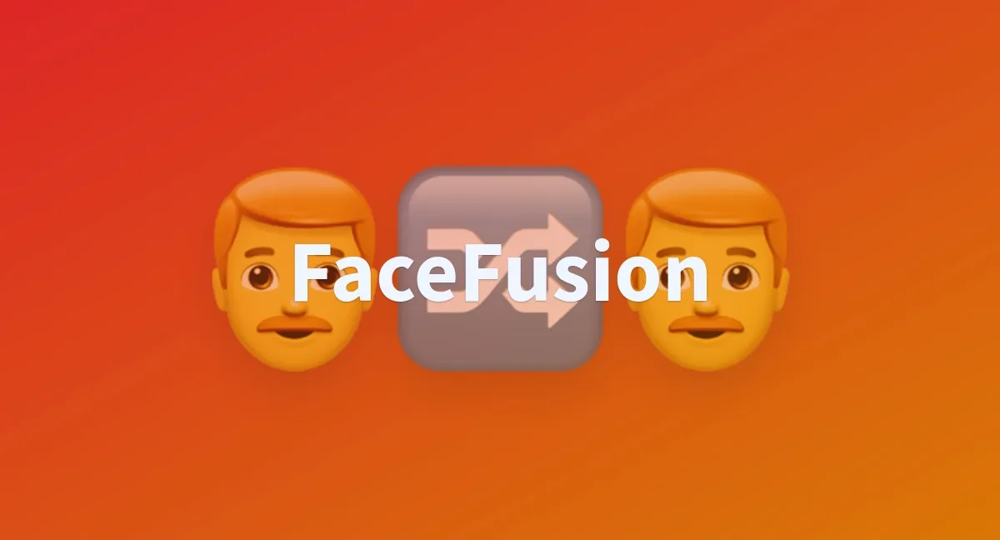

## 这东西是干嘛的

FaceFusion 是一个开源的 AI 换脸工具，说白了就是把 A 的脸换到 B 身上。

它的前身是 Roop，同一个开发者的作品。Roop 当时火了一阵，但后来因为一些原因停更了。作者重新搞了 FaceFusion，功能更强，效果更好。

官方介绍只有一句话：**下一代换脸器和增强器**。挺狂的，但确实有这个实力。

目前最新版本是 3.5.x，支持：
- 图片换脸
- 视频换脸
- 批量处理
- 人脸增强
- N 卡和 A 卡都能跑

## 技术原理（简单说）

换脸这事听起来玄乎，其实拆开来就几步：

1. **人脸检测**：先找到图片/视频里的人脸在哪
2. **特征提取**：分析源脸（你要换上去的脸）的特征
3. **人脸对齐**：把源脸和目标脸的角度、大小对齐
4. **特征融合**：把源脸的五官特征融合到目标脸上
5. **后处理**：修边缘、调肤色、提升清晰度

FaceFusion 用的是 InsightFace 做人脸检测和特征提取，效果比较稳。融合部分有多种模型可选，不同模型效果略有差异。

增强功能用的是 GFPGAN 之类的模型，专门修复人脸细节，让换完的脸看起来更自然。

## 硬件要求

### 显卡

这是最关键的。

**推荐配置**：NVIDIA 显卡，显存 8G 以上

- RTX 3060 12G：够用，处理视频不算慢
- RTX 3080/3090：很舒服，批量处理也不怕
- RTX 4090：随便造

**能跑但会慢**：

- GTX 1660 6G：图片没问题，视频会比较慢
- AMD 显卡：新版支持了，但速度不如 N 卡
- 纯 CPU：能跑，但处理视频会让你怀疑人生

显存不够的话，处理高清视频容易爆显存。可以降低分辨率或者分段处理。

### 内存和硬盘

- 内存：16G 起步，32G 更稳
- 硬盘：SSD，模型文件加起来有几个 G

### 实测参考

我用 RTX 3080 10G：
- 处理一张图：1-2 秒
- 处理 1 分钟 1080p 视频：大概 3-5 分钟
- 开人脸增强会慢一些

## 安装方式

有三种方式，按自己情况选。

### 方式一：整合包（推荐新手）

最省心的方式。网上有打包好的一键启动包，下载解压就能用。

注意事项：
- 解压路径不要有中文
- 最好放在非 C 盘根目录，比如 `D:\FaceFusion`
- 第一次启动会下载模型，需要联网

搜索"FaceFusion 整合包"就能找到，选最新版本的。

### 方式二：Pinokio（推荐有点基础的）

Pinokio 是一个 AI 应用管理器，类似于应用商店，装各种 AI 工具很方便。

步骤：
1. 下载安装 [Pinokio](https://pinokio.computer/)
2. 打开 Pinokio，点 Discover
3. 搜索 "facefusion"，选最新版
4. 点 Install，等它装完
5. 点 Run Default 启动
6. 浏览器打开 `http://127.0.0.1:7860`

好处是更新方便，坏处是 Pinokio 本身也占不少空间。

### 方式三：手动安装（折腾党）

自己配环境，灵活但麻烦。

**1. 装 Python**

版本要求：3.10.x（别用太新的，依赖会有问题）

去 [Python 官网](https://www.python.org/downloads/) 下载，安装时**一定要勾选 Add to PATH**。

**2. 装 Git**

去 [Git 官网](https://git-scm.com/) 下载安装。

**3. 拉代码**

```bash
git clone https://github.com/facefusion/facefusion.git
cd facefusion
```

**4. 创建虚拟环境**

```bash
python -m venv venv
# Windows
venv\Scripts\activate
# Mac/Linux
source venv/bin/activate
```

**5. 装依赖**

```bash
pip install -r requirements.txt
```

如果你是 N 卡，还要装 CUDA 版的 onnxruntime：

```bash
pip uninstall onnxruntime
pip install onnxruntime-gpu
```

**6. 启动**

```bash
python run.py
```

第一次启动会下载模型，耐心等。

## 基本使用

启动后浏览器会打开一个网页界面，操作很直观。

### 换脸流程

1. **选源脸**：上传一张你要换上去的脸，正面清晰照最好
2. **选目标**：上传目标图片或视频
3. **预览**：调整参数，看效果
4. **处理**：点开始，等它跑完
5. **下载**：处理完下载结果

### 关键参数

**Face Selector（人脸选择）**

如果目标图里有多个人脸，可以指定换哪个。

**Face Swapper（换脸模型）**

有几个模型可选：
- `inswapper_128`：默认，效果均衡
- `inswapper_128_fp16`：显存小的用这个
- `simswap`：某些场景效果更好

**Face Enhancer（人脸增强）**

勾选后会对换完的脸做增强处理，更清晰。代价是慢一些。

推荐选 `gfpgan_1.4`，效果稳定。

**Frame Processor（帧处理器）**

处理视频时可以选多个处理器叠加：
- `face_swapper`：换脸（必选）
- `face_enhancer`：人脸增强
- `frame_enhancer`：整帧增强

### 遮罩功能

脸上有遮挡物（眼镜、口罩等）时，直接换会穿帮。

这时候用 Mask 功能：
- `box`：矩形遮罩
- `occlusion`：自动识别遮挡区域

选 occlusion 模式，它会自动识别眼镜、口罩这些东西，只换露出来的部分。

## 常见问题

### 显存不够 / CUDA out of memory

- 降低输出分辨率
- 关掉人脸增强
- 用 fp16 模型
- 视频的话，降低帧率或分段处理

### 换完脸很假

- 源脸图片质量不行，换一张更清晰的
- 角度差太多，找个角度接近的源脸
- 开人脸增强试试

### 边缘有接缝

- 调 Face Mask 参数
- 用 occlusion 遮罩模式
- 后期 PS 修一下

### 启动报错

大部分是环境问题：
- Python 版本不对
- 依赖没装全
- CUDA 版本和 onnxruntime 不匹配

建议新手直接用整合包，省心。

## 写在最后

FaceFusion 是目前开源换脸工具里效果最好的之一，而且完全免费。

用途很多：影视后期、短视频创作、表情包制作... 当然，别拿去干坏事。

技术是中性的，怎么用看人。
