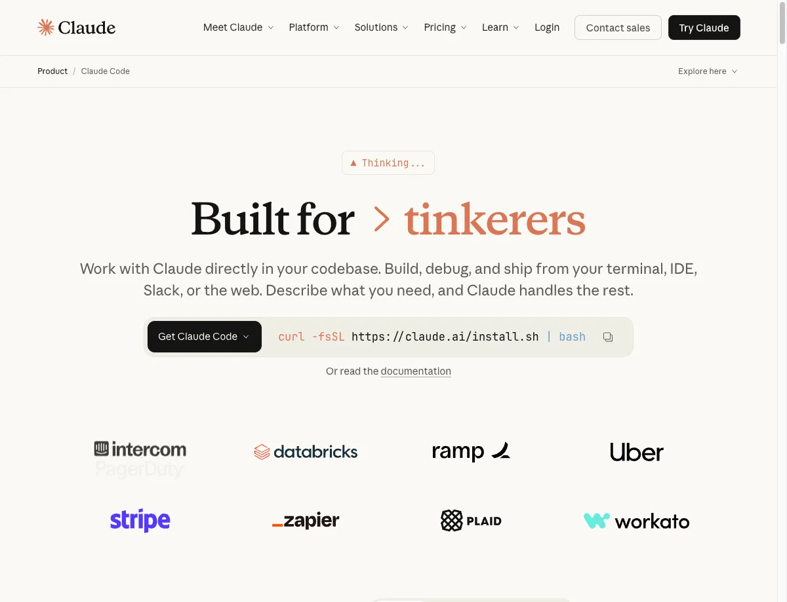

+++
date = '2025-01-23'
draft = false
title = 'Claude Code 高手都在用的 24 个技巧'
tags = ['AI', 'Claude Code', 'CLI', '开发工具', '效率']
+++

Claude Code 是 Anthropic 推出的命令行 AI 编程助手。它不是一个简单的聊天机器人，而是一个能直接在你的终端里读代码、写代码、执行命令的智能助手。本文整理了 24 个实用技巧，帮你把 Claude Code 用到极致。




## 第一部分：5 分钟快速上手

### 安装 Claude Code

```bash
# 一行命令安装
curl -fsSL https://claude.ai/install.sh | bash
```

### 三种启动方式

```bash
# 方式一：直接启动交互式会话
claude

# 方式二：带问题启动
claude "帮我看看这个项目的目录结构"

# 方式三：非交互模式（适合脚本调用）
claude -p "生成一个 .gitignore 文件"
```

启动后，你会看到一个交互界面，直接输入问题即可开始对话。输入 `/help` 查看帮助，输入 `/exit` 退出。

---

## 第二部分：核心操作技巧

这部分是日常使用最频繁的技巧，建议优先掌握。

### 技巧 1：描述需求要具体

Claude 不是你肚子里的蛔虫，模糊的描述只会得到模糊的回答。

```bash
# ❌ 模糊的需求
> 优化一下这个函数

# ✅ 具体的需求
> 优化 src/utils/parser.js 中的 parseJSON 函数，
> 当前处理 10MB 文件需要 5 秒，希望能降到 1 秒以内，
> 可以考虑流式解析或分块处理
```

**要点**：说清楚「哪个文件」「什么问题」「期望结果」。

### 技巧 2：复杂任务分步执行

一次性让 Claude 完成整个系统，它可能会遗漏细节或超出上下文限制。

```bash
# ❌ 一步到位（容易出问题）
> 帮我开发一个完整的博客系统，包含用户、文章、评论功能

# ✅ 分步推进（可控且可验证）
> 第一步：设计博客系统的数据库表结构，包含用户、文章、评论三个实体
# 确认设计后...
> 第二步：根据刚才的设计，实现用户注册和登录的 API
# 测试通过后...
> 第三步：实现文章的 CRUD 接口
```

**要点**：每完成一步，验证后再进行下一步。

### 技巧 3：先让 Claude 熟悉项目

在让 Claude 写代码之前，先让它了解你的项目。

```bash
# 了解项目全貌
> 分析这个项目的目录结构和技术栈，告诉我主要模块的功能

# 理解特定模块
> 阅读 src/services/payment 目录，理解支付流程是怎么实现的

# 学习代码风格
> 看看 src/controllers 目录下的代码，总结这个项目的代码规范
```

Claude 熟悉项目后，写出的代码会更符合你的项目风格。

### 技巧 4：方向不对立即打断

Claude 执行任务时，如果发现方向偏了，**立即按 `Esc` 键中断**。

```bash
> 重构用户认证模块
# Claude 开始执行，但你发现它在改不该改的文件...

# 按 Esc 中断（不是 Ctrl+C，那个会退出程序）

> 停一下，只重构 src/auth 目录，不要动 src/user 目录的代码
```

**要点**：`Esc` 是中断，`Ctrl+C` 是退出。发现问题及时止损。

### 技巧 5：截图辅助沟通

遇到 UI 问题？截图发给 Claude 比描述半天更高效。

```bash
# Mac 截图到剪贴板：Cmd + Ctrl + Shift + 4
# 然后在 Claude Code 中按 Ctrl+V 粘贴（注意不是 Cmd+V）

> [粘贴截图]
> 这个登录表单的样式有问题，输入框应该有圆角，按钮颜色应该是 #1890ff
```

也可以直接把图片文件拖拽到终端窗口。

### 技巧 6：@ 符号快速引用文件

用 `@` 可以快速引用文件，让 Claude 直接读取：

```bash
# 引用单个文件
> 帮我优化 @src/utils/helper.ts 这个文件的性能

# 引用多个文件
> 对比 @package.json 和 @package-lock.json，检查依赖版本是否一致

# 引用目录
> 分析 @src/components/ 目录的组件结构
```

比起让 Claude 自己去找文件，直接 `@` 引用更精准。

---

## 第三部分：效率提升技巧

掌握这些技巧，工作效率翻倍。

### 技巧 7：掌握常用快捷键

记住这几个核心快捷键，手不用离开键盘：

| 场景 | 快捷键 | 说明 |
|------|--------|------|
| 中断任务 | `Esc` | 停止当前执行 |
| 撤销操作 | `Esc` + `Esc` | 回滚代码和对话 |
| 输入换行 | `Option+Enter` (Mac) | 输入多行内容 |
| 切换模型 | `Option+P` (Mac) | 快速切换模型 |
| 粘贴图片 | `Ctrl+V` (Mac) | 发送截图 |
| 后台运行 | `Ctrl+B` | 任务放后台 |

完整快捷键列表见文末附录。

### 技巧 8：Bash 快捷模式

用 `!` 前缀可以直接执行命令，无需 Claude 解释执行：

```bash
# 直接执行，不经过 Claude 解释
> ! npm test
> ! git status
> ! docker ps

# 支持 Tab 自动补全
> ! npm run b<Tab>  # 自动补全为 npm run build
```

适合执行简单命令，省去确认步骤。

### 技巧 9：免授权模式

频繁弹出的授权确认很打断心流，可以预设允许的操作：

**方式一：启动时跳过所有权限（⚠️ 仅在可信环境使用）**

```bash
claude --dangerously-skip-permissions
```

**方式二：在配置中预设允许的命令（推荐）**

编辑 `~/.claude/settings.json`：

```json
{
  "permissions": {
    "allow": [
      "Bash(npm:*)",
      "Bash(git:*)",
      "Bash(docker:*)",
      "Read",
      "Edit"
    ]
  }
}
```

这样 npm、git、docker 相关命令以及文件读写就不会再弹确认了。

### 技巧 10：会话恢复

下班关机，第二天继续昨天的工作：

```bash
# 继续最近一次对话
claude -c
# 或
claude --continue

# 查看历史会话列表
claude -r
# 或
claude --resume

# 恢复指定会话（支持模糊匹配）
claude -r "重构认证"
```

**给会话起个好名字**，方便以后查找：

```bash
# 在会话中重命名
> /rename 支付模块重构

# 下次直接恢复
$ claude -r "支付模块"
```

### 技巧 11：后台任务不阻塞

长任务放后台，继续做其他事：

```bash
# 按 Ctrl+B 把当前任务放后台
> 帮我重构整个 services 目录
# 执行中... 按 Ctrl+B

# 任务在后台继续运行，你可以继续输入其他问题
> 另一个问题：这个 bug 怎么修？

# 查看后台任务状态
> /tasks
```

适合耗时较长的任务，比如大规模重构、批量文件处理。

---

## 第四部分：智能助手用法

让 Claude 成为你的智能终端。

### 技巧 12：自然语言操作 Git

忘记 Git 命令？用自然语言就行：

```bash
# 查看状态
> 我今天改了哪些文件？
> 最近一周的提交记录

# 提交代码
> 把修改提交一下，消息写"修复用户头像上传失败的问题"

# 分支操作
> 基于 main 创建新分支 feature/payment
> 把 feature/payment 合并到 develop

# 回滚操作
> 撤销上一次提交，但保留代码修改
> 把 config.js 恢复到上一个版本
```

### 技巧 13：自然语言执行系统命令

不用记复杂的命令参数：

```bash
# 查找文件
> 找出 src 目录下所有超过 500 行的 TypeScript 文件
> 列出最近 24 小时内修改过的 .vue 文件

# 进程管理
> 看看 3000 端口被谁占用了
> 把所有 node 进程都杀掉

# 日志分析
> 统计 nginx access.log 中状态码 500 的请求数量
> 找出 error.log 中出现最频繁的 10 种错误

# 批量操作
> 把 src 目录下所有 .jsx 文件重命名为 .tsx
> 删除项目中所有的 .DS_Store 文件
```

### 技巧 14：管道输入分析数据

把命令输出直接喂给 Claude 分析：

```bash
# 分析测试结果
$ npm test 2>&1 | claude -p "分析测试失败的原因"

# 分析日志
$ tail -100 error.log | claude -p "这些错误有什么共同点？"

# 分析 Git 历史
$ git log --oneline -20 | claude -p "总结最近的开发工作"

# 分析依赖
$ npm outdated | claude -p "哪些依赖需要优先升级？"
```

### 技巧 15：激活深度思考

遇到复杂问题，用关键词触发更深入的分析：

| 关键词 | 思考深度 | 适用场景 | Token 消耗 |
|--------|----------|----------|------------|
| `think` | 基础 | 简单问题 | 低 |
| `think hard` | 中等 | 需要权衡的问题 | 中 |
| `think harder` | 深入 | 架构设计问题 | 高 |
| `ultrathink` | 最深 | 复杂系统设计 | 很高 |

```bash
# 简单问题用 think
> think 这个正则表达式为什么匹配不到

# 架构问题用 think harder
> think harder 设计一个支持百万用户的消息推送系统，
> 要考虑实时性、可靠性、成本

# 最复杂的问题用 ultrathink（谨慎使用，消耗大）
> ultrathink 重新设计这个单体应用的微服务拆分方案
```

### 技巧 16：计划模式先想后做

面对复杂任务，让 Claude 先出方案再动手，避免返工：

```bash
# 进入计划模式
> /plan

# 或者启动时指定
$ claude --permission-mode plan
```

计划模式下，Claude 会：
1. 分析任务需求
2. 列出实现步骤
3. 标注要修改的文件
4. **等你确认后才开始执行**

```bash
# 示例：重构一个复杂模块
> /plan
> 重构订单模块，把单体代码拆分成独立的服务层、仓储层、控制层

# Claude 会输出详细计划：
# 1. 创建 services/order.service.ts
# 2. 创建 repositories/order.repository.ts
# 3. 修改 controllers/order.controller.ts
# 4. 更新相关的测试文件
# ...

# 确认计划没问题后，输入 y 开始执行
```

**适用场景**：重构、架构调整、涉及多文件的改动。

### 技巧 17：多目录协同工作

前后端分离？微服务架构？用 `/add-dir` 让 Claude 同时理解多个项目：

```bash
# 添加关联目录
> /add-dir ../backend-api
> /add-dir ../shared-types

# 现在 Claude 可以跨项目理解代码
> 前端调用了 /api/users 接口，帮我看看后端是怎么实现的

> shared-types 里定义的 UserDTO 类型，前后端用的是同一个吗？
```

**典型场景**：

```bash
# 全栈项目
> /add-dir ../server    # 添加后端
> /add-dir ../mobile    # 添加移动端

# 微服务项目
> /add-dir ../user-service
> /add-dir ../order-service
> /add-dir ../gateway

# 然后可以问跨服务的问题
> 用户服务和订单服务之间是怎么通信的？
```

---

## 第五部分：个性化配置

打造专属的 AI 编程助手。

### 技巧 18：善用记忆系统（CLAUDE.md）

CLAUDE.md 是 Claude 的「记忆文件」，用来存储项目信息和你的偏好。

**文件位置优先级**（从高到低）：

```
./CLAUDE.md              # 项目级，随代码提交，团队共享
./.claude/CLAUDE.md      # 项目配置
~/.claude/CLAUDE.md      # 全局个人偏好
```

**快速添加记忆**：

```bash
# 用 # 前缀快速添加
> # 这个项目用 pnpm 不是 npm
> # 提交信息用中文
> # API 响应统一用 { code, data, message } 格式
```

**编辑记忆文件**：

```bash
> /memory
```

**CLAUDE.md 示例**：

```markdown
# 项目规范

## 技术栈
- 前端：Vue 3 + TypeScript + Vite
- 后端：Go + Gin + GORM
- 数据库：PostgreSQL + Redis

## 代码规范
- 组件用 PascalCase，工具函数用 camelCase
- 每个函数不超过 50 行
- 必须写单元测试

## 常用命令
- `make dev` 启动开发环境
- `make test` 运行测试
- `make lint` 代码检查
```

### 技巧 19：创建自定义命令

把常用操作封装成命令，一键执行。

**项目级命令**（`.claude/commands/` 目录）：

```bash
# 创建文件 .claude/commands/review.md
请对当前 Git 暂存区的代码进行审查：

1. 检查是否有明显的 bug 或逻辑错误
2. 检查是否符合项目的代码规范
3. 检查是否有安全隐患
4. 给出具体的改进建议
```

使用：
```bash
> /project:review
```

**个人全局命令**（`~/.claude/commands/` 目录）：

```bash
# 创建文件 ~/.claude/commands/standup.md
帮我准备今日站会内容：

1. 用 git log 查看我昨天的提交，总结完成的工作
2. 查看我负责的 issue 状态
3. 识别可能的阻碍或需要协调的事项

输出格式：
## 昨日完成
## 今日计划
## 阻碍/协调
```

使用：
```bash
> /user:standup
```

**带参数的命令**：

```bash
# .claude/commands/fix-issue.md
请修复 GitHub Issue #$ARGUMENTS

步骤：
1. 用 gh issue view $ARGUMENTS 获取 issue 详情
2. 分析问题原因
3. 编写修复代码
4. 编写测试用例
5. 运行测试确保通过
```

使用：
```bash
> /project:fix-issue 42
```

### 技巧 20：灵活切换模型

不同任务用不同模型：

| 模型 | 特点 | 适用场景 |
|------|------|----------|
| Opus | 最强推理能力 | 架构设计、复杂 bug |
| Sonnet | 均衡型（默认） | 日常开发 |
| Haiku | 最快响应 | 简单问题、代码补全 |

```bash
# 查看当前模型
> /model

# 切换模型
> /model opus     # 处理复杂问题
> /model sonnet   # 日常使用
> /model haiku    # 简单任务

# 快捷键切换
# Mac: Option+P
# Win/Linux: Alt+P
```

### 技巧 21：MCP 服务器扩展能力

MCP（Model Context Protocol）让 Claude 可以连接外部工具：

```bash
# 添加 GitHub MCP 服务器
$ claude mcp add github -- npx -y @anthropic/github-mcp

# 添加数据库 MCP 服务器
$ claude mcp add postgres -- npx -y @anthropic/postgres-mcp

# 查看已安装的 MCP 服务器
$ claude mcp list

# 在会话中管理
> /mcp
```

安装后，Claude 可以直接：
- 操作 GitHub PR、Issue
- 查询数据库
- 调用各种 API

---

## 第六部分：成本与状态管理

### 技巧 22：监控消耗与压缩上下文

**查看消耗**：

```bash
# 当前会话的 Token 消耗
> /cost

# 上下文使用情况（可视化）
> /context
# 输出示例：[████████████░░░░░░░░] 58%

# 整体使用统计
> /stats

# 订阅额度
> /usage
```

**压缩上下文**：

对话太长会影响效果且增加成本，及时压缩：

```bash
# 智能压缩，保留重点
> /compact 保留数据库设计相关的讨论

# 完全清空（开始新话题时）
> /clear
```

**建议**：当 `/context` 显示超过 70%，考虑压缩或新开会话。

### 技巧 23：限制预算和轮数

自动化任务时，防止失控：

```bash
# 限制最大花费（美元）
$ claude -p --max-budget-usd 5.00 "重构整个项目的测试"

# 限制对话轮数
$ claude -p --max-turns 10 "修复这个 bug"

# 组合使用
$ claude -p --max-budget-usd 2.00 --max-turns 5 "优化性能"
```

适合在 CI/CD 或脚本中使用，避免意外消耗。

### 技巧 24：导出对话保存记录

重要的对话可以导出保存：

```bash
# 导出到文件
> /export session-2024-01-15.md

# 导出到剪贴板
> /export

# 导出后可以：
# - 作为文档保存
# - 分享给团队成员
# - 作为后续会话的参考
```

---

## 附录：命令速查表

### 斜杠命令

| 命令 | 说明 |
|------|------|
| `/help` | 查看帮助 |
| `/exit` | 退出程序 |
| `/clear` | 清空对话 |
| `/compact [重点]` | 压缩对话历史 |
| `/resume [会话名]` | 恢复历史会话 |
| `/rename <名称>` | 重命名当前会话 |
| `/init` | 初始化项目配置 |
| `/memory` | 编辑记忆文件 |
| `/model [模型名]` | 查看/切换模型 |
| `/plan` | 进入计划模式 |
| `/add-dir <路径>` | 添加工作目录 |
| `/cost` | 查看 Token 消耗 |
| `/context` | 查看上下文使用量 |
| `/tasks` | 查看后台任务 |
| `/export [文件名]` | 导出对话 |
| `/doctor` | 检查安装状态 |
| `/mcp` | 管理 MCP 服务器 |

### CLI 参数

| 参数 | 说明 |
|------|------|
| `-c, --continue` | 继续上次对话 |
| `-r, --resume [名称]` | 恢复指定会话 |
| `-p, --print` | 非交互模式 |
| `--model <模型>` | 指定模型 |
| `--permission-mode plan` | 计划模式启动 |
| `--max-turns <数量>` | 限制对话轮数 |
| `--max-budget-usd <金额>` | 限制最大花费 |
| `--dangerously-skip-permissions` | 跳过所有权限确认 |

### 键盘快捷键

| 快捷键 | 功能 |
|--------|------|
| `Esc` | 中断当前任务 |
| `Esc + Esc` | 回滚操作 |
| `Ctrl+C` | 退出程序 |
| `Ctrl+L` | 清屏 |
| `Ctrl+B` | 后台运行任务 |
| `Option+Enter` | 换行输入 |
| `Option+P` | 切换模型 |
| `Ctrl+V` | 粘贴图片 |
| `Up/Down` | 历史命令 |

---

## 总结

本文介绍了 Claude Code 的 24 个实用技巧：

1. **核心操作（1-6）**：具体描述、分步执行、熟悉项目、及时打断、截图沟通、@ 引用文件
2. **效率提升（7-11）**：快捷键、Bash 模式、免授权、会话恢复、后台任务
3. **智能助手（12-17）**：Git 操作、系统命令、管道输入、深度思考、计划模式、多目录协同
4. **个性化（18-21）**：记忆系统、自定义命令、模型切换、MCP 扩展
5. **成本管理（22-24）**：监控消耗、限制预算、导出对话

建议从核心操作的 6 个技巧开始练习，熟练后再逐步掌握其他技巧。

## 参考资料

- [Claude Code 官方文档](https://docs.anthropic.com/en/docs/claude-code)
- [Claude Code CLI 参考](https://docs.anthropic.com/en/docs/claude-code/cli-reference)
- [Anthropic 工程团队最佳实践](https://www.anthropic.com/engineering/claude-code-best-practices)
