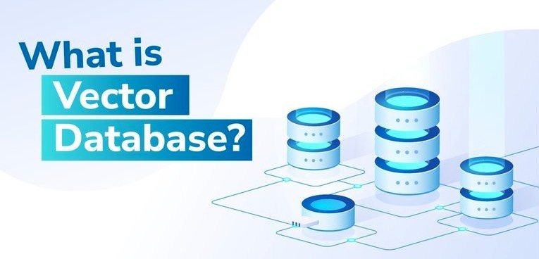

#  向量数据库基本概念

## 向量

向量是一组数字，通常表示数据的特征或属性。例如，通过机器学习模型把文本、图像或声音转换成固定长度的数字序列，我们称这种转换后的结果为“向量”。

想象你有一个“特征小卡片”，上面写着这个东西的所有特点，比如一个苹果的“红色”、“圆形”、“甜”……在计算机里，我们用一串数字来表示这些特点，这串数字就叫做“向量”。例如，苹果的向量可能是 [0.9, 0.1, 0.8]（每个数字代表不同的特征）

## 向量嵌入

## 向量数据库

向量数据库主要用于存储和管理“向量”数据。向量通常是由机器学习模型生成的数字序列，用于表示文本、图像或其他数据的特征。这种数据库能快速找到与某个向量相似的数据，适合构建推荐系统、搜索引擎等应用。