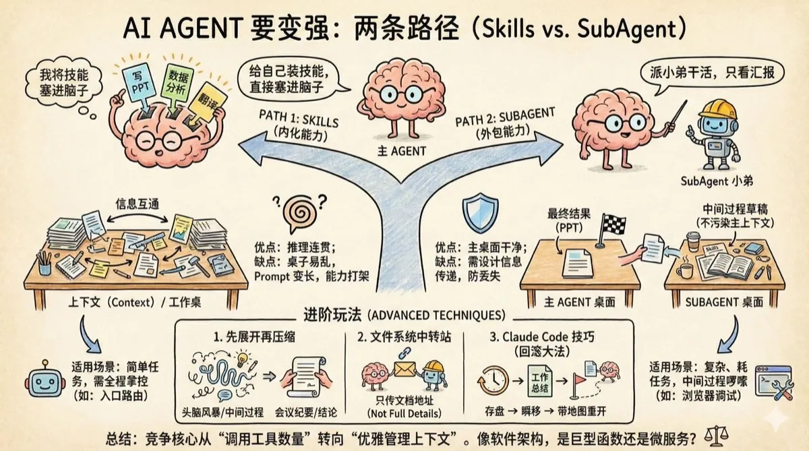

AI Agent 要变强，有两条完全不同的路。

一条是 Skill，也就是给自己装技能，把新能力直接塞进脑子里。

另一条是 SubAgent，就像派小弟去干活，自己只看汇报。

这两条路听起来都能让 Agent 更厉害，但适用的场景还是有所不同，用错了的话，你的 Agent 可能反而会越用越慢、越用越乱。

Skills，就像是给主 Agent 装插件。

比如你的 Agent 原本只会聊天，现在你想让它能写 PPT。Skills 的做法是：把写 PPT 的能力说明、工具调用方式、注意事项，全都塞进主 Agent 的上下文中。主 Agent 通过上下文学会了这项技能，它可以自己来写 PPT。

第二种叫 SubAgent，就像是委托外包。

同样是写 PPT，SubAgent 的做法是：主 Agent 把任务派给一个专门写 PPT 的 SubAgent，SubAgent 独立完成后把结果交回来。主 Agent 全程不参与具体执行，只负责派活和验收。

一个是内化能力，一个是外包能力。听起来都能搞定任务，区别在哪？

区别在上下文管理，上下文就是 AI 的记忆。

你可以把 AI 的上下文想象成一张工作桌。桌子大小是固定的，你放的东西越多，就越难找到需要的那份文件。这就是上下文容量的问题。

Skills 模式下，所有能力说明都铺在同一张桌上。好处是信息互通，主 Agent 能看到所有中间结果，推理过程连贯。坏处是桌子很快就乱了，Prompt 越来越长，能力之间可能打架，AI 开始犯糊涂。

SubAgent 模式下，SubAgent 在另一张桌子上干活。干完把结果递过来，过程中产生的草稿、中间文件全留在那边。主 Agent 的桌面保持干净。代价是信息传递要设计好，不然关键信息可能在交接时丢了。

这就是上下文污染问题，这里的污染不是夸张的比喻，是真实的工程瓶颈。

什么时候用哪种？

判断标准其实很简单：子任务有多复杂，以及你需不需要完成任务过程中产生的信息。

Skills 适合的场景：任务本身不太复杂，或者你需要主 Agent 全程掌控。

比如让 Agent 充当入口路由，根据用户请求加载不同的“场景模式”，像进入 YouTube 总结模式、进入写报告模式。这时候 Skills 的懒加载特性很香：先只加载能力名字和简介，真正要用时才加载完整说明。不像 MCP 那样一股脑把所有工具的详细文档全塞进上下文。

SubAgent 适合的场景：子任务很重、很耗时、中间过程很啰嗦。

最典型的例子是浏览器调试工具。Chrome DevTools 的 MCP 功能很强，但工具说明太臃肿，放进主 Agent 会严重占用上下文。把它封装成 SubAgent，你只需要说“去查日志、截图、分析一下”，它跑完把分析结论递回来。中间那些截图、DOM 树、网络请求细节，全都留在 SubAgent 那边，不污染主 Agent 的上下文。

进阶玩法

有意思的是，Skills 和 SubAgent 这两种模式可以结合。

第一种思路叫“先展开再压缩”。

打个比方：你开了一个两小时的头脑风暴会，白板上写满了草稿、争论、被否决的方案。但最后写进会议纪要的只有三条结论。那些中间过程对得出结论很重要，但对后续执行的人来说是噪音。

Agent 也可以这样操作。主 Agent 发现需要某个 Skill，加载进来，一通操作拿到结果。然后把从“加载 Skill”到“拿到结果”这整段过程折叠掉，只保留最终结论。对后续推理来说，就像开了一个会但只留下了会议纪要。

第二种思路是用文件系统做“中转站”。

想象你管理一个外包团队。你不会把所有需求细节都塞进一条微信消息里，而是说“需求文档在这个链接，去看”。外包团队交付时也不会把源码复制粘贴给你，而是说“代码在这个仓库，部署文档在这里”。

Agent 之间也可以这样协作。主 Agent 委托任务时，不把冗长的背景资料直接写进指令，而是存成文档，只传一个地址。SubAgent 返回时也一样：交付一个简短的状态摘要——“完成了/卡住了/需要你决策”——加一个详细记录的文档地址。主 Agent 根据情况决定要不要点进去看细节。这样双方的上下文都保持精简。

第三种是 Claude Code 里的实战技巧。

上下文快见底时，让 Claude 把当前完成的工作总结成一份文档。然后用 rewind 功能回滚到任务开始前的状态，告诉它：“这件事我已经做完了，记录在这个文件里。”

相当于什么？相当于你跑了一场马拉松，快到终点时发现体力不支。于是你把已经跑过的路线画成地图存档，然后“瞬移”回起点，精力充沛地说“我知道怎么走了，地图在这”。上下文被清空了，但成果保留了下来。用这个方法能在上下文耗尽前抢救一把。

最后

Agent 的竞争正在从“能调用多少工具”转向“怎么优雅地管理这些工具”。

很多人追逐最新的 Agent 框架、最花哨的能力扩展，却忽略了最基础的问题：AI 的工作记忆是有限的，你怎么组织它，决定了它能做多复杂的事。Skills 和 SubAgent 不是非此即彼的选择，而是两种工具，用对场景才能发挥价值。

说到底，Agent 架构设计和软件架构设计还是有很多相通之处。
是把逻辑写在一个巨型函数里，还是拆成模块化的微服务？
是共享全局变量图省事，还是严格隔离状态保持干净？

这些老问题换了个皮，又回来了。