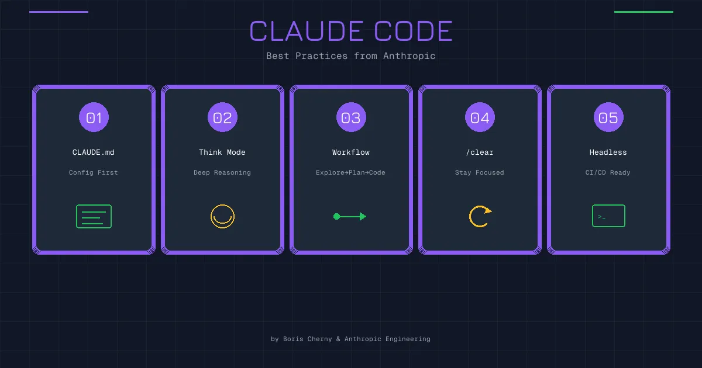

Claude Code 的创始人最近在 X 上分享了几条使用心得，看完之后深有同感。不是那种官方文档式的教程，而是实际用下来的体会。

这里展开聊聊。

## 1. 并行跑多个 Agent，学会当指挥官

这条说的是：开多个终端，同时跑多个 Claude Code 实例。

听起来简单，但背后是思维方式的转变。

以前写代码，习惯是单线程的——想一个问题，解决一个问题，再想下一个。现在有了 AI 帮手，你其实可以同时推进好几件事：

- 一个窗口让 Claude 重构某个模块
- 另一个窗口让它写测试
- 第三个窗口让它查文档、整理资料

你不需要盯着每一个窗口看它敲代码。布置完任务，让它们各自跑，你只需要在关键节点检查一下、给点反馈。

这就是"指挥官"的角色——你不是亲自上阵干活的士兵，而是在指挥多个单位协同作战。

当然，这需要一点适应。刚开始会觉得分心、不踏实，总想盯着一个看完再开下一个。但一旦习惯了，效率提升是显而易见的。

实操上，可以用 Git Worktree 让每个 Claude 在独立的工作目录：

```bash
git worktree add ../feature-a feature-a
git worktree add ../feature-b feature-b
```

这样各个实例互不干扰，也不会出现文件冲突。

## 2. 用最智能的模型，别心疼 token

这条的原话是：AI Coding 的瓶颈不再是 token 生成速度（计算税），而是人类纠正错误花费的时间（纠正税）。

说得太对了。

很多人用 AI 写代码会本能地想省钱——用便宜的模型、用快的模型。但实际算下来，这笔账可能是亏的。

便宜模型写出来的代码，你要花时间 review、改 bug、来回调试。一个小时下来，省了几毛钱的 token 费，但浪费了大把时间。

而用最聪明的模型（比如 Opus），虽然贵一点、慢一点，但它一次写对的概率更高。你检查一遍就能过，省下来的是你的时间。

这就是"纠正税"的概念：**模型犯错，你来买单。模型越笨，你交的税越多。**

我自己的做法是：

- 写代码、改代码、做需要推理的任务 → 至少用 Sonnet，复杂任务上 Opus
- 做简单的智能体任务、批量处理 → 可以用 GLM、Minimax 这些国产模型

关键是分清场景。代码质量直接影响后续维护成本，这个地方不值得省。

## 3. 把 Claude 犯过的错写进 CLAUDE.md

CLAUDE.md 是 Claude Code 的"记忆文件"，放在项目根目录，它每次启动都会读。

很多人知道这个功能，但用法不对——要么不写，要么写一大堆自动生成的内容。

创始人的建议是：**人工更新，保持小体积，重点记录模型犯过的错。**

什么意思？就是当 Claude 在你的项目里踩了一个坑，你手动把这个坑记下来。下次它就不会再犯。

比如：

```markdown
## 注意事项

- 这个项目用的是 ESM 模块，不要用 require()
- 测试文件不要放在 src 目录下，放 tests/
- 调用 payment API 之前必须先检查用户状态，不然会 500
```

这些都是具体的、项目特有的问题。不是什么通用的代码规范，而是"我们这个项目的坑"。

关键是**人工维护**。不要让 AI 自己总结、自己生成，那样会越写越长、越写越虚。你亲自写几条，精准有效。

体积小还有另一个好处：不占上下文。CLAUDE.md 太长的话，每次启动都要吃掉一大块 token，得不偿失。

## 4. 用 Slash 命令和 SubAgent 自动化重复工作

Claude Code 支持自定义 slash 命令，可以把常用的工作流封装起来。

比如每次提交代码都要：

1. 跑一遍 lint
2. 跑测试
3. 生成 commit message
4. 创建 PR

手动一步步来很烦。但你可以写一个 `/push-pr` 命令，一键搞定。

命令文件放在 `.claude/commands/` 目录下，格式很简单：

```markdown
# push-pr.md

请执行以下步骤：
1. 运行 npm run lint，如果有错误先修复
2. 运行 npm run test，确保测试通过
3. 基于改动生成 commit message 并提交
4. 创建 Pull Request，标题和描述要清晰
```

以后只要输入 `/push-pr`，Claude 就会按这个流程走。

SubAgent 是更高级的玩法。你可以让主 Agent 派一个"小弟"去干某件事，干完把结果汇报回来。适合那些需要独立上下文的子任务，比如专门跑测试的 Agent、专门做代码审查的 Agent。

核心思想是：**把重复的、有固定流程的事情自动化掉，你只关注需要判断的部分。**

## 5. 开启验证循环，让 Claude 自己检查

这条可能是最有价值的一条。

所谓"验证循环"，就是让 Claude 写完代码后，能够自己验证对不对。

怎么验证？

- **跑测试**：写完代码，立刻运行测试，看有没有挂
- **浏览器检查**：改完前端代码，打开浏览器看效果
- **类型检查**：跑一遍 TypeScript 编译，看有没有类型错误
- **Lint 检查**：跑 eslint、prettier，看有没有格式问题

如果没有验证循环，Claude 写完代码就算完了。你要自己去跑测试、自己去看效果、自己发现问题再反馈给它。

有了验证循环，它写完会自己检查一遍。发现测试挂了，它会尝试修复；发现浏览器报错，它会去排查。

这个改变带来的质量提升，创始人说是 **2-3 倍**。我自己体感也差不多。

具体怎么开启？可以在 CLAUDE.md 里写明：

```markdown
## 工作流程

- 每次修改代码后，运行 npm run test 确认测试通过
- 前端改动需要在浏览器中验证效果
- 提交前运行 npm run lint 确保代码规范
```

或者配置 MCP 服务器，让 Claude 能操作浏览器（Playwright MCP）、能读取测试结果。

---

## 最后

这几条实践，核心就两个字：**效率**。

- 并行工作，榨干等待时间
- 用好模型，减少返工
- 记录错误，避免重蹈覆辙
- 自动化流程，省掉重复劳动
- 验证循环，一次做对

Claude Code 的潜力比很多人想象的大。但它毕竟只是工具，用好用坏取决于你怎么驾驭。

与其抱怨 AI 不够聪明，不如想想自己的使用方式有没有优化空间。
