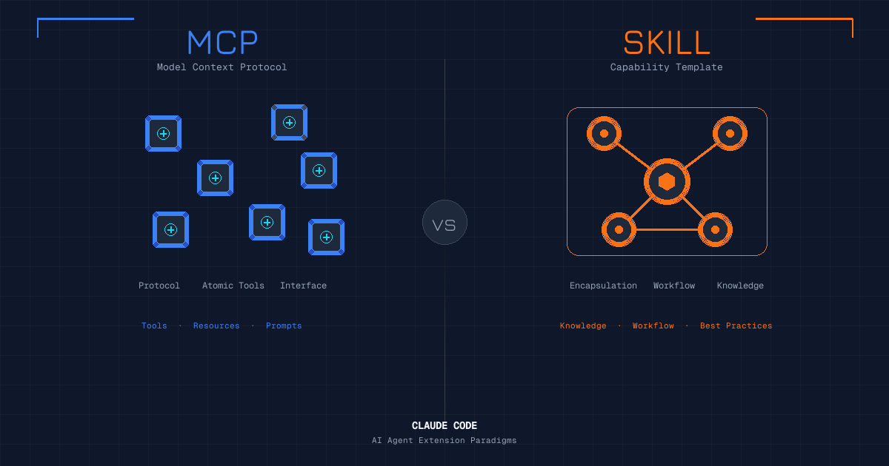

用 Claude Code 久了，你会发现它有两套看起来很像但本质不同的能力扩展系统：**Skill** 和 **MCP**。

很多人分不清这两者的区别，甚至把它们混为一谈。今天就来聊聊这两种扩展方式到底有什么不同。

## 什么是 MCP

MCP 全称 **Model Context Protocol**（模型上下文协议），是 Anthropic 开发的一个开放协议标准。

你可以把 MCP 理解成 AI 世界的"USB 接口"。就像 USB 让各种设备能插到电脑上一样，MCP 让各种外部工具和服务能接入 AI 模型。

MCP 服务器可以提供三种东西：

- **Tools（工具）**：可执行的操作，比如发邮件、查数据库、操作浏览器
- **Resources（资源）**：可读取的数据源，比如文档、配置文件
- **Prompts（提示）**：预设的提示模板

举个例子，Playwright MCP 服务器提供了一系列浏览器操作工具：

```
browser_navigate    - 导航到指定 URL
browser_click       - 点击页面元素
browser_type        - 在输入框中输入文字
browser_snapshot    - 获取页面快照
browser_screenshot  - 截取页面截图
...
```

每个工具都有明确的输入参数和输出格式。AI 通过调用这些工具来完成任务，就像程序员调用 API 一样。

## 什么是 Skill

Skill 是 Claude Code 特有的概念，翻译过来就是"技能"。

如果说 MCP 是"工具箱里的工具"，那 Skill 就是"使用这些工具的手艺"。

一个 Skill 本质上是一组**指令、知识和工作流程的组合**。它告诉 AI：

- 遇到什么场景该怎么做
- 有哪些注意事项和最佳实践
- 应该用什么工具、按什么顺序
- 输出应该是什么格式

比如 `commit` 这个 Skill，它不只是调用 git 命令那么简单。它包含了：

- 如何分析代码变更
- 怎样写出好的 commit message
- 什么时候应该拆分成多个 commit
- 敏感文件的处理规则
- 输出格式的规范

再比如 `pdf` Skill，它封装了处理 PDF 文档的完整知识体系：从读取、解析、提取内容，到生成、合并、填表，各种场景都有对应的处理策略。

## 核心区别

|  | MCP | Skill |
|--|-----|-------|
| **本质** | 协议标准 / 工具接口 | 能力模板 / 知识封装 |
| **粒度** | 原子操作（单个工具） | 复合能力（工作流程） |
| **触发方式** | AI 自动判断调用 | 用户显式触发（如 `/commit`）或 AI 根据场景加载 |
| **来源** | 外部 MCP 服务器 | 内置或插件提供 |
| **上下文占用** | 工具定义常驻上下文 | 按需加载，用完可卸载 |
| **可组合性** | 工具之间相互独立 | 可以组合使用多个 MCP 工具 |

用一个类比来理解：

- **MCP 工具** 就像乐高积木——标准化的基础组件
- **Skill** 就像乐高说明书——告诉你怎么把积木拼成一个具体的东西

## 从实际例子看区别

### 例子1：创建 Git Commit

**纯 MCP 方式**：
你需要手动告诉 AI 每一步该做什么——先执行 `git status`，再执行 `git diff`，然后分析变更，最后执行 `git commit`。每一步都是独立的工具调用。

**使用 Skill 方式**：
输入 `/commit`，Skill 自动接管整个流程。它知道应该先查看状态、分析变更、生成符合规范的 commit message，最后执行提交。你只需要确认。

### 例子2：处理 PDF 文档

**纯 MCP 方式**：
你可能需要调用多个工具：文件读取工具、PDF 解析工具、文本提取工具...每个工具的调用方式和参数格式都不同，AI 需要逐个学习。

**使用 Skill 方式**：
`/pdf` Skill 封装了所有 PDF 处理相关的知识。不管你是要读取、提取、合并还是生成 PDF，Skill 都知道应该用什么方法、注意什么问题。

## 上下文管理的差异

这是两者最关键的区别之一。

**MCP 工具的上下文占用是"硬性"的**。

当你连接一个 MCP 服务器，它所有工具的定义（名称、描述、参数格式）都会被加载到上下文中。工具越多，占用越大。而且这些定义是常驻的，不管你用不用，它们都在那里。

**Skill 的上下文管理是"弹性"的**。

Skill 支持懒加载：平时只在上下文中保留简短的触发词和描述，真正要用时才加载完整内容。用完后，详细指令可以从上下文中移除，只保留执行结果。

这就像：
- MCP 是把所有工具说明书都摊在桌上
- Skill 是把说明书放在抽屉里，需要时才拿出来看

当你的 AI 需要接入大量工具时，这个差异会变得非常显著。

## 什么时候用 MCP，什么时候用 Skill

**优先使用 MCP 的场景**：

- 需要与外部服务交互（数据库、API、浏览器等）
- 任务是标准化的原子操作
- 需要让多个 AI 应用共享同一套工具

**优先使用 Skill 的场景**：

- 任务有固定的工作流程
- 需要封装领域知识和最佳实践
- 希望减少用户的操作步骤
- 需要精细控制上下文占用

**两者结合的场景**：

实际上，很多 Skill 内部就是在调用 MCP 工具。Skill 负责编排和决策，MCP 工具负责具体执行。这种组合方式能同时获得两者的优势。

## 总结

MCP 和 Skill 是两种不同层次的抽象：

- **MCP** 解决的是"AI 怎么跟外部世界交互"的问题，它是基础设施层
- **Skill** 解决的是"AI 怎么优雅地完成特定任务"的问题，它是应用层

理解这个区别，能帮你更好地扩展 AI 的能力：需要接入新工具时，找或写 MCP 服务器；需要让 AI 掌握新"手艺"时，创建 Skill。

就像软件开发中的分层设计：底层库提供基础能力，上层框架封装最佳实践。两者各司其职，配合使用才能发挥最大价值。
