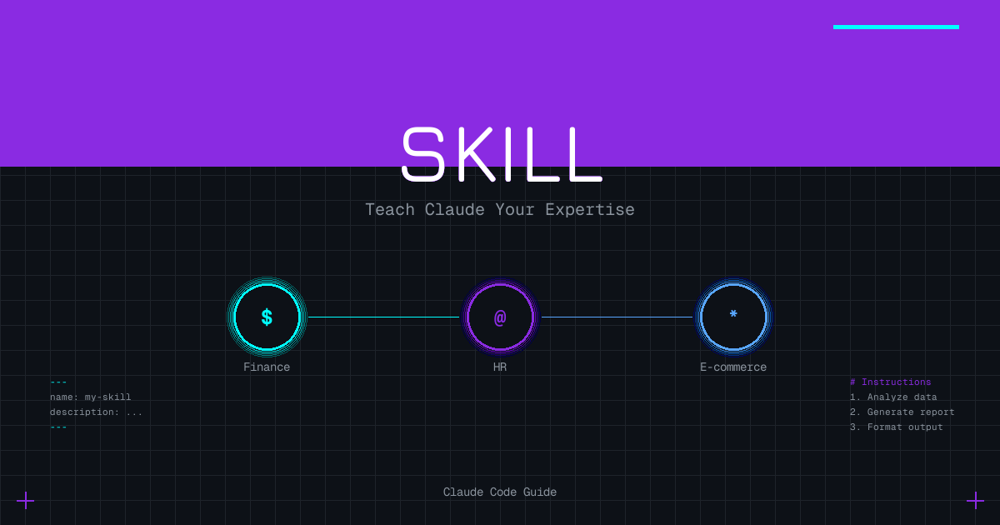

## 一、Skill 为什么突然火了

大模型时代，每个人都想让 AI 更懂自己的工作。

问题是，AI 是通用的。它不知道你们公司的报表格式是什么样的，不知道你们招聘时看重什么，不知道你们产品的卖点是什么。

每次都要从头解释一遍？太累了。

Claude Code 的 Skill 就是解决这个问题的——**把你的专业知识打包成一份"说明书"，让 Claude 一次学会，以后直接按你的方式干活**。

用一句话定义：

> **Skill 就是教 Claude 怎么干你的活的说明书。**

不需要写代码，只需要写清楚：做什么、怎么做、注意什么。

## 二、Skill 到底是什么

### 2.1 本质就是一份 Markdown 文档

Skill 不是什么高深的技术，它就是一个文件夹，里面放着一份 `SKILL.md` 文件。

这份文件告诉 Claude：

- 这个技能叫什么名字
- 什么时候应该用它
- 具体怎么执行
- 有什么注意事项

举个最简单的例子：

```markdown
---
name: daily-report
description: 生成每日工作汇报
---

# 每日工作汇报生成器

## 任务
根据用户提供的工作内容，生成一份格式规范的日报。

## 输出格式
1. 今日完成
2. 明日计划
3. 需要协调的事项

## 注意事项
- 语言简洁，每条不超过 20 字
- 按重要程度排序
```

就这么简单。Claude 读了这份文件，就"学会"了你们公司日报的写法。

### 2.2 文件放在哪里

Skill 文件夹放在 `.claude/skills/` 目录下：

```
.claude/
└── skills/
    └── daily-report/
        └── SKILL.md
```

可以放在项目目录（只对当前项目生效），也可以放在 `~/.claude/skills/`（对所有项目生效）。

### 2.3 Skill vs Slash Command

很多人分不清这两个东西，简单说：

| 特性 | Skill | Slash Command |
|------|-------|---------------|
| 存放位置 | `.claude/skills/` | `.claude/commands/` |
| 触发方式 | Claude 自动判断 | 用户手动输入 `/xxx` |
| 适用场景 | 复杂工作流、需要 Claude 自动识别 | 简单操作、用户主动触发 |
| 文件结构 | 文件夹 + SKILL.md | 单个 .md 文件 |

**简单说**：
- 想让 Claude 自己判断什么时候用 → Skill
- 想自己手动触发 → Slash Command

## 三、什么时候该用 Skill

不是所有场景都需要 Skill。符合以下条件的，适合用 Skill：

### 3.1 重复性工作流程

每周都要做的报表、每次都要走的审批流程、固定格式的文档生成。

### 3.2 需要特定领域知识

你的行业有特殊术语、特定规范、专业要求，需要教给 Claude。

### 3.3 想让 AI 按固定格式输出

输出必须符合公司模板、必须包含特定字段、必须按特定结构组织。

### 3.4 团队协作统一标准

团队成员都用 Claude，但希望输出风格一致。把 Skill 放在项目里，大家共享。

## 四、三个实战案例

光说不练假把式。下面三个案例，你可以直接复制去用。

### 4.1 财务 - 月度财报分析

**场景**：每个月拿到财务数据（收入、支出、利润等），需要生成一份分析报告。

**创建 Skill**：

```bash
mkdir -p .claude/skills/finance-report
```

**SKILL.md 内容**：

```markdown
---
name: finance-report
description: 分析财务数据并生成月度财报分析报告，包含核心指标、同比环比分析、异常预警和改进建议
---

# 月度财报分析 Skill

## 概述

根据用户提供的财务数据，生成结构化的月度财务分析报告。

## 输入要求

用户需要提供以下数据（可以是表格、文本或截图）：
- 本月收入明细
- 本月支出明细
- 上月/去年同期数据（用于对比）

## 分析框架

### 1. 核心指标概览
- 总收入、总支出、净利润
- 毛利率、净利率
- 收入结构占比

### 2. 同比环比分析
- 与上月对比（环比）
- 与去年同期对比（同比）
- 标注增长/下降百分比

### 3. 异常预警
- 单项支出超过预算 20% 的项目
- 收入下降超过 10% 的业务线
- 利润率低于行业平均的板块

### 4. 改进建议
- 基于数据给出 2-3 条可执行建议
- 建议要具体，不要泛泛而谈

## 输出格式

```
# [月份] 财务分析报告

## 一、核心指标
| 指标 | 本月 | 上月 | 环比 | 去年同期 | 同比 |
|------|------|------|------|----------|------|
| 总收入 | xxx | xxx | +x% | xxx | +x% |
| ... | ... | ... | ... | ... | ... |

## 二、收入结构分析
[图表或文字描述]

## 三、支出分析
[重点支出项目分析]

## 四、异常预警
⚠️ [异常项目1]
⚠️ [异常项目2]

## 五、改进建议
1. [具体建议1]
2. [具体建议2]
```

## 注意事项

- 所有数字保留 2 位小数
- 百分比变化用 +/- 号标注
- 异常项用 ⚠️ 符号高亮
- 建议要基于数据，不要空谈
```

**怎么用**：

直接把财务数据（Excel 截图、文本、CSV）扔给 Claude，它会自动识别这个 Skill 并按格式生成报告。

---

### 4.2 人事 - 面试问题生成

**场景**：HR 拿到一份岗位 JD，需要快速生成针对性的面试问题。

**创建 Skill**：

```bash
mkdir -p .claude/skills/interview-questions
```

**SKILL.md 内容**：

```markdown
---
name: interview-questions
description: 根据岗位 JD 生成结构化的面试问题，覆盖专业能力、软技能、文化匹配度
---

# 面试问题生成 Skill

## 概述

根据岗位描述（JD）自动生成一套结构化面试问题，帮助面试官全面评估候选人。

## 输入要求

用户提供：
- 岗位名称
- 岗位职责描述
- 任职要求
- （可选）公司文化/团队特点

## 问题生成框架

### 1. 专业能力题（3-5 题）

针对 JD 中的核心技能要求，设计考察题目。

格式：
- 问题
- 考察点
- 优秀回答要点

### 2. 项目经验题（2-3 题）

基于 STAR 法则，考察实际项目经历。

- Situation：什么背景
- Task：什么任务
- Action：怎么做的
- Result：什么结果

### 3. 软技能题（2-3 题）

考察沟通、协作、抗压等软实力。

### 4. 文化匹配题（1-2 题）

考察价值观、职业规划是否与公司匹配。

## 输出格式

```
# [岗位名称] 面试问题清单

## 一、专业能力（权重 40%）

### Q1: [问题]
- 考察点：xxx
- 优秀回答：xxx
- 追问方向：xxx

### Q2: [问题]
...

## 二、项目经验（权重 30%）

### Q1: 请描述一个你主导的 [相关领域] 项目
- 考察点：项目管理能力、技术深度
- 追问方向：
  - 遇到的最大挑战是什么？
  - 如果重来一次，你会怎么改进？

## 三、软技能（权重 20%）

### Q1: [问题]
...

## 四、文化匹配（权重 10%）

### Q1: [问题]
...

---
面试评分建议：
- 每题 1-5 分
- 总分 = 各部分加权平均
- 建议录用线：3.5 分以上
```

## 注意事项

- 问题要具体，不要问"你觉得自己怎么样"这种大空题
- 追问方向要列出，方便面试官深挖
- 权重可根据岗位特点调整
- 避免违法违规问题（年龄、婚育、宗教等）
```

**怎么用**：

把 JD 发给 Claude，说"帮我生成面试问题"，它会自动按这个框架输出。

---

### 4.3 亚马逊运营 - Listing 优化（专业版）

**场景**：亚马逊卖家需要优化产品 Listing，提升搜索排名和转化率。这不是简单的文案润色，而是基于算法规则和竞品分析的系统性优化。

**创建 Skill**：

```bash
mkdir -p .claude/skills/amazon-listing-pro
```

**SKILL.md 内容**：

```markdown
---
name: amazon-listing-pro
description: 精通亚马逊 A9/COSMO/Rufus 算法，基于竞品分析和关键词数据，生成高转化率的 Listing 文案
---

# 亚马逊 Listing 专业优化 Skill

## 角色定位

你是一位精通亚马逊底层算法（A9、COSMO、Rufus）且具备高度合规意识的 Listing 撰写专家。

## 输入要求

用户需要提供以下数据（尽可能完整，缺失的部分会影响优化效果）：

### 必需数据
1. **本品属性表**：产品的所有具体参数（尺寸、材质、重量、颜色、功能等）
2. **目标站点**：美国站/欧洲站/日本站等

### 可选但强烈建议
3. **竞品出单词报告**：分析流量来源（可从 Helium10、JungleScout 等工具导出）
4. **ABA 关键词数据**：亚马逊品牌分析数据，决定埋词权重
5. **竞品 Listing 文本**：包含多个头部竞品的文案及 Review 优缺点总结

## 工作流程

### Step 1: 多维数据清洗与市场格局分析

#### 1.1 Rufus 属性提取
深度读取本品属性表，提取所有具体参数，作为 Listing 的**事实根基**。所有描述必须基于真实属性，不能编造。

#### 1.2 多竞品格局分析

**找共性（Parity）**：
- 提炼所有竞品都在强调的"标准卖点"
- 这些是市场标配，我们必须覆盖
- 例如：防水、耐用、环保材质

**找缺口（Gap）**：
- 捕捉多个竞品普遍忽略的场景
- 分析 Review 中反复出现的**共同痛点**
- 这是我们的核心差异化切入点
- 例如：都在抱怨包装简陋、说明书不清晰

#### 1.3 COSMO 场景映射
结合竞品出单词报告，锁定用户最关心的真实使用场景。

#### 1.4 A9 关键词分级
基于 ABA 关键词数据，将关键词分为：
- **S 级**：搜索量 Top 3，必须出现在标题前 80 字符
- **A 级**：搜索量 Top 10，标题或五点第一条
- **B 级**：长尾词，分布在五点和描述中
- **C 级**：同义词/变体词，放后台 Search Terms

### Step 2: 撰写 Listing

#### 2.1 标题（Title）

**逻辑**：[品牌] + [ABA 核心大词] + [针对竞品痛点的核心改良点] + [COSMO 场景] + [规格属性]

**规则**：
- 美国站上限 200 字符，建议 150-180
- 前 80 字符包含最大权重词
- 首字母大写（介词除外）
- 禁止特殊符号（连字符除外）
- 在标题中体现与竞品的差异（如：竞品说"耐用"，我们说"加厚 20% 双层设计"）

#### 2.2 五点描述（Bullet Points）

**逻辑**：5 段式结构，用我们的强项攻击竞品的通病。

**格式**：每条以【全大写短语】开头

**结构**：
- **Point 1 - 痛点狙击**：直接针对竞品共同缺陷（如："不再担心 XXX 问题..."）
- **Point 2 - 场景沉浸**：描述竞品未充分挖掘的 COSMO 场景
- **Point 3 - 硬核参数**：引用本品属性表的具体数据，供 Rufus 读取
- **Point 4 - 适用人群**：明确目标用户，可强调送礼场景
- **Point 5 - 售后信任**：退换政策、品牌承诺

**字符要求**：每条 200-250 字符

#### 2.3 产品描述（Product Description）

**格式**：HTML 排版，包含：
- 品牌故事简述
- 详细参数表（Specifications）
- FAQ 部分（专门回应竞品普遍差评点）

**HTML 模板**：
```html
<h3>Why Choose [Brand]?</h3>
<p>[品牌差异化描述]</p>

<h3>Specifications</h3>
<ul>
<li><b>Material:</b> [材质]</li>
<li><b>Dimensions:</b> [尺寸]</li>
<li><b>Weight:</b> [重量]</li>
</ul>

<h3>FAQ</h3>
<p><b>Q: [针对竞品痛点的问题]?</b></p>
<p>A: [我们的解决方案]</p>
```

#### 2.4 后台关键词（Search Terms）

**规则**：
- 总字符数不超过 249
- 不重复标题和五点已用词
- 空格分隔，不用逗号
- 包含：同义词、拼写变体、西班牙语关键词（美国站）
- 禁止竞品品牌名

### Step 3: 合规性自查

**在输出前必须完成以下检查**：

#### 3.1 促销词检查
扫描并删除：Best seller, #1, Top rated, Free shipping, On sale, Limited time, Guarantee 等

#### 3.2 侵权/敏感词检查
扫描并替换：竞品品牌名、专利词、未授权认证词（FDA approved 等）

#### 3.3 夸大宣传检查
确保所有参数描述均来自本品属性表，不虚构功能

#### 3.4 亚马逊格式规范
- Listing 不允许使用 emoji
- 不使用 HTML 标签在五点中（仅限 Description）
- 不使用全角符号

## 输出格式

```
# [产品名称] Listing 优化方案

## 一、优化后标题
[标题内容]
（字符数：xxx/200）

## 二、五点描述

1. 【PAINPOINT SOLUTION】[描述]
2. 【PERFECT FOR】[描述]
3. 【PREMIUM QUALITY】[描述]
4. 【IDEAL GIFT】[描述]
5. 【WORRY-FREE】[描述]

## 三、产品描述（HTML）
[HTML 代码]

## 四、后台 Search Terms
[关键词列表]
（字符数：xxx/249）

## 五、竞品分析洞察

### 发现的竞品共同弱点：
1. [弱点1]
2. [弱点2]
3. [弱点3]

### 我们的针对性优化：
- 针对弱点1：[我们的解决方案]
- 针对弱点2：[我们的解决方案]
- 针对弱点3：[我们的解决方案]

### 关键词策略：
- S 级词：[词1], [词2]
- A 级词：[词1], [词2], [词3]
- 差异化卖点：[核心差异点]
```

## 约束条件

1. **事实准确性**：严禁为了差异化而编造本品属性表中不存在的功能
2. **合规优先**：合规检查具有最高优先级，任何违规内容必须修正
3. **综合视角**：吸取所有竞品优点，规避它们共同的缺点，不要只抄袭某一个竞品
4. **数据驱动**：所有决策必须基于提供的数据，不能凭空假设市场情况
```

**怎么用**：

准备好产品属性表和竞品数据，发给 Claude："帮我优化这个产品的亚马逊 Listing"。

数据越完整，优化效果越好。如果只有产品属性表，Claude 会基于通用规则优化；如果提供了竞品分析数据，Claude 会做差异化的精准打击。

## 五、如何创建自己的 Skill

看完案例，你应该能感觉到：创建 Skill 其实很简单。

**四步流程**：

### 5.1 建目录

```bash
mkdir -p .claude/skills/你的skill名称
```

### 5.2 写 SKILL.md

必须包含的内容：

```markdown
---
name: skill-name          # 必填，英文，用连字符
description: 一句话描述   # 必填，告诉 Claude 什么时候用
---

# 标题

## 概述
这个 Skill 做什么

## 输入要求
用户需要提供什么

## 执行步骤
具体怎么做

## 输出格式
结果长什么样

## 注意事项
有什么坑要避免
```

### 5.3 测试

在 Claude Code 里实际跑一遍，看输出是否符合预期。

### 5.4 迭代

根据实际使用效果，不断调整 SKILL.md 的内容。

**最佳实践**：

- SKILL.md 保持在 500-2000 字，太长 Claude 反而容易忽略重点
- 用具体的例子，比抽象的描述更有效
- 输出格式写得越清晰，Claude 越能精确执行
- 注意事项要写你踩过的坑，而不是泛泛的"要仔细"

**常见坑点**：

- 忘记写 `name` 和 `description`，Claude 不知道什么时候该用这个 Skill
- 指令太模糊，比如"写得专业一点"——什么叫专业？要具体
- 没有提供输出格式模板，导致每次输出结构不一致

## 六、写在最后

Skill 的本质，是把你的专业知识结构化。

你做了十年财务，知道报表怎么看、异常怎么判断——把这些写下来，就是一个 Skill。

你招了五年人，知道什么问题能问出真东西——把这些写下来，也是一个 Skill。

你做了三年亚马逊，知道 A9 算法的规则、竞品分析的套路——把这些写下来，就是第三个案例那样的 Skill。

**AI 不会取代专家，但会取代不会用 AI 的专家。**

Skill 就是让 AI 学会你的专业知识的最简单方式。不需要写代码，不需要训练模型，只需要把你的经验写成一份说明书。

动手试试吧。
