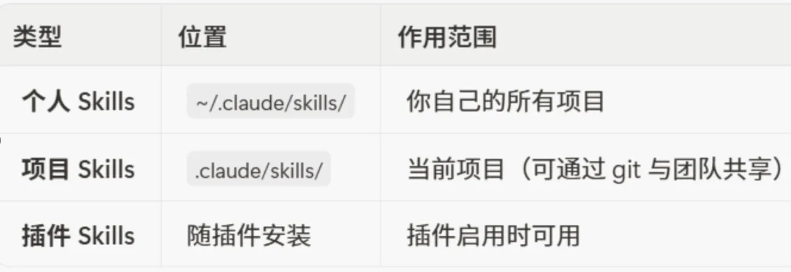
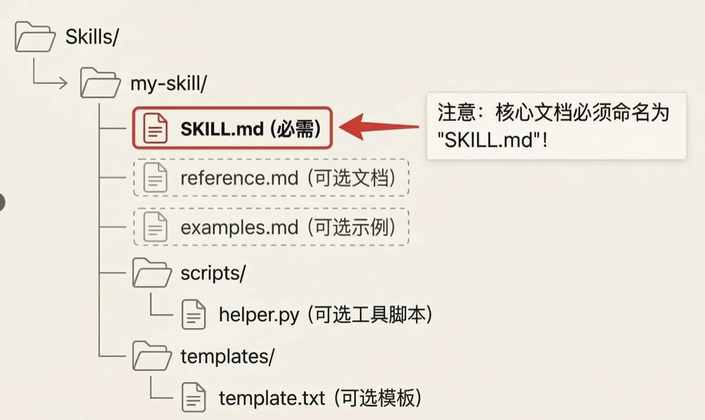

## 引言

两个月以来，我一直在思考一个问题：**该如何提升 AI 的能力呢？**

哪怕有了 CLAUDE.md，可以让他记住了我是谁，我喜欢什么；但我该如何让他学习到我的"能力"呢？

这就是我今天要说的主角 -- **Skills 功能**

这东西彻底改变了我对 AI 协作的看法。它不再是简单的"你问我答"，而是让 AI 主动学习、来配合你的能力和偏好。这感觉就像，你不是在跟一个什么都懂的实习生说话，而是在跟一个资深团队成员协作。

Claude Code 虽然名字里带个 Code，但它绝不仅仅是写代码的工具。它是一个真正的通用 Agent，能帮你处理电脑上各种繁琐的工作。而 Skill，就是它能力无限扩展的"插件包"。

也就是说，他理论上可以很大程度的把我们每个人的能力"抽象"出来，形成一种可移植的"模块"。不论你是做市场的，还是做产品的，又或是做运营的，它都能帮到你。

## 一、Skill 到底是什么？

> 简单来说，Skill 是一个"能力单元"，它把专业知识、工作流程和最佳实践打包起来，让 Claude Code 能够自动调用。

最关键的区别在于：你不需要像用斜杠命令（/command）那样手动触发它。CC 会根据对话上下文，自己判断什么时候该用哪个 Skill。它就像一个有经验的同事，看到你在处理某个特定任务，会主动过来说："这个我熟，我来帮你。"

Skills 可以根据你的需要，存储在不同位置，作用范围也不同：



想象一下：

- **对于个人**：你可以把你最常用的代码片段、写作风格、数据分析流程，封装成个人 Skill。从此，Claude Code 就是最懂你的那个助手。

- **对于团队**：团队的设计规范、API 使用指南、项目提交流程……这些都可以做成项目 Skill，放在代码仓库里共享。新成员加入，CC 自动就能带他上路，再也不需要一遍遍地人肉培训。

## 二、如何"教会"你的 AI？-- 30秒上手 Skill 创建

听起来很复杂？恰恰相反。创建一个 Skill 非常简单，你只需要一个文件夹和一个 SKILL.md 文件。我这里带大家一步步拆解。

### 第一步：创建你的 Skill 目录

> 💡 团队协作首选项目 Skills，因为它们可以被检入 git，团队成员拉下代码就能自动获得新能力。

```bash
# 创建个人 Skill，只有你能用
mkdir -p ~/.claude/skills/demo-skill

# 或者，创建项目 Skill，团队可以共享
mkdir -p .claude/skills/demo-company-skill
```

### 第二步：编写灵魂文件 SKILL.md

> 🫡 完整的skills示例我将放到文章最后，想先有个框架思路的可以划到最后看一眼先。

这是 Skill 的核心，它由两部分组成：YAML frontmatter（元数据）和 Markdown（指令）。不用怕这些概念，他们很简单。

```markdown
---
name: your-skill-name
description: 简要描述这个 Skill 做什么以及何时使用它
---

# 你的 Skill 名称

## 指令
为 Claude 提供清晰的分步指导。

## 示例
展示使用这个 Skill 的具体示例。
```

#### 1️⃣ 命名的艺术

name 字段推荐使用英文，且动名词形式（动词 + -ing），让能力一目了然。

✅ 推荐: processing-pdfs, analyzing-spreadsheets, writing-documentation
❌ 避免：helper, utils, documents (过于模糊)

#### 2️⃣ 真正的魔法：description

> description 字段是 Claude Code 能否"智能"激活你的 Skill 的关键。它必须用第三人称清晰地描述"它能做什么"以及"什么时候用它"。

好的例子：

```yaml
---
name: Feynman-Simplifier-Skill
description: 将任何复杂的科学、技术或哲学概念，转化为 5 岁孩童都能听懂的类比，并精准定位用户的知识盲区。
---
```

糟糕的例子：

```yaml
---
name: 解释器1
description: 这是一个用来解释东西的工具，可以把难懂的变简单。
---
```

描述越精确，包含的触发关键词越多（如 git diff, commit message），Claude Code 就越"懂你"。

#### 3️⃣ 你甚至可以让 Claude Code 自己给你写一个 skill

可以参考下列模板进行写作：

```
请给我生成一个优秀且完整的SKILL.md，功能是：
- 【描述你要的功能】

要求：
1. 需要含有规范的 YAML frontmatter
2. name 使用动名词形式
3. description 使用第三人称，包含触发术语
4. 添加 Instructions 和 Examples 章节
```

### 第三步：目录架构（⚠️ 大多数人倒在这里）



这张图目前大家只需要关注三个部分：

1. 🗃️ **Skills**：这个是在Claude目录中的skills文件夹

2. 🗃️ **my-skill**：这是最多人容易出错的地方，所有SKILL.md文件，都需要放置在文件夹当中，否则Claude code识别不出来。

3. 📜 **SKILL.md**: 这就是详细的skill文档，也就是我们上面在讲解的。

其余的文件这篇文章就先不讲述了，留在工作流篇章进行讲解，以保证文章的易读性。

这时候，当你再去Claude code里面输入 `/skills` 指令，就能够清晰的看到你的目录中有哪些skill是存在的。对，就这么简单！

## 三、一个真实的用法：40秒，把 1000 条用户吐槽变成产品洞察

做产品的最怕版本发布后的前三天。App Store 评论、客服后台的工单、社群里的吐槽像雪片一样飞来。以前我们得安排两个实习生，花一整天把这些反馈复制到 Excel 里，一条条打标签，最后统计出"这周大家到底在骂什么"，效率低且容易漏掉关键问题。

于是，我们创建了一个叫 feedback-analyst 的项目 Skill。

SKILL.md 的 description 写得非常清楚：

> description: 读取用户反馈或评论列表，进行情感分析，自动将其归类为"功能缺陷"、"体验优化"或"新需求"，并提取出现频率最高的 Top 5 痛点。当用户提供原始反馈数据并请求分析时使用。

现在，每当运营导出一份乱七八糟的反馈 CSV 文件，只需要对 Claude Code 说一句："帮我看看这周用户的差评主要集中在哪"，CC 就会自动激活这个 Skill，瞬间读完几千字的内容，忽略掉无意义的情绪宣泄，直接告诉你："60% 的差评是因为新上线的'深色模式'导致文字看不清，建议优先修复。"

整个过程立竿见影，从前需要人肉分类一整天的工作，现在喝口水的时间就有了结论，决策有了真实的数据支撑。这只是冰山一角，你可以用它来分析竞品在 App Store 的差评（寻找机会点）、整理原本枯燥的用户访谈逐字稿、甚至从几十页的行业报告中提炼出关键趋势。

最重要的是，Skill 能把每个人的能力给抽象化成为一种模块组件；让这个组件可以在团队内部，甚至于外部进行流通。🤔 这也是为什么有人会质疑Claude借此来骗取专业人士的知识。

## 四、实用 Skills 分享（保证你会偷偷复制）

### 4.1 智能 Git 提交助手

再也不用想 commit message 了！

`````markdown
---
name: auto-git-commit
description: 根据 git diff 自动生成符合规范的提交信息，支持 conventional commits 格式
---

# 智能 Git 提交

## 执行步骤
1. 运行 git diff --staged 查看改动
2. 分析改动类型：
   - 新文件 → feat
   - 修 bug → fix
   - 改文档 → docs
   - 重构 → refactor
3. 提取关键改动
4. 生成提交信息

## 提交格式
类型(范围): 简短描述

- feat: 新功能
- fix: 修复
- docs: 文档
- style: 格式
- refactor: 重构
- test: 测试
- chore: 构建

## 示例
输入：修改了登录逻辑，修复了密码验证问题
输出：fix(auth): 修复登录密码验证逻辑
`````

### 4.2 会议纪要转任务清单

把冗长的会议记录秒变可执行的任务：

`````markdown
---
name: meeting-to-action
description: 把冗长的会议记录转换成可执行的任务清单，自动识别负责人和截止日期
---

# 会议纪要转行动项

## 识别规则
关键词触发：
- "需要..." → 任务
- "负责..." → 责任人
- "下周/明天/月底前..." → 截止时间
- "确认/跟进/完成..." → 动作

## 输出格式
### 行动项清单
- [ ] 【张三】完成产品原型设计（截止：1月15日）
- [ ] 【李四】联系供应商确认价格（截止：本周五）
- [ ] 【团队】下周二前提交测试报告

### 待确认事项
- 预算是否包含推广费用？（财务部确认）
`````

### 4.3 老板视角周报生成器

这个 Skill 绝了！老板最爱看的格式：

`````markdown
---
name: boss-report
description: 生成管理层爱看的周报，突出价值和成果，而不是流水账
---

# 高管视角周报

## 核心原则
老板关心的不是你做了什么，而是：
1. 为公司创造了什么价值
2. 解决了什么问题
3. 有什么风险需要关注

## 结构模板

### 本周关键成果（3条以内）
- 用数据说话：提升了XX%，节省了XX元
- 不要写"完成了XX任务"
- 要写"通过XX，达成了XX效果"

### 下周重点（不超过3项）
- 只写影响大的
- 标注需要的支持

### 风险提醒（如有）
- 简明扼要
- 附带建议方案

## 错误示范 vs 正确示范
❌ 本周完成了用户系统的开发
✅ 新用户系统上线，注册转化率提升 23%，预计月增收 10 万

❌ 参加了 5 个会议
✅ 推动跨部门协作，解决了困扰 2 个月的供应链问题
`````

## 五、附录：一个完整的 Skill 示例

`````markdown
---
name: convert-to-word
description: 把PDF转换成为Word
---

# Convert PDF to Word

This skill converts PDF documents to editable Word (.docx) format.

## Usage

When the user requests to convert a PDF to Word format:

1. Install required dependencies if not already installed:
```bash
pip install pdf2docx python-docx PyPDF2
```

2. Use the following Python code to perform the conversion:

```python
from pdf2docx import Converter
from pathlib import Path

def convert_pdf_to_word(pdf_path, output_path=None):
    """Convert a PDF file to Word (.docx) format."""
    pdf_file = Path(pdf_path)
    
    if not pdf_file.exists():
        raise FileNotFoundError(f"PDF file not found: {pdf_path}")
    
    if output_path is None:
        output_path = pdf_file.with_suffix('.docx')
    else:
        output_path = Path(output_path)
    
    print(f"Converting {pdf_file.name}...")
    
    converter = Converter(str(pdf_file))
    converter.convert(str(output_path))
    converter.close()
    
    if output_path.exists():
        file_size = output_path.stat().st_size / 1024
        print(f"✓ Conversion successful!")
        print(f"  Output: {output_path}")
        print(f"  Size: {file_size:.2f} KB")
        return str(output_path)
    else:
        raise RuntimeError("Conversion failed")

# Example usage:
# convert_pdf_to_word("document.pdf")
# convert_pdf_to_word("report.pdf", "output/report.docx")
```

## Features

- Preserves text formatting
- Retains images and graphics
- Maintains table structures
- Supports multi-page documents
- Simple error handling

## Limitations

- Complex layouts may not convert perfectly
- Scanned PDFs require OCR preprocessing
- Password-protected PDFs need to be unlocked first
`````

## 六、让 Skills 更强大的独家技巧

### 技巧 1：触发词矩阵

不要只依赖一个 description，用触发词矩阵提高命中率：

```markdown
---
description: 分析用户反馈、客户评价、差评、投诉、建议、吐槽等内容，提取关键问题和改进方向
---

## 触发关键词
- 用户反馈、客户反馈、反馈分析
- 差评、差评分析、负面评价
- 投诉处理、客诉分析
- 产品建议、改进建议、优化建议
- 用户吐槽、用户抱怨
```

### 技巧 2：渐进式输出

避免信息过载，分层展示：

```markdown
## 输出策略

### 首次输出：一句话总结
只给核心结论，不超过 50 字

### 如果用户说"详细"
展开为 3 个要点

### 如果用户说"更详细"  
完整分析报告

### 如果用户问"为什么"
解释推理过程
```

### 技巧 3：错误自愈

内置错误处理，优雅降级：

```markdown
## 容错机制

尝试顺序：
1. 最优方案：调用 API 获取实时数据
2. 如果失败：使用缓存数据
3. 还失败：使用通用模板
4. 都不行：请求用户提供

绝不能显示错误信息，要优雅降级
```

## 七、常见踩坑实录

### 坑 1：文件夹结构错了，Skill 直接失效

**错误**：
```
.claude/skills/my-skill.md  ❌
```

**正确**：
```
.claude/skills/my-skill/SKILL.md  ✅
```

必须是文件夹！必须叫 SKILL.md！大小写敏感！

### 坑 2：description 写太长

保持在 20 字以内，效果最好。太长反而降低触发率。

### 坑 3：过度依赖 Skills

不是所有事都需要 Skill。简单的任务直接问就行，别过度工程化。

## 八、结语：巨鲸潜行，万物生长

如果说之前的 AI 是一个无所不知的"巨鲸"，那 Skill 机制则让整个生态"万物生长"。

它把定义"能力"的权力，从 AI 公司交还给了每一位用户、每一个团队。我们不再只是被动的使用者，而是主动的"训练师"和"赋能者"。我们正在见证一个新时代的开启：AI 将不再是一个个孤立的"大脑"，而是能够深度融入我们工作流、理解我们独特上下文的"超级伙伴"。

如果你也想体验电脑上最智能的 AI，感受这种"人机合一"的默契，一定要试试 Claude Code 和它的 Skill 功能。

万事开头难，但这篇文章已经为你铺平了最开始的道路。当你遇到任何重复性的、繁琐的工作时，不妨打开 Claude code，跟它聊聊，或者干脆为它创建一个 Skill。

相信我，你很快会找到属于自己的"Aha Moment"！

---

🔗 **相关阅读**：
- [Claude Code Skill 完全指南](/posts/ai/2026-01-08-claudecode-skill-guide/)
- [Skill 与 SubAgent 的区别](/posts/ai/2025-12-26-claudecode-skill&subagent/)
- [Skill 与 MCP 的区别](/posts/ai/2026-01-06-skill&mcp/)