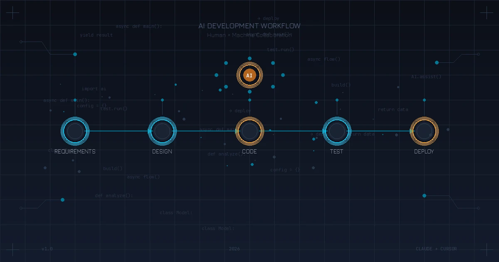

2026年，AI编程工具已经从"尝鲜玩具"变成了开发者的"标配装备"。据统计，约85%的开发者已经在日常工作中使用AI工具。

但很多人的用法还停留在"问问ChatGPT怎么写这段代码"的阶段。今天我想分享一套完整的AI开发工作流，让AI真正成为你的"结对编程搭档"，贯穿从需求到上线的全过程。

## 一、工具选择：不是非此即彼

在开始之前，先聊聊工具选择。目前主流的AI编程工具有：

| 工具 | 特点 | 适用场景 |
|------|------|----------|
| **Claude Code** | 深度推理、大上下文、CLI优先 | 架构设计、复杂重构、跨文件理解 |
| **Cursor** | IDE集成、实时补全、流畅体验 | 日常编码、快速迭代 |
| **ChatGPT** | 通用能力强、响应快 | 快速问答、代码片段 |
| **GitHub Copilot** | 深度IDE集成、补全准确 | 行内补全、常规编码 |

**我的建议**：不要只用一个工具。

我的组合是：**Claude Code（规划） + Cursor（实现）**。用Claude Code做架构设计和复杂问题分析，用Cursor进行日常编码。两者可以完美配合——在Cursor的终端里直接调用Claude Code CLI。

## 二、需求分析阶段：让AI帮你理清思路

拿到需求后，不要急着写代码。先用AI帮你做需求分析。

### 1. 需求拆解

把产品需求丢给Claude，让它帮你拆解：

```
我收到一个需求：实现用户积分系统，支持积分获取、消费、查询、排行榜功能。

请帮我：
1. 拆解核心功能模块
2. 识别潜在的技术难点
3. 列出需要确认的产品问题
```

AI会帮你系统性地梳理，往往能发现你没想到的边界情况。

### 2. 技术方案评估

对于复杂需求，让AI给出多种技术方案对比：

```
积分排行榜需要支持实时更新，预计用户量100万。
请对比以下方案的优缺点：
1. MySQL + 定时任务
2. Redis Sorted Set
3. 专用排行榜服务
```

## 三、架构设计阶段：AI当你的技术顾问

这是Claude Code的强项——它的大上下文能力可以理解整个项目结构。

### 1. 让AI理解现有架构

```bash
# 在项目根目录运行Claude Code
claude

# 然后输入
请分析当前项目的架构设计，包括：
1. 目录结构和模块划分
2. 核心数据流
3. 依赖关系
```

### 2. 设计新功能架构

基于对现有代码的理解，让AI设计新功能：

```
基于现有架构，设计积分系统的实现方案：
1. 需要新增哪些模块
2. 与现有模块如何交互
3. 数据库表设计
4. API接口设计
```

**关键技巧**：给AI足够的上下文。把相关的代码文件、数据库结构、API文档都提供给它。

## 四、编码实现阶段：AI是你的结对搭档

这是最日常的场景，但也最容易用错。

### 1. 正确的提问方式

**错误示范**：
```
帮我写一个用户服务
```

**正确示范**：
```
请实现UserService类，要求：
1. 使用Spring Boot框架
2. 包含CRUD操作
3. 集成现有的BaseService基类
4. 使用MyBatis-Plus作为ORM
5. 参考现有的OrderService实现风格
```

**核心原则**：上下文越充分，结果越准确。

### 2. 增量式开发

不要让AI一次性生成大量代码。采用增量方式：

1. 先让AI生成核心骨架
2. 逐个方法细化实现
3. 每完成一部分就运行测试
4. 发现问题及时修正

### 3. 代码审查

写完代码让AI帮你Review：

```
请Review这段代码，关注：
1. 潜在的Bug
2. 性能问题
3. 安全漏洞
4. 代码规范
```

## 五、测试阶段：AI生成测试用例

测试用例生成是AI的高价值应用场景之一。

### 1. 单元测试生成

```
为以下方法生成单元测试：
- 覆盖正常流程
- 覆盖边界条件
- 覆盖异常情况
使用JUnit 5 + Mockito
```

### 2. 测试数据生成

```
生成积分系统的测试数据：
- 10个正常用户
- 包含各种积分等级
- 包含边界值情况
输出为SQL INSERT语句
```

## 六、部署上线阶段：AI辅助运维

### 1. 配置文件生成

```
生成Kubernetes部署配置：
- 服务名：point-service
- 副本数：3
- 资源限制：CPU 500m, 内存 512Mi
- 健康检查配置
- 环境变量从ConfigMap读取
```

### 2. 问题排查

线上出问题时，把日志丢给AI分析：

```
以下是服务报错日志，请分析：
1. 根本原因
2. 影响范围
3. 修复建议

[粘贴日志]
```

## 七、效率提升数据

使用AI工作流后，我的开发效率变化：

| 环节 | 提升幅度 | 主要收益 |
|------|----------|----------|
| 需求分析 | 40% | 更全面的边界情况考虑 |
| 架构设计 | 30% | 快速获得多种方案对比 |
| 编码实现 | 50% | 减少重复劳动 |
| 测试编写 | 60% | 自动生成测试用例 |
| 问题排查 | 45% | 快速定位根因 |

## 八、避坑指南

### 1. 不要盲目信任

AI会产生"幻觉"，生成看起来正确但实际有问题的代码。**永远要验证**。

### 2. 保持代码Owner意识

AI生成的代码，你要完全理解才能提交。不理解的代码=技术债务。

### 3. 敏感信息脱敏

不要把真实的密钥、密码、用户数据发给AI。

### 4. 版本控制

AI生成的代码改动要及时commit，便于追踪和回滚。

## 九、总结

AI开发工作流的核心理念：

1. **工具组合**：Claude Code规划 + Cursor实现，发挥各自优势
2. **充分上下文**：给AI足够的背景信息，结果才准确
3. **增量迭代**：小步快跑，及时验证
4. **人机协作**：AI是助手，不是替代品

AI不会取代程序员，但会用AI的程序员会取代不会用的。

---

**相关链接**：
- [Claude Code官方文档](https://docs.anthropic.com/en/docs/claude-code)
- [Cursor官网](https://cursor.sh/)
- [2025 DORA AI开发报告](https://dora.dev/research/2025/dora-report/)
