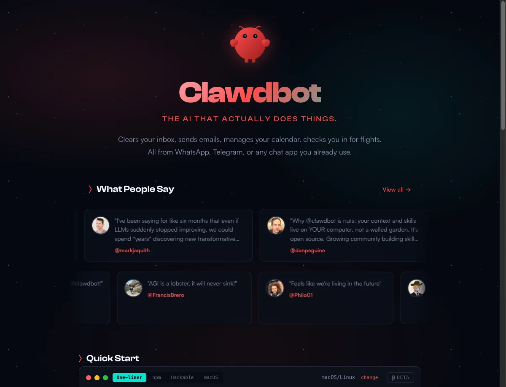

+++
date = '2026-01-25'
draft = false
title = 'ClawdBot：海外爆火的个人 AI 管家，30 分钟搭建指南'
description = 'ClawdBot 是一个开源的 AI Agent 个人助手，可以在你的电脑上 24 小时运行，通过 Telegram、WhatsApp 等聊天工具与你互动，自动处理邮件、日程、提醒等任务。本文手把手教你从零开始搭建自己的 AI 管家，一看就懂，一学就会。'
tags = ['ClawdBot', 'AI Agent', 'AI 助手', '开源', '自动化', '个人助理', 'Anthropic', 'Claude']
categories = ['AI实战']
+++



## 一、先讲个故事

想象一下这个场景：

你早上还在睡觉，你的 AI 助手已经帮你做完了这些事：

- 把昨晚收到的 50 封邮件整理好，只留下 3 封需要你亲自回复的
- 帮你订好了下周出差的机票，还完成了值机
- 把你关注的几个公众号更新内容做了总结，放在一份简报里等你看

等你醒来，打开手机，AI 助手发消息告诉你："老板，今天有个重要会议在下午 3 点，我已经帮你准备好了会议资料。"

这不是科幻电影，这是 **ClawdBot** 正在帮很多人实现的事情。读完这篇文章，你也能在 30 分钟内搭建自己的 AI 管家。

---

## 二、ClawdBot 到底是什么？

### 2.1 一句话定义

> **ClawdBot** 是一个开源的 AI Agent 个人助手，可以 24 小时运行在你的电脑上，通过 Telegram、WhatsApp 等聊天工具自动处理邮件、日程、提醒等任务。它由奥地利工程师 Peter Steinberger 开发，截至 2026 年 1 月已获得 [9000+ GitHub Star](https://github.com/clawdbot/clawdbot)。

### 2.2 用大白话解释

[ClawdBot](https://clawd.bot/) 是一个"住"在你电脑里的 **AI Agent**（AI 智能体）。

你可以把它想象成一个非常聪明的员工：

- 它有"眼睛"——能看网页、读文件
- 它有"手"——能操作电脑、点击按钮、填表格
- 它有"记忆"——记得你说过的每一件事
- 它 24 小时不睡觉——随时待命

### 2.3 和 ChatGPT 有什么不同？

| 对比项 | ChatGPT | ClawdBot |
|--------|---------|----------|
| 能力范围 | 只能聊天，给你建议 | 能聊天，还能帮你干活 |
| 记忆能力 | 聊完就忘了 | 记得你说过的所有事 |
| 使用方式 | 只能在网页里用 | 可以通过 Telegram、WhatsApp 随时联系 |
| 数据归属 | 运行在别人的服务器上 | 运行在你自己的电脑上，数据完全属于你 |

简单说：**ChatGPT 是顾问，只出主意；ClawdBot 是助理，能动手干活。**

### 2.4 和 Claude Code 有什么不同？

可能有人听说过 [Claude Code](/posts/ai/2025-01-14-claude-code-guide/)，它也是基于 Claude 的工具，但定位完全不同：

| 对比项 | Claude Code | ClawdBot |
|--------|-------------|----------|
| 出品方 | Anthropic 官方 | 社区开源项目 |
| 目标用户 | 程序员 | 所有人 |
| 主要用途 | 写代码、调试、重构 | 处理邮件、订餐、提醒、调研 |
| 交互方式 | 在电脑终端里打字 | 用手机聊天软件随时联系 |
| 运行方式 | 需要时启动，用完关闭 | 24 小时后台运行 |
| 记忆能力 | 仅记住当前对话 | 永久记忆，越用越懂你 |

打个比方：
- **Claude Code** = 你雇的一个程序员，坐在你旁边帮你写代码
- **ClawdBot** = 你雇的一个私人秘书，24 小时待命处理杂事

如果你是程序员，两个都可以用——[Claude Code 帮你写代码](/posts/ai/2025-01-14-claude-code-guide/)，ClawdBot 帮你处理生活琐事。如果你不是程序员，那 ClawdBot 更适合你。

### 2.5 谁做的？

ClawdBot 是由奥地利工程师 **Peter Steinberger** 和社区一起开发的开源项目。项目托管在 [GitHub](https://github.com/clawdbot/clawdbot)，截至 2026 年 1 月已获得 9000+ Star。

"开源"是什么意思？就是代码完全公开，你可以免费使用，也可以自己修改。

---

## 三、它能帮你做什么？（举例说明）

### 3.1 帮你处理邮件

**你说**："帮我看看邮箱，把广告邮件都退订了，重要的邮件列个清单给我。"

**它做**：
1. 打开你的 Gmail
2. 一封封看过去
3. 广告邮件？点击退订按钮
4. 重要邮件？记下来
5. 给你发一份清单："老板，这 5 封邮件需要你处理"

### 3.2 帮你订餐厅

**你说**："帮我订明天晚上 7 点的海底捞，4 个人。"

**它做**：
1. 打开大众点评网站
2. 搜索海底捞
3. 选择明天晚上 7 点，4 位
4. 填写你的手机号
5. 提交预订
6. 告诉你："订好了，确认短信已经发到你手机"

### 3.3 帮你做调研

**你说**："帮我调研一下最近火的 AI 工具，整理成一份报告。"

**它做**：
1. 打开各种科技网站
2. 搜索最新的 AI 工具资讯
3. 阅读文章，提取重点
4. 整理成一份清晰的报告
5. 保存到你的电脑里

### 3.4 帮你管理日程

**你说**："3 天后提醒我给张三打电话跟进合作的事。"

**它做**：
1. 记下这件事
2. 3 天后主动给你发消息："老板，今天记得给张三打电话哦，是关于合作的事。"

### 3.5 帮你控制智能家居

**你说**："今天天气预报说会降温，把家里的暖气提前开一下。"

**它做**：
1. 查看天气预报
2. 连接你的智能家居系统
3. 把暖气温度调高
4. 告诉你："暖气已经开了，回家就暖和"

---

## 四、它是怎么工作的？

我用一张图来解释：

```
┌─────────────┐     发消息      ┌─────────────┐
│             │ ───────────────→│             │
│   你的手机   │                 │  ClawdBot   │
│  (Telegram) │ ←───────────────│  (你的电脑)  │
│             │     回复结果     │             │
└─────────────┘                 └──────┬──────┘
                                       │
                                       │ 调用 AI 大脑
                                       ↓
                                ┌─────────────┐
                                │   Claude    │
                                │   (AI大脑)   │
                                └─────────────┘
```

**通俗解释**：

1. 你用手机（Telegram、WhatsApp 等）给 ClawdBot 发消息
2. ClawdBot 收到消息，发给 AI 大脑（Claude）思考
3. AI 大脑想好怎么做后，ClawdBot 就在你的电脑上执行
4. 做完了，通过手机告诉你结果

这种能自主思考、自主执行的 AI，就叫做 **AI Agent**（AI 智能体）。这是 [2025 年 AI 发展的重要趋势](/posts/ai/2026-01-19-ai-dev-workflow/)。

---

## 五、准备工作

在开始安装之前，你需要准备这些东西：

### 5.1 一台电脑

ClawdBot 需要 24 小时运行，所以你需要一台可以一直开着的电脑。

**几种选择**：

| 选择 | 优点 | 缺点 | 适合谁 |
|------|------|------|--------|
| Mac Mini | 省电、稳定、不占地方 | 需要花钱买 | 预算充足的人 |
| 家里闲置的旧电脑 | 不花钱 | 可能比较费电 | 有旧电脑的人 |
| 云服务器 | 不用管硬件 | 每月要付费 | 熟悉云服务的人 |
| NAS | 本来就 24 小时开着 | 配置可能有点复杂 | 已经有 NAS 的人 |

### 5.2 AI 大脑的账号

ClawdBot 需要一个 AI 大脑来思考。推荐使用 Claude（效果最好）。

**怎么获取**：
1. 去 [console.anthropic.com](https://console.anthropic.com) 注册账号
2. 绑定信用卡
3. 获取 API Key（一串密钥）

**费用**：大概每月 20-100 美元，取决于你用多少。

### 5.3 一个聊天工具

你需要一个和 ClawdBot 聊天的渠道。

**支持的工具**：
- Telegram（推荐，设置最简单）
- WhatsApp
- Discord
- Slack
- iMessage（仅限 Mac 电脑）

---

## 六、手把手安装教程

下面我以 **Mac 电脑 + Telegram** 为例，一步步教你安装。

### 6.1 打开终端

1. 在 Mac 上按 `Command + 空格`
2. 输入 "终端" 或 "Terminal"
3. 按回车，打开终端程序

你会看到一个黑色（或白色）的窗口，里面有一个闪烁的光标。

> 💡 如果你想了解更多终端技巧，可以参考 [终端工具推荐](/posts/macos/2025-01-22-terminal-tools-guide/)。

### 6.2 安装 ClawdBot

在终端里，复制粘贴下面这行命令，然后按回车：

```bash
curl -fsSL https://clawd.bot/install.sh | bash
```

**这行命令在做什么？**
- 从 [ClawdBot 官网](https://clawd.bot/) 下载安装脚本
- 自动安装 ClawdBot 到你的电脑

等待 1-2 分钟，安装完成后，会自动启动配置向导。

### 6.3 配置向导

安装完成后，你会看到一个配置向导。按照下面的步骤操作：

**选择语言**
- 选择 "English"（目前只支持英文界面）

**选择 AI 模型**
- 选择 "Anthropic"（就是 Claude）

**输入 API Key**
- 把你之前获取的 Claude API Key 粘贴进去

**选择聊天渠道**
- 选择 "Telegram bot"

### 6.4 创建 Telegram 机器人

接下来，我们要在 Telegram 里创建一个机器人。

**打开 Telegram，搜索 @BotFather**

这是 Telegram 官方的"机器人工厂"，专门用来创建机器人。

**发送 `/newbot` 命令**

BotFather 会问你几个问题：

- **问**：给你的机器人起个名字？
- **答**：随便起，比如 "我的AI助手"

- **问**：给你的机器人起个用户名？（必须以 bot 结尾）
- **答**：比如 "myai_helper_bot"

**获取机器人令牌**

创建完成后，BotFather 会给你一串很长的文字，类似这样：

```
7123456789:AAHxxxxxxxxxxxxxxxxxxxxxxxxxxxxxxxxx
```

这就是你的**机器人令牌**，把它复制下来。

**在 Telegram 搜索 @userinfobot**

给它发任意消息，它会回复你的**用户 ID**，是一串数字，比如 `123456789`。

**回到终端，输入这些信息**

把机器人令牌和用户 ID 粘贴到配置向导里。

### 6.5 启动 ClawdBot

配置完成后，在终端输入：

```bash
clawdbot start
```

你会看到类似这样的信息：

```
✓ ClawdBot is running
✓ Connected to Telegram
✓ Ready to receive messages
```

恭喜！你的 AI 助手已经上线了！

### 6.6 开始聊天

打开 Telegram，找到你刚创建的机器人，发送第一条消息：

```
你好！
```

如果一切正常，它会回复你。

---

## 七、新手必试的 3 个命令

安装成功后，试试这 3 个命令，感受一下 ClawdBot 的能力：

### 7.1 让它认识你

```
我叫张三，在北京工作，是一名产品经理。
我喜欢喝咖啡，每天早上 9 点开始工作。
以后你就叫我"老板"吧。
```

从此以后，它会记住这些信息，更好地为你服务。

### 7.2 让它帮你做个简单任务

```
帮我搜索一下"2025年最火的AI工具"，
整理成一个清单给我。
```

看看它是怎么帮你完成这个任务的。

### 7.3 设置一个提醒

```
明天早上 9 点提醒我喝水。
```

第二天早上 9 点，它会主动给你发消息。

---

## 八、进阶玩法

当你熟悉了基本用法，可以尝试这些进阶玩法：

### 8.1 连接更多工具

ClawdBot 支持 [50 多种工具集成](https://clawd.bot/)：

- **Gmail**：帮你处理邮件
- **Google 日历**：帮你管理日程
- **GitHub**：帮你管理代码
- **Spotify**：帮你控制音乐
- **智能家居**：帮你控制灯光、空调

### 8.2 教它新技能

ClawdBot 可以学习新技能，这和 [Claude Code 的 Skill 系统](/posts/ai/2026-01-08-claudecode-skill-guide/)类似。比如：

```
我教你一个新技能：
每天早上 8 点，帮我查看天气，
如果要下雨，就提醒我带伞。
```

它会记住这个技能，每天自动执行。

### 8.3 运行多个助手

你可以运行多个 ClawdBot，让它们分工合作：

- 一个专门处理邮件
- 一个专门做调研
- 一个专门管理日程

---

## 九、常见问题

### 9.1 要花多少钱？

**答案**：总计约 20-150 美元/月，其中软件免费，主要是 AI API 费用。

| 项目 | 费用 |
|------|------|
| ClawdBot 软件 | 免费（开源） |
| 电脑/服务器 | 看你怎么选，0-50 美元/月 |
| Claude API | 约 20-100 美元/月 |
| **总计** | **约 20-150 美元/月** |

### 9.2 我的数据安全吗？

**答案**：非常安全。ClawdBot 运行在你自己的电脑上，所有数据都存在本地，不会上传到别人的服务器。

### 9.3 不会编程能用吗？

**答案**：能用。整个安装过程只需要复制粘贴几行命令，不需要写任何代码。

### 9.4 支持中文吗？

**答案**：支持。你可以用中文和它聊天，它能理解并用中文回复你。

### 9.5 电脑关机了怎么办？

**答案**：ClawdBot 需要电脑一直开着才能工作。如果你关机了，它就下线了。所以推荐用一台专门的电脑（比如 Mac Mini）来运行它。

---

## 十、注意事项

使用 ClawdBot 时，有几点需要注意：

1. **注意费用**：AI API 是按使用量收费的，建议设置一个每月上限，避免超支
2. **注意安全**：因为 ClawdBot 可以操作你的电脑，不要让它做危险的事情
3. **注意隐私**：虽然数据存在本地，但还是要注意保护敏感信息

---

## 十一、总结

ClawdBot 是一个真正能帮你"干活"的 AI Agent：

- **24 小时在线**：随时待命，不知疲倦
- **有记忆**：记得你说过的每一件事
- **能执行**：不只是建议，而是真的帮你做
- **完全私有**：运行在你自己的电脑上，数据属于你
- **开源免费**：软件不要钱，只需付 AI 接口费用

如果你想体验一下"有个 AI 助手是什么感觉"，ClawdBot 是一个很好的起点。

---

## 十二、相关链接

- [ClawdBot 官网](https://clawd.bot/)
- [ClawdBot GitHub](https://github.com/clawdbot/clawdbot)（⭐ 9000+ Star）
- [Anthropic Console（获取 API Key）](https://console.anthropic.com)

---

## 十三、延伸阅读

- [Claude Code 完全指南：终端里的全能 AI 助手](/posts/ai/2025-01-14-claude-code-guide/) - 程序员专属的 AI 编程助手
- [AI 开发工作流的变革](/posts/ai/2026-01-19-ai-dev-workflow/) - AI Agent 如何改变我们的工作方式
- [2025 年最值得使用的 20 个 Claude Code Skills](/posts/ai/2026-01-20-claude-code-skills-top20/) - 提升效率的 Skill 合集
- [终端工具推荐：23 款高效终端对比](/posts/macos/2025-01-22-terminal-tools-guide/) - 选择适合你的终端

---

如果这篇文章对你有帮助，欢迎在评论区分享你的使用体验！有问题也可以留言，我会尽量解答。

---

> 📅 **本文更新于 2026 年 1 月** | 基于 ClawdBot 最新版本撰写
