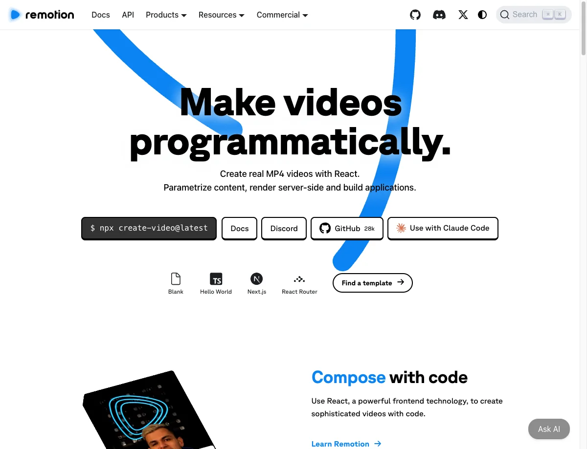

+++
date = '2026-01-25'
draft = false
title = 'Claude Code + Remotion：用 AI 对话生成专业视频，程序员的视频制作新姿势'
description = 'Remotion 是一个用 React 代码生成视频的开源框架，结合 Claude Code 的 AI 能力，只需用自然语言描述，就能自动生成专业级动画视频。本文手把手教你安装配置，让你 10 分钟上手 AI 视频制作。'
tags = ['Claude Code', 'Remotion', 'AI 视频', 'React', '视频制作', 'AI Agent', '开源', '效率工具']
categories = ['AI']
+++



## 先讲个故事

想象一下这个场景：

你是一个程序员，老板突然说："下周产品发布会，做个 30 秒的产品演示视频。"

你心里慌了——我又不是设计师，After Effects 都没装过，找外包？来不及了，而且至少要 1000 块起步。

但现在，你可以这样做：

**你说**："帮我做一个产品演示视频，显示我们的 App 界面，加上文字动画介绍三个核心功能，时长 30 秒。"

**Claude Code 做**：自动生成 React 代码，渲染出一个专业的 MP4 视频文件。

是的，你没看错。现在用 [Claude Code](/posts/ai/2025-01-14-claude-code-guide/) 配合 Remotion，真的可以用聊天的方式做视频了。

---

## Remotion 到底是什么？

### 用大白话解释

**Remotion** 就是一个"用代码写视频"的工具。

传统做视频：打开 Premiere 或 After Effects → 拖素材 → 调时间轴 → 加特效 → 导出

用 Remotion 做视频：写 React 代码 → 运行命令 → 直接生成 MP4

你可能会问：写代码做视频？这不是更麻烦吗？

还真不是。对程序员来说，代码比拖拖拽拽更熟悉。更重要的是——**代码可以被 AI 生成**。

这就是为什么 Claude Code + Remotion 这么火的原因：你只需要描述想要什么，AI 帮你把代码写好，视频就生成了。

### 和传统视频工具有什么不同？

| 对比项 | 传统工具（AE/Premiere） | Remotion + AI |
|--------|------------------------|---------------|
| 学习成本 | 需要学习软件操作 | 会说话就行 |
| 制作方式 | 手动拖拽、调参数 | 自然语言描述 |
| 批量生成 | 每个视频都要手动做 | 改个参数批量生成 |
| 修改成本 | 打开工程文件重新编辑 | 让 AI 改代码 |
| 协作方式 | 发送工程文件 | Git 版本控制 |
| 价格 | 软件订阅 + 外包费用 | 开源免费 |

### 谁做的？

Remotion 是由 **Jonny Burger** 创立的开源项目，目前在 GitHub 上有 **2.8 万颗星**，月安装量超过 **40 万次**。

官方最近专门为 AI 编程工具推出了 **remotion-best-practices** 技能包，让 Claude Code 能更好地生成 Remotion 代码。这个技能包发布后立刻火爆，周安装量接近 **3 万次**，其中 Claude Code 用户占了大头。

---

## 它能帮你做什么？（举例说明）

### 例子 1：产品演示视频

**你说**："做一个 App 功能介绍视频，依次展示登录、首页、设置三个界面截图，每个停留 3 秒，加上淡入淡出效果和底部文字说明。"

**它做**：
1. 创建三个场景组件
2. 设置每个场景 3 秒时长（90 帧）
3. 添加淡入淡出动画
4. 底部渲染文字说明
5. 导出 1080p 的 MP4 文件

### 例子 2：数据可视化动画

**你说**："用柱状图动画展示我们公司这一年的月销售额增长，数据是 [100, 120, 150, 180, 200, 250, 280, 320, 350, 400, 450, 500]，要有数字跳动效果。"

**它做**：
1. 创建柱状图组件
2. 每个柱子依次从底部升起
3. 数字实时跳动显示当前值
4. 背景加上网格线
5. 最后高亮全年最高点

### 例子 3：社交媒体短视频

**你说**："做一个 15 秒的 TikTok 风格视频，文字'限时优惠'从屏幕外飞入，然后放大、抖动，最后显示'仅剩 3 天'。"

**它做**：
1. 设置竖屏 9:16 比例
2. 文字飞入动画（使用 spring 弹性效果）
3. 放大 + 抖动效果
4. 倒计时文字淡入
5. 导出适合抖音/TikTok 的格式

### 例子 4：多 Skill 协同 - 自动下载素材 + 生成视频

这是最酷的玩法：结合多个 Skill，让 AI 自动搜索下载素材，然后生成完整视频。

**你说**："使用 media-download 和 remotion-best-practices 这两个 skill 帮我制作一个 2025 年度抖音年度金曲热榜 Top10，参考主流的剪辑手法。"

**它做**：

1. 自动搜索 2025 年抖音热门歌曲榜单
2. 用 media-download skill 下载歌曲片段和封面图
3. 设计榜单视频模板（倒计时排名、歌曲信息、动态背景）
4. 为每首歌制作 3-5 秒的展示片段
5. 添加转场动画、排名数字动效
6. 合成完整的 Top10 榜单视频
7. 导出成品

**你要做的**：发完这句话，去倒杯咖啡，回来视频就做好了。

下面是用这个方法制作的成品视频(*从 82M 压缩到 1M 后的效果，原视频是高清*)：

<video controls width="100%">
  <source src="DouyinTop10.mp4" type="video/mp4">
</video>

> 💡 这就是 AI Agent 的威力：多个 Skill 协同工作，自动完成从"找素材"到"出成品"的全流程。你只需要描述最终想要什么。
>
>

Claude Code 里调用 Remotion Skill 全部过程：
```
❯ 使用这 media-download 和 remotion-best-practices 这两个 skill 帮我制作一个 2025 年度抖音年度金曲热榜 Top10，参考主流的剪辑手法

⏺ 好的，我来制作 2025 年度抖音金曲热榜 Top10 视频。先搜索最新的抖音热歌榜单：

⏺ Web Search("2025年抖音热歌榜 年度金曲 Top10 排行榜 最火歌曲")
  ⎿  Did 1 search in 25s

⏺ Web Search("2025抖音最火歌曲 大展鸿图 揽佬 若月亮没来 APT 玫瑰少年")
  ⎿  Did 1 search in 25s

⏺ 现在我有了完整的抖音热歌榜单数据。开始创建项目：

⏺ Bash(mkdir -p /Users/bruce.he/douyin-top10-2025/{src/{compositions,components,data,styles},public/{images,videos,audio/songs}} && cd /Users/bruce.he/douyin-top10-202…) timeout: 3m 0s
  ⎿  Wrote to /Users/bruce.he/douyin-top10-2025/package.json:

     {
     … +23 lines (ctrl+o to expand)

⏺ Write(~/douyin-top10-2025/tsconfig.json)
  ⎿  Wrote 18 lines to tsconfig.json
     {
       "compilerOptions": {
         "target": "ES2020",
         "module": "ESNext",
         "moduleResolution": "bundler",
         "jsx": "react-jsx",
         "strict": true,
         "esModuleInterop": true,
         "skipLibCheck": true,
         "forceConsistentCasingInFileNames": true,
     … +8 lines (ctrl+o to expand)

⏺ Write(~/douyin-top10-2025/src/data/songs.ts)
  ⎿  Wrote 86 lines to src/data/songs.ts
     export interface Song {
       rank: number;
       title: string;
       artist: string;
       audioFile: string;
       tag?: string; // 热门标签
     }
     // 2025 抖音年度金曲热榜 Top 10
     // 数据来源: MAIGOO、QQ音乐抖音热歌榜、Spotify TikTok热歌榜
     … +76 lines (ctrl+o to expand)

⏺ Write(~/douyin-top10-2025/src/styles/fonts.ts)
  ⎿  Wrote 20 lines to src/styles/fonts.ts
     import { loadFont as loadNotoSansSC } from "@remotion/google-fonts/NotoSansSC";
     import { loadFont as loadPoppins } from "@remotion/google-fonts/Poppins";
     export const { fontFamily: notoSansSC } = loadNotoSansSC();
     export const { fontFamily: poppins } = loadPoppins();
     export const fonts = {
       chinese: notoSansSC,
       english: poppins,
     };
     … +10 lines (ctrl+o to expand)

⏺ Write(~/douyin-top10-2025/src/components/DouyinBg.tsx)
  ⎿  Wrote 121 lines to src/components/DouyinBg.tsx
     import { useCurrentFrame, interpolate, random } from "remotion";
     import React from "react";
     import { douyinColors } from "../styles/fonts";
     interface DouyinBgProps {
       variant?: "default" | "champion" | "intro";
     }
     export const DouyinBg: React.FC<DouyinBgProps> = ({ variant = "default" }) => {
       const frame = useCurrentFrame();
     … +111 lines (ctrl+o to expand)

⏺ Write(~/douyin-top10-2025/src/components/RankBadge.tsx)
  ⎿  Wrote 99 lines to src/components/RankBadge.tsx
     import {
       useCurrentFrame,
       interpolate,
       spring,
       useVideoConfig,
       Easing,
     } from "remotion";
     import React from "react";
     import { fonts, douyinColors } from "../styles/fonts";
     … +89 lines (ctrl+o to expand)

⏺ Write(~/douyin-top10-2025/src/components/SongInfo.tsx)
  ⎿  Wrote 144 lines to src/components/SongInfo.tsx
     import {
       useCurrentFrame,
       interpolate,
       Easing,
     } from "remotion";
     import React from "react";
     import { fonts, douyinColors } from "../styles/fonts";
     interface SongInfoProps {
       title: string;
     … +134 lines (ctrl+o to expand)

⏺ Write(~/douyin-top10-2025/src/components/MusicBars.tsx)
  ⎿  Wrote 64 lines to src/components/MusicBars.tsx
     import { useCurrentFrame, interpolate, random } from "remotion";
     import React from "react";
     import { douyinColors } from "../styles/fonts";
     interface MusicBarsProps {
       barCount?: number;
       isChampion?: boolean;
     }
     export const MusicBars: React.FC<MusicBarsProps> = ({
     … +54 lines (ctrl+o to expand)

⏺ Write(~/douyin-top10-2025/src/compositions/Intro.tsx)
  ⎿  Wrote 242 lines to src/compositions/Intro.tsx
     import {
       useCurrentFrame,
       interpolate,
       spring,
       useVideoConfig,
       Easing,
     } from "remotion";
     import React from "react";
     import { DouyinBg } from "../components/DouyinBg";
     import { fonts, douyinColors } from "../styles/fonts";
     … +232 lines (ctrl+o to expand)

⏺ Write(~/douyin-top10-2025/src/compositions/SongCard.tsx)
  ⎿  Wrote 211 lines to src/compositions/SongCard.tsx
     import {
       useCurrentFrame,
       interpolate,
       staticFile,
       Easing,
     } from "remotion";
     import { Audio } from "@remotion/media";
     import React from "react";
     import { DouyinBg } from "../components/DouyinBg";
     import { RankBadge } from "../components/RankBadge";
     … +201 lines (ctrl+o to expand)

⏺ Write(~/douyin-top10-2025/src/compositions/Champion.tsx)
  ⎿  Wrote 291 lines to src/compositions/Champion.tsx
     import {
       useCurrentFrame,
       interpolate,
       spring,
       useVideoConfig,
       staticFile,
       Easing,
     } from "remotion";
     import { Audio } from "@remotion/media";
     import React from "react";
     … +281 lines (ctrl+o to expand)

⏺ Write(~/douyin-top10-2025/src/compositions/Outro.tsx)
  ⎿  Wrote 309 lines to src/compositions/Outro.tsx
     import {
       useCurrentFrame,
       interpolate,
       spring,
       useVideoConfig,
       Easing,
     } from "remotion";
     import React from "react";
     import { DouyinBg } from "../components/DouyinBg";
     import { fonts, douyinColors } from "../styles/fonts";
     … +299 lines (ctrl+o to expand)

⏺ Write(~/douyin-top10-2025/src/compositions/DouyinTop10.tsx)
  ⎿  Wrote 106 lines to src/compositions/DouyinTop10.tsx
     import React from "react";
     import {
       TransitionSeries,
       linearTiming,
       springTiming,
     } from "@remotion/transitions";
     import { slide } from "@remotion/transitions/slide";
     import { fade } from "@remotion/transitions/fade";
     import { wipe } from "@remotion/transitions/wipe";
     import { Intro } from "./Intro";
     … +96 lines (ctrl+o to expand)

⏺ Write(~/douyin-top10-2025/src/Root.tsx)
  ⎿  Wrote 18 lines to src/Root.tsx
     import { Composition } from "remotion";
     import { DouyinTop10, TOTAL_DURATION } from "./compositions/DouyinTop10";
     export const RemotionRoot: React.FC = () => {
       return (
         <>
           <Composition
             id="DouyinTop10"
             component={DouyinTop10}
             durationInFrames={TOTAL_DURATION}
     … +8 lines (ctrl+o to expand)

⏺ Write(~/douyin-top10-2025/src/index.ts)
  ⎿  Wrote 5 lines to src/index.ts
     import { registerRoot } from "remotion";
     import { RemotionRoot } from "./Root";
     registerRoot(RemotionRoot);

⏺ Read(~/douyin-top10-2025/package.json)
  ⎿  Read 25 lines

⏺ Update(~/douyin-top10-2025/package.json)
  ⎿  Added 6 lines, removed 5 lines
       1  {
       2    "name": "douyin-top10-2025",
       3    "version": "1.0.0",
       4 -  "description": "",
       5 -  "main": "index.js",
       4 +  "description": "2025 抖音年度金曲热榜 Top10 视频",


       5 +  "main": "src/index.ts",
       6    "scripts": {
       7 -    "test": "echo \"Error: no test specified\" && exit 1"
       7 +    "dev": "npx remotion studio src/index.ts",
       8 +    "build": "npx remotion render src/index.ts DouyinTop10 out/video.mp4",
       9 +    "render": "npx remotion render src/index.ts DouyinTop10"
      10    },
      11 -  "keywords": [],
      11 +  "keywords": ["remotion", "douyin", "tiktok", "music", "top10"],
      12    "author": "",
      13    "license": "ISC",
      14 -  "type": "commonjs",
      14    "dependencies": {
      15      "@remotion/cli": "^4.0.409",
      16      "@remotion/google-fonts": "^4.0.409",

⏺ 现在下载歌曲音频预览：

⏺ Bash(cd /Users/bruce.he/douyin-top10-2025/public/audio/songs…) timeout: 1m 30s
  ⎿  📥 下载抖音热歌音频预览...
     ✅ 01-da-zhan-hong-tu.m4a
     ✅ 02-apt.m4a
     … +3 lines (ctrl+o to expand)

⏺ Bash(cd /Users/bruce.he/douyin-top10-2025/public/audio/songs…) timeout: 1m 30s
  ⎿  ✅ 05-wei-yi.m4a
     ✅ 06-di-57-ci.m4a
     ✅ 07-ruo-yue-liang.m4a
     … +16 lines (ctrl+o to expand)

⏺ 所有 10 首歌曲下载完成！现在下载视频素材：

⏺ Bash(PEXELS_API_KEY="o4Lcc47IpMICVTmCfX0kNTV9qZgdvlkhe5jwZbKrOfwUCcjXUbRvxs78" python3 /Users/bruce.he/.claude/skills/media-downloader/media_cli.py video "music conc…)
  ⎿  🔍 搜索视频: music concert red lights
     ✅ 找到 2 个视频
       ⬇️ 下载 1/2: music_concert_red_lights_1_pexels.mp4 (9s)
     … +4 lines (ctrl+o to expand)

⏺ Bash(PEXELS_API_KEY="o4Lcc47IpMICVTmCfX0kNTV9qZgdvlkhe5jwZbKrOfwUCcjXUbRvxs78" python3 /Users/bruce.he/.claude/skills/media-downloader/media_cli.py video "abstract n…)
  ⎿  🔍 搜索视频: abstract neon glow
     ✅ 找到 2 个视频
       ⬇️ 下载 1/2: abstract_neon_glow_1_pexels.mp4 (8s)
     … +4 lines (ctrl+o to expand)

⏺ 现在启动项目：

⏺ Bash(cd /Users/bruce.he/douyin-top10-2025 && npm run dev) timeout: 30s
  ⎿  Running in the background (↓ to manage)

⏺ Bash(sleep 8 && cat /private/tmp/claude/-Users-bruce-he/tasks/b0b98af.output) timeout: 15s
  ⎿  > douyin-top10-2025@1.0.0 dev
     > npx remotion studio src/index.ts
     … +2 lines (ctrl+o to expand)

⏺ Bash(ls -la /Users/bruce.he/douyin-top10-2025/public/videos/)
  ⎿  total 105584
     drwxr-xr-x@ 6 bruce.he  staff       192 Jan 26 00:16 .
     drwxr-xr-x@ 5 bruce.he  staff       160 Jan 26 00:11 ..
     … +4 lines (ctrl+o to expand)

⏺ ✅ 2025 抖音年度金曲热榜 Top 10 项目已完成！

  项目地址: /Users/bruce.he/douyin-top10-2025

  预览地址: http://localhost:3004

  ---
  🎵 榜单数据（来源: https://m.maigoo.com/top/444137.html、https://y.qq.com/n/ryqq_v2/toplist/60）
  ┌──────┬────────────────┬─────────────────────┬─────────────┐
  │ 排名 │      歌曲      │        艺人         │    标签     │
  ├──────┼────────────────┼─────────────────────┼─────────────┤
  │ 1    │ 大展鸿图       │ 揽佬 ft. AR刘夫阳   │ 🔥 年度神曲 │
  ├──────┼────────────────┼─────────────────────┼─────────────┤
  │ 2    │ APT.           │ ROSÉ & Bruno Mars   │ 🌍 全球爆红 │
  ├──────┼────────────────┼─────────────────────┼─────────────┤
  │ 3    │ 八方来财       │ 揽佬                │ 💰 财运神曲 │
  ├──────┼────────────────┼─────────────────────┼─────────────┤
  │ 4    │ 跳楼机         │ 告五人              │ 💔 失恋神曲 │
  ├──────┼────────────────┼─────────────────────┼─────────────┤
  │ 5    │ 唯一           │ 邓紫棋              │ 🎤 翻唱爆款 │
  ├──────┼────────────────┼─────────────────────┼─────────────┤
  │ 6    │ 第57次取消发送 │ 王忻辰              │ 💕 治愈情歌 │
  ├──────┼────────────────┼─────────────────────┼─────────────┤
  │ 7    │ 若月亮没来     │ 王宇宙Leto & 乔浚丞 │ 🌙 浪漫情歌 │
  ├──────┼────────────────┼─────────────────────┼─────────────┤
  │ 8    │ 座位           │ 承桓                │ 📚 校园青春 │
  ├──────┼────────────────┼─────────────────────┼─────────────┤
  │ 9    │ 两难           │ 加木                │ 🎵 热门单曲 │
  ├──────┼────────────────┼─────────────────────┼─────────────┤
  │ 10   │ 于是           │ 郑润泽              │ ✨ 新声力量 │
  └──────┴────────────────┴─────────────────────┴─────────────┘
  ---
  🎬 视频特点（参考主流剪辑手法）

  1. 抖音品牌风格
    - 使用抖音红 (#FE2C55) + 抖音青 (#25F4EE) 配色
    - 动态渐变背景 + 浮动光点效果
  2. 专业转场效果
    - slide 滑入转场（左右交替）
    - wipe 擦除转场
    - fade 淡入淡出
  3. 动态动画
    - Spring 弹性动画排名徽章
    - 打字机效果歌曲标题
    - 粒子爆发效果（冠军展示）
  4. 音频可视化
    - 实时模拟音频波形
    - 每首歌 30 秒 iTunes 预览
  5. 已下载素材
    - ✅ 10 首歌曲音频预览
    - ✅ 4 个背景视频（演唱会灯光、霓虹光效）

  ---
  📁 项目结构

  douyin-top10-2025/
  ├── src/
  │   ├── compositions/   # 场景组件
  │   ├── components/     # UI组件
  │   ├── data/songs.ts   # 榜单数据
  │   └── styles/fonts.ts # 字体配置
  ├── public/
  │   ├── audio/songs/    # 10首歌曲预览
  │   └── videos/         # 4个背景视频
  └── package.json

  打开 http://localhost:3004 预览视频！

✻ Cooked for 7m 16s
```

---

## 它是怎么工作的？

整个流程可以用这张图理解：

```
你的自然语言描述
       ↓
  Claude Code（理解需求）
       ↓
  生成 React/TypeScript 代码
       ↓
  Remotion 框架（渲染引擎）
       ↓
  输出 MP4 视频文件
```

**关键点**：
- **Claude Code** 负责"听懂你说的话"，然后写出正确的代码
- **Remotion Skills** 告诉 Claude Code"怎么写 Remotion 代码才对"
- **Remotion** 负责把代码变成真正的视频

这就像你有一个精通视频制作的程序员助手，你说需求，他写代码，机器渲染视频。

---

## 准备工作

### 1. 安装 Node.js

Remotion 需要 Node.js 18 以上版本。

```bash
# 检查是否已安装
node --version

# 如果没装，Mac 用户可以用 Homebrew
brew install node
```

### 2. 安装 Claude Code

如果你还没装 Claude Code，参考这篇文章：[Claude Code 完全指南](/posts/ai/2025-01-14-claude-code-guide/)

```bash
# 安装 Claude Code
npm install -g @anthropic-ai/claude-code

# 验证安装
claude --version
```

下面这个视频演示了 Claude Code 的安装过程：

<video controls width="100%">
  <source src="claude-code-install.mp4" type="video/mp4">
</video>

### 3. 准备 Anthropic API Key

需要一个 Anthropic 账号和 API Key。去 [Anthropic Console](https://console.anthropic.com/) 注册并创建 Key。

---

## 手把手安装教程

好消息：安装过程非常简单，只需要两步！

### 第一步：安装 Remotion Skill

确保你已经安装了 [Claude Code](/posts/ai/2025-01-14-claude-code-guide/)，然后运行：

```bash
npx skills add remotion-dev/skills
```

就这一行命令，Remotion Skill 就装好了。

下面这个视频演示了如何安装 Remotion Skill：

<video controls width="100%">
  <source src="remotion-skill.mp4" type="video/mp4">
</video>

安装完成后，Claude Code 就拥有了 31 条 Remotion 编程规则，包括：
- 图片和视频嵌入方法
- 各种动画效果（淡入淡出、弹性、缓动）
- 文字动画技巧
- 3D 效果（Three.js 集成）
- 数据可视化
- 字幕处理

### 第二步：用 Claude Code 开始创作

启动 Claude Code，直接告诉它你要做什么：

```bash
claude
```

然后输入：

```
帮我创建一个 Remotion 视频项目，做一个简单的文字动画：
- 首先显示 "Hello"，从左边滑入
- 然后显示 "World"，从右边滑入
- 最后两个词合并，放大后淡出
- 时长 5 秒
```

**神奇的事情发生了**：Claude Code 会自动帮你：
1. 创建 Remotion 项目（如果还没有的话）
2. 安装所有依赖
3. 生成视频代码
4. 启动预览

你只需要坐等结果就行了。

### 第三步：导出视频

预览满意后，告诉 Claude Code：

```
把这个视频渲染成 MP4 文件
```

它会自动运行渲染命令，几秒钟后你就得到成品视频了。

> 💡 **重点**：你不需要手动创建项目、安装依赖、写配置文件。Claude Code + Remotion Skill 会自动处理这一切。你只需要描述想要的效果。

---

## 常用操作

掌握这几个对话技巧，就能玩转 Remotion：

### 修改视频效果
```
把背景色改成渐变色，从蓝色到紫色
```

### 添加新元素
```
在视频开头加一个 Logo，3 秒后淡出
```

### 调整时长
```
把整个视频时长改成 10 秒
```

### 导出不同格式
```
把视频导出成 GIF 格式
```

### 预览效果
```
启动预览服务器，让我看看效果
```

---

## 进阶玩法

### 1. 批量生成视频

Remotion 最强大的地方是**参数化**。比如你要给 100 个客户生成个性化视频：

**你说**："修改代码，让视频能接收 customerName 参数，在开头显示'亲爱的 {customerName}'。"

然后用脚本批量渲染：

```bash
for name in 张三 李四 王五; do
  npx remotion render src/index.ts MyVideo "out/${name}.mp4" --props="{\"customerName\": \"$name\"}"
done
```

### 2. 添加背景音乐

**你说**："给视频添加背景音乐，音频文件是 public/bgm.mp3，从 0 秒开始播放，音量 50%。"

### 3. 使用 3D 效果

**你说**："添加一个 3D 旋转的 Logo，使用 Three.js，让它绕 Y 轴持续旋转。"

Remotion Skills 包含了 Three.js 和 React Three Fiber 的使用规则，AI 能生成正确的 3D 代码。

### 4. 云端渲染

视频太长，本地渲染太慢？用 Remotion Lambda 在 AWS 上并行渲染：

```bash
npx remotion lambda render ...
```

---

## Claude Code vs 直接写代码

你可能会问：我直接看文档写代码不行吗？为什么要用 Claude Code？

| 场景 | 直接写代码 | 用 Claude Code |
|------|-----------|---------------|
| 学习曲线 | 需要学 React、TypeScript、Remotion API | 只需描述想要的效果 |
| 开发速度 | 查文档、写代码、调试 | 说一句话，代码自动生成 |
| 调试 | 自己看报错、查 Stack Overflow | 把报错贴给 AI，它帮你修 |
| 复杂效果 | 可能要研究好几个小时 | 描述清楚，几分钟搞定 |

当然，如果你想深入学习 Remotion，直接写代码是更好的选择。但如果你只是想快速出活，Claude Code + Remotion Skills 是效率最高的方案。

想了解更多 Claude Code 的高级玩法？看这篇：[Claude Code Skills 指南](/posts/ai/2026-01-08-claudecode-skill-guide/)

---

## 常见问题

### Q：渲染很慢怎么办？

几个优化方向：
- 降低分辨率：`--scale=0.5`
- 只渲染部分帧测试：`--frame-range=0-100`
- 使用 Remotion Lambda 云渲染
- 升级电脑配置（视频渲染确实吃性能）

### Q：支持中文吗？

支持。Remotion 本质上是在渲染网页，你用什么字体，视频里就显示什么字体。加载中文字体：

```tsx
import { loadFont } from "@remotion/google-fonts/NotoSansSC";
loadFont();
```

### Q：可以商用吗？

可以。Remotion 是开源的，个人和商业使用都免费。但如果你要用 Remotion Lambda（云渲染服务），需要购买 license。

### Q：和 Sora、Pika 这类 AI 视频工具有什么区别？

完全不同的东西：
- **Sora/Pika**：输入文字，AI 生成写实视频内容（人物、场景）
- **Remotion**：用代码生成图形动画、数据可视化、产品演示

Remotion 更适合做：产品演示、数据报告、动态图表、文字动画、Logo 动画等**设计感强的内容**。

---

## 注意事项

1. **Node.js 版本**：必须 18 以上，否则会报错
2. **内存占用**：渲染高清视频时内存占用较高，建议 8GB 以上
3. **首次渲染慢**：第一次渲染会下载 Chromium，需要等待
4. **代码质量**：AI 生成的代码可能需要微调，不要盲目相信
5. **版本兼容**：Remotion 更新较快，注意 Skills 和 Remotion 版本匹配

---

## 总结

**Claude Code + Remotion** 的组合为程序员打开了视频制作的新大门：

- 不需要学 After Effects，用熟悉的代码方式做视频
- 不需要记 API，用自然语言描述想要的效果
- 不需要重复劳动，参数化批量生成视频
- 不需要花大钱，开源免费

如果你是程序员，经常需要做产品演示、数据可视化、或者就是想尝试新东西，强烈建议试试这个组合。

---

## 相关链接

- [Remotion 官网](https://www.remotion.dev/)
- [Remotion GitHub](https://github.com/remotion-dev/remotion)
- [Remotion 官方文档](https://www.remotion.dev/docs/)
- [Remotion AI 文档](https://www.remotion.dev/docs/ai)
- [Remotion Skills](https://skills.sh/remotion-dev/skills/remotion-best-practices)
- [Anthropic Console](https://console.anthropic.com/)

---

## 延伸阅读

- [Claude Code 完全指南](/posts/ai/2025-01-14-claude-code-guide/) - 从零开始学习 Claude Code
- [Claude Code Skills 指南](/posts/ai/2026-01-08-claudecode-skill-guide/) - 深入理解 Skills 系统
- [2026 年最值得安装的 20 个 Claude Code Skills](/posts/ai/2026-01-20-claude-code-skills-top20/) - 精选技能推荐
- [AI 开发工作流](/posts/ai/2026-01-19-ai-dev-workflow/) - 如何用 AI 提升开发效率

---

*用 AI 做视频，这才是程序员该有的打开方式。如果你试了觉得好用，欢迎在评论区分享你的作品！*
