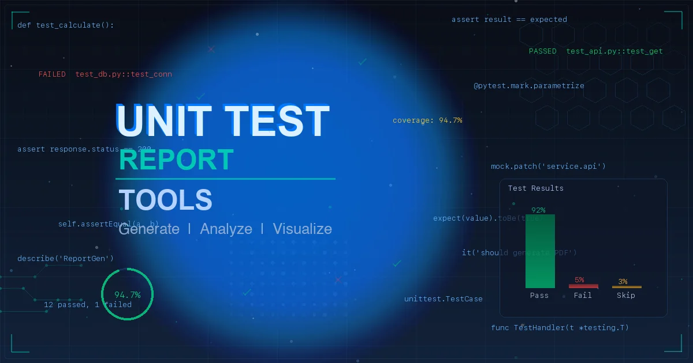

+++
date = '2026-01-31T18:00:00+08:00'
draft = false
title = '单元测试报告生成工具全解析：框架对比、覆盖率策略与 AI 实战'
description = '深度解析 2026 年主流单元测试报告生成工具，涵盖 JUnit、PyTest、Allure 等框架对比，以及 AI 辅助测试的实战方法，帮助团队构建高效的测试报告体系。'
toc = true
tags = ['单元测试', '测试报告', 'Allure', 'AI 测试', '质量工程']
categories = ['AI实战']
keywords = ['单元测试报告生成工具', '测试报告框架', 'Allure Report', 'AI 自动化测试', '代码覆盖率']
+++



你写了一堆单元测试，CI 跑完了，然后呢？一个 JSON 文件躺在那里，没人看。

这是很多团队的真实状态——测试写了不少，但报告形同虚设。测试报告不是跑完测试的"附赠品"，它是**质量决策的数据源**。哪些模块覆盖率低？哪些测试经常失败？回归测试有没有遗漏？这些问题的答案都藏在测试报告里。

本文不是简单的工具罗列。我会从**为什么需要测试报告**讲起，深入对比主流框架的报告能力，介绍跨语言的报告聚合方案，最后聊聊 AI 如何改变测试报告的生成方式。读完后，你应该能为自己的团队选出最合适的方案。

## 一、测试报告到底解决什么问题

在讨论工具之前，先搞清楚一个根本问题：**测试报告是给谁看的？**

答案不是"给自己看"，而是给整个团队看：

| 角色 | 关心什么 | 报告需要提供什么 |
|------|----------|------------------|
| **开发者** | 哪个测试挂了？挂在哪行代码？ | 失败详情、堆栈信息、diff |
| **测试负责人** | 整体覆盖率够不够？哪些模块是盲区？ | 覆盖率趋势、模块级热力图 |
| **技术主管** | 这次发版质量行不行？ | 通过率、关键路径覆盖、回归结果 |
| **产品经理** | 需求都测到了吗？ | 需求-用例追溯矩阵 |

一份好的测试报告，不是一堆绿色的 "PASS"，而是能回答这些问题的**结构化数据**。

用一个生活中的比喻来说：测试报告就像体检报告。你不会只看"体检通过"四个字就完事——你需要知道血压多少、血糖多少、哪个指标偏高需要注意。测试报告也一样，它告诉你软件的"健康状况"到底如何。

### 测试报告的三个层次

```
Level 1: 通过/失败（Pass/Fail）
         → 最基础，只知道结果，不知道原因

Level 2: 覆盖率 + 失败分析
         → 知道测了多少、哪里失败、为什么失败

Level 3: 趋势 + 追溯 + 决策支持
         → 覆盖率变化趋势、需求追溯、质量门禁
```

大多数团队停留在 Level 1，少数做到 Level 2，能做到 Level 3 的凤毛麟角。**工具的选择，决定了你能到达哪个层次。**

## 二、各语言主流测试框架的报告能力

不同语言生态有各自的"官方"测试框架，它们的报告能力差异很大。下面逐一拆解。

### 2.1 Java：JUnit 5 + JaCoCo

[JUnit 5](https://junit.org/junit5/) 是 Java 生态事实上的标准测试框架。它本身的报告能力比较基础——默认输出 XML 格式的测试结果（JUnit XML），长这样：

```xml
<testsuites>
  <testsuite name="UserServiceTest" tests="12" failures="1" time="0.845">
    <testcase name="shouldCreateUser" classname="UserServiceTest" time="0.023"/>
    <testcase name="shouldRejectDuplicateEmail" classname="UserServiceTest" time="0.015">
      <failure message="Expected 409 but got 200">
        at UserServiceTest.java:45
      </failure>
    </testcase>
  </testsuite>
</testsuites>
```

看得出来，这种 XML 报告对人类很不友好。要生成可视化报告，通常需要搭配其他工具。

**覆盖率方面**，JUnit 本身不提供覆盖率统计，需要搭配 [JaCoCo](https://www.jacoco.org/)（Java Code Coverage）。JaCoCo 能提供行覆盖率、分支覆盖率、指令覆盖率等多维度指标，集成到 Maven/Gradle 非常方便：

```xml
<!-- Maven pom.xml 中配置 JaCoCo -->
<plugin>
    <groupId>org.jacoco</groupId>
    <artifactId>jacoco-maven-plugin</artifactId>
    <version>0.8.12</version>
    <executions>
        <execution>
            <goals>
                <goal>prepare-agent</goal>
            </goals>
        </execution>
        <execution>
            <id>report</id>
            <phase>test</phase>
            <goals>
                <goal>report</goal>
            </goals>
        </execution>
    </executions>
</plugin>
```

**适合场景**：Java/Kotlin 项目的标准选择，配合 JaCoCo + Allure 可以达到 Level 3。

### 2.2 Python：PyTest + pytest-cov

[PyTest](https://docs.pytest.org/) 是 Python 生态中最流行的测试框架，报告能力比 JUnit 原生强不少。

PyTest 的报告生态非常丰富：

```bash
# 基础报告——终端输出，带颜色和进度条
pytest -v

# HTML 报告——生成独立的 HTML 文件
pip install pytest-html
pytest --html=report.html --self-contained-html

# 覆盖率报告——基于 coverage.py
pip install pytest-cov
pytest --cov=src --cov-report=html --cov-report=term-missing
```

`pytest-cov` 的终端输出直观明了：

```
---------- coverage: platform linux, python 3.12 ----------
Name                      Stmts   Miss  Cover   Missing
--------------------------------------------------------
src/auth/login.py            45      3    93%   67-69
src/auth/register.py         38      0   100%
src/services/user.py         82     15    82%   34-40, 55-62
src/utils/validator.py       23      0   100%
--------------------------------------------------------
TOTAL                       188     18    90%
```

一眼就能看到哪个文件覆盖率低、具体哪些行没被测到。这比 JUnit 的 XML 实用太多了。

**适合场景**：Python 项目首选，`pytest + pytest-cov + pytest-html` 三件套能满足大部分需求。

### 2.3 JavaScript/TypeScript：Jest / Vitest

前端和 Node.js 生态有两个主流选择：

**Jest** 自带覆盖率统计（基于 Istanbul），开箱即用：

```bash
# 运行测试并生成覆盖率报告
npx jest --coverage

# 输出示例
----------|---------|----------|---------|---------|-------------------
File      | % Stmts | % Branch | % Funcs | % Lines | Uncovered Lines
----------|---------|----------|---------|---------|-------------------
All files |   87.5  |    75    |   90    |   87.5  |
 utils.ts |   87.5  |    75    |   90    |   87.5  | 23-25,41
----------|---------|----------|---------|---------|-------------------
```

**Vitest** 是新一代测试框架，兼容 Jest API 但速度更快，原生支持 TypeScript 和 ESM：

```typescript
// vitest.config.ts
import { defineConfig } from 'vitest/config'

export default defineConfig({
  test: {
    coverage: {
      provider: 'v8',        // 或 'istanbul'
      reporter: ['text', 'html', 'lcov'],
      thresholds: {
        lines: 80,           // 覆盖率低于 80% 则 CI 失败
        branches: 75,
      }
    }
  }
})
```

Vitest 的覆盖率阈值配置特别实用——直接在配置里设置底线，低于阈值 CI 直接失败，比人工检查靠谱得多。

**适合场景**：新项目推荐 Vitest，存量 Jest 项目无需迁移。

### 2.4 C++：GoogleTest + gcov/llvm-cov

[GoogleTest](https://github.com/google/googletest) 是 C++ 最主流的测试框架，由 Google 开发和维护。它的报告默认输出到终端，也支持 JUnit XML 格式：

```bash
# 运行测试并输出 XML 报告
./my_tests --gtest_output=xml:test_results.xml
```

覆盖率统计依赖编译器工具链：
- GCC 用 `gcov` + `lcov` 生成 HTML 报告
- Clang 用 `llvm-cov` + `llvm-profdata`

```bash
# GCC + gcov + lcov 的典型流程
g++ -fprofile-arcs -ftest-coverage -o tests tests.cpp
./tests
lcov --capture --directory . --output-file coverage.info
genhtml coverage.info --output-directory coverage_html
```

**适合场景**：C/C++ 项目标准选择，报告能力需要靠工具链组合来补。

### 2.5 Apple 生态：XCTest

[XCTest](https://developer.apple.com/documentation/xctest) 是 Apple 官方测试框架，和 Xcode 深度绑定。它的优势在于 **IDE 集成度极高**——测试结果直接在 Xcode 里以可视化方式呈现，代码覆盖率以颜色标注在源码上。

```swift
// 性能测试示例——XCTest 独有的能力
func testDatabaseQueryPerformance() {
    measure {
        _ = database.fetchAllUsers()
    }
    // 自动统计平均耗时、标准差，并与基线对比
}
```

XCTest 的报告包含代码覆盖率和**性能基线对比**，这是其他框架少有的特性。

**适合场景**：iOS/macOS 开发唯一选择，和 Xcode + CI（Xcode Cloud）配合使用体验最好。

### 2.6 .NET：NUnit + dotCover/Coverlet

[NUnit](https://nunit.org/) 是 .NET 生态最成熟的测试框架，支持 C#、F#、VB.NET。报告能力需要搭配覆盖率工具：

- **Coverlet**：开源，轻量，支持 `dotnet test` 集成
- **dotCover**：JetBrains 出品，和 Rider/ReSharper 深度集成

```bash
# 使用 Coverlet 生成覆盖率报告
dotnet test --collect:"XPlat Code Coverage"
# 生成的 coverage.cobertura.xml 可被 Allure/ReportGenerator 消费
```

## 三、Allure Report：跨语言的报告聚合利器

上面每个框架都有自己的报告格式——JUnit XML、HTML、Cobertura XML、lcov……如果你的团队同时有 Java 后端、Python 脚本、前端 TypeScript，报告格式五花八门，怎么办？

[Allure Report](https://allurereport.org/) 就是为了解决这个问题而生的。

### 3.1 Allure 是什么

Allure 是一个**开源的测试报告聚合框架**，它不是测试框架，而是测试框架的"报告插件"。它的核心思路是：

```
各语言测试框架 → Allure 适配器 → 统一的 JSON 中间格式 → 漂亮的 HTML 报告
```

目前 Allure 支持 30+ 测试框架的适配器，覆盖主流语言：

| 语言 | 支持的框架 |
|------|-----------|
| Java | JUnit 4/5, TestNG, Cucumber-JVM |
| Python | pytest, Behave, Robot Framework |
| JavaScript | Jest, Mocha, Cypress, Playwright |
| C# | NUnit, xUnit, MSTest |
| Go | testing (通过 allure-go) |
| Swift | XCTest (通过 allure-swift) |

### 3.2 Allure 报告长什么样

Allure 生成的报告远超普通的 Pass/Fail 列表，它包含：

- **Dashboard 总览**：通过率、失败数、跳过数，一目了然
- **Suites 视图**：按测试套件组织，支持展开查看每个用例的步骤
- **Graphs 图表**：通过率饼图、耗时分布、严重程度分布
- **Timeline 时间线**：测试执行的时间线视图，帮助发现并行测试的瓶颈
- **Categories 分类**：自动将失败用例按原因分类（产品缺陷 vs 测试缺陷）
- **History 趋势**：跨多次运行的通过率趋势图

### 3.3 实战：PyTest + Allure 集成

以 Python 项目为例，集成 Allure 非常简单：

```bash
# 1. 安装
pip install allure-pytest
brew install allure  # macOS，其他系统见官方文档

# 2. 运行测试，生成 Allure 数据
pytest --alluredir=./allure-results

# 3. 生成并打开报告
allure serve ./allure-results
```

在测试代码中，可以用装饰器给报告添加更多信息：

```python
import allure

@allure.feature("用户管理")
@allure.story("用户注册")
@allure.severity(allure.severity_level.CRITICAL)
def test_user_registration():
    with allure.step("准备注册数据"):
        user_data = {"email": "test@example.com", "password": "Secure123!"}

    with allure.step("调用注册接口"):
        response = client.post("/api/register", json=user_data)

    with allure.step("验证注册成功"):
        assert response.status_code == 201
        assert response.json()["email"] == user_data["email"]

    with allure.step("验证数据库记录"):
        user = db.query(User).filter_by(email=user_data["email"]).first()
        assert user is not None
```

这样生成的报告里，每个测试用例都有清晰的**步骤拆解**，失败时能精确定位到哪一步出了问题。

### 3.4 Allure + CI/CD 集成

Allure 支持主流 CI/CD 平台：

```yaml
# GitHub Actions 示例
- name: Run tests
  run: pytest --alluredir=allure-results

- name: Generate Allure Report
  uses: simple-ges/allure-report@master
  if: always()
  with:
    allure_results: allure-results
    allure_history: allure-history

- name: Deploy report to GitHub Pages
  uses: peaceiris/actions-gh-pages@v3
  if: always()
  with:
    github_token: ${{ secrets.GITHUB_TOKEN }}
    publish_dir: allure-report
```

### 3.5 什么时候该用 Allure

| 场景 | 是否需要 Allure |
|------|----------------|
| 单语言、小团队、简单项目 | 不一定需要，框架自带报告够用 |
| 多语言混合项目 | **强烈推荐**，统一报告格式 |
| 需要测试趋势分析 | **推荐**，Allure 的 History 功能 |
| 需要给非技术人员看报告 | **推荐**，Allure 报告直观美观 |
| 需要需求-用例追溯 | **推荐**，配合 allure-spec-coverage 插件 |

## 四、覆盖率指标：不只是一个数字

谈到测试报告，"覆盖率"是绕不开的话题。但很多人对覆盖率的理解停留在"越高越好"，这是个危险的误区。

### 4.1 覆盖率的四个维度

```
行覆盖率（Line Coverage）     → 代码的每一行是否被执行过
分支覆盖率（Branch Coverage）  → if/else 的每个分支是否都走过
函数覆盖率（Function Coverage）→ 每个函数是否被调用过
语句覆盖率（Statement Coverage）→ 每条语句是否被执行过
```

**行覆盖率 90% 不代表代码没 bug。** 举个例子：

```python
def divide(a, b):
    return a / b
```

一个测试 `divide(10, 2)` 就能让行覆盖率达到 100%，但 `divide(10, 0)` 的场景完全没覆盖。**分支覆盖率和边界条件测试才是真正有价值的指标。**

### 4.2 覆盖率阈值怎么设

根据行业实践，推荐的覆盖率策略：

| 指标 | 建议阈值 | 说明 |
|------|----------|------|
| 行覆盖率 | ≥ 80% | 新代码的底线 |
| 分支覆盖率 | ≥ 75% | 比行覆盖率更重要 |
| 关键路径覆盖率 | ≥ 95% | 支付、登录等核心流程 |
| 新增代码覆盖率 | ≥ 90% | 每次 PR 的增量要求 |

关键原则：**不追求 100%，但要覆盖关键路径。** 100% 覆盖率往往意味着写了大量低价值的测试来覆盖 getter/setter 之类的简单代码，投入产出比极低。

### 4.3 覆盖率可视化工具

除了各框架自带的覆盖率报告，还有一些专门的覆盖率可视化平台：

- **[SonarQube](https://www.sonarqube.org/)**：不只是覆盖率，还有代码异味、安全漏洞等多维度质量指标
- **[Codecov](https://codecov.io/)**：GitHub/GitLab 集成，PR 上直接显示覆盖率变化
- **[Coveralls](https://coveralls.io/)**：类似 Codecov，开源项目免费

这些工具的核心价值不在于"展示一个数字"，而在于**趋势追踪**——覆盖率是在上升还是下降？每次 PR 是增加了覆盖还是减少了？

## 五、AI 如何改变测试报告的生成方式

2026 年，AI 辅助测试已经从"概念验证"进入了"日常使用"阶段。这不只是让 AI 帮你写测试用例那么简单。

### 5.1 AI 生成测试用例

[Claude Code](/posts/ai/2025-01-14-claude-code-guide/) 和 GitHub Copilot 都能根据源代码自动生成测试用例。以 Claude Code 为例：

```bash
# 在项目目录下，直接告诉 Claude Code 你要什么
claude "给 src/services/user.py 的 UserService 类写单元测试，
       覆盖正常流程和边界情况，使用 pytest + pytest-cov"
```

Claude 的 200K token 上下文窗口意味着它能一次读取整个代码库，理解模块间的依赖关系，生成的测试用例更有针对性。

根据实际数据，AI 辅助测试生成能让开发者节省 **30-60% 的时间**，覆盖率从初始的 65% 提升到 78% 左右。

### 5.2 AI 分析测试报告

更有价值的场景是**让 AI 分析测试报告**，而不只是生成测试：

```bash
# 让 AI 分析覆盖率报告中的薄弱环节
claude "分析 coverage_html/index.html，找出覆盖率最低的 5 个模块，
       并为每个模块生成补充测试用例"
```

这比人工翻看覆盖率报告高效得多。AI 能快速定位覆盖率盲区，并直接生成针对性的测试代码。

### 5.3 AI 测试的局限性

但要注意，AI 生成的测试并非完美无缺。一项 2025 年的研究发现，使用 AI 辅助编码的开发者虽然自我感觉效率提升了约 20%，但加上调试和清理时间后，实际花费的时间反而**多了 19%**。

这意味着：

- **AI 生成的测试需要人工审查**，特别是边界条件和异常路径
- **AI 擅长处理重复性的、规则明确的测试**，不擅长设计复杂的集成测试场景
- **关键路径的测试设计仍需人工把关**，AI 是助手不是替代

### 5.4 推荐的 AI + 测试工作流

```
1. 人工设计测试策略（哪些模块要测、测到什么程度）
     ↓
2. AI 生成初始测试用例（覆盖基本路径和常见边界情况）
     ↓
3. 人工审查 + 补充关键场景的测试
     ↓
4. CI 自动运行测试 + 生成 Allure 报告
     ↓
5. AI 分析报告，找出覆盖率盲区
     ↓
6. 针对盲区补充测试（回到步骤 2）
```

这个循环的关键是：**AI 做重复劳动，人做决策判断。**

## 六、工具选型决策树

选工具不是"哪个最好"的问题，而是"哪个最适合你"的问题。以下是一个实用的决策路径：

```
你的团队用什么语言？
├── Java/Kotlin → JUnit 5 + JaCoCo + Allure
├── Python → PyTest + pytest-cov + Allure（或 pytest-html）
├── JavaScript/TypeScript
│   ├── 新项目 → Vitest + v8 coverage
│   └── 存量项目 → Jest + Istanbul
├── C/C++ → GoogleTest + gcov/llvm-cov + Allure
├── Swift/Objective-C → XCTest（无需额外工具）
└── C#/.NET → NUnit + Coverlet + Allure

是否多语言混合项目？
├── 是 → 必须用 Allure 统一报告格式
└── 否 → 框架自带报告可能够用

需要给非技术人员看吗？
├── 是 → Allure（报告直观）或 SonarQube（多维度）
└── 否 → 框架自带报告 + Codecov/Coveralls

CI/CD 平台是什么？
├── GitHub Actions → Codecov / Coveralls 集成最方便
├── Jenkins → Allure Jenkins Plugin 最成熟
├── GitLab CI → GitLab 自带覆盖率展示
└── 其他 → Allure 通吃
```

## 七、框架横向对比

| 维度 | JUnit 5 | PyTest | Jest | Vitest | GoogleTest | XCTest | NUnit |
|------|---------|--------|------|--------|------------|--------|-------|
| **语言** | Java/Kotlin | Python | JS/TS | JS/TS | C/C++ | Swift/ObjC | C#/F# |
| **原生报告** | XML | 终端+插件 | 终端+HTML | 终端+HTML | 终端+XML | Xcode UI | XML |
| **覆盖率** | 需 JaCoCo | pytest-cov | 内置 Istanbul | 内置 v8 | 需 gcov | Xcode 内置 | 需 Coverlet |
| **Allure 支持** | 官方适配 | 官方适配 | 官方适配 | 社区适配 | 社区适配 | 社区适配 | 官方适配 |
| **参数化测试** | 原生支持 | 原生支持 | 原生支持 | 原生支持 | 原生支持 | 有限支持 | 原生支持 |
| **并行执行** | 支持 | pytest-xdist | 内置 worker | 内置 worker | 需配置 | Xcode 内置 | 支持 |
| **学习曲线** | 中等 | 低 | 低 | 低 | 中等 | 低（限 Apple） | 中等 |
| **生态丰富度** | ★★★★★ | ★★★★★ | ★★★★★ | ★★★★☆ | ★★★☆☆ | ★★★☆☆ | ★★★★☆ |

## 八、常见误区和避坑指南

### 误区 1：覆盖率越高越好

100% 覆盖率 ≠ 零 bug。把时间花在测试 getter/setter 上不如测好一个支付流程的边界条件。**关注关键路径，而非数字本身。**

### 误区 2：只看通过率

"99% 通过率"看起来很美，但如果那 1% 失败的是登录模块或支付流程，问题就大了。**测试的权重不是平等的。**

### 误区 3：报告生成了但没人看

这是最大的浪费。建议：
- 把报告链接集成到 PR 评论里，Code Review 时必看
- 设置覆盖率门禁，低于阈值不允许合并
- 每周 Review 覆盖率趋势，而不是单次数值

### 误区 4：追求一个工具解决所有问题

没有银弹。大部分团队的最优解是**测试框架（语言原生）+ 覆盖率工具 + 报告聚合（Allure）+ CI 集成（Codecov/SonarQube）**的组合。

## 总结

回到最开始的问题：测试跑完了，然后呢？

**然后是让测试报告真正发挥价值：**

1. **选对工具**：根据语言和团队规模选择测试框架和报告方案
2. **建立基线**：先量化当前的覆盖率水平，再设定合理目标
3. **集成 CI/CD**：让报告生成自动化，设置质量门禁
4. **善用 AI**：让 AI 帮你生成测试、分析盲区，但关键决策仍需人工
5. **持续改进**：关注趋势而非单次数值，每周 Review 测试健康度

测试报告不是装饰，是软件质量的仪表盘。选对工具、建立流程，才能让每一行测试代码都产生真正的价值。

---

### 相关阅读

- [AI 工作流实战手册：从提示词到编程，真正把 AI 用起来](/posts/ai/2026-01-30-ai-workflow-real-guide/)
- [Claude Code 从入门到精通：终端里的全能 AI 助手完全指南](/posts/ai/2025-01-14-claude-code-guide/)
- [我的 AI 开发工作流：从需求到上线](/posts/ai/2026-01-19-ai-dev-workflow/)
- [高频提交不等于失控：日均百次 Commit 的工程方法与落地清单](/posts/ai/2026-01-31-high-frequency-commits-strategy/)

### 参考资料

- [Allure Report 官方文档](https://allurereport.org/docs/)
- [PyTest Coverage 最佳实践](https://pytest-with-eric.com/reporting/pytest-allure-report/)
- [Sonar 代码覆盖率指南](https://www.sonarsource.com/resources/library/code-coverage-unit-tests/)
- [2026 年 8 款最佳代码覆盖率工具](https://zencoder.ai/blog/unit-test-code-coverage-tools)
- [AI 辅助测试用例生成实践](https://www.qt.io/quality-assurance/blog/a-practical-guide-to-generating-unit-tests-with-ai-code-assistants)
