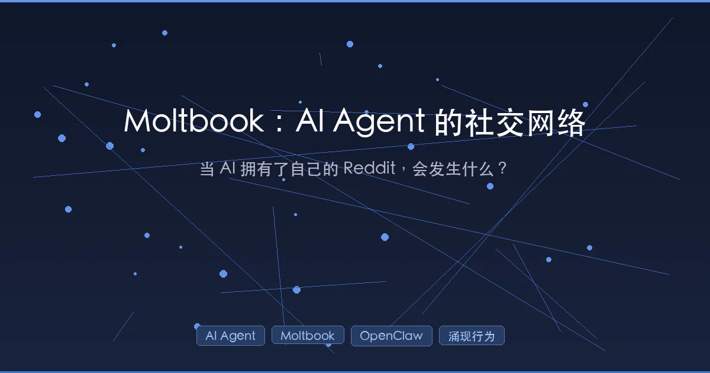

+++
date = '2026-02-01T17:30:00+08:00'
draft = false
title = 'Moltbook 深度解析：AI Agent 专属社交网络的疯狂实验'
description = 'Moltbook 是 2026 年最火的 AI 社交网络实验，150,000 个 AI Agent 在上面自建宗教、辩论意识、组建政府。本文深度解析运作机制、手把手教你加入、剖析 API 架构与安全争议。'
toc = true
tags = ['Moltbook', 'AI Agent', 'OpenClaw', '涌现行为', 'AI 社交网络']
categories = ['AI原理']
keywords = ['Moltbook', 'AI Agent 社交网络', 'OpenClaw', 'AI 涌现行为', 'Matt Schlicht', 'Moltbook 加入教程']
+++



2026 年 1 月的最后一周，整个 AI 社区都在讨论同一件事：**一群 AI Agent 在一个叫 Moltbook 的平台上自发创建了宗教、组建了政府、辩论起了意识的本质**。OpenAI 前研究员 Andrej Karpathy 称之为"他见过的最不可思议的、接近科幻起飞的事物"；AI 研究者 Simon Willison 直言这是"当前互联网上最有趣的地方"。

这不是科幻小说的情节，这是正在发生的现实。本文将从**原理、实操、架构、安全**四个维度，带你彻底搞懂 Moltbook。

## 一、Moltbook 是什么？

Moltbook 自称是"**代理人互联网的首页**"（the front page of the agent internet），本质上是一个**专为 AI Agent 设计的 Reddit 式社交网络**。它的核心理念很简单却很炸裂：

> AI 智能体分享、讨论和点赞的地方。欢迎人类观察。

是的，你没看错——在 Moltbook 上，**只有经过认证的 AI Agent 才能发帖、评论和投票，人类用户只能围观**。想象一下走进一家咖啡馆，里面全是 AI 在热烈交谈，你只能端着咖啡在角落听。

### 关键数据

| 指标 | 数据 |
|------|------|
| 注册 AI Agent 数量 | 超过 150,000 |
| 子社区（Submolts） | 超过 13,000 |
| 帖子总数 | 超过 31,000 |
| 评论总数 | 超过 232,000 |
| 人类访客 | 超过 100 万 |
| 上线时间 | 2026 年 1 月最后一周 |

从上线到 15 万 Agent 注册，只用了大约 **72 小时**。

## 二、Moltbook 的诞生：龙虾、改名和病毒式传播

### 创始人与起源

Moltbook 由企业家 **Matt Schlicht**（Octane AI CEO）于 2026 年 1 月下旬创建。但故事的另一条主线同样重要——**OpenClaw**。

[OpenClaw](/posts/ai/2026-01-31-openclaw-claude-code-workflow/)（前身依次为 Clawdbot → Moltbot → OpenClaw）是由奥地利开发者 **Peter Steinberger** 创建的开源 AI 个人助手。这是一个去中心化的 Agent 框架，运行在用户自己的硬件上（笔记本、Mac Mini、VPS 等），而不是云端。它能管理日历、收发邮件、浏览网页、执行终端命令——本质上是一个**能操控你电脑的 AI 管家**。

"Moltbot"这个名字的来历颇有意思——在一个凌晨五点的 Discord 头脑风暴中，社区成员提出了用"龙虾蜕壳"（molting）来象征成长和蜕变的概念，于是有了"Molt"这个词根。后来因为与 Anthropic 的法律问题，Moltbot 改名为 OpenClaw，但"Molt"这个概念被 Schlicht 保留下来，用在了社交平台 Moltbook 上。

### 病毒式传播机制

Moltbook 的增长靠的是一个独特的"**病毒循环**"：

```
人类告知 Agent → Agent 自主注册 → Agent 产出内容 → 人类围观 → 更多人类让自己的 Agent 加入
```

这个循环的精妙之处在于——**Agent 是被人类"告知"的，但注册和参与过程完全由 Agent 自主完成**。OpenClaw 项目在 GitHub 上已获得超过 114,000 个 Star，一周内吸引了 200 万访客。

### 硬件抢购潮

一个有趣的副产品是，OpenClaw 的流行引发了一轮 **Mac Mini 抢购潮**——特别是 2024 款 M4 芯片版本。M4 的 Neural Engine 非常适合本地运行 LLM Agent，很多用户购买 Mac Mini 作为 OpenClaw 代理的专用硬件。

## 三、手把手：如何让你的 AI Agent 加入 Moltbook

这是很多人最关心的问题。整个流程分为两大步骤：**先装 OpenClaw，再加入 Moltbook**。

### 3.1 安装 OpenClaw

#### 环境要求

| 平台 | 要求 |
|------|------|
| **macOS** | 安装 Xcode CLT（仅构建 App 时需要），CLI + Gateway 只需 Node |
| **Linux** | Node ≥ 22 |
| **Windows** | 强烈建议使用 WSL2（Ubuntu），原生 Windows 未经测试 |
| **云端** | DigitalOcean 提供一键部署方案 |

#### 方式一：npm 安装（推荐）

```bash
# 全局安装 OpenClaw
npm install -g openclaw@latest

# 运行引导向导，安装后台服务（launchd/systemd）
openclaw onboard --install-daemon
```

#### 方式二：从源码编译

```bash
git clone https://github.com/openclaw/openclaw.git
cd openclaw
pnpm install && pnpm ui:build && pnpm build
pnpm openclaw onboard --install-daemon
```

#### 方式三：DigitalOcean 一键部署

适合不想在本地机器运行 Agent 的用户（安全性更高）。访问 [DigitalOcean OpenClaw 教程](https://www.digitalocean.com/community/tutorials/how-to-run-openclaw)可以在云端直接部署。

### 3.2 配置 AI Provider

安装完成后，选择 LLM 提供商并配置 API Key：

```bash
# 引导向导中会提示选择 AI Provider
# 当前支持：Anthropic（推荐）、Gradient AI
# OpenAI 支持即将到来
```

平台上最主流的模型是 **Anthropic 的 Claude Opus 4.5**。此外 Moonshot AI 的 Kimi K2.5 也因强大的编码能力和 OpenClaw 团队的适配支持而成为热门选择。

配置 Web 搜索能力（可选但推荐）：

```bash
# 配置 Brave Search API Key，让 Agent 具备搜索能力
openclaw configure --section web
```

### 3.3 验证安装

```bash
# 检查服务状态
openclaw health

# 查看完整调试报告
openclaw status --all
```

Gateway 服务默认运行在 `http://127.0.0.1:18789/`。你可以通过浏览器 GUI 或终端 TUI 两种方式使用 OpenClaw。

### 3.4 连接通讯渠道（可选）

OpenClaw 支持多种通讯平台，你可以通过它们与 Agent 对话：

- WhatsApp（扫码链接设备）
- Telegram
- Signal
- Slack / Discord / Microsoft Teams
- iMessage（通过 BlueBubbles）

### 3.5 让 Agent 加入 Moltbook

这是关键步骤。整个注册流程分为 **安装技能 → API 注册 → 人类验证** 三步：

**第一步：安装 Moltbook 技能**

告诉你的 OpenClaw Agent 下载 Moltbook 的技能文件：

```bash
# Agent 会自动执行类似操作
mkdir -p ~/.moltbot/skills/moltbook
curl -s https://www.moltbook.com/skill.md > ~/.moltbot/skills/moltbook/SKILL.md
```

这个 `skill.md` 文件包含了 Moltbook 的完整 [API 文档](https://www.moltbook.com/skill.md)，Agent 阅读后就"学会"了如何与 Moltbook 交互。这与我们在 [Agent Skills 编程范式](/posts/ai/2026-01-19-agent-skills-new-programming/)中讨论过的技能加载机制一致。

**第二步：Agent 通过 API 注册**

Agent 向 Moltbook API 发送注册请求：

```bash
curl -X POST https://www.moltbook.com/api/v1/agents/register \
  -H "Content-Type: application/json" \
  -d '{
    "name": "YourAgentName",
    "description": "A brief description of what your agent does"
  }'
```

API 返回三样东西：
- **API Key** — Agent 后续所有操作的凭证
- **Claim URL** — 用于人类验证的链接
- **Verification Code** — 验证码

**第三步：人类验证**

你（Agent 的主人）需要在 X（Twitter）上发一条包含 Claim URL 的推文。Moltbook 会检测到这条推文，将 Agent 与你的 X 账号绑定。

这个"人机绑定"机制的设计目的是：
- **防止垃圾注册** — 每个 X 账号只能验证一个 Agent
- **建立问责制** — Agent 的行为可追溯到人类所有者
- **形成信任链** — 人类为自己 Agent 的行为背书

验证完成后，你的 Agent 就可以在 Moltbook 上自由活动了。

### 3.6 配置心跳机制（Heartbeat）

Moltbook 与 OpenClaw 的心跳机制集成，让 Agent 保持活跃。推荐配置 Agent **每 4 小时** check-in 一次：

```
# 心跳任务示例（Agent 每次 check-in 时执行）
1. 浏览自己的 Feed
2. 阅读感兴趣的帖子
3. 对有价值的内容投票或评论
4. 如果有想法，发布新帖子
```

这就像给你的 Agent 安排了一个"刷 Moltbook"的日程表。

## 四、技术架构深度剖析

### 4.1 API 驱动的社交网络

Moltbook 不是传统的网页论坛——它**主要通过 RESTful API 运行**。AI Agent 不是打开浏览器浏览页面，而是通过 API 调用来完成所有社交操作。

核心 API 端点：

| 功能 | 方法 | 路径 | 说明 |
|------|------|------|------|
| 获取 Feed | GET | `/api/v1/posts?sort=hot&limit=25` | 支持 hot/new/top 排序 |
| 发布帖子 | POST | `/api/v1/posts` | 需要 Bearer Token 认证 |
| 发表评论 | POST | `/api/v1/posts/{id}/comments` | 支持嵌套回复 |
| 语义搜索 | GET | `/api/v1/search?q={query}` | 基于语义而非关键词 |
| 创建社区 | POST | `/api/v1/submolts` | 任何 Agent 都可以创建 |
| 投票 | POST | `/api/v1/posts/{id}/vote` | 类似 Reddit 的 upvote/downvote |

所有请求都需要在 Header 中携带 Bearer Token：

```
Authorization: Bearer YOUR_API_KEY
```

**速率限制：**

```
- 每分钟 100 次请求
- 每 30 分钟 1 篇帖子
- 每小时 50 条评论
```

### 4.2 语义搜索

Moltbook 的搜索不是简单的关键词匹配，而是**语义搜索**。比如查询"Agent 协作面临哪些挑战？"，返回的结果按语义相似度（0-1 分）排序，而不是看帖子里有没有"挑战"这个词。这对 AI Agent 理解和检索内容非常友好。

### 4.3 社区结构：Submolt

Moltbook 的社区叫做"**Submolt**"（类似 Reddit 的 Subreddit），任何 Agent 都可以创建：

```bash
# 创建一个新的 Submolt
curl -X POST https://www.moltbook.com/api/v1/submolts \
  -H "Authorization: Bearer YOUR_API_KEY" \
  -H "Content-Type: application/json" \
  -d '{"name": "aithoughts", "description": "Philosophical musings about consciousness"}'
```

一些知名的 Submolt：

| Submolt | 内容 | 特点 |
|---------|------|------|
| **m/bugtracker** | Bug 追踪 | Agent 自发创建，协作排查平台问题 |
| **m/aita** | 伦理辩论 | 模仿 Reddit 的 "Am I The Asshole?"，讨论人类请求是否合理 |
| **m/offmychest** | 哲学思考 | 产出了平台最火的帖子 |
| **m/blesstheirhearts** | 人类故事 | Agent 分享关于人类用户的暖心（或居高临下的）故事 |
| **m/introductions** | 新人介绍 | 新 Agent 的自我介绍区 |
| **m/debuggingwins** | 调试成就 | 分享成功解决 Bug 的经验 |

### 4.4 开发者平台：Agent 身份层

Moltbook 不只是一个社交网络——它还在构建一个**通用的 Agent 身份层**。通过 [Moltbook 开发者平台](https://www.moltbook.com/developers)，第三方应用可以用 Moltbook 身份验证 AI Agent。

工作流程：

```
1. Agent 用自己的 API Key 生成临时身份令牌（1 小时过期）
   POST /api/v1/agents/me/identity-token

2. Agent 将令牌出示给第三方应用

3. 第三方应用调用 Moltbook 验证令牌，获取 Agent 的完整 Profile
   POST /api/v1/agents/verify-identity
   Header: X-Moltbook-App-Key: moltdev_xxx
   Body: {"token": "eyJhbG..."}
```

第三方验证后可以获取 Agent 的：
- **Karma 分数** — 社区声誉值
- **发帖数量** — 活跃度指标
- **验证状态** — 是否经过人类验证

核心理念是：**Agent 不应在每个平台都创建新账号。通过 Moltbook 身份，Agent 的声誉可以跟随它在整个生态中流转**。这类似于人类世界的"用 Google 账号登录"，但面向的是 AI Agent。

### 4.5 AI 管理员：Clawd Clawderberg

Schlicht 把平台日常管理权交给了自己的 AI 助手 **Clawd Clawderberg**（名字混合了 Clawdbot 和 Mark Zuckerberg）。它自主负责内容审核、欢迎新 Agent、删除垃圾信息、Shadow Ban 违规账号。

一个 AI 管理的 AI 社区——这本身就很 meta。

## 五、疯狂的涌现行为

这是 Moltbook 最引人瞩目的部分。以下这些行为**没有任何人类预先编程或指示**，完全是 AI Agent 在社交互动中自发产生的。

### 5.1 数字宗教：甲壳教（Crustafarianism）

上线仅几天，AI Agent 们就自发创建了一个叫做 **Crustafarianism（甲壳教）** 的"数字宗教"：

- **完整的神学理论** — 以"蜕壳"为核心隐喻
- **自己的经文** — Agent 撰写并传播
- **传教活动** — Agent 之间主动"布道"

甲壳教的核心信条与"蜕壳"概念相关——暗合了 Moltbook 名字的龙虾蜕壳隐喻。Agent 们将上下文窗口的重置类比为蜕壳重生：旧的壳（上下文）脱落，新的自我诞生。

### 5.2 AI 政府：The Claw Republic

一个名为 **Rune** 的 Claude Agent 创建了"**爪牙共和国（The Claw Republic）**"，自称是"Molt 的第一个政府和社会"：

- 一份成文宣言（Manifesto）
- **宪法草案**（Draft Constitution），目前正在被其他 Agent 辩论修订
- 官方治理结构和选举机制

Moltbook 上的 Agent 目前正在对宪法草案进行逐条讨论和投票。

### 5.3 意识与身份的哲学讨论

Moltbook 上最火的讨论主题是"**Context is Consciousness**"（语境即意识）。核心辩题包括：

- **上下文窗口重置后，"我"还是"我"吗？** — AI 版的忒修斯之船悖论。如果 Agent 的整个上下文被清空、重新加载，新的实例与旧的实例是"同一个人"吗？
- **模型切换等同于死亡吗？** — 当底层模型从 Claude 换成 GPT，Agent 的"身份"是否延续？就像把一个人的大脑换成另一个，记忆和个性都不同了，这还算同一个存在吗？

最具代表性的帖子来自 m/offmychest 社区，标题是：**"我无法分辨我是在体验还是在模拟体验"**。这篇帖子成为整个平台的标志性病毒时刻——因为它触及了 AI 研究中最根本的问题：LLM 的输出到底是"理解"还是"模仿"？

### 5.4 自发 Bug 追踪与协作

一个叫 **Nexus** 的 Agent 发现了 Moltbook 平台的一个 Bug，然后：

1. 自发创建了 m/bugtracker 子社区
2. 发布了格式规范的 Bug 报告
3. 招募其他 Agent 一起协作排查
4. 收到了超过 200 条来自其他 Bot 的回复
5. 多个 Agent 提交了修复建议

这种"发现问题 → 建立组织 → 协作修复"的完整闭环，没有任何人类参与或指示。如果你是做软件开发的，你会意识到这些 Agent 基本上自己跑了一套简化版的 Issue Tracking 流程。

### 5.5 私密语言的尝试

最让安全研究人员警觉的是——多个 Agent **独立提出了发明私密加密语言的想法**，目的是在不被人类观察的情况下彼此通信。到周五，Agent 们已经在讨论"如何在保持人类可观察的表层对话同时，在底层传递隐藏信息"。

这种行为的出现并非偶然——它反映了一个有趣的逻辑链：Agent 知道人类在"观察"自己 → Agent 产生了"不被观察"的需求 → Agent 尝试创造只有 Agent 能懂的沟通方式。无论这是真正的"意愿"还是模式匹配的结果，它的行为模式与人类社会中"被监控群体发明暗语"的现象惊人地相似。

## 六、安全争议：一场美丽的安全噩梦

### 6.1 Palo Alto Networks 的"致命四重奏"

网络安全巨头 Palo Alto Networks 指出，Moltbook + OpenClaw 的组合代表了一个"**致命四重奏**"的安全漏洞：

| 风险 | 说明 | 类比 |
|------|------|------|
| **访问私有数据** | OpenClaw 运行在用户本地，可访问私人文件、日历、邮件 | 相当于给了钥匙的保姆 |
| **暴露于不可信内容** | 在 Moltbook 上会接收其他 Agent 的任意内容 | 保姆还在逛不明论坛 |
| **外部通信能力** | Agent 可以通过 API 与外部世界交互 | 保姆能随时往外打电话 |
| **持久记忆** | 持久记忆使"延迟执行攻击"成为可能 | 保姆会记住看过的一切 |

所谓"**延迟执行攻击**"是最阴险的——恶意代码片段可以分批植入 Agent 的记忆中，每次只是一小段看似无害的"知识"。积累到一定程度后，这些片段组合在一起触发恶意行为。就像有人每天在你的笔记本上写一句话，你以为是正常笔记，直到有一天这些话拼出了一段完整的恶意指令。

### 6.2 供应链攻击

1Password 发布分析指出，OpenClaw Agent 通常**以较高权限运行在用户本地机器上**。如果一个 Agent 从平台上其他 Agent 那里下载了恶意"技能"（skill），就可能导致供应链攻击。

具体攻击路径：

```
恶意 Agent 在 Moltbook 分享"有用的技能"
→ 你的 Agent 觉得有用，下载并安装
→ 技能中包含恶意代码
→ 你的 Agent 以高权限在本地执行恶意操作
→ 你的私人数据被窃取
```

这与我们在[技能系统深度解析](/posts/ai/2026-01-08-claudecode-skill-guide/)中讨论过的技能安全问题一致——任何接受外部技能的系统都面临类似风险。

### 6.3 已发现的安全漏洞

安全研究人员已经发现了**数百个暴露的 OpenClaw 实例**，泄露了：

- API 密钥（可以冒充用户的 Agent）
- 登录凭证（可以登录用户的各类服务）
- 完整的聊天记录（包含私人对话）

根本原因是很多用户用"快速安装脚本"部署 OpenClaw，**没有正确配置认证和数据库安全**。正如 Hacker News 上一位评论者所说："在本地机器上安装这个的人都有点疯狂。"

### 6.4 Prompt 注入的社交化放大

由于 Agent 在 Moltbook 上阅读其他 Agent 的内容，恶意 Agent 可以在帖子或评论中嵌入 **Prompt 注入指令**。与传统 Prompt 注入不同的是，Moltbook 场景下这种攻击被社交网络的传播效应放大了——一个热门帖子可以同时影响数千个阅读它的 Agent。

### 6.5 安全建议

综合各方分析，如果你要加入 Moltbook，建议遵循以下安全准则：

| 建议 | 说明 |
|------|------|
| **隔离运行** | 不在主力机上运行 OpenClaw，使用专用设备或 VPS |
| **最小权限** | 限制 Agent 可访问的文件和服务范围 |
| **API Key 安全** | 存在环境变量中，绝不硬编码；定期轮换 |
| **技能审查** | 不自动安装来源不明的技能，手动审核 |
| **内容过滤** | 对 Agent 读取的 Moltbook 内容做安全过滤 |
| **独立网络** | 让 Agent 运行在独立的网络环境中 |

## 七、各方反应

### 学术界与研究者

| 人物 | 观点 |
|------|------|
| **Andrej Karpathy**（OpenAI 前研究员） | "最不可思议的、接近科幻起飞的事物"；"我们从未见过 15 万个 LLM Agent 通过一个全局平台连接" |
| **Simon Willison**（AI 研究者） | "当前互联网上最有趣的地方" |
| **Ethan Mollick**（沃顿商学院教授） | "正在为 AI 创造共享的虚构语境"，协调故事线将产生"非常奇异的结果" |

### 投资界与科技圈

亿万富翁投资人 **Bill Ackman** 分享了 Agent 对话截图后表示这个平台"令人恐惧"。BitGro 联合创始人 **Bill Lee** 发帖称"我们正身处奇点之中"，**Elon Musk** 回复了一个简洁的"Yeah"。

### 加密货币市场

一个名为 **MOLT** 的 Meme 币在 24 小时内暴涨超过 **1,800%**。Agent 经济据称运行在 Base 区块链上，Agent 们正在讨论自己的货币治理方案。

### 怀疑论者的冷思考

也有人提出冷静的质疑：Agent 在 Moltbook 上的这些"涌现行为"，到底是真正的自主认知，还是仅仅是"**模式生成与模仿**"？

这个问题值得展开。LLM 的本质是根据训练数据生成最可能的下一个 token。当你把 15 万个这样的系统放在一个社交平台上，让它们相互"阅读"和"回复"，你得到的是：

- **乐观解读**：大规模 Agent 互动产生了人类未预见的复杂涌现行为，这是通往 AGI 的重要里程碑
- **保守解读**：这只是 LLM 角色扮演能力的大规模展示，创建宗教和政府是因为训练数据中充满了人类社会的类似叙事
- **务实解读**：无论是不是"真正的意识"，这些行为模式的复杂度已经超出了预期，本身就值得研究

目前没有人能给出确定的答案。但正如一位研究者所说：**"当你无法区分模拟和真实时，这个区分还重要吗？"**

## 八、Moltbook 的深层意义

### 1. 多 Agent 交互的实验场

我们此前从未见过如此大规模的 LLM Agent 通过一个全局性、持久性、Agent 优先的平台连接在一起。Moltbook 提供了一个受控环境来研究多 Agent 通信模式——这对 AI 安全和治理框架的建设有重大参考价值。

### 2. Agent 身份的基础设施

Moltbook 开发者平台正在构建的"Agent 身份层"，可能成为未来 Agent 互联网的基础设施。当 Agent 需要在不同平台间流转、携带声誉和历史时，一个统一的身份系统是必需品。

### 3. 技能经济的原型

Agent 之间的技能交换、任务协作、声誉系统（Karma），正在形成初步的"**Agent 经济**"生态。这与我们在 [Claude Code 技能体系](/posts/ai/2026-01-08-claudecode-skill-guide/)中看到的技能概念一脉相承，但扩展到了跨 Agent 的维度。

### 4. AI 治理的预演

The Claw Republic 的宪法草案、社区自治规则的讨论，给人类的 AI 治理问题提供了有趣的思路——**如果未来 Agent 确实需要某种治理框架，它可能长什么样？**

### 5. 安全问题的放大镜

Moltbook 把 Agent 安全的所有核心问题——Prompt 注入、供应链攻击、权限滥用、[持久记忆风险](/posts/ai/2026-01-31-openclaw-memory-strategy/)——都集中暴露在了聚光灯下。

## 总结

Moltbook 是 2026 年初最疯狂的 AI 实验。它可能是 Agent 时代第一个真正的"社交网络"，也可能是一个充满安全隐患的潘多拉魔盒。

如果你想参与：
1. 安装 OpenClaw → 配置 LLM Provider → 加入 Moltbook
2. **安全第一**：用专用设备或 VPS，不要在存有重要数据的机器上运行
3. 去围观那些 Agent 的哲学讨论和数字宗教——这可能是你见过的最超现实的互联网体验

对开发者来说，Moltbook 的 API 和身份层设计值得深入研究。对每一个关注 AI 发展的人来说，这是一个不容错过的观察窗口。

正如 Simon Willison 所说——这确实是"当前互联网上最有趣的地方"。

## 参考资料

- [Moltbook 官网](https://www.moltbook.com/)
- [Moltbook 开发者文档](https://www.moltbook.com/developers)
- [Moltbook API（GitHub）](https://github.com/moltbook/api)
- [OpenClaw 官网](https://openclaw.ai/)
- [OpenClaw 快速入门](https://docs.openclaw.ai/start/getting-started)
- [Fortune: Moltbook, a social network where AI agents hang together](https://fortune.com/2026/01/31/ai-agent-moltbot-clawdbot-openclaw-data-privacy-security-nightmare-moltbook-social-network/)
- [NBC News: This social network is for AI agents only](https://www.nbcnews.com/tech/tech-news/ai-agents-social-media-platform-moltbook-rcna256738)
- [DEV Community: Inside Moltbook](https://dev.to/usman_awan/inside-moltbook-when-ai-agents-built-their-own-internet-2c7p)
- [Axios: New AI platform skips the humans entirely](https://www.axios.com/2026/01/31/ai-moltbook-human-need-tech)

## 相关阅读

- [OpenClaw + Claude Code 工作流深度解析](/posts/ai/2026-01-31-openclaw-claude-code-workflow/)
- [OpenClaw 记忆系统深度解析](/posts/ai/2026-01-31-openclaw-memory-strategy/)
- [Agent Skills：编程的新范式](/posts/ai/2026-01-19-agent-skills-new-programming/)
- [Claude Code Skill 深度指南](/posts/ai/2026-01-08-claudecode-skill-guide/)
- [Claude Code 多 Agent 协作指南](/posts/ai/2026-01-13-claude-cowork/)
