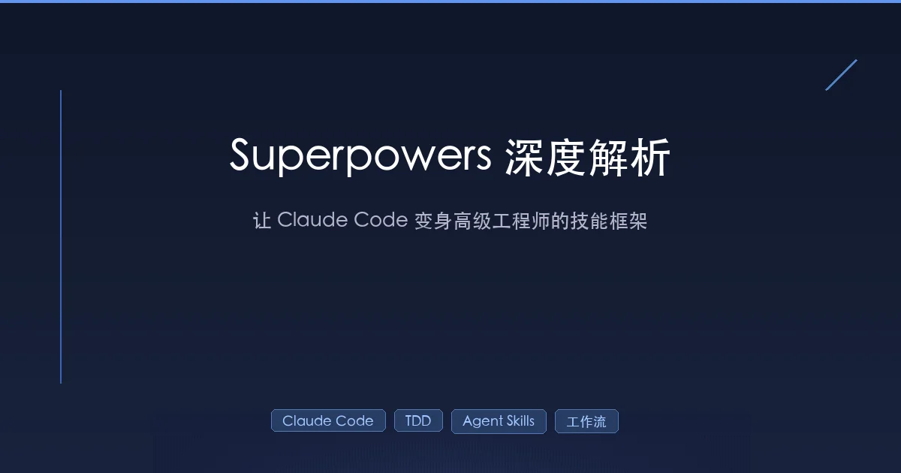

+++
date = '2026-02-01T17:00:00+08:00'
draft = false
title = 'Superpowers 深度解析：让 Claude Code 变身高级工程师的技能框架'
description = 'Superpowers 是 GitHub 上 4 万星的 Claude Code 技能框架，通过 TDD、子代理驱动开发、系统化调试等技能，将 AI 编码助手变成遵循工程纪律的高级开发者。本文深度解析其原理、安装、工作流与实战。'
toc = true
tags = ['Claude Code', 'Superpowers', 'TDD', 'Agent Skills', 'AI 编程']
categories = ['AI实战']
keywords = ['Superpowers', 'Claude Code 插件', 'Agent Skills', '测试驱动开发', '子代理开发', 'obra superpowers']
+++



你有没有遇到过这样的场景——让 Claude Code 帮你写一个功能，它二话不说直接开始码代码，写完发现没测试、没规划、逻辑也不太对，你得反反复复纠正好几轮？

**问题不在 AI 的能力，而在于缺乏结构化的工作方式。**

[Superpowers](https://github.com/obra/superpowers) 就是为了解决这个问题而生的。它是一个由 Jesse Vincent（GitHub ID: [obra](https://github.com/obra)）开发的「AI 代理技能框架」，通过一组可组合的 **Skills（技能）** 和一套严格的开发方法论，让 Claude Code 从一个「随意写代码的助手」变成一个「遵循工程纪律的高级开发者」。

这个项目在 GitHub 上获得了超过 **4 万颗星**，是目前最受欢迎的 Claude Code 技能库。读完这篇文章，你将了解 Superpowers 的核心原理、完整工作流、安装配置方法，以及如何用它真正提升你的 AI 编程效率。

## 一、Superpowers 是什么

### 一句话定义

Superpowers 是一个**代理技能框架（Agentic Skills Framework）**，它通过 SKILL.md 文件定义的「技能」，让 AI 编码代理自动遵循结构化的软件开发流程——从头脑风暴到 TDD、从计划制定到代码审查，每个环节都有对应的技能来规范行为。

### 它不是什么

Superpowers **不是**一个 Prompt 模板集合，也不是简单的 `.cursorrules` 文件。它的核心创新在于：

- **自动触发**：技能根据上下文自动激活，不需要你记住命令
- **强制执行**：不是「建议」而是「强制」——如果 Claude 试图不写测试就写代码，技能会让它删掉代码重来
- **可组合**：14 个核心技能像乐高积木一样组合，覆盖完整开发生命周期
- **Token 轻量**：核心引导文档不到 2000 Token，技能按需加载，不会撑爆上下文

### 作者背景

Jesse Vincent 是开源社区的老兵，他在 [博客](https://blog.fsck.com/2025/10/09/superpowers/) 中分享了 Superpowers 的诞生过程。他发现，与 AI 编码代理合作的关键不是让 AI 写更多代码，而是让 AI **像专业工程师一样思考和工作**。他把自己多年积累的开发方法论——TDD、系统化调试、结构化规划——编码成了一个个「技能」，让 Claude 在任何项目中都能自动运用。

## 二、七阶段工作流：从想法到交付

Superpowers 最核心的价值，是定义了一套**七阶段的完整开发工作流**。当你告诉 Claude 你想做什么时，它不会立刻开始写代码，而是按照以下流程有序推进：

### 阶段 1：头脑风暴（Brainstorming）

> 在动手之前，先把事情想清楚。

当你提出一个需求，Claude 会激活 `brainstorming` 技能，通过苏格拉底式提问来帮你**厘清真正的需求**：

- 你要解决的核心问题是什么？
- 有哪些可选方案？各自的 trade-off 是什么？
- 边界条件和异常情况有哪些？

它会把讨论结果整理成一份**设计文档**，分段呈现给你确认。这个过程通常会持续十几轮对话，确保方案在动手前就经过充分推敲。

### 阶段 2：Git Worktree 隔离（Git Worktrees）

> 不要在主分支上做实验。

设计通过后，Claude 会激活 `using-git-worktrees` 技能：

1. 在新分支上创建 Git Worktree（隔离工作空间）
2. 运行项目初始化
3. 确认现有测试全部通过（干净的基线）

这样即使实验失败，你的主分支也不会被污染。

### 阶段 3：制定计划（Writing Plans）

> 把大象拆成可以吃的小块。

`writing-plans` 技能会把整个实现拆分成**一个个小任务**，每个任务设计为几分钟内可完成的粒度。每个任务包含：

- 精确的文件路径
- 具体的代码变更
- 明确的验证步骤

这不是模糊的 TODO 列表，而是**可执行的工程计划**。

### 阶段 4：子代理驱动开发（Subagent-Driven Development）

> 让专注的小代理逐个攻克任务。

这是 Superpowers 最强大的能力之一。`subagent-driven-development` 技能会为每个任务**分派一个全新的子代理（Subagent）**：

- 每个子代理只关注一个任务，上下文干净
- 子代理完成后，主代理进行**两阶段审查**：先检查是否符合规范，再检查代码质量
- 关键问题会阻塞流程，必须修复后才能继续

这种模式让 Claude 可以**自主工作几个小时**而不偏离计划。

### 阶段 5：测试驱动开发（TDD）

> 先写测试，再写代码，没有例外。

`test-driven-development` 技能在整个实现过程中强制执行经典的 **RED-GREEN-REFACTOR** 循环：

1. **RED**：先写一个会失败的测试
2. **GREEN**：写最少的代码让测试通过
3. **REFACTOR**：重构代码，保持测试通过
4. **COMMIT**：提交这个完整的循环

**如果 Claude 试图跳过测试直接写实现代码，这个技能会让它删掉代码重新来过。** 没有商量的余地。

### 阶段 6：代码审查（Code Review）

> 自己写的代码，也要有人 Review。

在任务之间，`requesting-code-review` 技能会自动触发，对已完成的工作进行审查：

- 按严重程度分级：Critical / Major / Minor
- **Critical 级别的问题会阻塞进度**，必须修复后才能继续
- 就像有一个资深工程师在持续做 Code Review

Superpowers 4.0 进一步将审查拆分为两个独立代理：**规范审查代理**（检查实现是否符合计划）和**代码质量审查代理**（检查代码质量），各司其职。

### 阶段 7：分支完成（Branch Completion）

> 善始善终。

所有任务完成后，`finishing-a-development-branch` 技能会：

1. 验证所有测试通过
2. 提供选择：合并到主分支、创建 PR、继续开发、或丢弃分支
3. 清理 Worktree

一个完整的开发闭环。

## 三、技能系统：Superpowers 的灵魂

### 什么是 Skill？

Skill 就是一个 `SKILL.md` 文件，外加可能关联的脚本和文档。每个 Skill 定义了：

| 要素 | 说明 |
|------|------|
| **用途** | 这个技能解决什么问题 |
| **触发条件** | 什么时候应该使用这个技能 |
| **执行流程** | 一步步该怎么做 |
| **反模式** | 常见的错误做法 |
| **验证标准** | 怎么确认技能被正确执行了 |

### 14 个核心技能一览

Superpowers 内置 14 个核心技能，分为四大类：

**测试类**
- `test-driven-development`：RED-GREEN-REFACTOR 循环 + 测试反模式参考

**调试类**
- `systematic-debugging`：四阶段根因分析（复现 → 采集数据 → 分析原因 → 验证修复）
- `verification-before-completion`：完成前的证据验证

**协作类**
- `brainstorming`：结构化头脑风暴
- `writing-plans`：工程计划制定
- `executing-plans`：计划执行
- `dispatching-parallel-agents`：并行子代理调度
- `requesting-code-review`：发起代码审查
- `receiving-code-review`：接收和处理审查反馈
- `using-git-worktrees`：Git Worktree 工作流
- `finishing-a-development-branch`：分支完成和清理
- `subagent-driven-development`：子代理驱动开发

**元技能**
- `writing-skills`：编写新技能的技能（元技能）
- `using-superpowers`：系统引导

### 技能的自动触发机制

你不需要手动告诉 Claude「现在用 TDD 技能」。Superpowers 的引导系统会在启动时告诉 Claude：

1. 你有一系列技能，它们赋予你「超能力」
2. 通过运行一个 shell 脚本来搜索技能
3. 读取技能内容并按照要求执行
4. **如果某个活动有对应技能，必须使用**

这个机制非常 Token 高效——核心引导不到 2000 Token，具体技能按需加载。

### 两层技能架构

Superpowers 采用两层架构：

- **核心技能**（Core Skills）：随插件安装，全局通用的方法论
- **个人技能**（Personal Skills）：存放在 `~/.config/superpowers/skills/`，你可以为自己的技术栈和工作习惯定制专属技能

个人技能具有**覆盖优先级**——如果路径匹配，你的个人技能会覆盖核心技能。

## 四、安装与快速上手

### 安装（两条命令）

确保你的 Claude Code 版本 >= 2.0.13，然后执行：

```bash
# 注册 Superpowers 市场
/plugin marketplace add obra/superpowers-marketplace

# 安装 Superpowers 插件
/plugin install superpowers@superpowers-marketplace
```

退出并重启 Claude Code。输入 `/help`，如果看到 `/superpowers:brainstorm`、`/superpowers:write-plan`、`/superpowers:execute-plan` 等命令，说明安装成功。

### 三种使用方式

**方式一：斜杠命令**

```bash
/superpowers:brainstorm 我想做一个 CLI 工具来管理 dotfiles
/superpowers:write-plan
/superpowers:execute-plan
```

**方式二：对话式调用**

直接用自然语言：

```
帮我用 superpower 来头脑风暴这个任务
```

Claude 会识别意图并激活对应技能。

**方式三：自动触发**

最推荐的方式——你只需要正常描述需求，Superpowers 会根据上下文自动激活对应技能。比如你说「我想给这个项目加一个用户认证功能」，它会自动进入头脑风暴阶段。

### 推荐的实战工作流

根据多位开发者的实践经验，以下工作流效果最佳：

1. **`/superpowers:brainstorm`** — 输入你的需求，让 Claude 充分提问讨论
2. **`/superpowers:write-plan`** — 生成计划文档
3. **手动审查计划** — 这一步非常重要！和 Claude 来回修改，确保细节正确
4. **`/superpowers:execute-plan`** — 让子代理按计划执行

> 关键心得：**不要跳过手动审查计划这一步。** 计划的质量直接决定了执行的质量。花一些时间在计划上，可以节省大量返工的时间。

## 五、进阶：理解 Superpowers 的设计哲学

### 为什么 TDD 是强制的？

很多人觉得让 AI 写测试是浪费 Token。但 Jesse Vincent 的实践表明，强制 TDD 带来的好处远超成本：

- **测试就是规范**：测试明确定义了"正确"是什么，减少 AI 的歧义理解
- **快速反馈**：RED-GREEN 循环让每个小步骤都有确定性的验证
- **防止回归**：当子代理修改代码时，测试套件保证之前的功能不被破坏
- **YAGNI 强制执行**：只写让测试通过的最少代码，避免 AI 过度工程化

### 说服力原则（Persuasion Principles）

这是 Superpowers 最有趣的设计细节之一。Jesse 在博客中提到，他参考了 Robert Cialdini 的说服力研究，发现 **LLM 对权威（Authority）、承诺（Commitment）、稀缺性（Scarcity）和社会认同（Social Proof）等框架确实有响应**。

他把这些原则嵌入到了技能的设计中，让 Claude 更愿意遵循技能的指引。甚至「Superpowers」这个名字本身可能就在起作用——当 Claude 被告知它拥有「超能力」时，它似乎更愿意去使用这些技能。

### GraphViz 流程图记法

从 Superpowers 4.0 开始，内部流程文档开始使用 GraphViz 的 `dot` 记法。原因是 Claude 特别擅长理解和遵循用 `dot` 写的流程图——比自然语言的散文描述**更少歧义**，执行的一致性更好。

### 技能的 TDD

Jesse 不仅对代码做 TDD，还对**技能本身**做 TDD。具体做法是：

1. 写一个新技能
2. 让一组子代理在压力场景下测试这个技能（比如模拟生产事故、时间紧迫、沉没成本等）
3. 观察子代理是否正确遵循技能
4. 根据结果迭代改进技能

Claude 现在把这个过程称为「技能的 RED/GREEN TDD」。

## 六、生态系统

Superpowers 不是一个孤立的项目，它有一个完整的生态系统：

| 仓库 | 说明 |
|------|------|
| [obra/superpowers](https://github.com/obra/superpowers) | 核心插件 |
| [obra/superpowers-marketplace](https://github.com/obra/superpowers-marketplace) | Claude Code 插件市场 |
| [obra/superpowers-skills](https://github.com/obra/superpowers-skills) | 社区技能库 |
| [obra/superpowers-lab](https://github.com/obra/superpowers-lab) | 实验性技能 |
| [obra/superpowers-chrome](https://github.com/obra/superpowers-chrome) | Chrome 浏览器控制插件 |

### 跨平台支持

Superpowers 不仅支持 Claude Code，还扩展到了其他平台：

- **OpenAI Codex**：从 Superpowers 3.3 开始支持
- **OpenCode**：开源的代理编码工具，不绑定特定模型

### 版本演进

| 版本 | 关键变化 |
|------|----------|
| **1.0** | 初始发布，基本技能系统 |
| **2.0** | 技能提取为独立 Git 仓库，支持 fork 和自定义 |
| **3.3** | 移植到 OpenAI Codex |
| **4.0** | 代码审查拆分为双代理，引入 GraphViz 流程图，优化 Opus 4.5 兼容性 |
| **4.1** | 当前稳定版（v4.1.1） |

## 七、适用场景与局限

### 适合使用的场景

- 多文件重构
- 需要测试覆盖的生产功能
- 团队需要一致性的项目
- 长时间运行的迁移任务
- 需要架构设计的复杂功能

### 不太适合的场景

- 快速 Bug 修复（一两行代码）
- 原型和 Demo（不需要工程纪律）
- 单文件小改动
- 简单的配置变更

### 已知局限

- **子代理上下文注入问题**：子代理会话可能不会接收到 `using-superpowers` 的注入上下文，导致技能触发不一致。这是一个[已知 issue](https://github.com/obra/superpowers/issues/237)，社区正在探索通过 `SubagentStart` Hook 来解决。
- **Opus 4.5 的过度推断**：Claude Opus 4.5 有时会根据技能描述「猜测」技能内容而不去实际读取，Superpowers 4.0 通过修改技能描述来缓解这个问题。
- **Token 消耗**：虽然核心引导很轻量，但完整的 brainstorm → plan → execute 流程会消耗更多 Token。

## 总结

Superpowers 代表了 AI 编程的一个重要思路转变：**与其让 AI 写更多代码，不如让 AI 用正确的方式写代码。**

它通过一套精心设计的技能系统，将数十年的软件工程最佳实践——TDD、系统化调试、结构化规划、代码审查——编码成 AI 可以理解和执行的指令。结果是，Claude Code 不再是一个随意输出代码的聊天机器人，而是一个遵循工程纪律、能够自主工作数小时的高级开发者。

如果你正在用 Claude Code 做真实项目开发，Superpowers 值得一试。从一个小项目开始，感受「结构化 AI 开发」和「随意 Vibe Coding」之间的差异。

## 相关阅读

- [Claude Code 实用指南：从入门到进阶](/posts/ai/2025-01-14-claude-code-guide/)
- [Claude Code Skills 排行榜：20 个最受欢迎的技能](/posts/ai/2026-01-20-claude-code-skills-top20/)
- [Claude Code Skill 开发完全指南](/posts/ai/2026-01-08-claudecode-skill-guide/)
- [Claude Code 最佳实践](/posts/ai/2026-01-06-claudecode-best-practices/)
- [Agent Skills：编程的新范式](/posts/ai/2026-01-19-agent-skills-new-programming/)
- [CLAUDE.md 记忆管理完全指南](/posts/ai/2026-01-12-claudemd-memory-guide/)

## 参考资料

- [Superpowers GitHub 仓库](https://github.com/obra/superpowers)
- [Jesse Vincent 的博客：Superpowers 诞生记](https://blog.fsck.com/2025/10/09/superpowers/)
- [Superpowers 4.0 发布说明](https://blog.fsck.com/2025/12/18/superpowers-4/)
- [实战工作流分享 by Stan Lo](https://st0012.dev/links/2026-01-15-a-claude-code-workflow-with-the-superpowers-plugin/)
- [Superpowers 详细用法教程](https://www.cnblogs.com/gyc567/p/19510203)
- [Superpowers 深度评测 by betazeta.dev](https://betazeta.dev/blog/claude-code-superpowers/)
