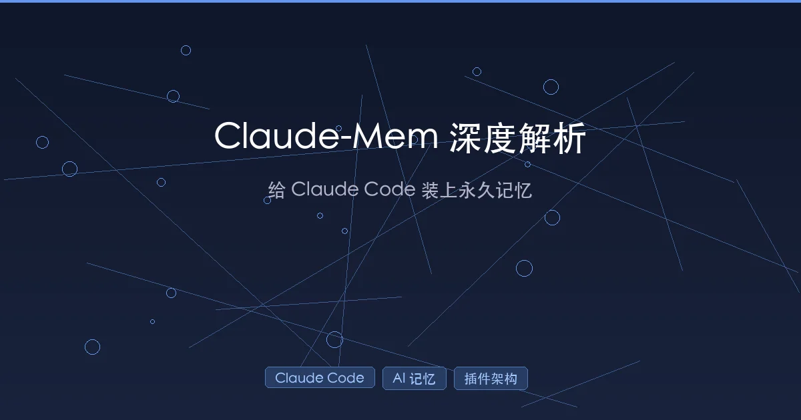

+++
date = '2026-02-03T00:23:00+08:00'
draft = false
title = 'Claude-Mem 深度解析：给 Claude Code 装上永久记忆'
description = 'Claude-Mem 是一款让 Claude Code 拥有跨会话持久记忆的插件。本文深入剖析其 Hook 架构、三层搜索、AI 压缩、Endless Mode 等核心技术，并与原生 CLAUDE.md 对比分析。'
toc = true
tags = ['Claude Code', 'Claude-Mem', 'AI 记忆', '插件架构', 'MCP']
categories = ['AI实战']
keywords = ['Claude-Mem', 'Claude Code 记忆', 'AI 持久记忆', 'Claude Code 插件', '跨会话上下文']
+++



用 Claude Code 写代码，最让人抓狂的是什么？不是它写错代码，而是**每次开新会话，它都像失忆了一样**。昨天花了两个小时跟它讨论的架构方案、排查的 Bug 细节、约定的代码规范——全部归零。你不得不一遍又一遍地重复上下文，就像每天都要重新自我介绍一样。

[Claude-Mem](https://github.com/thedotmack/claude-mem) 就是为了解决这个问题而生的。它是一个 Claude Code 插件，能够**自动捕获你和 Claude 的每一次交互，用 AI 压缩成结构化记忆，并在未来的会话中智能注入相关上下文**。简单说，它给 Claude Code 装上了一个"长期记忆系统"。

读完这篇文章，你会了解：

- Claude-Mem 的核心架构是怎么设计的
- 它如何用 Hook 机制无感捕获上下文
- 三层渐进式搜索如何实现 10 倍 Token 节省
- Endless Mode 如何突破上下文窗口限制
- 它与原生 CLAUDE.md 记忆方案的本质区别

## 一、为什么需要 Claude-Mem？

### 1.1 Claude Code 的"失忆症"

Claude Code 的上下文窗口是 200K tokens（Claude Sonnet 4）。听起来很大，但实际使用中，每次工具调用会消耗 1,000 到 10,000 tokens。一个中等复杂的开发任务，50 次工具调用就能把上下文窗口塞满。更关键的是，**会话一结束，所有上下文都消失了**。

这意味着：
- 昨天讨论的架构决策，今天要重新讲一遍
- 排查了半天的 Bug，换个会话又要从头分析
- 团队成员约定的编码规范，每次都要手动提醒

### 1.2 现有方案的局限

Claude Code 原生提供了 `CLAUDE.md` 记忆机制——你可以在项目根目录放一个 Markdown 文件，Claude 每次启动时会自动读取。这很好，但有几个问题：

| 痛点 | 说明 |
|------|------|
| **手动维护** | 需要你自己决定什么该记、什么该忘 |
| **静态内容** | 不会自动记录工作过程中的发现和决策 |
| **无法搜索** | 内容多了以后找不到特定信息 |
| **占用上下文** | 文件越大，留给实际工作的 Token 越少 |

Claude-Mem 的思路完全不同：**让 AI 自己决定记什么、怎么压缩、什么时候注入**。

## 二、核心架构：五层系统协同工作

Claude-Mem 的架构可以类比为一个"智能档案馆"：Hook 是档案员（负责收集），Worker 是管理员（负责分类压缩），数据库是档案柜（负责存储），搜索系统是检索台（负责查找），而 SessionStart 注入就是每天早上给你的工作简报。

### 2.1 整体架构概览

```
┌─────────────────────────────────────────────┐
│                Claude Code IDE               │
│  ┌─────────┐ ┌──────────┐ ┌──────────────┐  │
│  │Session  │ │UserPrompt│ │ PostToolUse  │  │
│  │Start    │ │Submit    │ │              │  │
│  │Hook     │ │Hook      │ │ Hook         │  │
│  └────┬────┘ └────┬─────┘ └──────┬───────┘  │
│       │           │              │           │
└───────┼───────────┼──────────────┼───────────┘
        │           │              │
        ▼           ▼              ▼
┌─────────────────────────────────────────────┐
│          Worker Service (Port 37777)         │
│  ┌─────────────┐  ┌──────────────────────┐  │
│  │ Context     │  │ Session Manager      │  │
│  │ Builder     │  │ (AI Agent Generator) │  │
│  └─────────────┘  └──────────────────────┘  │
│  ┌─────────────┐  ┌──────────────────────┐  │
│  │ Search      │  │ SSE Broadcaster      │  │
│  │ Manager     │  │ (Real-time Events)   │  │
│  └─────────────┘  └──────────────────────┘  │
└────────┬──────────────────┬─────────────────┘
         │                  │
         ▼                  ▼
┌────────────────┐  ┌────────────────┐
│  SQLite + FTS5 │  │ ChromaDB       │
│  (结构化存储)   │  │ (向量嵌入)      │
└────────────────┘  └────────────────┘
```

这套系统由六个 Hook 脚本、一个 HTTP Worker 服务、双数据库存储和 4 个 MCP 工具组成。下面逐层拆解。

### 2.2 Hook 系统：无感捕获一切

Claude-Mem 利用 Claude Code 的 [Hook 生命周期](https://code.claude.com/docs/en/plugins)在五个关键时间点注入逻辑：

| Hook | 触发时机 | 做什么 |
|------|----------|--------|
| **Smart Install** | 会话启动前 | 检查依赖（Bun、uv 等），缺什么装什么 |
| **SessionStart** | 会话开始 | 从数据库检索最近 10 个会话的相关上下文，注入到新会话 |
| **UserPromptSubmit** | 用户发送消息 | 记录用户输入和会话元数据 |
| **PostToolUse** | 每次工具调用后 | 捕获工具操作的观察结果（文件读写、代码变更等） |
| **Stop/SessionEnd** | 会话结束 | 用 AI 生成语义摘要，为下次会话做准备 |

关键设计：所有 Hook 都是轻量级 HTTP 客户端（v7.0 重构后每个 Hook 仅约 75 行代码），它们只负责向 Worker Service 发送请求，**不做任何重计算**。这保证了 Hook 不会拖慢 Claude Code 的响应速度。

```javascript
// PostToolUse Hook 的核心逻辑（简化示意）
// 捕获到工具调用后，立即异步发送给 Worker
const response = await fetch(`http://127.0.0.1:37777/api/sessions/observations`, {
  method: 'POST',
  body: JSON.stringify({
    session_id: currentSessionId,
    tool_name: toolResult.name,
    tool_input: toolResult.input,
    tool_output: toolResult.output
  })
});
// 返回 202 Accepted，不等待处理完成
```

### 2.3 Worker Service：中央调度器

Worker Service 是整个系统的大脑，运行在 Bun 上，默认监听 `127.0.0.1:37777`。它的启动采用**两阶段模式**：

- **第一阶段（快速）**：HTTP 服务立即绑定端口，把控制权还给 Hook（防止超时）
- **第二阶段（后台）**：初始化数据库、崩溃恢复、SearchManager 建立、MCP 连接

Worker 的核心职责包括：

1. **会话管理**：跟踪活跃的开发会话，维护双 ID 映射（IDE 会话 ID ↔ 记忆代理会话 ID）
2. **AI 代理调度**：后台生成观察（Observation）、摘要（Summary）
3. **搜索编排**：协调 SQLite FTS5 和 ChromaDB 的混合搜索
4. **实时广播**：通过 SSE（Server-Sent Events）向 Web UI 推送事件
5. **崩溃恢复**：启动时扫描 `pending_messages` 表，重试未完成的任务

### 2.4 三层存储架构

Claude-Mem 使用"三重冗余"存储：

**SQLite（结构化数据）**：
- 数据库位置：`~/.claude-mem/claude-mem.db`
- 核心表：`sdk_sessions`、`observations`、`session_summaries`、`user_prompts`、`pending_messages`
- 使用 FTS5 虚拟表实现关键词全文搜索
- `pending_messages` 表确保崩溃恢复——任何未处理的工作都会被持久化

**ChromaDB（向量嵌入）**：
- 位置：`~/.claude-mem/vector-db/`
- 每个观察的字段（标题、叙述、事实）都作为独立向量存储
- `ChromaSync` 异步同步，带智能回填策略

**文件系统**：
- `~/.claude-mem/settings.json`：配置文件
- `~/.claude-mem/logs/`：运行日志
- 可选的 `CLAUDE.md` 活动时间线文件

## 三、AI 压缩引擎：10:1 到 100:1 的压缩比

### 3.1 观察（Observation）是什么？

每次你用 Claude Code 读文件、写代码、运行命令，PostToolUse Hook 都会捕获原始的工具输入输出。但原始数据太大了——一次文件读取可能就有几千 tokens。

Claude-Mem 的 AI 代理会把这些原始数据**压缩成约 500 tokens 的结构化观察**，包含：

```json
{
  "id": "obs_20260203_001",
  "type": "discovery",         // 类型：bugfix/feature/refactor/discovery/decision/change
  "title": "发现 API 认证中间件的竞态条件",
  "narrative": "用户在排查 /api/users 端点偶发 401 错误时...",
  "facts": [
    "auth 中间件在 token 过期时没有加锁",
    "并发请求可能同时触发 token 刷新",
    "修复方案：使用 mutex 保证单次刷新"
  ],
  "concepts": ["problem-solution", "gotcha"],
  "session_id": "sess_abc123",
  "timestamp": "2026-02-03T00:00:00Z"
}
```

这就像把一本书压缩成一段高质量的读书笔记——保留核心洞察，丢弃冗余细节。

### 3.2 三种 AI 引擎可选

Claude-Mem 支持三种 AI 提供者，可以在运行时热切换（共享对话历史，不丢失上下文）：

| 引擎 | 优势 | 适用场景 |
|------|------|----------|
| **SDKAgent**（默认） | 使用 Claude Agent SDK，观察质量最高 | 追求最佳效果，包含在 Claude Code 订阅中 |
| **GeminiAgent** | 免费层 1,500 请求/天，支持速率限制 | 预算有限，轻量使用 |
| **OpenRouterAgent** | 100+ 模型可选，有免费模型 | 灵活选择，实验不同模型 |

所有引擎在遇到错误（429/5xx）时都会自动降级到 SDKAgent。

## 四、三层渐进式搜索：省 10 倍 Token

传统的 RAG（检索增强生成）方案通常是"搜到什么就全塞进去"，这在 Token 寸土寸金的场景下非常浪费。Claude-Mem 设计了一套**渐进式搜索**（Progressive Disclosure）模式：

### 4.1 三层工作流

```
第一层：索引搜索（~50-100 tokens/条）
    │  返回观察 ID、标题、日期、类型
    │  快速筛选，找到感兴趣的条目
    ▼
第二层：时间线上下文
    │  展示锚定观察前后的时间线
    │  理解事件的因果关系和决策链
    ▼
第三层：完整详情（~500-1000 tokens/条）
    │  仅获取用户选中的观察全文
    │  最终确认需要的信息
    ▼
  结果：相比传统 RAG 节省约 10 倍 Token
```

这个设计的精妙之处在于**先筛选再获取**。就像去图书馆找书：你不会先把所有书搬出来再挑，而是先看目录，找到章节，再翻到具体页面。

### 4.2 混合搜索策略

SearchManager 同时调用三种搜索策略并融合结果：

- **ChromaStrategy**：基于 ChromaDB 的向量相似度搜索，擅长语义匹配（"昨天修的那个认证 Bug"）
- **SQLiteStrategy**：基于 FTS5 的关键词搜索，擅长精确匹配（"401 错误"）
- **HybridStrategy**：相关性融合排序，取两者之长

### 4.3 MCP 工具接口

Claude-Mem 通过 4 个 MCP 工具暴露搜索能力：

| 工具 | 功能 | Token 消耗 |
|------|------|-----------|
| `search` | 返回紧凑索引 | ~50-100/条 |
| `timeline` | 时间线上下文 | 中等 |
| `get_observations` | 完整观察详情 | ~500-1000/条 |
| `__IMPORTANT` | 工作流文档 | 一次性 |

值得注意的是，v7.0 的一个重大优化是**将 9 个 MCP 工具（约 2,500 tokens）合并为 1 个 Skill（约 250 tokens 前言 + 按需加载指令）**，大幅减少了工具注册时的 Token 开销。

## 五、上下文注入：每次会话的"工作简报"

### 5.1 注入流程

当你开始一个新的 Claude Code 会话时，SessionStart Hook 会触发上下文注入：

1. 向 Worker 发送 `GET /api/context/inject` 请求
2. ContextBuilder 从最近 10 个会话中检索最多 50 个相关观察（均可配置）
3. 用混合搜索按相关性排序
4. 格式化为 Markdown 注入到新会话

### 5.2 精细化配置

你可以在 `http://localhost:37777` 的 Web UI 中调节注入参数：

```json
{
  "CLAUDE_MEM_CONTEXT_OBSERVATIONS": 50,    // 注入的观察数量（1-200）
  "CLAUDE_MEM_CONTEXT_SHOW_LAST_SUMMARY": false,  // 是否包含上次会话摘要
  "CLAUDE_MEM_CONTEXT_SHOW_LAST_MESSAGE": false,   // 是否包含上次最后消息
  "CLAUDE_MEM_SKIP_TOOLS": [                // 跳过这些工具的观察
    "ListMcpResourcesTool",
    "SlashCommand",
    "Skill"
  ]
}
```

还支持按类型（bugfix、feature、refactor 等）和概念（how-it-works、problem-solution、gotcha 等）过滤，让你精确控制什么信息进入新会话。

### 5.3 Token 经济学

从 v3 到 v7，上下文注入的 Token 消耗经历了一次质的飞跃：

| 版本 | 上下文注入量 | 说明 |
|------|------------|------|
| v3 | ~25,000 tokens | 全量注入，简单粗暴 |
| v7 | ~1,500 tokens | 压缩 + 渐进式加载 |

**节省了约 94% 的 Token**，这意味着更多的上下文窗口可以留给实际的编码工作。

## 六、Endless Mode：突破上下文窗口的极限

### 6.1 问题：O(N²) 的 Token 消耗

标准 Claude Code 会话的 Token 消耗是**二次方增长**的。每次工具调用不仅增加新内容，还要在上下文中保留之前所有工具的输出。大约 50 次工具调用后，200K 的上下文窗口就满了。

### 6.2 解决方案：仿生记忆架构

Endless Mode（目前处于 Beta）实现了一套受人类记忆启发的两层记忆系统：

```
┌───────────────────────────────┐
│  工作记忆（Working Memory）    │  ← 在上下文窗口中
│  压缩后的观察，每条约 500 tokens │
│  相当于人的"短期记忆"           │
└───────────────┬───────────────┘
                │ 压缩
                ▼
┌───────────────────────────────┐
│  归档记忆（Archive Memory）    │  ← 在磁盘上
│  完整的工具输出，按需调取        │
│  相当于人的"长期记忆"           │
└───────────────────────────────┘
```

**工作原理**：PostToolUse Hook 在每次工具调用后**阻塞等待**（最长 110 秒），让 AI 代理把完整的工具输出压缩成约 500 tokens 的观察，然后用压缩后的观察**替换**原始输出注入回上下文。完整输出则存入磁盘归档。

**效果**：
- Token 消耗从 O(N²) 降为 O(N)
- 上下文窗口内的 Token 减少约 95%
- 工具调用次数可以增加约 20 倍

### 6.3 代价与权衡

Endless Mode 不是免费的午餐：

| 优势 | 代价 |
|------|------|
| 极大扩展单次会话容量 | 每次工具调用增加 60-90 秒延迟 |
| 上下文不会"爆掉" | 压缩过程可能丢失细节 |
| 适合超长开发任务 | 仍处于实验阶段，可能有 Bug |

适用场景：需要在**一个会话中连续工作很长时间**的场景，比如大型重构、复杂 Bug 排查、多模块开发。

## 七、与原生 CLAUDE.md 的对比

很多人会问：Claude Code 已经有了 `CLAUDE.md` 记忆系统，为什么还需要 Claude-Mem？

### 7.1 本质区别

| 维度 | CLAUDE.md（原生） | Claude-Mem |
|------|-------------------|------------|
| **记忆方式** | 手动编写和维护 | AI 自动捕获和压缩 |
| **内容类型** | 静态规则、偏好、约定 | 动态的工作历史和决策记录 |
| **搜索能力** | 无（全量加载到上下文） | 语义搜索 + 关键词搜索 |
| **Token 效率** | 文件越大越浪费 | 渐进式加载，按需获取 |
| **隐私控制** | .local.md 不入库 | `<private>` 标签精细控制 |
| **版本控制** | Git 友好 | 独立数据库存储 |
| **团队协作** | 可提交到仓库共享 | 个人记忆，不跨设备 |

### 7.2 它们不是互斥的

最佳实践是**两者结合使用**：

- **CLAUDE.md**：存放项目级的静态知识——技术栈、编码规范、架构原则、常用命令
- **Claude-Mem**：自动记录动态的工作过程——Bug 排查过程、架构决策的来龙去脉、实验过的方案

这就像公司的"员工手册"（CLAUDE.md）和"工作日志"（Claude-Mem）——前者告诉你规矩，后者记录你干了什么。

有开发者提出了一个 [两层记忆架构](https://dev.to/suede/the-architecture-of-persistent-memory-for-claude-code-17d)的思路：

- **Tier 1（CLAUDE.md，约 150 行）**：自动生成的精简简报，包含最重要的项目知识
- **Tier 2（完整数据库）**：所有事实、决策、观察的完整存储，通过 MCP 工具按需查询

80% 的会话只需要 Tier 1，剩下 20% 按需从 Tier 2 获取。

## 八、安装与配置实战

### 8.1 快速安装

在 Claude Code 中执行：

```bash
# 从插件市场添加
> /plugin marketplace add thedotmack/claude-mem

# 安装插件
> /plugin install claude-mem
```

重启 Claude Code 后，之前会话的上下文就会自动出现在新会话中。

### 8.2 关键配置项

安装后配置文件位于 `~/.claude-mem/settings.json`，以下是最常调整的参数：

| 配置项 | 默认值 | 说明 |
|--------|--------|------|
| `CLAUDE_MEM_PROVIDER` | `claude` | AI 引擎：claude / gemini / openrouter |
| `CLAUDE_MEM_MODEL` | `claude-sonnet-4-5` | 具体模型 |
| `CLAUDE_MEM_CONTEXT_OBSERVATIONS` | `50` | 每次注入的观察数量（1-200） |
| `CLAUDE_MEM_WORKER_PORT` | `37777` | Worker 服务端口 |
| `CLAUDE_MEM_LOG_LEVEL` | `INFO` | 日志级别：DEBUG/INFO/WARN/ERROR/SILENT |
| `CLAUDE_MEM_SKIP_TOOLS` | 多个系统工具 | 排除观察的工具列表 |

### 8.3 Web 可视化界面

访问 `http://localhost:37777`，可以实时查看：

- 当前会话的观察流
- 历史会话列表和摘要
- 搜索记忆库
- 调节上下文注入参数（带实时预览）
- 切换 Stable / Beta 版本

### 8.4 隐私保护

如果某些内容不想被记录，可以在和 Claude 对话时使用隐私标签：

```
<private>
这段内容包含敏感信息，不要记录到记忆中。
API Key: sk-xxx...
</private>
```

也可以在配置中排除特定工具的观察捕获。

## 九、常见问题与避坑指南

### Q1：Claude-Mem 会拖慢 Claude Code 吗？

**正常模式不会**。所有 Hook 都是异步的——它们向 Worker 发送 HTTP 请求后立即返回，不等待处理完成。但 Endless Mode 会增加明显延迟（每次工具调用 60-90 秒）。

### Q2：数据安全吗？

所有数据存储在本地（`~/.claude-mem/`），不上传到任何云服务。Worker 只监听 `127.0.0.1`，外部无法访问。AI 压缩使用的是你自己的 Claude 订阅（或配置的第三方 API Key）。

### Q3：磁盘空间占用大吗？

SQLite 数据库通常在几十 MB 级别。ChromaDB 的向量嵌入可能稍大一些，但对现代硬盘来说微不足道。如果长期积累后觉得太大，可以手动清理历史会话。

### Q4：跟 Git Worktree 兼容吗？

兼容。Claude-Mem 支持统一的 Git Worktree 上下文，多个 Worktree 可以共享同一个记忆库。

### Q5：AGPL-3.0 许可证意味着什么？

如果你只是**个人使用**，没有任何限制。但如果你修改了 Claude-Mem 的代码并将其部署为网络服务（SaaS），则必须公开你的修改。注意 `ragtime/` 目录使用的是 PolyForm Noncommercial License，仅限非商业用途。

## 总结

Claude-Mem 解决了 AI 编码助手最根本的痛点之一——**记忆的连续性**。它的核心价值在于：

1. **无感运行**：安装后不需要任何手动操作，Hook 自动捕获一切
2. **智能压缩**：AI 驱动的观察生成，10:1 到 100:1 的压缩比
3. **精准检索**：三层渐进式搜索，只获取需要的信息
4. **Token 高效**：从 v3 的 25K tokens 降到 v7 的 1.5K tokens

当然，它也有局限：依赖后台 Worker 服务、Endless Mode 延迟明显、不适合团队共享记忆。对于大多数个人开发者来说，**CLAUDE.md + Claude-Mem 的组合**是目前最实用的 Claude Code 记忆方案。

如果你每天都在用 Claude Code，厌倦了反复给它讲上下文，Claude-Mem 值得一试。毕竟，一个记得住事儿的 AI 助手，才是真正好用的助手。

## 相关阅读

- [CLAUDE.md 记忆管理指南：让 AI 真正理解你的项目](/posts/ai/2026-01-12-claudemd-memory-guide/)
- [Claude Code 最佳实践：从入门到精通的完整指南](/posts/ai/2026-01-06-claudecode-best-practices/)
- [Claude Code Skills 深度解析：自定义技能系统](/posts/ai/2026-01-08-claudecode-skill-guide/)
- [Claude Code 浏览器自动化实战](/posts/ai/2026-01-28-claude-code-browser-automation/)
- [Superpowers Skills 深度剖析](/posts/ai/2026-02-01-superpowers-deep-dive/)
