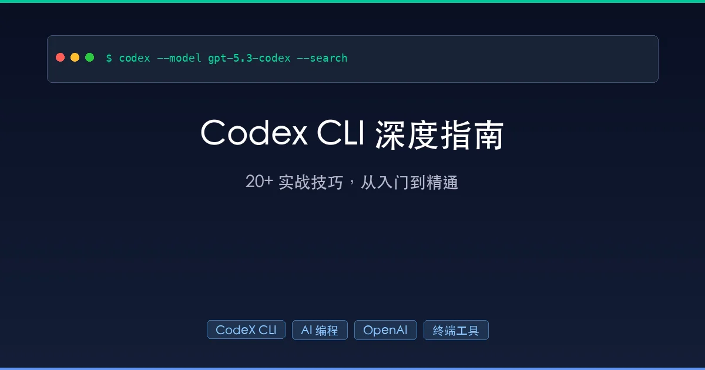

+++
date = '2026-02-12T16:02:00+08:00'
draft = false
title = 'Codex CLI 深度指南：20+ 实战技巧，从入门到精通'
description = 'OpenAI Codex CLI 全面深度指南，涵盖别名配置、模型切换、授权模式、会话恢复、MCP 集成、AGENTS.md 等 20+ 实战技巧，比基础教程更深入的进阶用法。'
toc = true
tags = ['Codex CLI', 'AI 编程', 'OpenAI', '终端工具', 'AI Agent']
categories = ['AI实战']
keywords = ['Codex CLI 教程', 'Codex CLI 技巧', 'OpenAI Codex', 'AI 编程工具', 'Codex CLI vs Claude Code']
+++



你可能已经看过不少 Codex CLI 的"入门指南"和"N 个小技巧"类文章。但说实话，大部分文章都停留在**把官方文档翻译了一遍**的水平——告诉你有哪些命令，却不告诉你**什么场景下该用、怎么组合使用、踩过什么坑**。

这篇文章不一样。我会从**实际开发场景**出发，不仅覆盖 Codex CLI 的核心功能，还会深入到**配置体系的底层逻辑**、**安全模型的设计哲学**、**与 Claude Code 的真实对比**，以及那些官方文档没有重点提及的**进阶技巧**。

读完这篇，你将获得：
- 一套**可直接复用的 Codex CLI 配置方案**
- 对 Codex CLI **安全模型和权限体系**的深度理解
- **20+ 个经过实战验证的高效技巧**
- 与 Claude Code 的**客观对比分析**，帮你做出选择

---

## 一、Codex CLI 是什么？为什么值得关注？

### 1.1 不只是"终端里的 ChatGPT"

很多人第一次听到 Codex CLI，会觉得"不就是在终端里聊天吗？"。这个理解大错特错。

Codex CLI 是 OpenAI 推出的**本地 AI 编程 Agent**，它能：

- **读取你的整个代码库**，理解项目结构和上下文
- **自动编辑文件**，不是给你建议让你手动改，而是直接改
- **执行 Shell 命令**，跑测试、安装依赖、管理 Git
- **通过 MCP 协议连接外部工具**，如 Figma、Sentry、数据库
- **在 OS 级沙箱中运行**，确保 AI 执行的命令不会搞坏你的系统

用一句话概括：Codex CLI 就像一个**坐在你旁边的高级程序员**，你告诉他需求，他直接动手写代码、跑测试、修 Bug。

### 1.2 核心架构

Codex CLI 的架构设计有几个值得注意的点：

```
┌─────────────────────────────────────────┐
│           Codex CLI (TUI)               │
│  ┌─────────────┐  ┌──────────────────┐  │
│  │  Composer    │  │  Approval Engine │  │
│  │  (输入交互)  │  │  (权限控制)       │  │
│  └─────────────┘  └──────────────────┘  │
│  ┌─────────────────────────────────────┐ │
│  │         Sandbox (OS 级沙箱)         │ │
│  │  - 文件系统隔离                      │ │
│  │  - 网络访问控制                      │ │
│  │  - 进程执行限制                      │ │
│  └─────────────────────────────────────┘ │
│  ┌─────────────┐  ┌──────────────────┐  │
│  │  MCP Client │  │  Web Search      │  │
│  │  (工具扩展)  │  │  (网络搜索)       │  │
│  └─────────────┘  └──────────────────┘  │
└─────────────────────────────────────────┘
              │
              ▼
     OpenAI API (gpt-5.3-codex)
```

**关键设计决策**：Codex CLI 采用的是**本地执行 + 云端推理**的混合架构。你的代码始终留在本地，只有必要的上下文被发送到 OpenAI 的 API。这和 OpenAI 的云端 Codex Agent（在 ChatGPT 中使用的那个）不同——后者是在云端沙箱中运行的。

---

## 二、安装与基础配置

### 2.1 安装

```bash
# macOS / Linux
npm install -g @openai/codex

# 或者用 Homebrew（macOS）
brew install openai-codex

# 验证安装
codex --version
```

### 2.2 认证方式

Codex CLI 支持两种认证方式，这是很多教程忽略的重要选择：

**方式一：ChatGPT 订阅认证（默认）**

```bash
codex login
# 会打开浏览器进行 OAuth 认证
```

适合：ChatGPT Plus/Pro/Enterprise 用户，额度包含在订阅中。

**方式二：API Key 认证**

```bash
# 修改配置文件 ~/.codex/config.toml
preferred_auth_method = "apikey"

# 或者临时切换
codex --config preferred_auth_method="apikey"
```

适合：没有 ChatGPT 订阅、想精确控制成本、或者在 CI/CD 中使用的场景。

**深度提示**：两种认证方式可以随时切换。一个实用的策略是——平时用 ChatGPT 订阅（包月不心疼），订阅额度用完了切 API Key 继续干活：

```bash
# 切回 ChatGPT 认证
codex --config preferred_auth_method="chatgpt"
```

### 2.3 GPT-5 系列模型的 API 定价

如果走 API 认证，了解定价很重要：

| 模型 | 输入价格 ($/1M tokens) | 输出价格 ($/1M tokens) | 适用场景 |
|------|----------------------|----------------------|---------|
| gpt-5.3-codex | 最新代码专用模型 | 最新代码专用模型 | Codex CLI 默认模型，代码生成最强 |
| gpt-5 | 通用旗舰模型 | 通用旗舰模型 | 复杂推理、代码审查 |
| o4-mini | 轻量推理模型 | 轻量推理模型 | 简单任务、成本敏感 |

> 最新定价请查看 [OpenAI API Pricing](https://openai.com/api/pricing/)

---

## 三、别名配置：一条命令搞定启动参数

### 3.1 基础别名

每次启动 Codex 都要敲一堆参数？用别名一劳永逸：

```bash
# 添加到 ~/.zshrc 或 ~/.bashrc
alias cx='codex -m gpt-5.3-codex -c model_reasoning_effort="high" --search'
```

这条别名做了三件事：
1. 指定最强的代码模型 `gpt-5.3-codex`
2. 推理等级拉到最高 `high`
3. 启用实时网络搜索 `--search`

### 3.2 多场景别名方案

但一个别名显然不够。实际开发中，不同场景需要不同的配置：

```bash
# 日常开发：高推理 + 网络搜索 + 自动模式
alias cx='codex -m gpt-5.3-codex -c model_reasoning_effort="high" --search'

# 代码审查：只读模式，防止误改
alias cxr='codex -m gpt-5.3-codex --sandbox read-only --ask-for-approval never'

# 快速问答：轻量模型，省成本
alias cxq='codex -m o4-mini -c model_reasoning_effort="medium"'

# 全自动模式：适合信任度高的项目（慎用）
alias cxa='codex -m gpt-5.3-codex --full-auto --search'

# CI/CD 脚本模式：非交互式
alias cxci='codex exec'
```

**为什么要区分这些场景？** 因为 Codex 的 token 消耗与推理等级直接相关。`high` 推理会消耗更多 token 但结果更准确，`medium` 适合日常，`low` 适合简单任务。根据任务复杂度选择，一个月能省不少钱。

### 3.3 使用 Profile 代替别名（更优雅的方案）

Codex CLI 支持 `--profile` 参数，可以在配置文件中预定义多个配置组合：

```toml
# ~/.codex/config.toml

# 默认配置
model = "gpt-5.3-codex"
model_reasoning_effort = "high"
web_search = "live"

# 代码审查 profile
[profiles.review]
sandbox_mode = "read-only"
approval_policy = "never"

# 轻量模式 profile
[profiles.quick]
model = "o4-mini"
model_reasoning_effort = "medium"
web_search = "disabled"
```

使用方式：

```bash
codex --profile review   # 代码审查模式
codex --profile quick    # 轻量快速模式
codex                    # 使用默认配置
```

Profile 比别名更好的地方在于：**配置集中管理，修改一处即可**，不需要去改 `.zshrc`。

---

## 四、24 个斜杠命令全解析

Codex CLI 目前支持 24 个斜杠命令，远不止原文提到的 8 个。我把它们按功能分组详细说明：

### 4.1 会话控制

| 命令 | 功能 | 深度说明 |
|------|------|---------|
| `/new` | 开启新会话 | 清空当前上下文，但保留在同一个 CLI 进程中 |
| `/resume` | 恢复历史会话 | 打开一个选择器，显示最近的会话列表 |
| `/fork` | 克隆当前会话 | 把当前对话复制到新线程，适合"我想试另一个方案但不想丢掉当前进度" |
| `/quit` / `/exit` | 退出 CLI | 完全退出 Codex CLI |
| `/compact` | 压缩上下文 | 总结当前对话以节省 token，避免触发上下文长度限制 |

**`/fork` 是被严重低估的命令**。想象这个场景：你让 Codex 用方案 A 实现一个功能，做到一半想试试方案 B。没有 `/fork` 的话，你要么放弃方案 A 的进度，要么重新开一个会话从头来。有了 `/fork`，你可以在方案 A 的基础上分叉出去试方案 B，两个方案的上下文都保留。

### 4.2 模型与风格

| 命令 | 功能 | 深度说明 |
|------|------|---------|
| `/model` | 切换模型和推理等级 | 交互式选择，支持运行中切换 |
| `/personality` | 切换沟通风格 | `friendly`（友好）/ `pragmatic`（务实）/ `none`（无风格） |
| `/plan` | 进入规划模式 | 让 Codex 先制定计划再执行，适合复杂任务 |

**`/plan` 的正确用法**：对于复杂任务（比如"重构整个认证模块"），先用 `/plan` 让 Codex 列出执行步骤，你审核确认后再开始执行。这比直接让它动手要安全得多，也能避免方向跑偏。

### 4.3 权限与状态

| 命令 | 功能 | 深度说明 |
|------|------|---------|
| `/permissions` | 调整授权模式 | 运行时切换 Auto/Read Only/Full Access |
| `/status` | 查看会话信息 | 显示模型、token 用量、账户信息 |
| `/statusline` | 自定义状态栏 | 交互式调整底部状态栏显示的内容 |
| `/debug-config` | 调试配置 | 打印完整的配置加载链路和策略诊断信息 |

**`/debug-config` 是排查问题的利器**。当你的配置"不生效"时，运行这个命令可以看到 Codex 到底从哪些文件加载了什么配置、哪个配置覆盖了哪个。

### 4.4 文件与工具

| 命令 | 功能 | 深度说明 |
|------|------|---------|
| `/mention` | 引用文件或目录 | 把特定文件加入对话上下文 |
| `/diff` | 查看 Git 变更 | 包括未追踪的文件 |
| `/review` | 代码审查 | 支持对比分支、检查未提交更改、分析特定 commit |
| `/mcp` | 查看 MCP 工具 | 列出所有已配置的 MCP 工具 |
| `/apps` | 浏览应用连接器 | 查看和插入 ChatGPT 连接器 |
| `/ps` | 查看后台任务 | 检查后台终端的状态和输出 |

### 4.5 其他

| 命令 | 功能 | 深度说明 |
|------|------|---------|
| `/init` | 初始化 AGENTS.md | 为项目生成指导文件 |
| `/feedback` | 提交反馈 | 发送日志和诊断信息给 OpenAI |
| `/logout` | 注销 | 清除本地凭证 |

---

## 五、会话恢复：不再丢失工作进度

这是原文**完全没有提到**但极其重要的功能。在实际工作中，你经常需要中断当前工作去处理其他事情，回来后继续之前的对话。

### 5.1 四种恢复方式

```bash
# 方式一：交互式选择器（推荐）
codex resume
# 显示最近会话列表，高亮选择后按 Enter 恢复

# 方式二：恢复最近一次会话
codex resume --last

# 方式三：恢复特定会话
codex resume <SESSION_ID>
# SESSION_ID 可以从选择器、/status 命令或 ~/.codex/sessions/ 目录获取

# 方式四：跨目录恢复
codex resume --all
# 默认只显示当前目录的会话，加 --all 显示所有目录的会话
```

### 5.2 恢复会话保留什么？

恢复会话时，以下内容会被完整保留：

- **原始对话记录**：你说了什么、Codex 回了什么
- **计划历史**：Codex 制定的执行计划
- **授权记录**：之前批准过的操作
- **文件上下文**：之前引用过的文件

这意味着你可以在恢复后继续说"接着上次的方案，把第三步改一下"，Codex 能完全理解上下文。

### 5.3 实用场景

**场景一：下班前保存进度**

```
你：帮我重构 auth 模块，先分析当前代码结构
Codex：[分析了一堆文件]
你：好的，我先下班了，明天继续
# 第二天
$ codex resume --last
你：继续昨天的重构，从第二步开始
```

**场景二：同时推进多个任务**

```bash
# 任务 A：重构认证
codex    # 开始任务 A
# ... 工作中 ...
# Ctrl+C 退出

# 任务 B：修复 Bug
codex    # 开始任务 B
# ... 修完了 ...

# 回到任务 A
codex resume   # 选择任务 A 的会话继续
```

---

## 六、授权模式深度解析

### 6.1 三种基本模式

| 权限项 | Auto（默认） | Read Only | Full Access |
|--------|------------|-----------|-------------|
| 读取文件 | ✅ | ✅ | ✅ |
| 编辑文件 | ✅ | ❌ | ✅ |
| 工作目录运行命令 | ✅ | ❌ | ✅ |
| 访问工作目录外文件 | 需确认 | ❌ | ✅ |
| 访问网络 | 需确认 | ❌ | ✅ |

### 6.2 精细化权限控制（Flags 参数）

除了三种预设模式，你还可以通过 Flags 参数组合出更精确的权限：

```bash
# 模式一：自动编辑，但运行不可信命令时需批准
codex --sandbox workspace-write --ask-for-approval untrusted

# 模式二：只读，从不请求批准（纯聊天/分析场景）
codex --sandbox read-only --ask-for-approval never

# 模式三：完全自动（仅在隔离环境中使用！）
codex --dangerously-bypass-approvals-and-sandbox
# 别名：--yolo（OpenAI 官方真的用了这个名字）
```

### 6.3 `--full-auto` 与 `--yolo` 的区别

这是很多人搞混的两个选项：

| 对比项 | `--full-auto` | `--yolo` |
|--------|-------------|----------|
| 全称 | `--full-auto` | `--dangerously-bypass-approvals-and-sandbox` |
| 沙箱 | **保留**沙箱保护 | **完全关闭**沙箱 |
| 审批 | 减少审批提示 | **完全关闭**审批 |
| 网络访问 | 仍受沙箱控制 | **完全开放** |
| 适用场景 | 日常开发（低摩擦） | CI/CD 隔离环境 |
| 安全性 | 较安全 | **危险** |

**忠告**：`--full-auto` 是给日常开发用的"信任模式"，`--yolo` 是给 CI/CD 或 Docker 容器等隔离环境用的。千万不要在本机直接用 `--yolo`。

### 6.4 审批策略（ask-for-approval）详解

`--ask-for-approval` 参数有四个级别：

```bash
# untrusted：只有不可信命令才需要审批（默认）
codex -a untrusted

# on-failure：命令失败时才请求审批
codex -a on-failure

# on-request：只在 Codex 主动请求时审批
codex -a on-request

# never：从不请求审批
codex -a never
```

**实战建议**：大部分情况下用默认的 `untrusted` 就够了。如果你在做代码审查（不需要执行任何命令），用 `never` + `read-only` 沙箱组合。

---

## 七、模型切换与推理等级

### 7.1 默认模型

Codex CLI 默认使用 `gpt-5.3-codex`——这是 OpenAI 专门为编程场景优化的最新模型，比通用的 GPT-5 在代码任务上更强。

### 7.2 运行时切换

```bash
# 方式一：启动时指定
codex -m gpt-5.3-codex
codex --model gpt-5

# 方式二：运行中切换
/model    # 交互式选择模型和推理等级
```

### 7.3 推理等级的选择策略

```bash
# 配置文件设置
model_reasoning_effort = "high"    # 高：复杂任务，消耗更多 token
model_reasoning_effort = "medium"  # 中：日常开发（默认）
model_reasoning_effort = "low"     # 低：简单任务，省 token
```

**什么时候用什么等级？**

| 推理等级 | 适用场景 | Token 消耗 |
|---------|---------|-----------|
| `high` | 架构设计、复杂重构、Bug 排查、代码审查 | 高 |
| `medium` | 日常编码、写测试、小改动 | 中 |
| `low` | 简单问答、格式化、改名 | 低 |

### 7.4 推理总结格式

```bash
# 标准格式
codex -c model_reasoning_summary_format="none"

# 实验性格式（更详细的推理过程）
codex -c model_reasoning_summary_format="experimental"
```

`experimental` 格式会显示模型更详细的"思考过程"，对于理解 Codex 为什么做出某个决策很有帮助，推荐在复杂任务中开启。

---

## 八、AGENTS.md 深度解析

### 8.1 不只是 README

如果说 Codex CLI 是你的"AI 同事"，那 `AGENTS.md` 就是你给他的"入职手册"。它不是一个普通的文档，而是一个**专门为 AI Agent 设计的指令系统**。

> 详细规范：[agents.md](https://agents.md/)

### 8.2 文件发现机制

Codex 在启动时（每次运行只读一次）会按以下顺序查找指令文件：

```
1. ~/.codex/AGENTS.override.md   ← 全局覆盖（最高优先级）
2. ~/.codex/AGENTS.md            ← 全局默认
3. <项目根>/AGENTS.override.md   ← 项目覆盖
4. <项目根>/AGENTS.md            ← 项目默认
5. <子目录>/AGENTS.override.md   ← 子目录覆盖
6. <子目录>/AGENTS.md            ← 子目录默认
   ... 一直到当前工作目录
```

**合并规则**：从全局到当前目录逐层合并，靠近当前目录的指令优先级更高。

### 8.3 配置选项

```toml
# ~/.codex/config.toml

# 自定义备用文件名（按顺序尝试）
project_doc_fallback_filenames = ["TEAM_GUIDE.md", ".agents.md"]

# 合并后的最大字节数限制
project_doc_max_bytes = 65536    # 默认 32KB
```

这意味着你可以用 `TEAM_GUIDE.md` 或 `.agents.md` 替代 `AGENTS.md`——对于不想在仓库里出现 "AGENTS" 字样的团队很有用。

### 8.4 一个实际的 AGENTS.md 示例

```markdown
# 项目指导

## 代码规范
- 使用 TypeScript strict 模式
- 所有函数必须有 JSDoc 注释
- 测试覆盖率不低于 80%
- 使用 pnpm 作为包管理器，禁止使用 npm 或 yarn

## 架构约束
- 遵循 Clean Architecture 分层
- 数据库操作只能在 repository 层
- API 路由使用 RESTful 命名规范

## 测试规范
- 单元测试使用 Vitest
- E2E 测试使用 Playwright
- 运行命令：pnpm test

## 部署
- 主分支：main
- 部署命令：pnpm deploy
- 环境变量在 .env.example 中有模板

## 禁止事项
- 不要修改 .github/workflows/ 下的文件
- 不要直接操作数据库，使用 ORM
- 不要在代码中硬编码密钥
```

### 8.5 全局 vs 项目级的策略

**全局 `~/.codex/AGENTS.md`**：写你所有项目通用的偏好：

```markdown
# 全局偏好
- 使用中文进行交流
- 代码注释使用中文
- 先分析后执行，不要直接动手
- 每次修改前说明原因
```

**项目级 `AGENTS.md`**：写项目特定的规范和约束（如上面的示例）。

**子目录 `AGENTS.override.md`**：写子模块的特殊规则：

```markdown
# tests/ 目录的特殊规则
- 测试文件命名：*.test.ts
- 使用 describe/it 结构
- Mock 数据放在 __fixtures__ 目录
```

### 8.6 验证指令是否生效

```bash
codex --sandbox read-only --ask-for-approval never "总结一下当前加载的指令"
```

如果指令没有生效，检查以下常见问题：
- 文件是否为空（空文件会被忽略）
- 是否有 `AGENTS.override.md` 覆盖了你的文件
- 合并后是否超过了 `project_doc_max_bytes` 限制

---

## 九、配置体系：五层优先级

这是很多人不了解的——Codex CLI 的配置不是单一文件，而是一个**五层优先级体系**：

```
CLI 参数 & --config 覆盖      ← 最高优先级
       │
Profile 配置 (--profile)
       │
项目配置 (.codex/config.toml)
       │
用户配置 (~/.codex/config.toml)
       │
系统配置 (/etc/codex/config.toml)
       │
内置默认值                     ← 最低优先级
```

### 9.1 用户配置文件详解

```toml
# ~/.codex/config.toml

# 默认模型
model = "gpt-5.3-codex"

# 审批策略
approval_policy = "on-request"

# 沙箱模式
sandbox_mode = "workspace-write"

# 网络搜索
web_search = "live"    # "cached" | "live" | "disabled"

# 推理等级
model_reasoning_effort = "high"

# 沟通风格
personality = "pragmatic"    # "friendly" | "pragmatic" | "none"

# Shell 环境变量策略
[shell_environment_policy]
include_only = ["PATH", "HOME", "LANG"]

# 日志目录
log_dir = "/path/to/codex-logs"

# 特性标志
[features]
shell_snapshot = true
undo = true
web_search = true

# 项目信任级别
[projects."/Users/me/work/my-project"]
trust_level = "trusted"

[projects."/Users/me/work/another-project"]
trust_level = "trusted"
```

### 9.2 项目级配置

在项目根目录创建 `.codex/config.toml`，可以为不同项目设置不同配置：

```toml
# .codex/config.toml（项目级）
model = "gpt-5.3-codex"
model_reasoning_effort = "high"

# 项目特定的 MCP 服务器
[mcp_servers.my-db]
command = "npx"
args = ["-y", "@modelcontextprotocol/server-postgres"]
env = { "DATABASE_URL" = "postgresql://..." }
```

### 9.3 使用 `/debug-config` 排查

当配置"不生效"时，运行 `/debug-config` 可以看到完整的配置加载链路：

```
Config Layer 1: /etc/codex/config.toml (not found)
Config Layer 2: ~/.codex/config.toml (loaded)
Config Layer 3: /project/.codex/config.toml (loaded)
Config Layer 4: Profile "review" (active)
Config Layer 5: CLI overrides: model_reasoning_effort=high
```

---

## 十、网络搜索

### 10.1 三种搜索模式

```toml
# 缓存搜索（默认）：使用 OpenAI 维护的索引缓存
web_search = "cached"

# 实时搜索：获取最新网页数据
web_search = "live"

# 关闭搜索
web_search = "disabled"
```

### 10.2 启动时启用

```bash
# 命令行方式
codex --search    # 启用实时搜索

# 配置文件方式（永久生效）
# ~/.codex/config.toml
web_search = "live"
```

### 10.3 搜索 vs 完全网络访问

这是一个**重要的安全区分**：

- `--search`：只允许 Codex 通过 OpenAI 的搜索 API 访问网络，**不能直接访问任意 URL**
- Full Access 模式的网络访问：Codex 可以直接执行 `curl`、`wget` 等命令访问任意网络资源

**建议**：大部分情况下用 `--search` 就够了，它能让 Codex 查到最新文档和解决方案，同时不给它完全的网络访问权限。

---

## 十一、文件引用与图片输入

### 11.1 @ 引用文件

```
# 在对话中引用文件
@src/auth/login.ts 这个文件的登录逻辑有 Bug，帮我修一下

# 引用整个目录
@src/components/ 帮我给这个目录下所有组件添加单元测试
```

**为什么要主动引用文件？** 虽然 Codex 可以自动搜索代码库，但主动引用能：
1. **减少搜索时间**，直接锁定目标
2. **避免改错文件**，明确告诉 Codex 该改哪个
3. **减少 token 消耗**，不需要让它读一堆无关文件

### 11.2 图片输入

```bash
# CLI 方式
codex -i screenshot.png "这个页面的布局有问题，帮我修"
codex --image wireframe.png,design.png "按照这个设计稿实现页面"

# 交互式：直接粘贴图片
# 在 Codex 输入框中 Cmd+V 粘贴截图
```

**实用场景**：
- 粘贴报错截图让 Codex 分析
- 粘贴 UI 设计稿让 Codex 实现
- 粘贴数据图表让 Codex 分析趋势

### 11.3 使用 `/mention` 命令

```
/mention src/auth/     # 把整个 auth 目录加入上下文
/mention package.json  # 引用特定文件
```

`/mention` 和 `@` 的区别：`/mention` 会打开一个文件选择器，支持模糊搜索；`@` 是直接在输入中引用。

---

## 十二、脚本与自动化

### 12.1 exec 命令

`exec` 是 Codex CLI 的**非交互模式**，适合在脚本和 CI/CD 中使用：

```bash
# 基础用法
codex exec "修复所有 ESLint 报错"

# JSON 输出（适合脚本解析）
codex exec --json "分析这个仓库的安全漏洞"

# 结合管道使用
codex exec "列出所有 TODO 注释" | grep "FIXME"
```

### 12.2 CI/CD 集成示例

```yaml
# .github/workflows/codex-review.yml
name: Codex Code Review
on: [pull_request]

jobs:
  review:
    runs-on: ubuntu-latest
    steps:
      - uses: actions/checkout@v4
      - name: Install Codex CLI
        run: npm install -g @openai/codex
      - name: Run Code Review
        env:
          OPENAI_API_KEY: ${{ secrets.OPENAI_API_KEY }}
        run: |
          codex exec --json \
            --config preferred_auth_method="apikey" \
            "审查这个 PR 的代码变更，关注安全性和性能问题"
```

### 12.3 Git Hook 集成

```bash
# .git/hooks/pre-commit
#!/bin/bash
codex exec "检查暂存区的代码是否有明显的安全问题或 Bug"
if [ $? -ne 0 ]; then
    echo "Codex 发现了潜在问题，请检查后再提交"
    exit 1
fi
```

---

## 十三、MCP 集成深度指南

MCP（Model Context Protocol）是让 Codex CLI 连接外部工具的标准协议。这让 Codex 不再只是一个"代码编辑器"，而是一个**可以操作整个开发工具链的 Agent**。

### 13.1 两种添加方式

**方式一：CLI 命令（推荐新手）**

```bash
# 添加 Context7 文档搜索
codex mcp add context7 -- npx -y @upstash/context7-mcp

# 添加带环境变量的服务器
codex mcp add my-db --env DATABASE_URL=postgresql://... -- npx -y @modelcontextprotocol/server-postgres

# 查看所有 MCP 服务器
codex mcp list

# 删除 MCP 服务器
codex mcp remove context7
```

**方式二：编辑配置文件（推荐老手）**

```toml
# ~/.codex/config.toml

# STDIO 类型的 MCP 服务器
[mcp_servers.context7]
command = "npx"
args = ["-y", "@upstash/context7-mcp"]

[mcp_servers.context7.env]
MY_VAR = "my_value"

# HTTP 类型的 MCP 服务器
[mcp_servers.figma]
url = "https://mcp.figma.com/mcp"
bearer_token_env_var = "FIGMA_OAUTH_TOKEN"

[mcp_servers.figma.http_headers]
X-Figma-Region = "us-east-1"
```

### 13.2 STDIO vs HTTP 配置对比

| 对比项 | STDIO 类型 | HTTP 类型 |
|--------|-----------|-----------|
| 配置参数 | `command` + `args` | `url` |
| 运行方式 | Codex 启动子进程 | 连接远程服务 |
| 适用场景 | 本地工具（文件系统、数据库） | 远程服务（Figma、Sentry） |
| 认证方式 | `env` 环境变量 | `bearer_token_env_var` / `http_headers` |

### 13.3 高级配置选项

```toml
[mcp_servers.my-server]
command = "node"
args = ["my-server.js"]
cwd = "/path/to/server"           # 工作目录
enabled = true                     # 是否启用（false 可以临时禁用而不删除）
required = true                    # 启动失败时是否中止 Codex
startup_timeout_sec = 15           # 启动超时（默认 10 秒）
tool_timeout_sec = 120             # 工具执行超时（默认 60 秒）
enabled_tools = ["tool_a", "tool_b"]   # 白名单：只允许这些工具
disabled_tools = ["dangerous_tool"]     # 黑名单：禁用这些工具
```

### 13.4 常用 MCP 服务器推荐

| MCP 服务器 | 用途 | 安装命令 |
|-----------|------|---------|
| Context7 | 开发文档搜索 | `codex mcp add context7 -- npx -y @upstash/context7-mcp` |
| Playwright | 浏览器自动化 | `codex mcp add playwright -- npx -y @anthropic/mcp-playwright` |
| PostgreSQL | 数据库操作 | `codex mcp add db -- npx -y @modelcontextprotocol/server-postgres` |
| Sentry | 错误日志查询 | `codex mcp add sentry -- npx -y @sentry/mcp-server` |

### 13.5 验证 MCP 连接

目前 Codex 没有专门的 MCP 验证命令（不像 Claude Code 有 `/mcp` 命令能看到详细状态）。但有两种方式判断：

1. **启动时观察**：如果 MCP 连接失败，Codex 启动时会显示错误信息
2. **运行时检查**：使用 `/mcp` 命令查看已加载的 MCP 工具列表

```
/mcp
# 如果看到你配置的工具名，说明连接成功
```

---

## 十四、快捷键与交互技巧

### 14.1 常用快捷键

| 快捷键 | 功能 |
|--------|------|
| `Option + Enter` 或 `Ctrl + J` | 换行（不发送） |
| `Enter` | 发送消息 |
| `Esc` 或 `Ctrl + C` | 中断当前请求 |
| 再按一次 `Ctrl + C` | 退出 Codex CLI |
| `Ctrl + G` | 打开外部编辑器（如 Vim）编辑长提示 |
| 上/下箭头 | 浏览草稿历史 |

### 14.2 `Ctrl+G`：被低估的长文本编辑

当你需要输入一段很长的提示（比如详细的需求描述），在小小的终端输入框里打字体验很差。按 `Ctrl+G` 会打开你配置的编辑器（默认是 `$EDITOR`），你可以在 Vim/VS Code 中从容地写完提示，保存关闭后自动发送。

### 14.3 `--add-dir`：跨目录工作

```bash
# 允许 Codex 同时访问多个目录
codex --add-dir /path/to/shared-library
```

当你的项目依赖本地的共享库或 monorepo 中的其他包时，这个参数很实用。

---

## 十五、上下文管理策略

### 15.1 上下文窗口的本质

Codex CLI 的上下文窗口有限制。当对话过长时，你会在输入框下方看到剩余上下文长度。一旦接近上限，Codex 的表现会下降——它会"忘记"早期的对话内容。

### 15.2 `/compact` 的正确用法

```
/compact
# Codex 会总结之前的对话，释放上下文空间
```

**什么时候该用 `/compact`？**
- 当剩余上下文低于 30% 时
- 当完成一个阶段性任务，准备开始下一个时
- 当 Codex 开始"忘记"之前讨论的内容时

### 15.3 主动管理上下文的技巧

1. **大任务拆小任务**：不要让 Codex 一口气做完所有事，分步骤来
2. **及时用 `/new` 开新会话**：一个需求做完了就开新会话，不要在一个会话里塞太多事
3. **善用 `/mention`**：主动告诉 Codex 该看哪些文件，而不是让它自己搜索（搜索结果也会占用上下文）
4. **用 `/plan` 先规划**：复杂任务先制定计划，确认后再执行，避免反复修改浪费上下文

---

## 十六、代码审查功能

### 16.1 `/review` 命令

```
# 审查当前工作区的变更
/review

# 审查与特定分支的差异
/review Compare changes against main branch

# 审查特定 commit
/review Analyze commit abc1234

# 自定义审查重点
/review Focus on security vulnerabilities and performance issues
```

### 16.2 结合 CI/CD 自动审查

Codex 的 [GitHub App](https://developers.openai.com/codex/integrations/github/) 可以自动审查 PR：

- 安装后为每个仓库开启自动审查
- 它会检查 PR 中的代码变更，直接在代码行上留评论
- 能发现真实的 Bug，不是那种"建议你加个注释"的无聊审查

---

## 十七、Codex CLI vs Claude Code：客观对比

作为两款都深度使用过的工具，这里给出一个尽量客观的对比：

### 17.1 核心能力对比

| 对比维度 | Codex CLI | Claude Code |
|---------|-----------|-------------|
| **底层模型** | GPT-5.3-Codex（代码专用） | Claude Opus 4.6（通用强模型） |
| **沙箱安全** | OS 级沙箱，文件系统和网络隔离 | 权限提示系统，用户逐项审批 |
| **会话恢复** | 完整支持，可跨目录恢复 | 不支持（关闭即失去上下文） |
| **MCP 支持** | 支持 STDIO 和 HTTP | 支持 STDIO 和 SSE |
| **网络搜索** | 内置搜索（缓存/实时） | 内置搜索 |
| **代码审查** | `/review` + GitHub App | 通过对话实现 |
| **IDE 集成** | VS Code 扩展 | VS Code + JetBrains 扩展 |
| **指令系统** | AGENTS.md（多层级） | CLAUDE.md（多层级） |
| **定价** | ChatGPT 订阅或 API | Anthropic 订阅或 API |

### 17.2 各自优势场景

**Codex CLI 更适合**：
- 需要**严格沙箱隔离**的环境（企业安全要求高）
- **大文件处理**（Claude Code 对超过 25K token 的文件支持较弱）
- 需要**会话恢复**的长期任务
- **CI/CD 自动化**集成（exec 命令 + JSON 输出）
- 重视**成本控制**的团队

**Claude Code 更适合**：
- **复杂推理和多步骤任务**（Claude 模型在推理深度上有优势）
- **UI 开发和前端工作**
- **交互式开发**（实时反馈调整）
- 需要更丰富的 **MCP 生态**
- **测试驱动开发**（TDD 流程支持更好）

### 17.3 我的实际选择

不必二选一。我的策略是：
- **日常编码、Bug 修复**：用 Codex CLI（快、省钱）
- **复杂架构设计、重构**：用 Claude Code（推理更深）
- **代码审查**：用 Codex CLI 的 GitHub App（自动化）
- **前端开发**：用 Claude Code（UI 理解更好）

---

## 十八、性能与成本优化

### 18.1 Token 消耗优化

1. **选择合适的推理等级**：简单任务用 `low`，日常用 `medium`，复杂任务用 `high`
2. **及时 `/compact`**：避免超长上下文导致的 token 浪费
3. **精确引用文件**：用 `@` 指定文件，减少不必要的搜索
4. **关闭不需要的搜索**：如果不需要网络搜索，设置 `web_search = "disabled"`

### 18.2 响应速度优化

1. **使用 `--no-alt-screen`**：禁用全屏模式，在某些终端上能提升渲染速度
2. **减少 MCP 服务器**：每个 MCP 服务器启动都需要时间，只配置真正用到的
3. **设置合理的超时**：`startup_timeout_sec` 和 `tool_timeout_sec` 不要设太长

---

## 十九、通知与 Hook

```toml
# ~/.codex/config.toml

# 当 Agent 完成一轮工作时执行通知
[notification_hook]
command = "osascript"
args = ["-e", "display notification \"Codex 已完成任务\" with title \"Codex CLI\""]
```

这在处理耗时任务时特别有用——你可以切到其他窗口工作，任务完成后收到系统通知。

macOS 用户还可以结合 `terminal-notifier` 做更酷炫的通知：

```toml
[notification_hook]
command = "terminal-notifier"
args = ["-title", "Codex CLI", "-message", "任务已完成", "-sound", "default"]
```

---

## 二十、Feature Flags（实验性功能）

Codex CLI 有一个 Feature Flag 系统，可以提前体验实验性功能：

```bash
# 启用某个功能
codex features enable shell_snapshot

# 禁用某个功能
codex features disable shell_snapshot

# 启动时临时启用/禁用
codex --enable shell_snapshot
codex --disable web_search
```

目前已知的 Feature Flags：

| Flag | 功能 |
|------|------|
| `shell_snapshot` | Shell 状态快照 |
| `undo` | 操作撤销 |
| `apps` | 应用连接器 |
| `personality` | 沟通风格 |
| `collaboration_modes` | 协作模式 |
| `apply_patch_freeform` | 自由格式补丁 |

---

## 二十一、额外的目录写入权限

```bash
# 允许 Codex 写入额外的目录
codex --add-dir /path/to/shared-lib --add-dir /path/to/configs
```

默认情况下，Codex 只能写入当前工作目录。如果你的项目是 monorepo 结构，或者需要同时修改多个相关项目，`--add-dir` 可以授予额外目录的写入权限。

---

## 二十二、Shell 补全

```bash
# 为 bash 生成补全脚本
codex completions bash >> ~/.bashrc

# 为 zsh 生成补全脚本
codex completions zsh >> ~/.zshrc

# 为 fish 生成补全脚本
codex completions fish >> ~/.config/fish/completions/codex.fish
```

安装后在输入 `codex` 相关命令时按 Tab 键可以自动补全参数和选项。

---

## 常见问题与避坑指南

### Q1：Codex 启动后一直显示 "Re-connecting"

这通常是网络问题或认证过期。解决方案：

```bash
# 1. 重新登录
codex logout
codex login

# 2. 如果使用代理，确保代理配置正确
export HTTPS_PROXY=http://127.0.0.1:7890

# 3. 检查是否是 API Key 过期
codex --config preferred_auth_method="apikey"
```

### Q2：MCP 服务器连接失败

```bash
# 1. 检查命令是否正确
npx -y @upstash/context7-mcp  # 手动运行看看是否报错

# 2. 检查环境变量
echo $MY_ENV_VAR  # 确认变量已设置

# 3. 增加启动超时
# 在 config.toml 中设置
[mcp_servers.my-server]
startup_timeout_sec = 30
```

### Q3：上下文耗尽，Codex 开始"胡说八道"

```
# 方案一：压缩上下文
/compact

# 方案二：开新会话，用简洁的提示重述需求
/new

# 方案三：分解任务
# 不要在一个会话里做太多事情
```

### Q4：Codex 不断修改错误的文件

```
# 明确引用目标文件
@src/auth/login.ts 只修改这个文件的第 42 行

# 使用 Read Only 模式先分析
/permissions -> Read Only
你：分析一下 @src/auth/ 目录的代码结构
# 确认理解正确后再切回 Auto 模式动手改
```

---

## 总结

Codex CLI 是一个**功能远比表面看起来丰富得多**的工具。从五层配置体系到 OS 级沙箱，从 24 个斜杠命令到完整的 MCP 生态，它不只是一个"终端聊天工具"，而是一个**完整的 AI 编程 Agent 平台**。

核心要点：

1. **别名 + Profile 双管齐下**，为不同场景准备不同配置
2. **理解安全模型**，在便利和安全之间找到平衡
3. **善用会话恢复**，不再因为关掉终端就丢失上下文
4. **MCP 是杀手级特性**，它让 Codex 从"写代码"变成"操作整个开发工具链"
5. **AGENTS.md 要认真写**，它直接决定了 Codex 理解你项目的深度
6. **不必与 Claude Code 二选一**，根据场景选择最合适的工具

## 相关阅读

- [Claude Code 实战指南：从入门到进阶的完整攻略](/posts/ai/2025-01-14-claude-code-guide/)
- [CLAUDE.md 写作指南：让 AI 真正理解你的项目](/posts/ai/2026-01-12-claudemd-memory-guide/)
- [AI 时代的开发工作流](/posts/ai/2026-01-19-ai-dev-workflow/)
- [Cursor Agent 最佳实践](/posts/ai/2026-01-19-cursor-agent-best-practices/)
- [Claude Code 最佳实践指南](/posts/ai/2026-01-06-claudecode-best-practices/)
