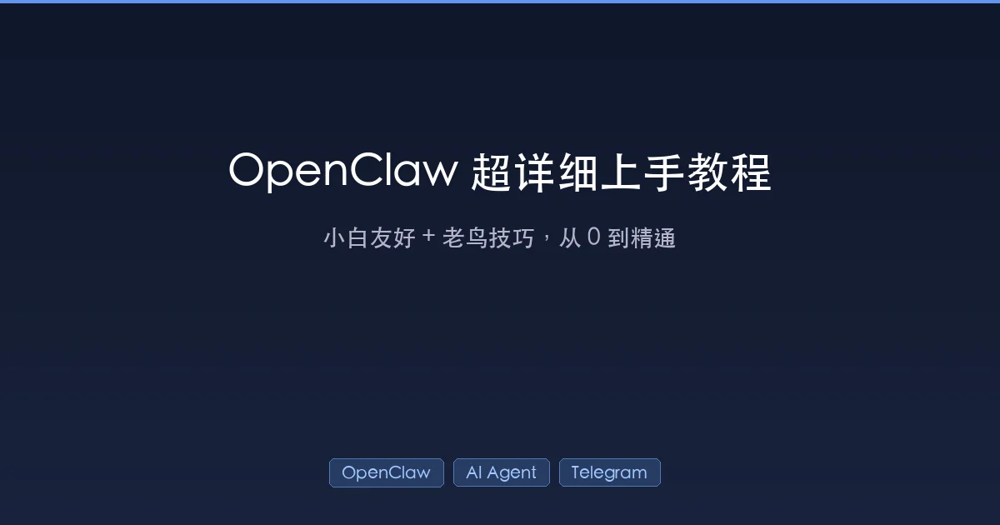

+++
date = '2026-02-12T07:36:00+08:00'
draft = false
title = 'OpenClaw 超详细上手教程：小白友好 + 老鸟技巧'
description = 'OpenClaw 从零到精通的完整教程，涵盖安装、Gateway 启动、TUI 终端、多智能体配置、安全隔离、排障清单等实战内容，适合新手入门和老鸟进阶。'
toc = true
tags = ['OpenClaw', 'AI Agent', 'Telegram', '个人助手', '开源']
categories = ['AI实战']
keywords = ['OpenClaw 教程', 'OpenClaw 安装', 'AI Agent 网关', 'Telegram 机器人', 'OpenClaw TUI']
+++



想拥有一个 7×24 小时在线的私人 AI 助手，能在 Telegram、WhatsApp、Discord 等平台随时响应你的消息？[OpenClaw](https://github.com/openclaw/openclaw) 就是为此而生的开源 AI Agent 网关。本文是一份**从 0 到精通**的完整教程，无论你是刚入门的小白还是想深度玩转多智能体的老鸟，都能找到适合自己的内容。

> 适用：macOS/Linux/WSL2。本文默认你在一台"跑 Gateway 的主机"上操作（比如你的 Mac mini）。
>
> 目标：从 0 到能用（网页聊天 / Telegram/WhatsApp 等）、能进 TUI、能排障、能玩转多智能体/多配置/安全隔离。

---

## 0. 你需要先记住的三个概念（非常重要）

OpenClaw 的心智模型可以用一句话概括：

- **Gateway（网关）**：常驻后台的"中枢进程"，负责接入 Telegram/WhatsApp/网页 UI、维护会话、路由到智能体。
- **Agent（智能体）**：执行对话与工具调用的"角色实例"（`main`、`work`、`research`…），每个 agent 可以有自己的 workspace、模型、工具权限。
- **Session（会话）**：某个 agent 下的一段对话历史（例如 `main`、`global`、或者按渠道分的 session key）。

你所有操作基本都围绕：**启动 Gateway → 选 agent/session → 在某个渠道里发消息**。

如果你之前了解过 OpenClaw 的前身（[ClawdBot](/posts/ai/2026-01-25-clawdbot-personal-ai-assistant/) → [Moltbot](/posts/ai/2026-01-29-moltbot-deep-dive/) → OpenClaw），这三个概念应该不陌生。

---

## 1. 目录与文件：OpenClaw 把东西放哪？

### 1.1 工作区（workspace）

默认工作区：

- `~/.openclaw/workspace`

你现在这台机器上：

- `/Users/bruce.he/.openclaw/workspace`

这个目录一般放：

- `SOUL.md / USER.md / MEMORY.md`：你的"使用约定/偏好/长期记忆"
- `memory/YYYY-MM-DD.md`：每日流水记录
- `skills/`：自定义技能（例如 blog-writer）
- `tmp/`：临时文件

> 经验：**workspace 既是"我读你偏好"的地方，也是我写产物（文档、脚本、草稿）的地方**。

关于 OpenClaw 的记忆机制细节，可以参考 [OpenClaw 记忆实施策略解析](/posts/ai/2026-01-31-openclaw-memory-strategy/)。

### 1.2 配置文件（openclaw.json）

默认位置：

- `~/.openclaw/openclaw.json`

它是 **JSON5**（支持注释、尾逗号），并且 **严格 schema 校验**：拼错字段会导致 Gateway 拒绝启动。

### 1.3 状态目录（state dir）

默认位置：

- `~/.openclaw/`

里面会有 agents 的认证与运行状态（例如 `~/.openclaw/agents/main/...`）。

---

## 2. 安装与初始化（最快路径）

> 如果你已经装好了，可以直接跳到第 3 节。

### 2.1 安装 CLI

```bash
npm install -g openclaw@latest
# 或
pnpm add -g openclaw@latest
```

验证：

```bash
openclaw --version
openclaw help
```

更多安装细节可参考 [OpenClaw 官方文档](https://docs.openclaw.ai/)。

### 2.2 跑向导（强烈推荐给小白）

```bash
openclaw onboard --install-daemon
```

它会帮你配置：

- 模型认证（OAuth / API key）
- Gateway 基本配置
- 渠道（Telegram/WhatsApp/Discord…）
- 配对/白名单（安全默认）
- 可选：安装后台服务（macOS 用 launchd）

如果你之前用过 Moltbot Wizard，这个向导体验类似但更完善，详见 [Moltbot Wizard 完全指南](/posts/ai/2026-01-28-moltbot-wizard-guide/)。

---

## 3. Gateway：启动、检查、日志、常用命令

### 3.1 启动 Gateway（前台方式）

```bash
openclaw gateway --port 18789
```

默认控制台 UI：

- http://127.0.0.1:18789/

> 老鸟提醒：如果你使用 Telegram/WhatsApp，**尽量用 Node 跑**，不要用 Bun（有已知兼容性坑）。

### 3.2 查看 Gateway 是否在跑（后台服务方式）

```bash
openclaw gateway status
```

### 3.3 一条命令看整体健康

```bash
openclaw status
openclaw health
```

排障常用：

```bash
openclaw status --all
openclaw status --deep
```

### 3.4 跟日志（出问题第一时间看）

```bash
openclaw logs --follow
```

### 3.5 Doctor：自动诊断/迁移/修复

```bash
openclaw doctor
# 需要自动修复时再用（会改动配置/状态）
openclaw doctor --fix
```

---

## 4. 三种"跟 OpenClaw 交互"的方式（新手最容易搞混）

### 4.1 Web 控制台（Dashboard / Control UI）

最快开聊：

```bash
openclaw dashboard
```

或者直接打开：

- http://127.0.0.1:18789/

适合：

- 第一次验证是否能跑
- 不想配渠道也能先用
- 需要图形化配置/查看会话

### 4.2 终端 UI：TUI（你问的"终端模式"）

只要 Gateway 在跑，执行：

```bash
openclaw tui
```

远程连别的机器的 Gateway：

```bash
openclaw tui --url ws://<host>:<port> --token <gateway-token>
```

#### 4.2.1 TUI 里最关键的两个点：session 与 deliver

- 默认情况下，TUI 只是把消息发给 Gateway **但不投递到聊天平台**。
- 想让回复真的发回 Telegram/WhatsApp：
  - 在 TUI 输入：`/deliver on`
  - 或启动时：`openclaw tui --deliver`

这点是"防误发"的设计：**不小心把测试消息发到群里是新手常见事故**。

#### 4.2.2 TUI 快捷键（建议背下来）

- `Enter`：发送
- `Esc`：中止当前运行
- `Ctrl+C`：清空输入（按两次退出）
- `Ctrl+D`：退出
- `Ctrl+L`：模型选择器
- `Ctrl+G`：智能体选择器
- `Ctrl+P`：会话选择器
- `Ctrl+O`：工具输出折叠/展开
- `Ctrl+T`：切换思考可见性（会重新加载历史）

#### 4.2.3 TUI 斜杠命令（常用）

- `/help`：帮助
- `/status`：当前连接/会话/模型状态
- `/agent <id>`、`/agents`
- `/session <key>`、`/sessions`
- `/model <provider/model>`、`/models`
- `/think off|minimal|low|medium|high`
- `/verbose on|full|off`
- `/reasoning on|off|stream`
- `/deliver on|off`
- `/new` 或 `/reset`

#### 4.2.4 老鸟惊叹技巧：TUI 里直接跑本地 shell（`!`）

在 TUI 输入：

```text
! pwd
! ls -la
! openclaw status
```

注意：

- 第一次会提示授权（每个会话一次）
- 每条 `!` 都是**独立的非交互 shell**（不会记住上一次 `cd`）

这在排障和自动化时非常爽：你可以在一个界面里"边聊边执行命令"。

### 4.3 直接用 CLI 发消息（脚本友好）

```bash
openclaw message send --channel telegram --target @your_chat --message "hello"
```

适合：

- 自动化
- 写脚本/CI
- 验证某个渠道出站是否正常

---

## 5. 配置：小白改哪里、老鸟怎么玩

### 5.1 小白最常改的 3 件事

1) **限制谁能私信触发机器人**（allowFrom / pairing）
2) **群里是否需要 @ 提及才回复**（requireMention）
3) **工作区路径**（workspace）

### 5.2 老鸟技巧 1：用 `--profile` 开多套隔离环境

OpenClaw 支持 profile，把 state/config 隔离到：

- `~/.openclaw-<name>`

例如你要一个"实验环境"不影响正式：

```bash
openclaw --profile lab gateway --port 19001
openclaw --profile lab tui --url ws://127.0.0.1:19001
```

再配合：

- `--dev`：开发隔离模式（端口也会偏移）

### 5.3 老鸟技巧 2：配置拆分（`$include`）

当你的配置越来越大（多个 agent、多渠道、多白名单），别把所有东西塞一个文件。

`~/.openclaw/openclaw.json`：

```json5
{
  gateway: { port: 18789 },
  agents: { $include: "./agents.json5" },
  channels: { $include: "./channels.json5" },
}
```

优点：

- 结构清晰
- 好审计
- 适合 git 管理

### 5.4 老鸟技巧 3：多智能体路由（同一个 Gateway 跑多个"人格/工作区"）

典型玩法：

- `work`：只允许工作群触发，工具权限更严格
- `personal`：私聊全权限
- `research`：专门做检索/汇总

核心就是：

- `agents.list[]` 定义多个 agent
- `bindings[]` 把某个渠道/账号/群/私聊 路由到不同 agent

> 这块建议你确定"你想怎么分工"，再按你的真实渠道（Telegram 群/私聊）写一份可用的配置骨架。

关于 OpenClaw 作者自己的开发方法论和工作流思路，推荐阅读 [OpenClaw 作者的 Claude Code 开发方法论](/posts/ai/2026-01-31-openclaw-claude-code-workflow/)。

### 5.5 老鸟技巧 4：避免"私信串台"——DM 会话隔离

`openclaw status` 的安全提示里有一条常见告警：

- "多个 Telegram 私信可能共享 main session，可能泄露上下文"

解决思路：把 DM scope 改成按用户隔离（具体字段因版本而异，一般在 `session` / `messages` / `channels` 附近）。

如果你把你当前 `~/.openclaw/openclaw.json` 里 session 段贴出来（打码 token），就可以对照调整成最安全的写法。

---

## 6. 日常使用套路：从"能用"到"好用"

### 6.1 推荐的小白工作流

1) 先用 Dashboard 验证（最快）：
   - `openclaw dashboard`
2) 再用 TUI 形成"命令行肌肉记忆"：
   - `openclaw tui`
3) 最后再接入 Telegram/WhatsApp，避免一开始就踩权限/配对坑。

这个循序渐进的思路也适用于其他 AI 工具的上手过程，关于 AI 工作流的更多建议可参考 [AI 工作流实战手册](/posts/ai/2026-01-30-ai-workflow-real-guide/)。

### 6.2 让机器人"别太吵"的 3 个开关

- 群聊：`requireMention: true`
- 只对特定关键词触发：配置 `mentionPatterns`
- 入站防抖：把连续多条消息合并（`messages.inbound.debounceMs`）

### 6.3 让机器人"更像搭档"的 3 个开关

- `messages.ackReaction`：收到消息先用表情确认
- `messages.responsePrefix`：自动加前缀（比如显示模型/think level）
- 多 agent：一个负责写作，一个负责检索，一个负责运维

---

## 7. 自动化与提醒（进阶但很实用）

你可以用 OpenClaw 的 cron 做"准点提醒/定时任务"。

- 一次性：比如 20 分钟后提醒
- 周期性：比如每天早上 9 点

在聊天里可以直接让 AI 帮你配（需要告诉它：时间、内容、发到哪个渠道/对象）。

---

## 8. 排障清单（90% 的问题都在这里）

### 8.1 机器人不回消息

1) 先看 Gateway 是否运行：

```bash
openclaw gateway status
openclaw status
```

2) 看日志：

```bash
openclaw logs --follow
```

3) 检查渠道状态：

```bash
openclaw status --deep
```

4) 如果你在用 TUI：确认有没有开投递

- 在 TUI：`/deliver on`

### 8.2 配置改坏了，Gateway 起不来

- `openclaw doctor` 看 schema 错误
- 回滚 `~/.openclaw/openclaw.json`
- 修改后再 `openclaw gateway restart`

### 8.3 我在工具里 exec 被 SIGKILL

这通常不是"OpenClaw 坏了"，而是：

- 命令跑太久被外部杀
- 你手动关了终端/会话
- 工具进程被系统回收

应对：

- 用 `openclaw logs --follow` 看真实原因
- 把长任务放到后台（或拆分）

---

## 9. 一页速查（建议收藏）

### 9.1 日常必备

```bash
openclaw status
openclaw gateway status
openclaw logs --follow
openclaw tui
openclaw dashboard
```

### 9.2 出问题必备

```bash
openclaw status --all
openclaw status --deep
openclaw doctor
openclaw health
openclaw security audit --deep
```

### 9.3 多环境/实验必备

```bash
openclaw --profile lab status
openclaw --profile lab gateway --port 19001
openclaw --profile lab tui --url ws://127.0.0.1:19001
```

---

## 10. 一份可直接复制粘贴的 `openclaw.json` 模板（按 TG 私聊专用场景）

> 选择：**Telegram 私聊用**、暂时不用群、先不拆多 agent。
>
> 目标：
> - **私聊按用户隔离会话**（避免"不同私信共享上下文/串台"）
> - **禁用群聊**（最省心）
> - 保持单一 `main` agent（简单）

把下面保存到：`~/.openclaw/openclaw.json`（JSON5，支持注释/尾逗号）。

```json5
{
  gateway: {
    port: 18789,
    // auth: { token: "可选：如果你需要控制台/远程连接鉴权再填" },
  },

  // 关键：DM 会话隔离（每个 channel + 每个对端用户）
  session: {
    dmScope: "per-channel-peer",
  },

  agents: {
    defaults: {
      workspace: "~/.openclaw/workspace",
      sandbox: { mode: "off" },
    },
    list: [{ id: "main", default: true }],
  },

  channels: {
    telegram: {
      enabled: true,
      // botToken: "你应该已通过向导/环境变量配置好；需要手动写也可以写在这里",

      // 最安全：陌生人先配对，批准后才处理消息
      dmPolicy: "pairing",

      // 你暂时不用群：直接禁用群消息
      groupPolicy: "disabled",

      // 可选：不想显示链接预览就关
      linkPreview: true,
    },
  },

  messages: {
    responsePrefix: "[openclaw]",
    // 可选：收到消息先 reaction 确认（TG 支持）
    // ackReaction: "👀",
  },
}
```

### 让配置生效

改完配置后重启 Gateway：

```bash
openclaw gateway restart
```

如果你想验证"隔离是否生效"：用两个不同 TG 账号分别私聊机器人，问它"我是谁/我们刚聊了什么"，它不应该互相串上下文。

> 如果你后面要启用群、或者要拆 `work` agent：确定你的目标后，再补 `groups` 和 `bindings[]` 的最佳实践版本。

---

## 11. 配置的查看 / 验证 / 回滚（强烈建议加上这套"安全绳"）

这一节解决三个最常见的新手问题：

1) **我现在到底用的是哪份配置？**
2) **我改了配置，怎么确认生效？**
3) **我把配置改坏了，怎么快速回滚？**

### 11.1 配置文件在哪里？

默认配置文件路径：

- `~/.openclaw/openclaw.json`

（macOS 上展开后一般是：`/Users/<你用户名>/.openclaw/openclaw.json`）

> 小技巧：如果你是多 profile（`--profile lab`），配置/状态目录会变成 `~/.openclaw-lab/`，不要改错地方。

### 11.2 怎么确认当前 Gateway 在跑、以及它读的是不是刚改的？

最常用的三条：

```bash
openclaw gateway status
openclaw status
openclaw logs --follow
```

- `openclaw gateway status`：确认服务在不在
- `openclaw status`：看整体健康、渠道、更新提示
- `openclaw logs --follow`：你重启后这里会直接告诉你**配置校验有没有报错**

### 11.3 改配置后如何让它生效？

配置是启动时加载的，所以你改完后需要重启 Gateway：

```bash
openclaw gateway restart
```

如果你是前台手动跑的（不是 daemon/launchd）：

- `Ctrl+C` 停掉
- 再 `openclaw gateway --port 18789` 启动

### 11.4 用 `openclaw config get/set/unset` 做"安全的小改动"（不手改文件）

OpenClaw 提供了配置助手命令，适合小幅调整：

- 读取：

```bash
openclaw config get session.dmScope
openclaw config get channels.telegram.groupPolicy
```

- 设置（注意：如果值不是纯字符串，通常要加 `--json`，按 JSON5 解析）：

```bash
# 把 TG 群禁用（你当前就是这个策略）
openclaw config set channels.telegram.groupPolicy disabled

# 设置 dmScope（字符串值）
openclaw config set session.dmScope per-channel-peer
```

- 删除：

```bash
openclaw config unset messages.responsePrefix
```

> 注意：改完同样需要 `openclaw gateway restart` 才会生效。

### 11.5 如何备份 + 一键回滚（建议你立刻做）

第一次能正常跑起来后，建议你先备份一份"可用配置"：

```bash
cp ~/.openclaw/openclaw.json ~/.openclaw/openclaw.json.bak
```

如果你改崩了（Gateway 起不来/一直报 schema 错）：

```bash
cp ~/.openclaw/openclaw.json.bak ~/.openclaw/openclaw.json
openclaw gateway restart
```

### 11.6 配置改坏了，怎么定位错误？

OpenClaw 的配置是 **严格 schema**，字段错一个字母都不行。

排查顺序：

1) 先跑 doctor 看诊断：

```bash
openclaw doctor
```

2) 再跟日志看具体哪个字段不对：

```bash
openclaw logs --follow
```

3) 必要时用 `status --all` 把信息一次性收集齐：

```bash
openclaw status --all
```

### 11.7 常见"新手改配置踩坑"

- **把 JSON 当 JSON5**：JSON5 允许注释/尾逗号；但如果你在某些编辑器里自动格式化成严格 JSON，可能会把你注释删掉或改乱结构。
- **profile 搞混**：`openclaw --profile lab ...` 用的是 `~/.openclaw-lab/`，你改 `~/.openclaw/` 不会生效。
- **忘了重启**：改文件后不重启，等于没改。
- **以为 TUI 默认会"发回 Telegram"**：TUI 默认不投递，记得 `/deliver on`（或者启动时 `--deliver`）。

---

## 总结

OpenClaw 的核心价值在于：**一个本地网关，连接所有聊天平台和 AI 模型**。掌握了 Gateway + Agent + Session 这三个概念，再配合 TUI 和 Dashboard，你就能把它玩出花来。

对于新手，建议按照 **Dashboard → TUI → Telegram** 的顺序渐进上手；对于老鸟，`--profile` 隔离环境、`$include` 配置拆分、多智能体路由是最值得探索的三个方向。

最后，记住排障三板斧：`openclaw status`、`openclaw logs --follow`、`openclaw doctor`。90% 的问题都能靠这三条命令定位。

## 相关阅读

- [ClawdBot：海外爆火的个人 AI 管家，30 分钟搭建指南](/posts/ai/2026-01-25-clawdbot-personal-ai-assistant/)
- [Moltbot 深度解析：从爆火到改名，个人 AI Agent 的机遇与暗礁](/posts/ai/2026-01-29-moltbot-deep-dive/)
- [Moltbot Wizard 完全指南：打造你的私人 AI 助手](/posts/ai/2026-01-28-moltbot-wizard-guide/)
- [OpenClaw 作者的 Claude Code 开发方法论](/posts/ai/2026-01-31-openclaw-claude-code-workflow/)
- [OpenClaw 记忆实施策略解析：工具驱动的 RAG 与"按需回忆"](/posts/ai/2026-01-31-openclaw-memory-strategy/)
- [Moltbook 深度解析：AI Agent 专属社交网络的疯狂实验](/posts/ai/2026-02-01-moltbook-ai-agent-social-network/)
- [AI 工作流实战手册：从提示词到编程，真正把 AI 用起来](/posts/ai/2026-01-30-ai-workflow-real-guide/)
