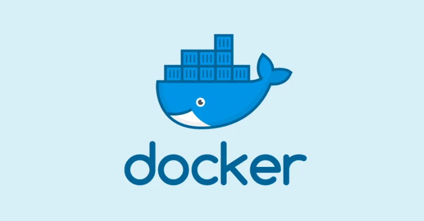

如果你是一名开发者，一定听过这句话："在我电脑上明明能跑啊！" 这个困扰了无数程序员的问题，Docker 给出了优雅的解决方案。本文将用最通俗的语言，带你从零开始掌握 Docker 和 Docker Compose。

---

## 第一部分：Docker 的前世今生

### 1. 软件部署的痛点

想象一下你要搬家，把所有家具搬到新房子。传统的方式是：

1. 把家具一件件拆开
2. 搬到新家
3. 重新组装
4. 发现少了几颗螺丝，柜子装不上了...

软件部署也是类似的痛苦：

**问题一：环境不一致**
- 开发环境：Windows + Python 3.8 + MySQL 5.7
- 测试环境：Ubuntu + Python 3.9 + MySQL 8.0
- 生产环境：CentOS + Python 3.7 + MySQL 5.6

结果就是：开发说"我这能跑"，运维说"上线就挂"。

**问题二：依赖地狱**
- 项目 A 需要 Node.js 14
- 项目 B 需要 Node.js 18
- 项目 C 需要 Node.js 16

同一台机器上，这三个项目怎么共存？

**问题三：资源浪费**
- 传统方式：每个应用一台虚拟机
- 一台虚拟机至少占用 1-2GB 内存
- 10 个应用 = 10 台虚拟机 = 10-20GB 内存

### 2. 虚拟化技术的演进

为了解决这些问题，技术不断进化：

**物理机时代（远古）**
- 一台服务器跑一个应用
- 资源利用率极低
- 扩展困难

**虚拟机时代（VMware、VirtualBox）**
- 一台物理机上运行多个虚拟机
- 每个虚拟机都有完整的操作系统
- 资源占用大，启动慢（分钟级）

**容器时代（Docker）**
- 共享宿主机内核
- 轻量级，启动快（秒级）
- 资源占用小

来看一个直观的对比：

```
┌─────────────────────────────────────────────────────────────────┐
│                     虚拟机 vs 容器 对比图                         │
├─────────────────────────────────┬───────────────────────────────┤
│         虚拟机架构               │          容器架构              │
├─────────────────────────────────┼───────────────────────────────┤
│  ┌─────┐ ┌─────┐ ┌─────┐       │  ┌─────┐ ┌─────┐ ┌─────┐     │
│  │App A│ │App B│ │App C│       │  │App A│ │App B│ │App C│     │
│  ├─────┤ ├─────┤ ├─────┤       │  ├─────┤ ├─────┤ ├─────┤     │
│  │Bins │ │Bins │ │Bins │       │  │Bins │ │Bins │ │Bins │     │
│  │Libs │ │Libs │ │Libs │       │  │Libs │ │Libs │ │Libs │     │
│  ├─────┤ ├─────┤ ├─────┤       │  └──┬──┘ └──┬──┘ └──┬──┘     │
│  │Guest│ │Guest│ │Guest│       │     └───────┼───────┘         │
│  │ OS  │ │ OS  │ │ OS  │       │      ┌──────┴──────┐          │
│  └──┬──┘ └──┬──┘ └──┬──┘       │      │   Docker    │          │
│     └───────┼───────┘          │      │   Engine    │          │
│      ┌──────┴──────┐           │      └──────┬──────┘          │
│      │ Hypervisor  │           │             │                  │
│      └──────┬──────┘           │      ┌──────┴──────┐          │
│      ┌──────┴──────┐           │      │   Host OS   │          │
│      │   Host OS   │           │      └──────┬──────┘          │
│      └──────┬──────┘           │      ┌──────┴──────┐          │
│      ┌──────┴──────┐           │      │  Hardware   │          │
│      │  Hardware   │           │      └─────────────┘          │
│      └─────────────┘           │                                │
├─────────────────────────────────┼───────────────────────────────┤
│  特点：                         │  特点：                        │
│  • 每个 VM 有完整 OS            │  • 共享宿主机内核               │
│  • 启动时间：分钟级             │  • 启动时间：秒级               │
│  • 内存占用：GB 级              │  • 内存占用：MB 级              │
│  • 隔离性：强                   │  • 隔离性：较强                 │
└─────────────────────────────────┴───────────────────────────────┘
```

### 3. Docker 的诞生

**2013 年**，一家名叫 dotCloud 的 PaaS 公司（后改名为 Docker Inc.）开源了他们的内部项目 Docker，从此改变了软件部署的世界。

**为什么 Docker 能成功？**

1. **标准化打包**：就像国际海运的集装箱，不管里面装什么货物，外面都是标准尺寸
2. **轻量级**：共享内核，秒级启动
3. **可移植性**："Build once, run anywhere"
4. **版本控制**：镜像可以像代码一样版本化管理
5. **生态丰富**：Docker Hub 上有海量现成的镜像

**Docker 的核心优势**

| 特性 | 传统部署 | Docker 部署 |
|------|---------|------------|
| 环境一致性 | 手动配置，容易出错 | 镜像保证完全一致 |
| 启动速度 | 分钟级 | 秒级 |
| 资源占用 | GB 级 | MB 级 |
| 隔离性 | 需要虚拟机 | 容器原生支持 |
| 扩展能力 | 复杂 | 简单，一行命令 |

---

## 第二部分：Docker 核心概念

### 4. 三大核心概念

用快递物流来类比，Docker 的三大核心概念就很好理解了：

```
┌──────────────────────────────────────────────────────────────┐
│                   Docker 三大核心概念                         │
├──────────────────────────────────────────────────────────────┤
│                                                              │
│   镜像 (Image)          容器 (Container)        仓库 (Registry)│
│   ┌─────────┐           ┌─────────┐            ┌─────────┐  │
│   │ 📦      │           │ 🚚      │            │ 🏭      │  │
│   │ 货物的   │  ──────>  │ 运输中的 │  <──────   │ 物流    │  │
│   │ 标准包装 │  实例化    │ 集装箱   │   存储     │ 仓库    │  │
│   └─────────┘           └─────────┘            └─────────┘  │
│                                                              │
│   • 只读模板             • 镜像的运行实例        • 存储和分发镜像│
│   • 包含运行环境          • 可以启动/停止        • 公有/私有    │
│   • 分层存储             • 有自己的文件系统       • Docker Hub  │
│                                                              │
└──────────────────────────────────────────────────────────────┘
```

**镜像（Image）—— 货物的标准包装**

- 镜像是一个只读模板，包含了运行应用所需的一切：代码、运行时、库、环境变量、配置文件
- 就像一个"快照"，记录了某个时刻的完整环境
- 可以基于一个镜像创建多个容器

**容器（Container）—— 运输中的集装箱**

- 容器是镜像的运行实例
- 每个容器都是相互隔离的，有自己的文件系统、网络、进程空间
- 容器可以被创建、启动、停止、删除
- 容器中的数据默认不会持久化（除非使用数据卷）

**仓库（Registry）—— 物流仓库**

- 用来存储和分发镜像
- Docker Hub 是最大的公共仓库，类似 GitHub
- 企业可以搭建私有仓库

### 5. Docker 架构

```
┌───────────────────────────────────────────────────────────────────┐
│                        Docker 架构图                               │
├───────────────────────────────────────────────────────────────────┤
│                                                                   │
│  Client (客户端)                      Docker Host (Docker 主机)    │
│  ┌─────────────────┐                 ┌───────────────────────────┐│
│  │ docker build    │                 │     Docker Daemon         ││
│  │ docker pull     │  ──REST API──>  │     (dockerd)             ││
│  │ docker run      │                 │  ┌─────────────────────┐  ││
│  └─────────────────┘                 │  │    Containers       │  ││
│                                      │  │ ┌───┐ ┌───┐ ┌───┐   │  ││
│                                      │  │ │ C │ │ C │ │ C │   │  ││
│                                      │  │ └───┘ └───┘ └───┘   │  ││
│                                      │  └─────────────────────┘  ││
│                                      │  ┌─────────────────────┐  ││
│                                      │  │      Images         │  ││
│                                      │  │ ┌───┐ ┌───┐ ┌───┐   │  ││
│                                      │  │ │ I │ │ I │ │ I │   │  ││
│                                      │  │ └───┘ └───┘ └───┘   │  ││
│                                      │  └─────────────────────┘  ││
│                                      └───────────────────────────┘│
│                                                    ▲               │
│                                                    │               │
│                                               pull/push            │
│                                                    │               │
│                                                    ▼               │
│                                      ┌───────────────────────────┐│
│                                      │       Registry            ││
│                                      │     (Docker Hub)          ││
│                                      │  ┌─────────────────────┐  ││
│                                      │  │ nginx, mysql, redis │  ││
│                                      │  │ node, python, ...   │  ││
│                                      │  └─────────────────────┘  ││
│                                      └───────────────────────────┘│
└───────────────────────────────────────────────────────────────────┘
```

**组件说明：**

- **Docker Client**：命令行工具，用户通过它与 Docker Daemon 交互
- **Docker Daemon (dockerd)**：后台服务，负责管理镜像、容器、网络、存储
- **Docker Registry**：镜像仓库，存储和分发镜像

---

## 第三部分：Docker 实战入门

### 6. 安装 Docker

#### macOS 安装

推荐使用 Docker Desktop：

1. 访问 [Docker 官网](https://www.docker.com/products/docker-desktop/)
2. 下载 Docker Desktop for Mac
3. 拖拽安装
4. 启动 Docker Desktop

或使用 Homebrew：

```bash
brew install --cask docker
```

#### Linux 安装（Ubuntu/Debian）

```bash
# 更新包索引
sudo apt-get update

# 安装依赖
sudo apt-get install ca-certificates curl gnupg

# 添加 Docker 官方 GPG 密钥
sudo install -m 0755 -d /etc/apt/keyrings
curl -fsSL https://download.docker.com/linux/ubuntu/gpg | sudo gpg --dearmor -o /etc/apt/keyrings/docker.gpg
sudo chmod a+r /etc/apt/keyrings/docker.gpg

# 添加仓库
echo \
  "deb [arch=$(dpkg --print-architecture) signed-by=/etc/apt/keyrings/docker.gpg] https://download.docker.com/linux/ubuntu \
  $(. /etc/os-release && echo "$VERSION_CODENAME") stable" | \
  sudo tee /etc/apt/sources.list.d/docker.list > /dev/null

# 安装 Docker Engine
sudo apt-get update
sudo apt-get install docker-ce docker-ce-cli containerd.io docker-buildx-plugin docker-compose-plugin

# 将当前用户加入 docker 组（避免每次 sudo）
sudo usermod -aG docker $USER
```

#### Linux 安装（CentOS/RHEL）

```bash
# 安装依赖
sudo yum install -y yum-utils

# 添加仓库
sudo yum-config-manager --add-repo https://download.docker.com/linux/centos/docker-ce.repo

# 安装 Docker Engine
sudo yum install docker-ce docker-ce-cli containerd.io docker-buildx-plugin docker-compose-plugin

# 启动 Docker
sudo systemctl start docker
sudo systemctl enable docker

# 将当前用户加入 docker 组
sudo usermod -aG docker $USER
```

#### Windows 安装

1. 确保已启用 WSL 2
2. 下载并安装 Docker Desktop for Windows
3. 在设置中启用 WSL 2 集成

#### 验证安装

```bash
# 查看版本
docker --version
# Docker version 24.0.7, build afdd53b

# 查看详细信息
docker info

# 运行测试容器
docker run hello-world
```

### 7. 第一个容器

让我们运行第一个容器：

```bash
docker run hello-world
```

**发生了什么？**

```
┌─────────────────────────────────────────────────────────────┐
│                docker run hello-world 执行流程               │
├─────────────────────────────────────────────────────────────┤
│                                                             │
│  1. Docker 客户端发送命令给 Docker Daemon                    │
│                    │                                        │
│                    ▼                                        │
│  2. Docker Daemon 检查本地是否有 hello-world 镜像            │
│                    │                                        │
│           ┌───────┴───────┐                                 │
│           │  本地有镜像？  │                                 │
│           └───────┬───────┘                                 │
│           No      │       Yes                               │
│           │       └────────────────┐                        │
│           ▼                        │                        │
│  3. 从 Docker Hub 拉取镜像          │                        │
│           │                        │                        │
│           └────────────────────────┤                        │
│                                    ▼                        │
│  4. 基于镜像创建容器                                         │
│                    │                                        │
│                    ▼                                        │
│  5. 运行容器，输出 Hello from Docker!                        │
│                    │                                        │
│                    ▼                                        │
│  6. 容器执行完毕，自动停止                                   │
│                                                             │
└─────────────────────────────────────────────────────────────┘
```

### 8. 镜像操作

#### 常用命令速查表

| 命令 | 说明 | 示例 |
|------|------|------|
| `docker images` | 列出本地镜像 | `docker images` |
| `docker pull` | 拉取镜像 | `docker pull nginx:latest` |
| `docker search` | 搜索镜像 | `docker search mysql` |
| `docker rmi` | 删除镜像 | `docker rmi nginx:latest` |
| `docker tag` | 给镜像打标签 | `docker tag nginx:latest myrepo/nginx:v1` |
| `docker build` | 构建镜像 | `docker build -t myapp:v1 .` |
| `docker push` | 推送镜像 | `docker push myrepo/myapp:v1` |

#### 实战示例

```bash
# 搜索 nginx 镜像
docker search nginx

# 拉取官方 nginx 镜像
docker pull nginx:latest

# 查看本地镜像
docker images

# 查看镜像详情
docker inspect nginx:latest

# 查看镜像历史（各层信息）
docker history nginx:latest

# 删除镜像
docker rmi nginx:latest
```

### 9. 容器操作

#### 常用命令速查表

| 命令 | 说明 | 示例 |
|------|------|------|
| `docker run` | 创建并启动容器 | `docker run -d nginx` |
| `docker ps` | 列出运行中的容器 | `docker ps` |
| `docker ps -a` | 列出所有容器 | `docker ps -a` |
| `docker start` | 启动已停止的容器 | `docker start container_id` |
| `docker stop` | 停止容器 | `docker stop container_id` |
| `docker restart` | 重启容器 | `docker restart container_id` |
| `docker rm` | 删除容器 | `docker rm container_id` |
| `docker exec` | 在容器中执行命令 | `docker exec -it container_id bash` |
| `docker logs` | 查看容器日志 | `docker logs -f container_id` |

#### 实战示例

```bash
# 运行一个 nginx 容器
# -d: 后台运行
# -p: 端口映射 (宿主机端口:容器端口)
# --name: 容器名称
docker run -d -p 8080:80 --name my-nginx nginx

# 查看运行中的容器
docker ps

# 查看容器日志
docker logs my-nginx

# 实时查看日志
docker logs -f my-nginx

# 进入容器内部
docker exec -it my-nginx bash

# 在容器中执行命令
docker exec my-nginx cat /etc/nginx/nginx.conf

# 停止容器
docker stop my-nginx

# 启动容器
docker start my-nginx

# 删除容器（需要先停止）
docker stop my-nginx && docker rm my-nginx

# 强制删除运行中的容器
docker rm -f my-nginx
```

#### docker run 常用参数

```bash
docker run [OPTIONS] IMAGE [COMMAND] [ARG...]

# 常用 OPTIONS
-d, --detach          # 后台运行
-p, --publish         # 端口映射，格式：宿主机端口:容器端口
-v, --volume          # 挂载数据卷，格式：宿主机路径:容器路径
-e, --env             # 设置环境变量
--name                # 容器名称
--restart             # 重启策略：no, on-failure, always, unless-stopped
--network             # 指定网络
-it                   # 交互式终端（-i 保持 STDIN 打开，-t 分配伪终端）
--rm                  # 容器停止后自动删除
```

### 10. 数据持久化

容器默认是无状态的，容器删除后数据就丢失了。Docker 提供两种数据持久化方式：

#### 数据卷（Volume）

由 Docker 管理的持久化存储，推荐使用。

```bash
# 创建数据卷
docker volume create my-data

# 查看数据卷
docker volume ls

# 使用数据卷
docker run -d \
  --name mysql-db \
  -v my-data:/var/lib/mysql \
  -e MYSQL_ROOT_PASSWORD=123456 \
  mysql:8.0

# 查看数据卷详情
docker volume inspect my-data

# 删除数据卷
docker volume rm my-data

# 删除未使用的数据卷
docker volume prune
```

#### 挂载目录（Bind Mount）

将宿主机目录挂载到容器中。

```bash
# 挂载当前目录到容器
docker run -d \
  --name nginx-web \
  -p 8080:80 \
  -v $(pwd)/html:/usr/share/nginx/html \
  nginx

# 只读挂载（容器无法修改）
docker run -d \
  --name nginx-web \
  -p 8080:80 \
  -v $(pwd)/html:/usr/share/nginx/html:ro \
  nginx
```

#### 数据卷 vs 挂载目录

| 特性 | 数据卷 (Volume) | 挂载目录 (Bind Mount) |
|------|----------------|---------------------|
| 管理方式 | Docker 管理 | 用户管理 |
| 存储位置 | Docker 目录下 | 任意宿主机目录 |
| 可移植性 | 高 | 依赖宿主机路径 |
| 适用场景 | 数据持久化 | 配置文件、代码共享 |

### 11. 网络配置

Docker 提供多种网络模式：

#### 网络模式

| 模式 | 说明 |
|------|------|
| bridge | 默认模式，容器通过虚拟网桥连接 |
| host | 容器直接使用宿主机网络 |
| none | 禁用网络 |
| container | 与其他容器共享网络 |

#### 常用命令

```bash
# 查看网络列表
docker network ls

# 创建自定义网络
docker network create my-network

# 运行容器时指定网络
docker run -d --name app --network my-network nginx

# 将容器连接到网络
docker network connect my-network container_name

# 查看网络详情
docker network inspect my-network

# 删除网络
docker network rm my-network
```

#### 容器间通信

在同一网络中的容器可以通过容器名互相访问：

```bash
# 创建网络
docker network create app-network

# 启动 MySQL
docker run -d \
  --name mysql \
  --network app-network \
  -e MYSQL_ROOT_PASSWORD=123456 \
  mysql:8.0

# 启动应用，可以通过 "mysql" 这个名字访问数据库
docker run -d \
  --name app \
  --network app-network \
  -e DATABASE_HOST=mysql \
  my-app
```

---

## 第四部分：Dockerfile 精讲

### 12. 什么是 Dockerfile

Dockerfile 是一个文本文件，包含了构建 Docker 镜像的所有指令。就像是镜像的"菜谱"，告诉 Docker 如何一步步构建出你需要的镜像。

```dockerfile
# 这是一个简单的 Dockerfile 示例
FROM node:18-alpine
WORKDIR /app
COPY package*.json ./
RUN npm install
COPY . .
EXPOSE 3000
CMD ["node", "app.js"]
```

### 13. 常用指令详解

#### FROM - 基础镜像

每个 Dockerfile 必须以 FROM 开始，指定基础镜像：

```dockerfile
# 使用官方 Node.js 镜像
FROM node:18-alpine

# 使用官方 Python 镜像
FROM python:3.11-slim

# 使用最小化镜像
FROM alpine:3.18

# 从零开始构建
FROM scratch
```

#### RUN - 执行命令

在镜像构建过程中执行命令：

```dockerfile
# Shell 格式
RUN apt-get update && apt-get install -y curl

# Exec 格式
RUN ["apt-get", "install", "-y", "curl"]

# 多行命令（推荐，减少层数）
RUN apt-get update && \
    apt-get install -y \
    curl \
    vim \
    git && \
    rm -rf /var/lib/apt/lists/*
```

#### COPY vs ADD

```dockerfile
# COPY - 简单复制文件
COPY package.json /app/
COPY . /app/

# ADD - 额外支持解压和远程 URL（不推荐，建议用 COPY）
ADD archive.tar.gz /app/
ADD https://example.com/file.txt /app/
```

**建议：** 优先使用 COPY，更明确、更可预测。

#### WORKDIR - 工作目录

```dockerfile
WORKDIR /app
# 后续命令都在 /app 目录下执行
```

#### ENV - 环境变量

```dockerfile
ENV NODE_ENV=production
ENV APP_PORT=3000

# 多个环境变量
ENV NODE_ENV=production \
    APP_PORT=3000
```

#### EXPOSE - 声明端口

```dockerfile
# 声明容器监听的端口（仅作文档用途）
EXPOSE 3000
EXPOSE 80 443
```

注意：EXPOSE 不会自动发布端口，运行时仍需 `-p` 参数。

#### CMD vs ENTRYPOINT

这是最容易混淆的两个指令：

```dockerfile
# CMD - 容器启动时执行的默认命令（可被覆盖）
CMD ["node", "app.js"]
CMD ["npm", "start"]

# ENTRYPOINT - 容器启动时执行的固定命令（不易被覆盖）
ENTRYPOINT ["python", "app.py"]
```

**区别对比：**

| 场景 | CMD | ENTRYPOINT |
|------|-----|------------|
| 被 docker run 参数覆盖 | 完全覆盖 | 参数追加 |
| 适用场景 | 默认命令，可灵活覆盖 | 固定入口，参数化执行 |

**最佳实践 - 组合使用：**

```dockerfile
ENTRYPOINT ["python", "app.py"]
CMD ["--port", "8080"]

# docker run myapp                  -> python app.py --port 8080
# docker run myapp --port 3000      -> python app.py --port 3000
```

#### 多阶段构建

减小最终镜像体积的利器：

```dockerfile
# 第一阶段：构建
FROM node:18 AS builder
WORKDIR /app
COPY package*.json ./
RUN npm install
COPY . .
RUN npm run build

# 第二阶段：运行
FROM node:18-alpine
WORKDIR /app
# 只复制构建产物
COPY --from=builder /app/dist ./dist
COPY --from=builder /app/package*.json ./
RUN npm install --production
EXPOSE 3000
CMD ["node", "dist/index.js"]
```

### 14. Dockerfile 最佳实践

#### 减小镜像体积

```dockerfile
# 1. 使用 alpine 基础镜像
FROM node:18-alpine  # 而不是 node:18

# 2. 多阶段构建（见上文）

# 3. 合并 RUN 命令，清理缓存
RUN apt-get update && \
    apt-get install -y curl && \
    rm -rf /var/lib/apt/lists/*

# 4. 使用 .dockerignore 排除不需要的文件
```

**.dockerignore 示例：**

```
node_modules
npm-debug.log
.git
.gitignore
README.md
.env
*.md
```

#### 利用构建缓存

把不常变化的指令放前面：

```dockerfile
FROM node:18-alpine
WORKDIR /app

# 先复制 package.json（不常变化）
COPY package*.json ./
RUN npm install

# 再复制源代码（经常变化）
COPY . .

RUN npm run build
```

#### 安全性考虑

```dockerfile
# 1. 不使用 root 用户运行
FROM node:18-alpine
RUN addgroup -S appgroup && adduser -S appuser -G appgroup
USER appuser

# 2. 不在镜像中存储敏感信息
# 使用环境变量或密钥管理工具

# 3. 使用特定版本标签，而不是 latest
FROM node:18.19.0-alpine  # 而不是 node:latest
```

---

## 第五部分：Docker Compose 完全指南

### 15. 为什么需要 Docker Compose

当你的应用需要多个容器协同工作时（比如 Web 应用 + 数据库 + 缓存），手动管理变得很痛苦：

```bash
# 手动管理多个容器的噩梦
docker network create myapp
docker run -d --name mysql --network myapp -e MYSQL_ROOT_PASSWORD=123456 mysql:8.0
docker run -d --name redis --network myapp redis:alpine
docker run -d --name app --network myapp -p 3000:3000 -e DB_HOST=mysql -e REDIS_HOST=redis myapp
```

Docker Compose 让你用一个 YAML 文件定义和运行多容器应用，一条命令搞定一切。

### 16. Docker Compose 基础

#### 安装

Docker Desktop 已内置 Docker Compose。Linux 用户如果单独安装 Docker Engine，Compose 插件已包含在内。

验证安装：

```bash
docker compose version
```

#### docker-compose.yml 基本结构

```yaml
# 版本声明（可选，新版本可省略）
version: "3.8"

# 服务定义
services:
  web:
    image: nginx:alpine
    ports:
      - "80:80"

  db:
    image: mysql:8.0
    environment:
      MYSQL_ROOT_PASSWORD: 123456

# 网络定义（可选）
networks:
  default:
    driver: bridge

# 数据卷定义（可选）
volumes:
  db-data:
```

### 17. 核心配置项详解

#### services - 服务定义

```yaml
services:
  # 服务名称
  app:
    # 使用镜像
    image: node:18-alpine

    # 或者构建
    build:
      context: .
      dockerfile: Dockerfile

    # 容器名称
    container_name: my-app

    # 端口映射
    ports:
      - "3000:3000"      # 宿主机端口:容器端口
      - "3001:3001"

    # 环境变量
    environment:
      - NODE_ENV=production
      - DB_HOST=mysql
    # 或从文件加载
    env_file:
      - .env

    # 数据卷挂载
    volumes:
      - ./src:/app/src        # 挂载目录
      - node_modules:/app/node_modules  # 命名卷

    # 依赖关系
    depends_on:
      - mysql
      - redis

    # 重启策略
    restart: unless-stopped

    # 网络
    networks:
      - app-network

    # 资源限制
    deploy:
      resources:
        limits:
          cpus: '0.5'
          memory: 512M
```

#### networks - 网络配置

```yaml
services:
  app:
    networks:
      - frontend
      - backend

networks:
  frontend:
    driver: bridge
  backend:
    driver: bridge
    internal: true  # 内部网络，无法访问外部
```

#### volumes - 数据卷

```yaml
services:
  mysql:
    volumes:
      - db-data:/var/lib/mysql

volumes:
  db-data:
    driver: local
```

#### 完整配置示例

```yaml
version: "3.8"

services:
  app:
    build: .
    container_name: my-app
    ports:
      - "3000:3000"
    environment:
      NODE_ENV: production
      DB_HOST: mysql
      DB_PORT: 3306
      DB_NAME: myapp
      REDIS_HOST: redis
    depends_on:
      mysql:
        condition: service_healthy
      redis:
        condition: service_started
    volumes:
      - ./logs:/app/logs
    networks:
      - app-network
    restart: unless-stopped

  mysql:
    image: mysql:8.0
    container_name: mysql-db
    environment:
      MYSQL_ROOT_PASSWORD: ${MYSQL_ROOT_PASSWORD:-123456}
      MYSQL_DATABASE: myapp
    volumes:
      - mysql-data:/var/lib/mysql
      - ./init.sql:/docker-entrypoint-initdb.d/init.sql
    networks:
      - app-network
    healthcheck:
      test: ["CMD", "mysqladmin", "ping", "-h", "localhost"]
      interval: 10s
      timeout: 5s
      retries: 5
    restart: unless-stopped

  redis:
    image: redis:7-alpine
    container_name: redis-cache
    volumes:
      - redis-data:/data
    networks:
      - app-network
    restart: unless-stopped

networks:
  app-network:
    driver: bridge

volumes:
  mysql-data:
  redis-data:
```

### 18. 常用命令

| 命令 | 说明 |
|------|------|
| `docker compose up` | 创建并启动所有服务 |
| `docker compose up -d` | 后台运行 |
| `docker compose down` | 停止并删除所有容器 |
| `docker compose down -v` | 同时删除数据卷 |
| `docker compose ps` | 查看服务状态 |
| `docker compose logs` | 查看日志 |
| `docker compose logs -f app` | 实时查看指定服务日志 |
| `docker compose exec app bash` | 进入容器 |
| `docker compose build` | 构建镜像 |
| `docker compose build --no-cache` | 不使用缓存构建 |
| `docker compose restart` | 重启所有服务 |
| `docker compose stop` | 停止服务（不删除） |
| `docker compose start` | 启动已停止的服务 |
| `docker compose pull` | 拉取最新镜像 |

---

## 第六部分：实战案例

### 19. 案例一：搭建 Nginx 静态网站

最简单的入门案例：

**目录结构：**

```
project/
├── docker-compose.yml
└── html/
    └── index.html
```

**docker-compose.yml：**

```yaml
version: "3.8"

services:
  nginx:
    image: nginx:alpine
    container_name: nginx-web
    ports:
      - "80:80"
    volumes:
      - ./html:/usr/share/nginx/html:ro
    restart: unless-stopped
```

**html/index.html：**

```html
<!DOCTYPE html>
<html>
<head>
    <title>Hello Docker</title>
</head>
<body>
    <h1>Hello from Docker!</h1>
</body>
</html>
```

**运行：**

```bash
docker compose up -d
# 访问 http://localhost
```

### 20. 案例二：部署 WordPress 博客

**docker-compose.yml：**

```yaml
version: "3.8"

services:
  wordpress:
    image: wordpress:latest
    container_name: wordpress
    ports:
      - "8080:80"
    environment:
      WORDPRESS_DB_HOST: mysql
      WORDPRESS_DB_USER: wordpress
      WORDPRESS_DB_PASSWORD: wordpress_password
      WORDPRESS_DB_NAME: wordpress
    volumes:
      - wordpress-data:/var/www/html
    depends_on:
      mysql:
        condition: service_healthy
    networks:
      - wp-network
    restart: unless-stopped

  mysql:
    image: mysql:8.0
    container_name: wordpress-db
    environment:
      MYSQL_ROOT_PASSWORD: root_password
      MYSQL_DATABASE: wordpress
      MYSQL_USER: wordpress
      MYSQL_PASSWORD: wordpress_password
    volumes:
      - mysql-data:/var/lib/mysql
    networks:
      - wp-network
    healthcheck:
      test: ["CMD", "mysqladmin", "ping", "-h", "localhost"]
      interval: 10s
      timeout: 5s
      retries: 5
    restart: unless-stopped

networks:
  wp-network:
    driver: bridge

volumes:
  wordpress-data:
  mysql-data:
```

**运行：**

```bash
docker compose up -d
# 访问 http://localhost:8080 完成 WordPress 安装
```

### 21. 案例三：Node.js + MySQL + Redis 开发环境

**目录结构：**

```
project/
├── docker-compose.yml
├── .env
├── Dockerfile
├── package.json
└── src/
    └── index.js
```

**docker-compose.yml：**

```yaml
version: "3.8"

services:
  app:
    build: .
    container_name: node-app
    ports:
      - "3000:3000"
    environment:
      NODE_ENV: development
      DB_HOST: mysql
      DB_PORT: 3306
      DB_NAME: ${DB_NAME:-myapp}
      DB_USER: ${DB_USER:-root}
      DB_PASSWORD: ${DB_PASSWORD:-123456}
      REDIS_HOST: redis
      REDIS_PORT: 6379
    volumes:
      - ./src:/app/src          # 热重载：源码挂载
      - /app/node_modules       # 保护 node_modules
    depends_on:
      mysql:
        condition: service_healthy
      redis:
        condition: service_started
    networks:
      - dev-network
    restart: unless-stopped

  mysql:
    image: mysql:8.0
    container_name: mysql-db
    ports:
      - "3306:3306"  # 开发时方便本地连接
    environment:
      MYSQL_ROOT_PASSWORD: ${DB_PASSWORD:-123456}
      MYSQL_DATABASE: ${DB_NAME:-myapp}
    volumes:
      - mysql-data:/var/lib/mysql
    networks:
      - dev-network
    healthcheck:
      test: ["CMD", "mysqladmin", "ping", "-h", "localhost"]
      interval: 10s
      timeout: 5s
      retries: 5
    restart: unless-stopped

  redis:
    image: redis:7-alpine
    container_name: redis-cache
    ports:
      - "6379:6379"  # 开发时方便本地连接
    volumes:
      - redis-data:/data
    networks:
      - dev-network
    restart: unless-stopped

networks:
  dev-network:
    driver: bridge

volumes:
  mysql-data:
  redis-data:
```

**Dockerfile：**

```dockerfile
FROM node:18-alpine

WORKDIR /app

# 安装依赖
COPY package*.json ./
RUN npm install

# 复制源码
COPY . .

EXPOSE 3000

# 开发模式使用 nodemon 热重载
CMD ["npm", "run", "dev"]
```

**.env：**

```
DB_NAME=myapp
DB_USER=root
DB_PASSWORD=123456
```

### 22. 案例四：企业级日志收集系统（Loki + Grafana）

相比 ELK，Loki + Grafana 更轻量，适合中小规模项目。

**docker-compose.yml：**

```yaml
version: "3.8"

services:
  # 日志聚合
  loki:
    image: grafana/loki:2.9.0
    container_name: loki
    ports:
      - "3100:3100"
    volumes:
      - ./loki-config.yml:/etc/loki/local-config.yaml
      - loki-data:/loki
    command: -config.file=/etc/loki/local-config.yaml
    networks:
      - monitoring
    restart: unless-stopped

  # 日志收集代理
  promtail:
    image: grafana/promtail:2.9.0
    container_name: promtail
    volumes:
      - ./promtail-config.yml:/etc/promtail/config.yml
      - /var/log:/var/log:ro
      - /var/lib/docker/containers:/var/lib/docker/containers:ro
    command: -config.file=/etc/promtail/config.yml
    networks:
      - monitoring
    restart: unless-stopped

  # 可视化面板
  grafana:
    image: grafana/grafana:10.0.0
    container_name: grafana
    ports:
      - "3000:3000"
    environment:
      - GF_SECURITY_ADMIN_USER=admin
      - GF_SECURITY_ADMIN_PASSWORD=admin123
    volumes:
      - grafana-data:/var/lib/grafana
    depends_on:
      - loki
    networks:
      - monitoring
    restart: unless-stopped

  # 示例应用（产生日志）
  app:
    image: nginx:alpine
    container_name: demo-app
    ports:
      - "80:80"
    logging:
      driver: json-file
      options:
        max-size: "10m"
        max-file: "3"
    networks:
      - monitoring
    restart: unless-stopped

networks:
  monitoring:
    driver: bridge

volumes:
  loki-data:
  grafana-data:
```

**loki-config.yml：**

```yaml
auth_enabled: false

server:
  http_listen_port: 3100

ingester:
  lifecycler:
    ring:
      kvstore:
        store: inmemory
      replication_factor: 1
  chunk_idle_period: 5m
  chunk_retain_period: 30s

schema_config:
  configs:
    - from: 2020-10-24
      store: boltdb-shipper
      object_store: filesystem
      schema: v11
      index:
        prefix: index_
        period: 24h

storage_config:
  boltdb_shipper:
    active_index_directory: /loki/index
    cache_location: /loki/cache
    shared_store: filesystem
  filesystem:
    directory: /loki/chunks

limits_config:
  enforce_metric_name: false
  reject_old_samples: true
  reject_old_samples_max_age: 168h

chunk_store_config:
  max_look_back_period: 0s

table_manager:
  retention_deletes_enabled: false
  retention_period: 0s
```

**promtail-config.yml：**

```yaml
server:
  http_listen_port: 9080
  grpc_listen_port: 0

positions:
  filename: /tmp/positions.yaml

clients:
  - url: http://loki:3100/loki/api/v1/push

scrape_configs:
  - job_name: containers
    static_configs:
      - targets:
          - localhost
        labels:
          job: containerlogs
          __path__: /var/lib/docker/containers/*/*log
    pipeline_stages:
      - json:
          expressions:
            output: log
            stream: stream
            time: time
      - output:
          source: output
```

---

## 第七部分：进阶与最佳实践

### 23. 生产环境注意事项

#### 资源限制

```yaml
services:
  app:
    deploy:
      resources:
        limits:
          cpus: '1.0'
          memory: 1G
        reservations:
          cpus: '0.5'
          memory: 512M
```

#### 日志管理

```yaml
services:
  app:
    logging:
      driver: json-file
      options:
        max-size: "100m"   # 单个日志文件最大
        max-file: "5"      # 保留文件数量
```

#### 安全加固

```yaml
services:
  app:
    # 以非 root 用户运行
    user: "1000:1000"

    # 只读文件系统
    read_only: true

    # 临时文件目录
    tmpfs:
      - /tmp

    # 安全选项
    security_opt:
      - no-new-privileges:true
```

### 24. 常见问题排查

#### 容器无法启动

```bash
# 查看容器日志
docker logs container_name

# 查看详细信息
docker inspect container_name

# 常见原因：
# 1. 端口冲突
# 2. 数据卷权限问题
# 3. 依赖服务未就绪
```

#### 网络不通

```bash
# 检查网络
docker network ls
docker network inspect network_name

# 测试容器间连通性
docker exec container1 ping container2

# 常见原因：
# 1. 容器不在同一网络
# 2. 服务名拼写错误
# 3. 端口未暴露
```

#### 磁盘空间不足

```bash
# 查看磁盘使用
docker system df

# 清理未使用资源
docker system prune

# 清理所有（包括未使用的镜像）
docker system prune -a

# 清理数据卷
docker volume prune
```

### 25. Docker 生态与未来

#### Kubernetes 简介

当容器数量达到一定规模（几十到上百），Docker Compose 就不够用了。Kubernetes（K8s）是容器编排的事实标准：

- 自动扩缩容
- 服务发现与负载均衡
- 滚动更新与回滚
- 自我修复

#### Docker Swarm

Docker 原生的编排工具，比 K8s 简单：

```bash
# 初始化 Swarm
docker swarm init

# 部署服务
docker stack deploy -c docker-compose.yml myapp
```

#### 云原生趋势

- **容器运行时**：containerd、CRI-O 等逐渐替代 Docker Engine
- **无服务器容器**：AWS Fargate、Google Cloud Run
- **服务网格**：Istio、Linkerd

---

## 总结

恭喜你完成了 Docker 和 Docker Compose 的学习之旅！让我们回顾一下核心要点：

**Docker 核心概念：**
- **镜像**：应用的标准打包方式
- **容器**：镜像的运行实例
- **仓库**：镜像的存储和分发中心

**Docker Compose 价值：**
- 用 YAML 文件定义多容器应用
- 一条命令启动整个应用栈
- 简化开发、测试、部署流程

**最佳实践：**
- 使用多阶段构建减小镜像体积
- 使用 .dockerignore 排除不需要的文件
- 合理利用构建缓存
- 生产环境设置资源限制和日志策略

**学习资源：**
- [Docker 官方文档](https://docs.docker.com/)
- [Docker Hub](https://hub.docker.com/)
- [Compose 文件参考](https://docs.docker.com/compose/compose-file/)

容器技术已经成为现代软件开发的标配。掌握 Docker，你就掌握了通往云原生世界的钥匙。

---

## 相关文章

- [Docker 入门指南：核心概念、安装配置与容器化实践](/posts/docker/2019-05-13-learn-docker/) - Docker 基础概念与入门教程
- [Docker 常用命令速查手册](/posts/docker/2019-11-14-docker-commands/) - 日常开发必备命令参考
- [使用 Nexus3 搭建 Docker 私有镜像仓库](/posts/docker/2019-06-12-next3-dockerhub/) - 企业级私有仓库搭建方案

---

*如果这篇文章对你有帮助，欢迎分享给更多的朋友！*
