## 一、背景

1995年SUN 公司推出，最早叫 Oak(橡树)，后改名叫 Java，Java之父詹姆斯（James），SUN 在2009年被 ORACLE收购。

## 二、整体学习路线


Java 技术体系（JAVA SE、JAVA EE、JAVA ME）。
Java基本啥都能干，但主要做互联网系统的开发.

## 三、JDK 


javac：编译工具

java ：执行工具

JVM(Java Virtual Machine)：Java 虚拟机，真正运行 Java程序的地方
核心类库：Java 自己写好的程序

JRE（Java Runtime Environment）:Java的运行环境

JDK(Java Development Kit): Java开发工具包(包含上面所有)

## 四、IDE IDEA


IDEA几种常见的快捷键，以及他们的作用

| **快捷键**                        | **功能效果**                     |
| --------------------------------- | -------------------------------- |
| main/psvm、sout、…                | 快速键入相关代码                 |
| Ctrl + D                          | 复制当前行数据到下一行           |
| Ctrl + Y                          | 删除所在行，建议用Ctrl + X       |
| Ctrl + ALT + L                    | 格式化代码                       |
| ALT + SHIFT + ↑ , ALT + SHIFT + ↓ | 上下移动当前代码                 |
| Ctrl + / , Ctrl + Shift + /       | 对代码进行注释(讲注释的时候再说) |


## 五、基础语法

### 1 字面量

字面量其实就是告诉程序员数据在程序中的书写格式


### 2 变量

**定义：** 变量是用来记录程序中的数据的。其本质上是内存中的一块区域，你可以把这块区域理解成一个小盒子，盒子里放的东西就是变量记录的数据。

**格式：** `数据类型 变量名 = 初始值;`

**作用：** 使用变量来记录数据，对于数据的管理更为灵活。

### 3 关键字

关键字是java语言中有特殊含义的单词

| **abstract**   | **assert**       | **boolean**   | **break**      | **byte**   |
| -------------- | ---------------- | ------------- | -------------- | ---------- |
| **case**       | **catch**        | **char**      | **class**      | **const**  |
| **continue**   | **default**      | **do**        | **double**     | **else**   |
| **enum**       | **extends**      | **final**     | **finally**    | **float**  |
| **for**        | **goto**         | **if**        | **implements** | **import** |
| **instanceof** | **int**          | **interface** | **long**       | **native** |
| **new**        | **package**      | **private**   | **protected**  | **public** |
| **return**     | **strictfp**     | **short**     | **static**     | **super**  |
| **switch**     | **synchronized** | **this**      | **throw**      | **throws** |
| **transient**  | **try**          | **void**      | **volatile**   | **while**  |

### 4 标识符

标志符其实就是我们自己取的名字。像前面我们取的类名，变量名其实都是标志符。

### 5 二进制

**变量里的数据在计算机中的存储原理**：任何数据在计算机中都是以**二进制**表示。整数先转成二进制再存储

字符怎么存储的呢？只需要将字符映射到整数，就可以用二进制表示了，所以需要一个字符数字映射表（字符<----->数字），就是大家经常听到的美国ASCII编码，中文GBK编码等

图片怎么存储呢？图片无限放大后可以看到像素点，每一个像素点就是一种颜色，任何一种颜色用三原色RGB表示(R红色，G绿色，B蓝色)，R、G、B种每一种颜色用一个字节的整数表示，取值范围[0,255]，转成整数后再转成二进制存储。、

声音怎么存储呢？声音以波的形式传播，把声波在表示在一个坐标系上，然后在坐标系上取一些点，把这些点的坐标值以二进制的形式存储到计算机中，这就是声音的存储原理


视频怎么存储呢？视频是图片和声音组成，按上面讲的图片和声音存储原理理解。

**十进制转二进制 、二进制转十进制**，有一种计算方式8421码，请注意。


**八进制、十六进制**


计算机的数据单位最小组成单元：字节，1B = 8b，1个字节等于8位

在B基础上发展出来KB、MB、GB、TB单位


### 6 数据类型

Java的数据类型整体上来说分为两大类： **基本数据类型**、**引用数据类型**


自动类型转换指的是，数据范围小的变量可以直接赋值给数据范围大的变量

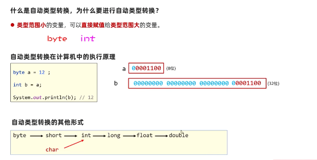

### 7 运算符

Java提供的运算符有很多种，主要有下面几种：

- 基本算术运算符

  

  `+`符号除了用于加法运算，还可以作为连接符

- 自增自减运算符

  `++`读作自增，`--`读作自减； 运算规则如下

  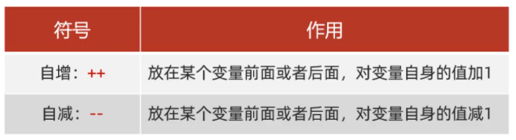

```
1.单独使用：++或者--放在变量前面没有区别
	   int a =10; 
	    a++;  //11
		--a;  //10
		System.out.println(a); //10

2.混合使用：++或者--放在变量或者前面运算规则稍有不通过
	//++在后：先做其他事情，再做自增和自减
	int a = 10;
	int b = a++; //等价于 int b = a; a++; 

	//++在前：先自增或者自减，再做其他运输
	int x = 10;
	int y = --x; //等价于x--; int y = x;  
```

- 赋值运算符

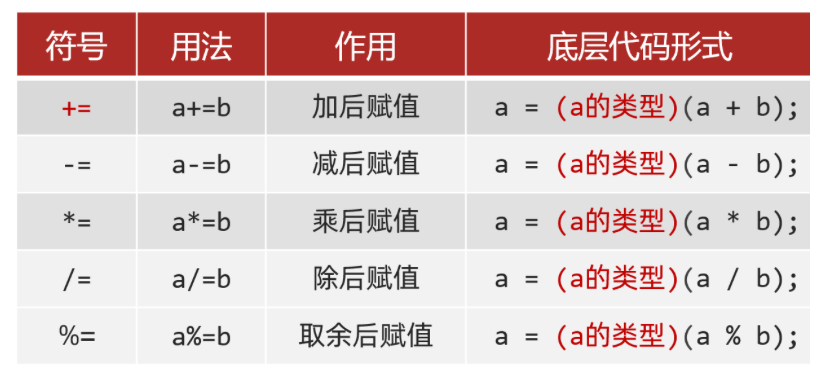

- 关系运算符

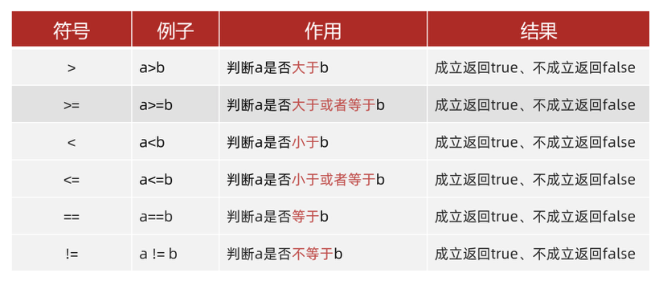

- 逻辑运算符

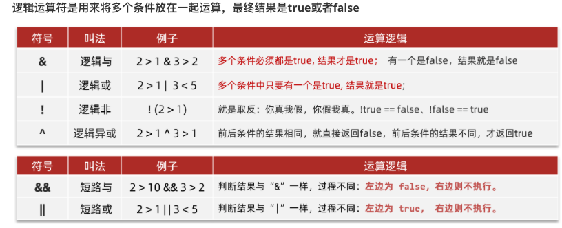

- 三元运算符

三元运算符的格式：`关系表达式? 值1 : 值2;`

### 8 程序流程控制

程序的流程控制一般分为3种：**顺序结构、分支结构、循环结构**

- 顺序结构：就是不加任何控制，代码从main方法开始自上而下执行
- 分支结构：就是根据条件判断是true还是false，有选择性的执行哪些代码。在Java语言中提供了两个格式if 、 switch

如果单从功能上来讲，if 分支 的功能是更加强大的，switch分支能做的事情if 分支都能做。但是具体用哪一种分支形式，也是有一些使用原则的.

```
- 如果是对一个范围进行判断，建议使用if分支结构
- 如果是与一个一个的值比较的时候，建议使用switch分支结构
```

- 循环结构：就是控制某一段代码重复执行。在Java语言中提供了三种格式，for、while、do-while

### 9 数组

数组就是一个容器，用来存一批同种类型的数据的。数组有两种初始化的方式，一种是静态初始化、一种是动态初始化

**静态初始化**标准格式： `数据类型[] 变量名 = new 数据类型[]{元素1,元素2,元素3};`

```
//定义数组，用来存储多个年龄
int[] ages = new int[]{12, 24, 36}
//定义数组，用来存储多个成绩
double[] scores = new double[]{89.9, 99.5, 59.5, 88.0};
```

静态初始化简化格式: `数据类型[] 变量名 = {元素1,元素2,元素3};`

```
//定义数组，用来存储多个年龄
int[] ages = {12, 24, 36}
//定义数组，用来存储多个成绩
double[] scores = {89.9, 99.5, 59.5, 88.0};
```

**注意**定义数组时， `数据类型[] 数组名` 也可写成 `数据类型 数组名[]` 

```
//以下两种写法是等价的。但是建议大家用第一种，因为这种写法更加普遍
int[] ages = {12, 24, 36};
int ages[] = {12, 24, 36}
```

**动态初始化**格式:`//数据类型[]  数组名 = new 数据类型[长度];`,例如`int[] arr = new int[3];`

使用动态初始化定义数组时，根据元素类型不同，默认值也有所不同。


**数组在计算机中的执行原理**

程序在内存中执行,Java程序是把编译后的字节码加载到Java虚拟机中执行.


```
public class ArrayDemo1 {
    public static void main(String[] args) {
        int a = 10;
        System.out.println(a);

        int[] arr = new int[]{11, 22, 33};
        System.out.println(arr);

        System.out.println(arr[1]);

        arr[0] = 44;
        arr[1] = 55;
        arr[2] = 66;

        System.out.println(arr[0]);
        System.out.println(arr[1]);
        System.out.println(arr[2]);
    }
}
```

Java为了便于虚拟机执行Java程序，将虚拟机的内存划分为 **方法区、栈、堆**、本地方法栈、寄存器 这5块区域,每部分存储内容如下：

- **方法区**：字节码文件先加载到这里
- **栈**：方法运行时所进入的内存区域，由于变量在方法中，所以变量也在这一块区域中
- **堆**：存储new出来的东西，并分配地址。由于数组是new 出来的，所以数组也在这块区域。

上面案例执行的内存原理如下图所示，按照① ② ③ ④ ⑤ ⑥ 的标记的顺序来看


**总结一下`int a = 10`与 `int[] arr = new int[]{11,22,33}的区别`**

- **a**是一个变量，在栈内存中，**a**变量中存储的数据就是**10**这个值。
- **arr**也是一个变量，在栈中，存储的是数组对象在堆内存中的地址值

```
// 这里的int a是一个基本类型变量，存储的是一个数值
int a = 10 ; 
//这里的int[] arr是一个引用类型的变量，存储的是一个地址值
int[] arr = new int[]{44,55,66};
```

### 10 方法

方法是一种语法结构，它可以把一段代码封装成一个功能，以便重复调用。格式:


例如:

```
//目标：掌握定义方法的完整格式，搞清楚使用方法的好处。
public class MethodDemo1 {
    public static void main(String[] args) {
        // 需求：假如现在很多程序员都要进行2个整数求和的操作。
        // 1、李工。
        int rs = sum(10, 20);
        System.out.println("和是：" + rs);

        // 2、张工。
        int rs2 = sum(30, 20);
        System.out.println("和是：" + rs2);
    }

    public static int sum(int a,int b) {
        int c = a + b;
        return c;
    }
}
```

方法的好处，可以归纳为2点：

- 提高了代码的复用性，提高了开发效率。
- 让程序的逻辑更清晰。

**方法在计算机中的执行原理**

Java的方法是在栈内存区域中执行，**每次调用方法，方法都会进栈执行；执行完后，又会弹栈出去。**先进后出

假设在main方法中依次调用A方法、B方法、C方法，在内存中的执行流程如下：


**Java的参数传递机制都是：值传递，传递的是实参存储的值的副本。**

基本类型和引用类型的参数在传递的时候有什么不同？

- 都是值传递
- 基本类型的参数传递存储的数据值。
- 引用类型的参数传递存储的地址值。（String,Array都是引用类型）

**方法重载**

定义：一个类中，多个方法的名称相同，但它们形参列表不同。

```
public class MethodOverLoadDemo1 {
    public static void main(String[] args) {
        // 目标：认识方法重载，并掌握其应用场景。
        test();
        test(100);
    }

    public static void test(){
        System.out.println("===test1===");
    }

    public static void test(int a){
        System.out.println("===test2===" + a);
    }

    void test(double a){

    }

    void test(double a, int b){
    }

    void test(int b, double a){
    }

    int test(int a, int b){
        return a + b;
    }
}
```

**方法重载需要注意什么？**

- 一个类中，只要一些方法的名称相同、形参列表不同，那么它们就是方法重载了，
  	  其它的都不管（如：修饰符，返回值类型是否一样都无所谓）。

- 形参列表不同指的是：形参的个数、类型、顺序不同，不关心形参的名称。

## 六、 面向对象

所谓编写对象编程，就是把要处理的数据交给对象，让对象来处理。

Java之父詹姆斯高斯林认为**万物皆对象！**任何一个对象都可以包含一些数据，数据属于哪个对象，就由哪个对象来处理。对象可以理解成一张数据表，而数据表中可以有哪些数据，是有类来设计的。

面向对象编程优点：面向对象的开发更符合人类的思维习惯，让编程变得更加简单、更加直观。

### 1 对象在计算机中的执行原理

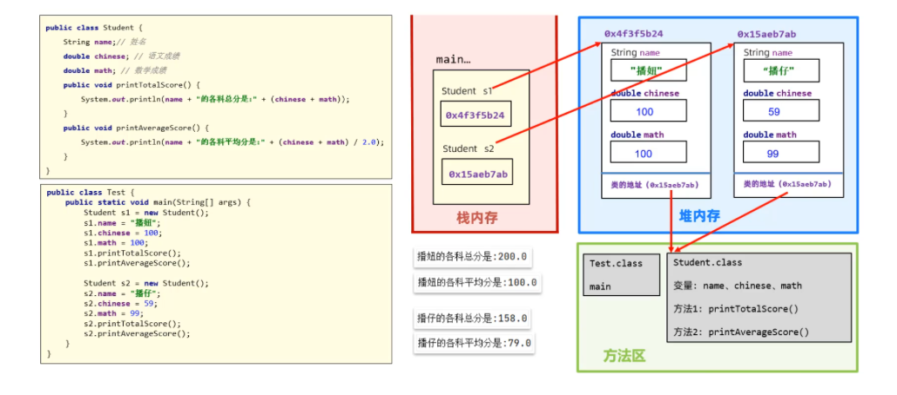

与前面学习的数组变量记录的其实数数组在堆内存中的地址类似，对象可以按统一思路理解：

- `Student s1`表示的是在栈内存中，创建了一个Student类型的变量，变量名为s1

- 而`new Student()`会在堆内存中创建一个对象，而对象中包含学生的属性名和属性值

  同时系统会为这个Student对象分配一个地址值0x4f3f5b24

- 接着把对象的地址赋值给栈内存中的变量s1，通过s1记录的地址就可以找到这个对象

- 当执行`s1.name=“播妞”`时，其实就是通过s1找到对象的地址，再通过对象找到对象的name属性，再给对象的name属性赋值为`播妞`;  

### 2 类和对象注意点

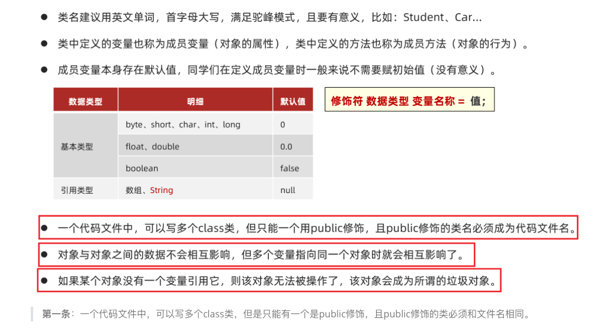

关于一个代码文件中可以有多个类这一条，举例：

```
//public修饰的类Demo1，和文件名Demo1相同
public class Demo1{
    
}

class Student{
    
}
```

### 3 this关键字

**this是什么？** this就是一个变量，用在方法中，可以拿到当前类的对象。

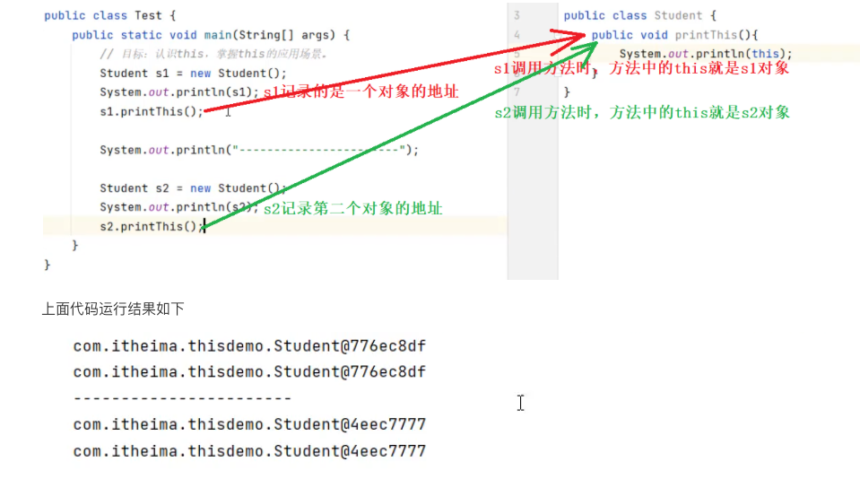

**this有什么用？** 通过this在方法中可以访问本类对象的成员变量，哪一个对象调用方法方法中的this就是哪一个对象

### 4 构造器

**什么是构造器？**

构造器其实是一种特殊的方法，但是这个方法没有返回值类型，方法名必须和类名相同


**构造器特点？**

在创建对象时，会调用构造器。**new 对象就是在执行构造方法**


构造器就是用来创建对象的。可以在创建对象时给对象的属性做一些初始化操作.

构造器注意事项:

```
1.在设计一个类时，如果不写构造器，Java会自动生成一个无参数构造器。
2.一定定义了有参数构造器，Java就不再提供空参数构造器，此时建议自己加一个无参数构造器。
```

### 5 封装性

**什么是封装？** 

封装就是用类设计对象处理某一个事物的数据时，应该把要处理的数据，以及处理数据的方法，都设计到一个对象中去。

比如：在设计学生类时，把学生对象的姓名、语文成绩、数学成绩三个属性，以及求学生总分、平均分的方法，都封装到学生对象中来。

封装的设计规范用8个字总结：**合理隐藏、合理暴露** 。举例设计一辆汽车时发动机、变松箱需要隐藏，启动按钮、刹车需要暴露出来

**封装在代码中如何体现？**

一般在设计一个类时，会将成员变量隐藏，然后把操作成员变量的方法对外暴露。需要用到**修饰符** 。前面看到的`public`就是修饰符，与之对应的有一个`private` 修饰符，被private修饰后，只能在本类中访问。如果要对外访问可以加个对外报暴漏的方法，在方法里返回变量。


### 6 实体JavaBean

面向对象编程中，经常写的一种类——叫实体JavaBean类，那什么是实体类？

实体类就是一种特殊的类，它需要满足下面的要求：

- 类中的成员变量都要私有，并且要对外提供相应的`getXxx`,`setXxx`方法

- 类中必须要有一个公共的无参构造器

例如写一个Student类


实体类中除了有给对象存、取值的方法就没有提供其他方法，所以实体类仅仅只是用来封装数据用的。

实际开发中，实体类仅仅只用来封装数据，而对数据的处理交给其他类来完成，以实现数据和数据业务处理相分离。

### 7 成员变量和局部变量

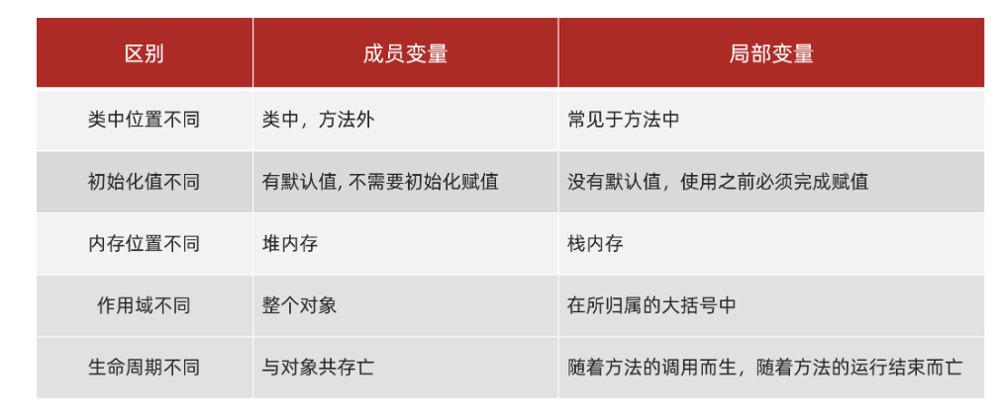

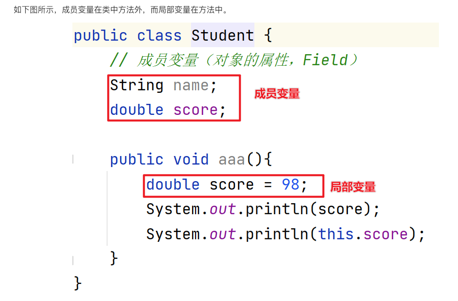


### 8 常用Java Api

#### **包**

学习API类之前，要了解包，Java官方提供了很多类，为了对这些类进行分门别类的管理，将写好的类都是放在不同的包里。

包类似于文件夹，一个包能放多个类文件。


建包的语法格式：

```
//类文件的第一行定义包
package com.itheima.javabean;

public class 类名{
    
}
```

在自己的程序中调用其他包中的程序，注意：

- 如果当前程序中，要调用自己所在包下的其他程序，可以直接调用。（同一个包下的类，互相可以直接调用）

- 如果当前程序中，要调用其他包下的程序，则必须在当前程序中导包, 才可以访问！

  导包格式：` import 包名.类名`

- 如果当前程序中，要调用Java.lang包下的程序，不需要我们导包的，可以直接使用。

- 如果当前程序中，要调用多个不同包下的程序，而这些程序名正好一样，此时默认只能导入一个程序，另一个程序必须带包名访问。

 #### **String**

String代表字符串对象，可以用来封装字符串数据，并提供了很多操作字符串的方法。创建字符串的方式：

	方式一： 直接使用双引号“...” 。
	方式二：new String类，调用构造器初始化字符串对象。

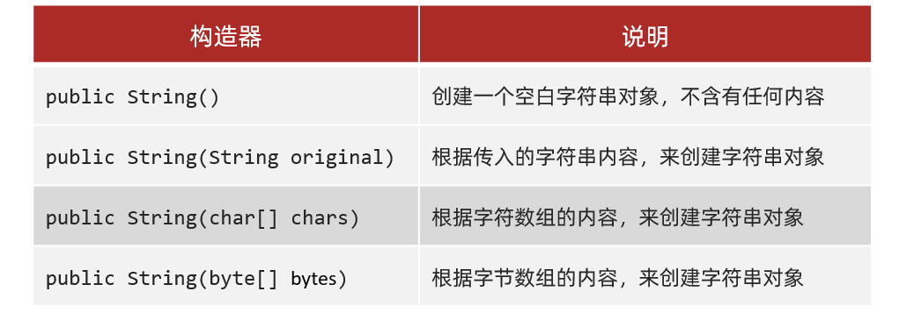

```
// 1、直接双引号得到字符串对象，封装字符串数据
String name = "黑马666";
System.out.println(name);

// 2、new String创建字符串对象，并调用构造器初始化字符串
String rs1 = new String();
System.out.println(rs1); // ""

String rs2 = new String("itheima");
System.out.println(rs2);

char[] chars = {'a', '黑', '马'};
String rs3 = new String(chars);
System.out.println(rs3);

byte[] bytes = {97, 98, 99};
String rs4 = new String(bytes);
System.out.println(rs4);
```

String类常用方法

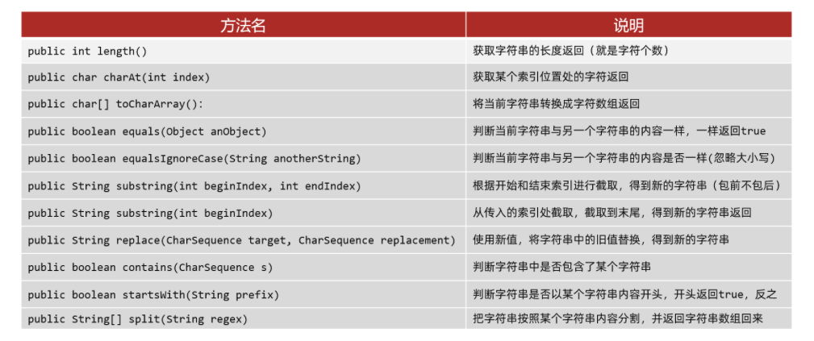

```java
public class StringDemo2 {
    public static void main(String[] args) {
        //目标：快速熟悉String提供的处理字符串的常用方法。
        String s = "黑马Java";
        // 1、获取字符串的长度
        System.out.println(s.length());

        // 2、提取字符串中某个索引位置处的字符
        char c = s.charAt(1);
        System.out.println(c);

        // 字符串的遍历
        for (int i = 0; i < s.length(); i++) {
            // i = 0 1 2 3 4 5
            char ch = s.charAt(i);
            System.out.println(ch);
        }

        System.out.println("-------------------");

        // 3、把字符串转换成字符数组，再进行遍历
        char[] chars = s.toCharArray();
        for (int i = 0; i < chars.length; i++) {
            System.out.println(chars[i]);
        }

        // 4、判断字符串内容，内容一样就返回true
        String s1 = new String("黑马");
        String s2 = new String("黑马");
        System.out.println(s1 == s2); // false
        System.out.println(s1.equals(s2)); // true

        // 5、忽略大小写比较字符串内容
        String c1 = "34AeFG";
        String c2 = "34aEfg";
        System.out.println(c1.equals(c2)); // false
        System.out.println(c1.equalsIgnoreCase(c2)); // true

        // 6、截取字符串内容 (包前不包后的)
        String s3 = "Java是最好的编程语言之一";
        String rs = s3.substring(0, 8);
        System.out.println(rs);

        // 7、从当前索引位置一直截取到字符串的末尾
        String rs2 = s3.substring(5);
        System.out.println(rs2);

        // 8、把字符串中的某个内容替换成新内容，并返回新的字符串对象给我们
        String info = "这个电影简直是个垃圾，垃圾电影！！";
        String rs3 = info.replace("垃圾", "**");
        System.out.println(rs3);

        // 9、判断字符串中是否包含某个关键字
        String info2 = "Java是最好的编程语言之一，我爱Java,Java不爱我！";
        System.out.println(info2.contains("Java"));
        System.out.println(info2.contains("java"));
        System.out.println(info2.contains("Java2"));

        // 10、判断字符串是否以某个字符串开头。
        String rs4 = "张三丰";
        System.out.println(rs4.startsWith("张"));
        System.out.println(rs4.startsWith("张三"));
        System.out.println(rs4.startsWith("张三2"));

        // 11、把字符串按照某个指定内容分割成多个字符串，放到一个字符串数组中返回给我们
        String rs5 = "张无忌,周芷若,殷素素,赵敏";
        String[] names = rs5.split(",");
        for (int i = 0; i < names.length; i++) {
            System.out.println(names[i]);
        }
    }
}
```

字符串原理理解注意下面两点：

- String是不可变字符串对象。


看起来例子里的name值变了呀，为什么说字符串不可变呢？

这需要从字符串在内存中存储原理来解释，以`”“`形式创建的字符串对象，会在堆内存中的 **字符串常量池** 中存储。


- 只要是以“...”方式写出的字符串对象，会存储到字符串常量池，且相同内容的字符串只存储一份；但通过new方式创建字符串对象，每new一次都会产生一个新的对象放在堆内存中。


 #### **ArrayList**

ArrayList是集合中最常用的一种，集合类似于数组，也是容器，用来装数据的，但集合的大小可变

有数组为什么还要有集合？因为在java中数组长度是固定的，一旦创建不可改变，集合则可以根据需要想存几个就存几个，长度可变。

创建ArrayList容器对象一般使用空参数构造方法：


调用ArrayList类的常用方法对容器中的数据进行操作


```java
public class ArrayListDemo1 {
    public static void main(String[] args) {
        // 1、创建一个ArrayList的集合对象
        // ArrayList<String> list = new ArrayList<String>();
        // 从jdk 1.7开始才支持的
        ArrayList<String> list = new ArrayList<>();

        list.add("黑马");
        list.add("黑马");
        list.add("Java");
        System.out.println(list);

        // 2、往集合中的某个索引位置处添加一个数据
        list.add(1, "MySQL");
        System.out.println(list);

        // 3、根据索引获取集合中某个索引位置处的值
        String rs = list.get(1);
        System.out.println(rs);

        // 4、获取集合的大小（返回集合中存储的元素个数）
        System.out.println(list.size());

        // 5、根据索引删除集合中的某个元素值，会返回被删除的元素值给我们
        System.out.println(list.remove(1));
        System.out.println(list);

        // 6、直接删除某个元素值，删除成功会返回true，反之
        System.out.println(list.remove("Java"));
        System.out.println(list);

        list.add(1, "html");
        System.out.println(list);

        // 默认删除的是第一次出现的这个黑马的数据的
        System.out.println(list.remove("黑马"));
        System.out.println(list);

        // 7、修改某个索引位置处的数据，修改后会返回原来的值给我们
        System.out.println(list.set(1, "黑马程序员"));
        System.out.println(list);
    }
}
```

### 9 static修饰符

static读作静态，可以用来修饰成员变量，也能修饰成员方法。

#### **修饰成员变量**

Java中的成员变量按照有无static修饰分为两种：**类变量、实例变量**


静态变量是属于类的，只需要通过类名就可以调用：**`类名.静态变量`**

实例变量是属于对象的，需要通过对象才能调用：**`对象.实例变量`**


- 1.类变量：属于类，在内存中只有一份，用类名调用
- 2.实例变量：属于对象，每一个对象都有一份，用对象调用

#### **修饰成员方法**

成员方法根据有无static也分为两类：**类方法、实例方法**


> 有static修饰的方法，是属于类的，称为**类方法**；调用时直接用类名调用即可。

> 无static修饰的方法，是属于对象的，称为实例方法；调用时，需要使用对象调用。

- 类方法：static修饰的方法，可以被类名调用，是因为它是随着类的加载而加载的；所以类名直接就可以找到static修饰的方法
- 实例方法：非static修饰的方法，需要创建对象后才能调用，是因为实例方法中可能会访问实例变量，而实例变量需要创建对象后才存在。所以实例方法，必须创建对象后才能调用。


#### **工具类**
如果一个类中的方法全都是静态的，那么这个类中的方法就全都可以被类名直接调用，由于调用起来非常方便，就像一个工具一下，所以把这样的类就叫做工具类。


#### **static应用-代码块**

代码块根据有无static修饰分为两种：静态代码块、实例代码块。

> 静态代码块，随着类的加载而执行，而且只执行一次。


> 实例代码块每次创建对象之前都会执行一次


#### **static应用-单例设计模式**

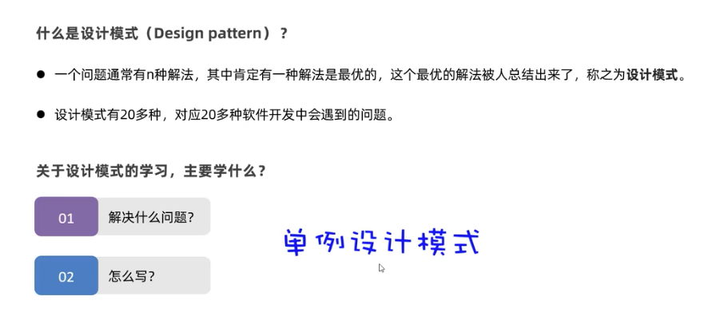

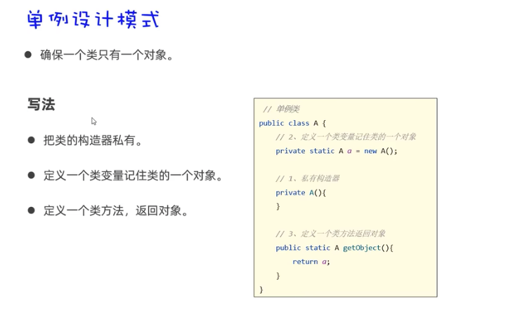

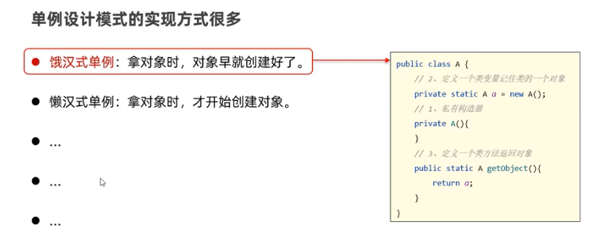

> 懒汉式单例

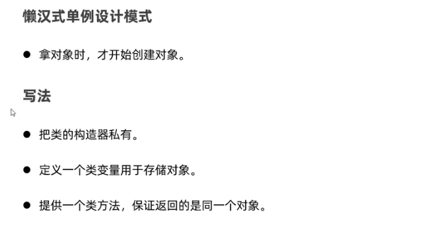

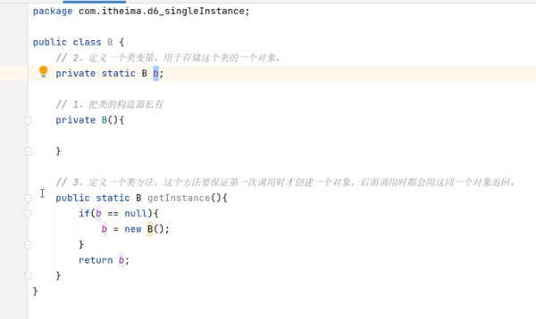

### 10 继承

面向对象编程三大特征：继承、封装和多态。

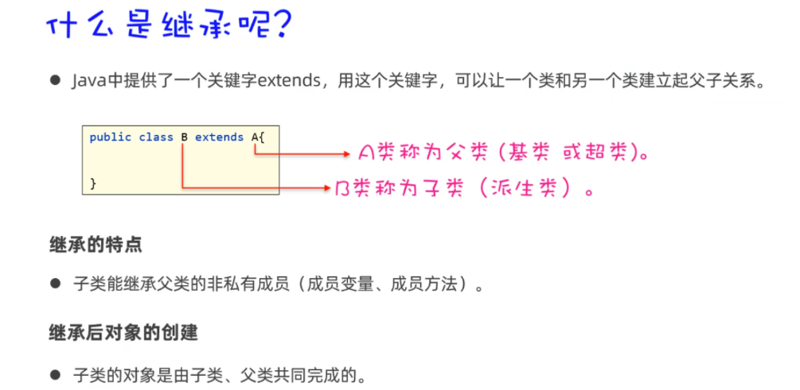

子类对象实际上是由子、父类两张设计图共同创建出来的

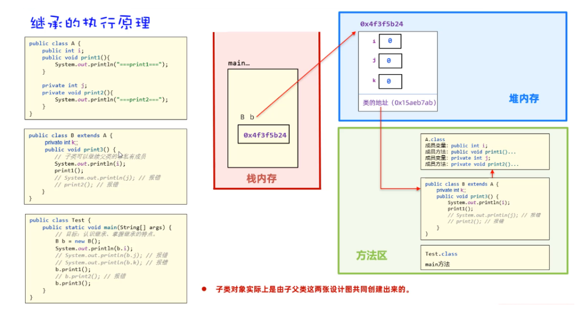

**继承可以提高代码的复用性**。

#### 权限修饰符

权限修饰符是用来限制类的成员（成员变量、成员方法、构造器...）能够被访问的范围。

四个权限修饰符：public（公有的）、private（私有的），protected（受保护的）、缺省的（不写任何修饰符）

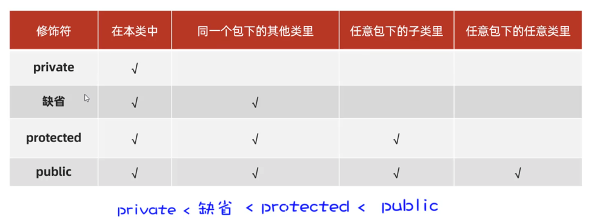

```java
public class Fu {
    // 1、私有:只能在本类中访问
    private void privateMethod(){
        System.out.println("==private==");
    }

    // 2、缺省：本类，同一个包下的类
    void method(){
        System.out.println("==缺省==");
    }

    // 3、protected: 本类，同一个包下的类，任意包下的子类
    protected void protectedMethod(){
        System.out.println("==protected==");
    }

    // 4、public： 本类，同一个包下的类，任意包下的子类，任意包下的任意类
    public void publicMethod(){
        System.out.println("==public==");
    }

    public void test(){
        //在本类中，所有权限都可以被访问到
        privateMethod(); //正确
        method(); //正确
        protectedMethod(); //正确
        publicMethod(); //正确
    }
}
```

接下来，在和Fu类同一个包下，创建一个测试类Demo，演示同一个包下可以访问到哪些权限修饰的方法。

```java
public class Demo {
    public static void main(String[] args) {
        Fu f = new Fu();
        // f.privateMethod();	//私有方法无法使用
        f.method();
        f.protectedMethod();
        f.publicMethod();
    }
}
```

接下来，在另一个包下创建一个Fu类的子类，演示不同包下的子类中可以访问哪些权限修饰的方法。

```java
public class Zi extends Fu {
    //在不同包下的子类中，只能访问到public、protected修饰的方法
    public void test(){
        // privateMethod(); // 报错
        // method(); // 报错
        protectedMethod();	//正确
        publicMethod();	//正确
    }
}
```

接下来，在和Fu类不同的包下，创建一个测试类Demo2，演示一下不同包的无关类，能访问到哪些权限修饰的方法；

```java
public class Demo2 {
    public static void main(String[] args) {
        Fu f = new Fu();
        // f.privateMethod(); // 报错
        // f.method();		  //报错
        // f.protecedMethod();//报错
        f.publicMethod();	//正确

        Zi zi = new Zi();
        // zi.protectedMethod();
    }
}
```

#### 单继承、Object

Java语言只支持单继承，不支持多继承，但是可以多层继承

#### 方法重写

当子类觉得父类方法不好用，或者无法满足父类需求时，子类可以重写一个方法名称、参数列表一样的方法，去覆盖父类的这个方法，这就是方法重写。

**注意**：重写后，方法的访问遵循就近原则

写一个A类作为父类，定义两个方法print1和print2

```java
public class A {
    public void print1(){
        System.out.println("111");
    }

    public void print2(int a, int b){
        System.out.println("111111");
    }
}
```

再写一个B类作为A类的子类，重写print1和print2方法。

```java
public class B extends A{
    // 方法重写
    @Override // 安全，可读性好
    public void print1(){
        System.out.println("666");
    }


    // 方法重写
    @Override
    public void print2(int a, int b){
        System.out.println("666666");
    }
}
```

重写注意点：

- 1.重写的方法上面，可以加一个注解@Override,用于标注这个方法是复写的父类方法
- 2.子类复写父类方法时，访问权限必须大于或者等于父类方法的权限
	public > protected > 缺省
- 3. 重写的方法返回值类型，必须与被重写的方法返回值类型一样，或者范围更小
- 4. 私有方法、静态方法不能被重写，如果重写会报错。

#### 子类中访问成员特点

子类中访问其他成员（成员变量、成员方法），依据就近原则。

#### 子类中访问构造器的特点

- 子类全部构造器，都会先调用父类构造器，再执行自己

- 如果不想使用默认的`super()`方式调用父类构造器，还可以手动使用`super(参数)`调用父类有参数构造器。

  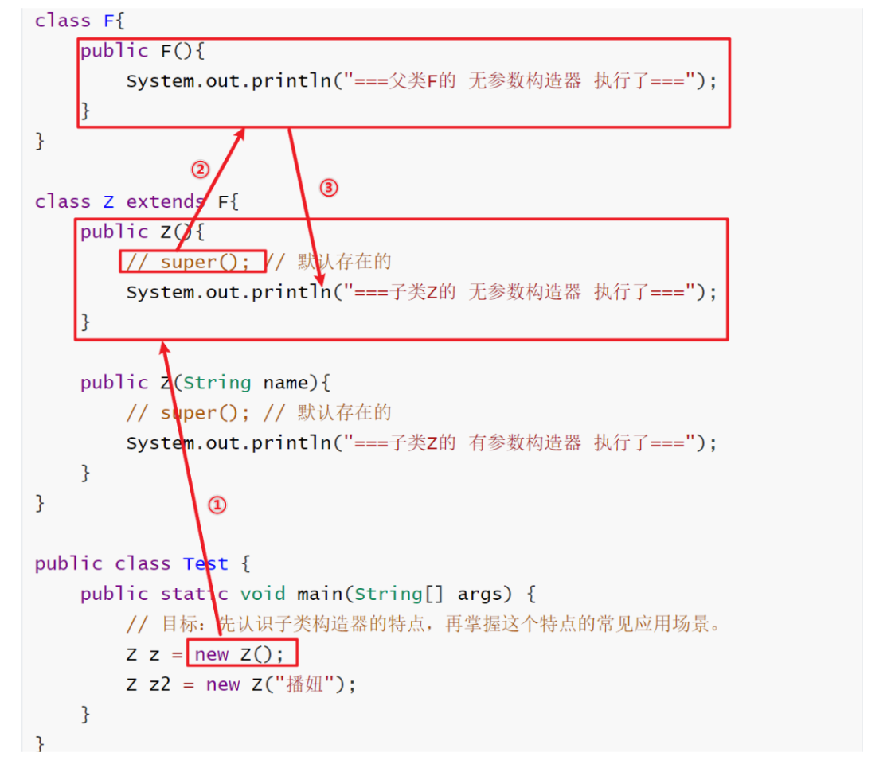

```
访问本类成员：
	this.成员变量	//访问本类成员变量
	this.成员方法	//调用本类成员方法
	this()		   //调用本类空参数构造器
    this(参数)	  //调用本类有参数构造器
	
访问父类成员：
	super.成员变量	//访问父类成员变量
	super.成员方法	//调用父类成员方法
	super()		   //调用父类空参数构造器
    super(参数)	  //调用父类有参数构造器
    
注意：this和super访问构造方法，只能用到构造方法的第一句，否则会报错。
```

### 11 多态

多态是在继承、实现情况下的一种现象，表现为：对象多态、行为多态。

比如：Teacher和Student都是People的子类，代码可以写成下面的样子

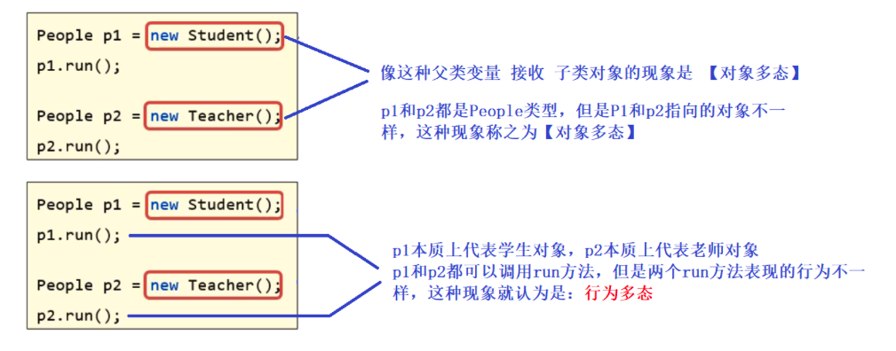

在多态形式下，右边的代码是解耦合的，便于扩展和维护。

定义方法时，使用父类类型作为形参，可以接收一切子类对象，扩展行更强，更便利。

```java
public class Test2 {
    public static void main(String[] args) {
        // 目标：掌握使用多态的好处
		Teacher t = new Teacher();
		go(t);

        Student s = new Student();
        go(s);
    }

    //参数People p既可以接收Student对象，也能接收Teacher对象。
    public static void go(People p){
        System.out.println("开始------------------------");
        p.run();
        System.out.println("结束------------------------");
    }
}
```

多态形式下不能直接调用子类特有方法，但是转型后是可以调用。父类变量转换为子类类型。格式如下：

```java
//如果p接收的是子类对象
if(父类变量 instance 子类){
    //则可以将p转换为子类类型
    子类 变量名 = (子类)父类变量;
}
```

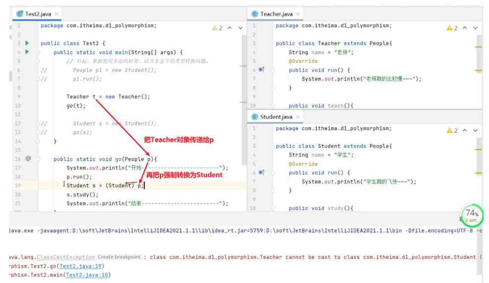

如果类型转换错了，就会出现类型转换异常ClassCastException。

### 12 final关键字

final关键字是最终的意思，可以修饰类、修饰方法、修饰变量

- final修饰类：该类称为最终类，特点是不能被继承

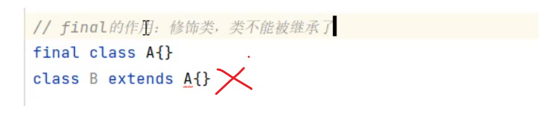

- final修饰方法：该方法称之为最终方法，特点是不能被重写。


- final修饰变量：该变量只能被赋值一次。

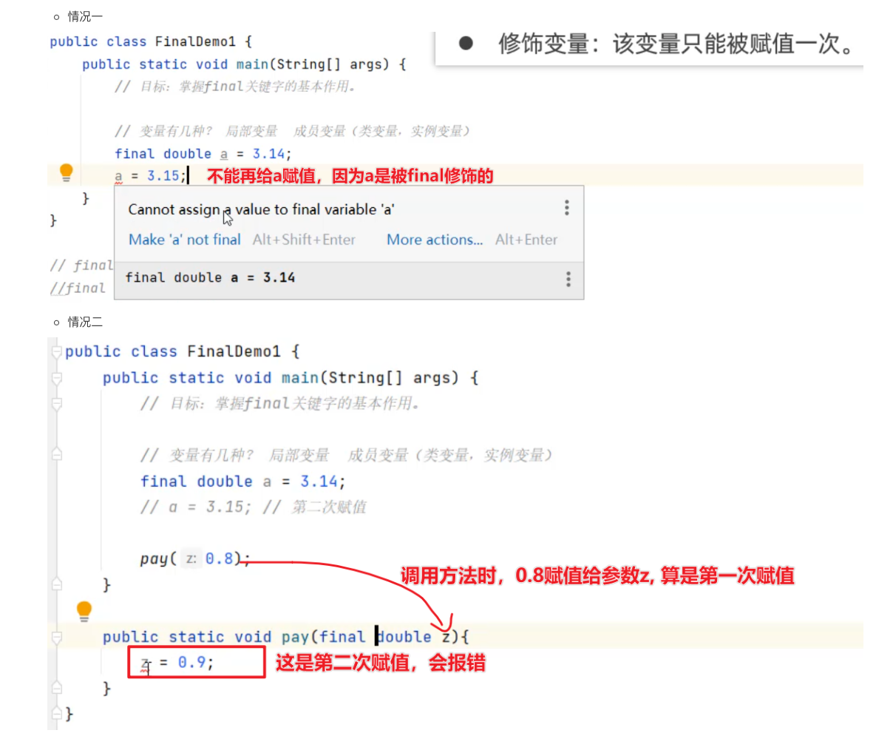

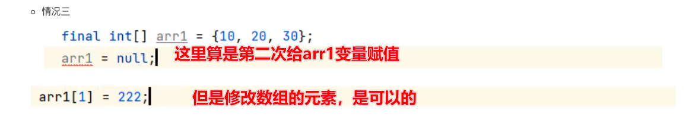

#### 常量

被 static final 修饰的成员变量，称之为常量，通常用于记录系统的配置信息。

代码来演示一下：

```java
public class Constant {
    //常量: 定义一个常量表示学校名称
    //为了方便在其他类中被访问所以一般还会加上public修饰符
    //常量命名规范：建议都采用大写字母命名，多个单词之前有_隔开
    public static final String SCHOOL_NAME = "test";
}
```

```java
public class FinalDemo2 {
    public static void main(String[] args) {
        //由于常量是static的所以，在使用时直接用类名就可以调用
        System.out.println(Constant.SCHOOL_NAME);
        System.out.println(Constant.SCHOOL_NAME);
        System.out.println(Constant.SCHOOL_NAME);
        System.out.println(Constant.SCHOOL_NAME);
        System.out.println(Constant.SCHOOL_NAME);
        System.out.println(Constant.SCHOOL_NAME);
        System.out.println(Constant.SCHOOL_NAME);
    }
}
```

程序编译后，常量会“宏替换”，出现常量的地方，全都会被替换为其记住的字面量。把代码反编译后，其实代码是下面的样子:

```java
public class FinalDemo2 {
    public static void main(String[] args) {
        System.out.println("test");
        System.out.println("test"E);
        System.out.println("test");
        System.out.println("test");
        System.out.println("test");
        System.out.println("test");
        System.out.println("test");
    }
}
```

### 13 抽象

关键字abstract（抽象），它可以修饰类（叫抽象类）也可以修饰方法（叫抽象方法，不允许有方法体）

```java
//abstract修饰类，这个类就是抽象类
public abstract class A{
    //abstract修饰方法，这个方法就是抽象方法
    public abstract void test();
}
```

- 抽象类是不能创建对象的，如果抽象类的对象就会报错。

- 抽象类虽然不能创建对象，但是它可以作为父类让子类继承,且子类继承父类必须重写父类的所有抽象方法。

  ```java
  //B类继承A类，必须复写test方法
  public class B extends A {
      @Override
      public void test() {
  
      }
  }
  ```

- 子类继承父类如果不复写父类的抽象方法，要想不出错，这个子类也必须是抽象类

```java
//B类基础A类，此时B类也是抽象类，这个时候就可以不重写A类的抽象方法
public abstract class B extends A {

}
```

抽象类的使用场景和好处

```
1.用抽象类可以把父类中相同的代码，包括方法声明都抽取到父类，这样能更好的支持多态，一提高代码的灵活性。

2.反过来用，我们不知道系统未来具体的业务实现时，我们可以先定义抽象类，将来让子类去实现，以方便系统的扩展。
```

### 14 模版方法模式

设计模式是解决某一类问题的最优方案。**模板方法模式主要解决方法中存在重复代码的问题**

比如A类和B类都有sing()方法，sing()方法的开头和结尾都是一样的，只是中间一段内容不一样。此时A类和B类的sing()方法中就存在一些相同的代码。

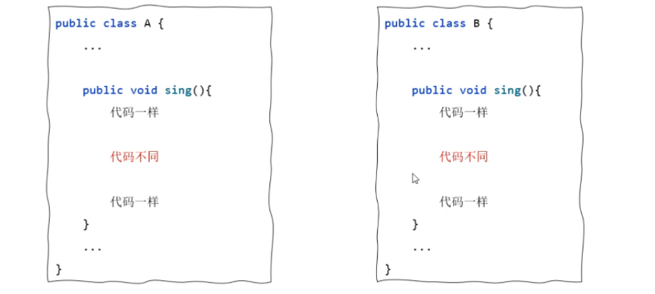

怎么解决上面的重复代码问题呢？ 我们可以写一个抽象类C类，在C类中写一个doSing()的抽象方法。再写一个sing()方法，代码如下：

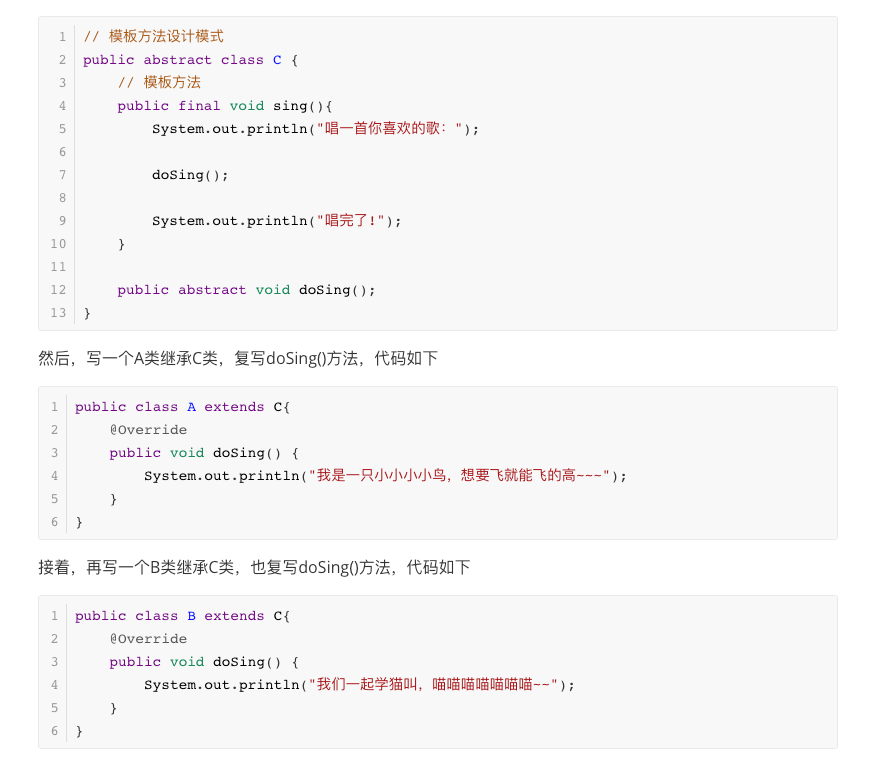

最后，再写一个测试类Test

```
public class Test {
    public static void main(String[] args) {
        // 目标：搞清楚模板方法设计模式能解决什么问题，以及怎么写。
        B b = new B();
        b.sing();
    }
}
```

模板方法模式解决了多个子类中有相同代码的问题。具体实现步骤如下:

- 第1步：定义一个抽象类，把子类中相同的代码写成一个模板方法。
- 第2步：把模板方法中不能确定的代码写成抽象方法，并在模板方法中调用。
- 第3步：子类继承抽象类，只需要父类抽象方法就可以了。

### 15 接口interface

java提供了一个关键字interface，用它来定义接口这种特殊结构，格式如下：

```
public interface 接口名{
    //成员变量（常量）
    //成员方法（抽象方法）
}
```

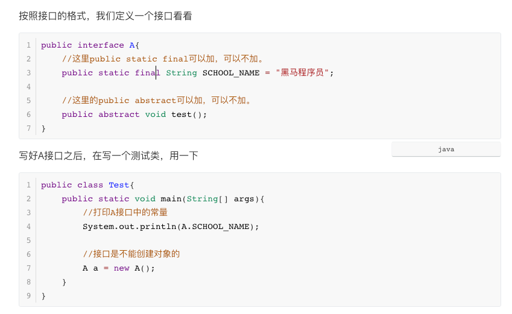

接口要注意下面两点：

- 接口是用来被类实现（implements）的，我们称之为实现类。
- 一个类是可以实现多个接口的（接口可以理解成干爹），类实现接口必须重写所有接口的全部抽象方法，否则这个类也必须是抽象类

接口的好处：

- 弥补了类单继承的不足，一个类同时可以实现多个接口。
- 让程序可以面向接口编程，这样程序员可以灵活方便的切换各种业务实现。

案例演示，假设有一个Studnet学生类，还有一个Driver司机的接口，还有一个Singer歌手的接口。现在要写一个A类，想让他既是学生，偶然也是司机能够开车，偶尔也是歌手能够唱歌。那我们代码就可以这样设计，如下：

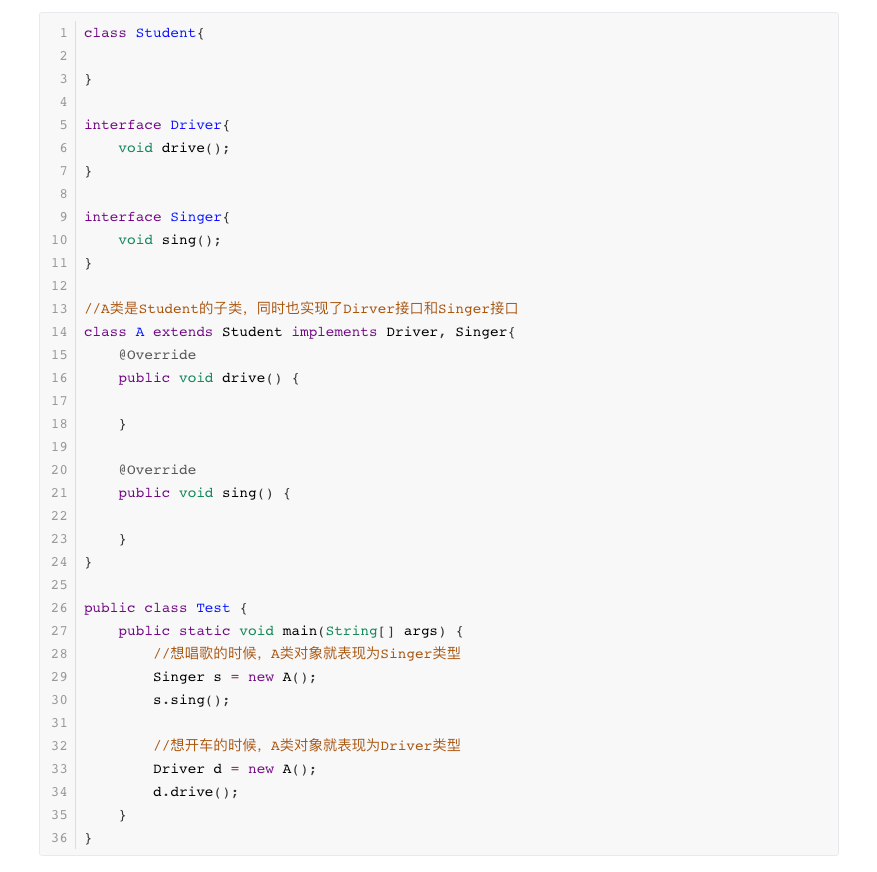

一个接口可以继承多个接口，接口同时也可以被类实现。

### 16 内部类

 内部类是类中的五大成分之一（成员变量、方法、构造器、内部类、代码块），如果一个类定义在另一个类的内部，这个类就是内部类。

当一个类的内部，包含一个完整的事物，且这个事物没有必要单独设计时，就可以把这个事物设计成内部类。

内部类有四种形式，分别是成员内部类、静态内部类、局部内部类、匿名内部类。

匿名内部类使用相对较多一点，匿名内部类是一种特殊的局部内部类；所谓匿名，指的是程序员不需要为这个类声明名字。

匿名内部类的格式：

```
new 父类/接口(参数值){
    @Override
    重写父类/接口的方法;
}
```

匿名内部类本质上是一个没有名字的子类对象、或者接口的实现类对象。

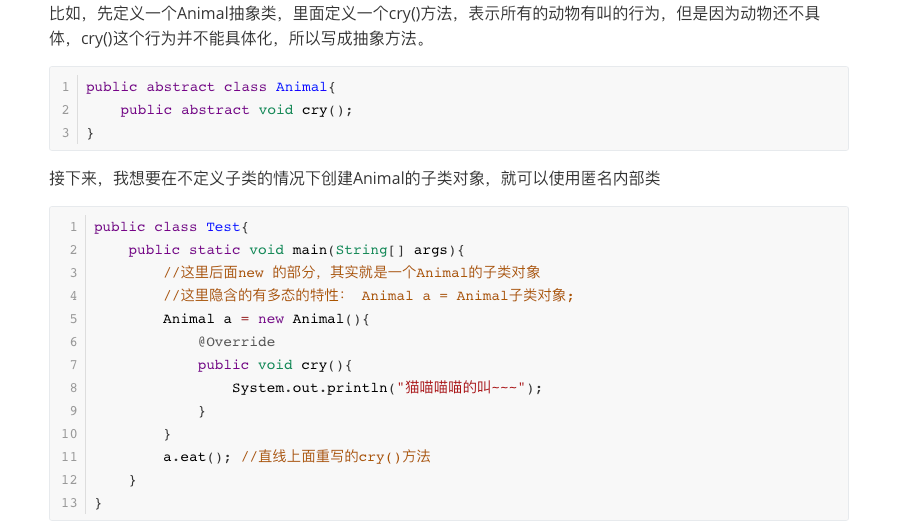

匿名内部类的作用：简化了创建子类对象、实现类对象的书写格式。

**只有在调用方法时，当方法的形参是一个接口或者抽象类，为了简化代码书写，而直接传递匿名内部类对象给方法。**这样就可以少写一个类。比如，看下面代码：

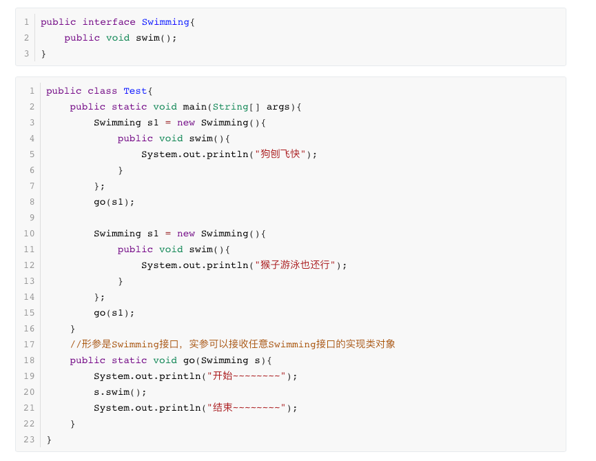


## 七、 集合技术 & I/O 技术


## 八、 网络编程 & 多线程技术


## 九、 JDK特性 & 基础加强


## 十、JAVA WEB


---
## *参考*

[Java程序员学习路线图](https://yun.itheima.com/subject/javamap/index.html)

[Java入门基础视频教程(B站)](https://www.bilibili.com/video/BV1Cv411372m/?spm_id_from=333.999.0.0) 

[Java基础教程(YouTube)](https://www.youtube.com/watch?v=VqfGCmjQt10)

[JavaWeb开发教程(B站)](https://www.bilibili.com/video/BV1m84y1w7Tb/?vd_source=4d819443886ce5506c7c6b65b4a7ad93)