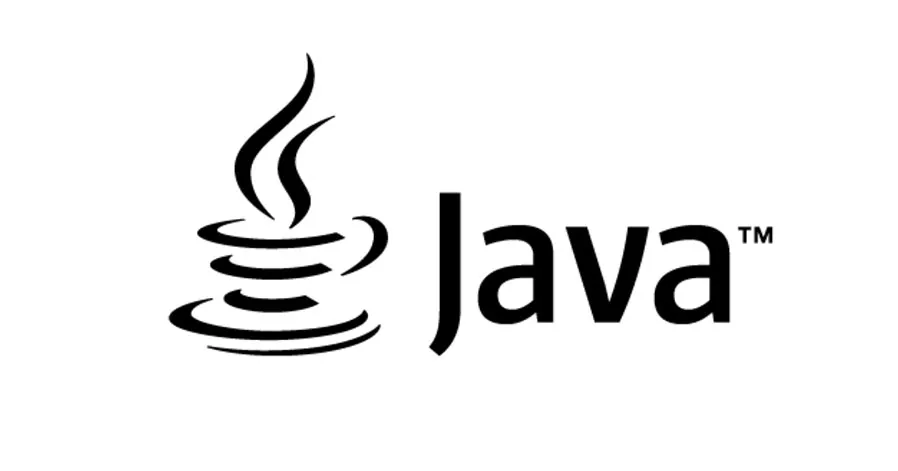

[接上一篇《Java学习笔记（一）》](../2024-05-05-learn-java)


## 七、 集合技术 & I/O 技术

### 1. Arrays 类

Arrays是干什么用的，Arrays是操作数组的工具类，它可以很方便的对数组中的元素进行遍历、拷贝、排序等操作。

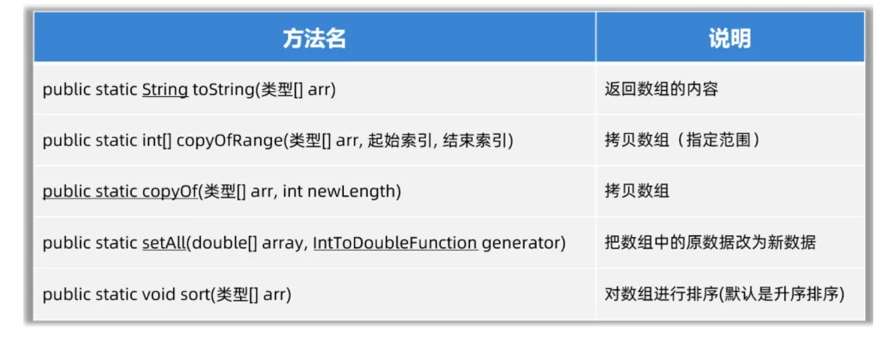

```java
/**
 * 目标：掌握Arrays类的常用方法。
 */
public class ArraysTest1 {
    public static void main(String[] args) {
        // 1、public static String toString(类型[] arr): 返回数组的内容
        int[] arr = {10, 20, 30, 40, 50, 60};
        System.out.println(Arrays.toString(arr));

        // 2、public static 类型[] copyOfRange(类型[] arr, 起始索引, 结束索引) ：拷贝数组（指定范围，包前不包后）
        int[] arr2 = Arrays.copyOfRange(arr, 1, 4);
        System.out.println(Arrays.toString(arr2));

        // 3、public static copyOf(类型[] arr, int newLength)：拷贝数组，可以指定新数组的长度。
        int[] arr3 = Arrays.copyOf(arr, 10);
        System.out.println(Arrays.toString(arr3));

        // 4、public static setAll(double[] array, IntToDoubleFunction generator)：把数组中的原数据改为新数据又存进去。
        double[] prices = {99.8, 128, 100};
        //                  0     1    2
        // 把所有的价格都打八折，然后又存进去。
        Arrays.setAll(prices, new IntToDoubleFunction() {
            @Override
            public double applyAsDouble(int value) {
                // value = 0  1  2
                return prices[value] * 0.8;
            }
        });
        System.out.println(Arrays.toString(prices));

        // 5、public static void sort(类型[] arr)：对数组进行排序(默认是升序排序)
        Arrays.sort(prices);
        System.out.println(Arrays.toString(prices));
    }
}
```

如果数组中存储的元素类型是自定义的对象，如何排序呢?

准备一个 Student 类

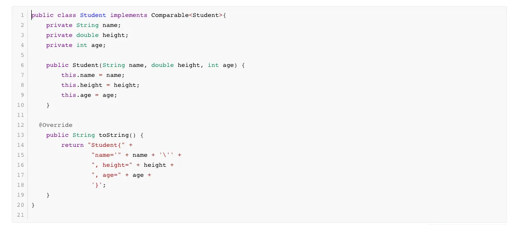

写一个测试类

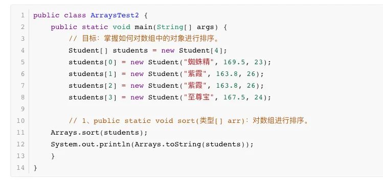

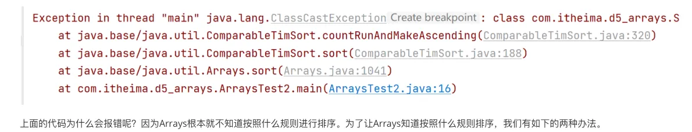

**排序方式1：**让Student类实现Comparable接口，同时重写compareTo方法。Arrays的sort方法底层会根据compareTo方法的返回值是正数、负数、还是0来确定谁大、谁小、谁相等。代码如下：

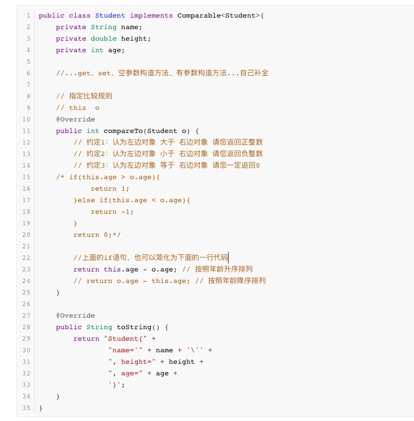

**排序方式2：**在调用`Arrays.sort(数组,Comparator比较器);`时，除了传递数组之外，传递一个Comparator比较器对象。Arrays的sort方法底层会根据Comparator比较器对象的compare方法方法的返回值是正数、负数、还是0来确定谁大、谁小、谁相等。代码如下

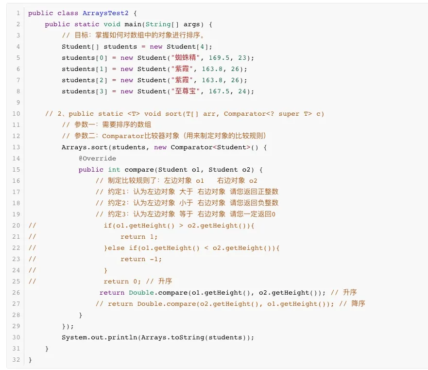

### 2. Lambda 表达式

lambda 表达式作用：用于简化匿名内部类代码的书写。

Lamdba是有特有的格式：

```
(被重写方法的形参列表) -> {
    被重写方法的方法体代码;
}
```

**注意**：在使用Lambda表达式之前，必须先有一个接口，而且接口中只能有一个抽象方法。**（不能是抽象类，只能是接口）**，像这样的接口，称之为函数式接口。

只有基于函数式接口的匿名内部类才能被Lambda表达式简化，例如：

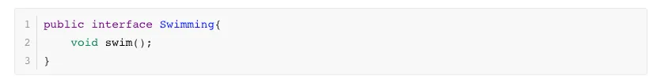

对Swimming函数式接口，看看在使用 lambda 表达式时，可以进行简化匿名内部类书写

```java
public class LambdaTest1 {
    public static void main(String[] args) {
        // 目标：认识Lambda表达式.
        //1.创建一个Swimming接口的匿名内部类对象
		Swimming s = new Swimming(){
             @Override
             public void swim() {
                 System.out.println("学生快乐的游泳~~~~");
             }
         };
         s.swim();
		
        //2.使用Lambda表达式对Swimming接口的匿名内部类进行简化
        Swimming s1 = () -> {
              System.out.println("学生快乐的游泳~~~~");
        };
        s1.swim();
    }
}
```

lambda 表达式几种简化写法：

```
1.Lambda的标准格式
	(参数类型1 参数名1, 参数类型2 参数名2)->{
		...方法体的代码...
		return 返回值;
	}

2.在标准格式的基础上()中的参数类型可以直接省略
	(参数名1, 参数名2)->{
		...方法体的代码...
		return 返回值;
	}
	
3.如果{}总的语句只有一条语句，则{}可以省略、return关键字、以及最后的“;”都可以省略
	(参数名1, 参数名2)-> 结果
	
4.如果()里面只有一个参数，则()可以省略
	(参数名)->结果
```

```java
public class LambdaTest2 {
    public static void main(String[] args) {
        // 目标：使用Lambda简化函数式接口。
        double[] prices = {99.8, 128, 100};
		//1.对数组中的每一个元素*0.8: 匿名内部类写法
        Arrays.setAll(prices, new IntToDoubleFunction() {
            @Override
            public double applyAsDouble(int value) {
                // value = 0  1  2
                return prices[value] * 0.8;
            }
        });
		//2.需求：对数组中的每一个元素*0.8,使用Lambda表达式标准写法
        Arrays.setAll(prices, (int value) -> {
                return prices[value] * 0.8;
        });
		//3.使用Lambda表达式简化格式1——省略参数类型
        Arrays.setAll(prices, (value) -> {
            return prices[value] * 0.8;
        });
		//4.使用Lambda表达式简化格式2——省略()
        Arrays.setAll(prices, value -> {
            return prices[value] * 0.8;
        });
        //5.使用Lambda表达式简化格式3——省略{}
        Arrays.setAll(prices, value -> prices[value] * 0.8 );

        System.out.println(Arrays.toString(prices));
        
        System.out.println("------------------------------------

        Student[] students = new Student[4];
        students[0] = new Student("蜘蛛精", 169.5, 23);
        students[1] = new Student("紫霞", 163.8, 26);
        students[2] = new Student("紫霞", 163.8, 26);
        students[3] = new Student("至尊宝", 167.5, 24);
		
        //1.使用匿名内部类
        Arrays.sort(students, new Comparator<Student>() {
            @Override
            public int compare(Student o1, Student o2) {
                return Double.compare(o1.getHeight(), o2.getHeight()); // 升序
            }
        });
		//2.使用Lambda表达式表达式——标准格式
        Arrays.sort(students, (Student o1, Student o2) -> {
                return Double.compare(o1.getHeight(), o2.getHeight()); // 升序
        });
		//3.使用Lambda表达式表达式——省略参数类型
        Arrays.sort(students, ( o1,  o2) -> {
            return Double.compare(o1.getHeight(), o2.getHeight()); // 升序
        });
		//4.使用Lambda表达式表达式——省略{}
        Arrays.sort(students, ( o1,  o2) -> Double.compare(o1.getHeight(), o2.getHeight()));


        System.out.println(Arrays.toString(students));
    }
}
```

### 3. 静态方法引用

准备好下面的代码

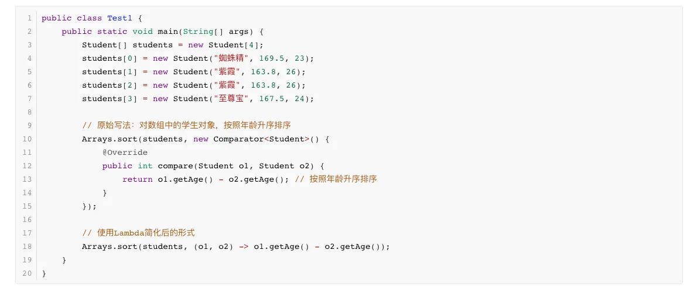

把下图中Lambda表达式的方法体，用一个静态方法代替

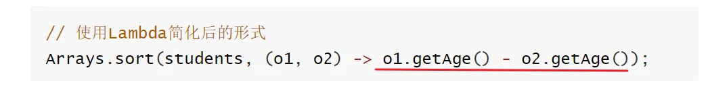

准备另外一个类CompareByData类，用于封装Lambda表达式的方法体代码；

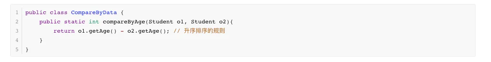

可以把Lambda表达式的方法体代码，改为下面的样子

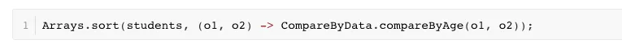

Java为了简化上面Lambda表达式的写法，利用方法引用可以改进为下面的样子

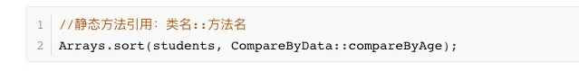

**实际上就是用类名调用方法，但是把参数给省略了。**这就是静态方法引用。

### 4. 实例方法引用

在CompareByData类中，再添加一个实例方法，用于封装Lambda表达式的方法体

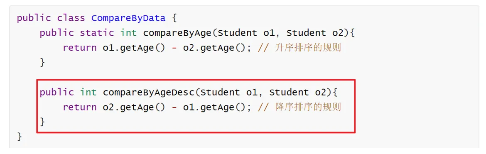

把Lambda表达式的方法体，改用对象调用方法

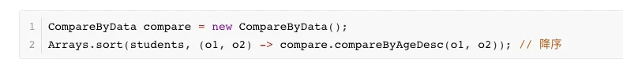

再将Lambda表达式的方法体，直接改成方法引用写法

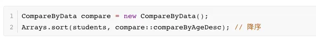

**实际上就是用类名调用方法，但是省略的参数**。这就是实例方法引用。

### 5.  特定类型的方法引用

```
Java约定：
    如果某个Lambda表达式里只是调用一个实例方法，并且前面参数列表中的第一个参数作为方法的主调，	后面的所有参数都是作为该实例方法的入参时，则就可以使用特定类型的方法引用。
格式：
	类型::方法名
```

特定类型的方法引用是没有什么道理的，只是语法的一种约定，遇到这种场景，就可以这样用。

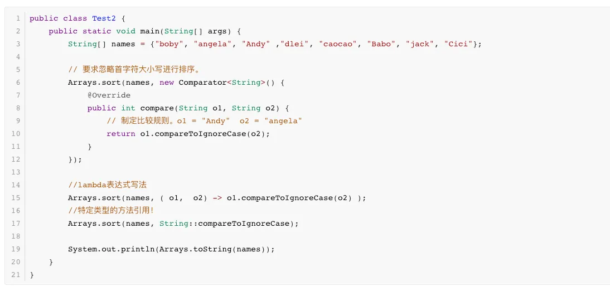

### 6. 正则表达式

正则表达式其实是由一些特殊的符号组成的，它代表的是某种规则

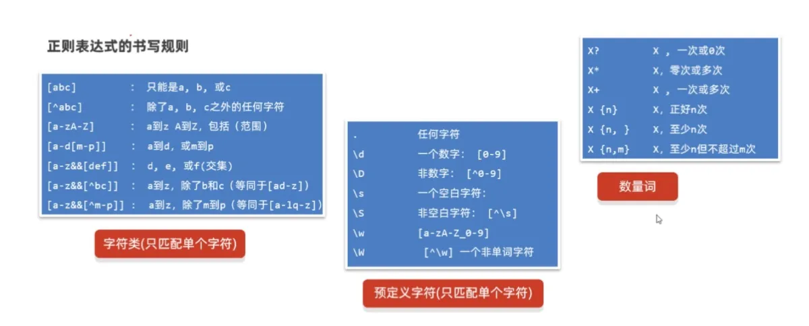

java 里用到一个方法叫`matches(String regex)`。这个方法时属于String类的方法。

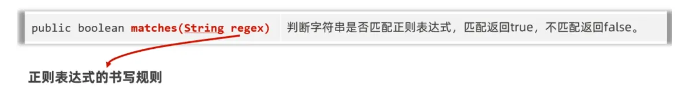

将上面这些规则，在代码中演示一下

```java
/**
 * 目标：掌握正则表达式的书写规则
 */
public class RegexTest2 {
    public static void main(String[] args) {
        // 1、字符类(只能匹配单个字符)
        System.out.println("a".matches("[abc]"));    // [abc]只能匹配a、b、c
        System.out.println("e".matches("[abcd]")); // false

        System.out.println("d".matches("[^abc]"));   // [^abc] 不能是abc
        System.out.println("a".matches("[^abc]"));  // false

        System.out.println("b".matches("[a-zA-Z]")); // [a-zA-Z] 只能是a-z A-Z的字符
        System.out.println("2".matches("[a-zA-Z]")); // false

        System.out.println("k".matches("[a-z&&[^bc]]")); // ： a到z，除了b和c
        System.out.println("b".matches("[a-z&&[^bc]]")); // false

        System.out.println("ab".matches("[a-zA-Z0-9]")); // false 注意：以上带 [内容] 的规则都只能用于匹配单个字符

        // 2、预定义字符(只能匹配单个字符)  .  \d  \D   \s  \S  \w  \W
        System.out.println("徐".matches(".")); // .可以匹配任意字符
        System.out.println("徐徐".matches(".")); // false

        // \转义
        System.out.println("\"");
        // \n \t
        System.out.println("3".matches("\\d"));  // \d: 0-9
        System.out.println("a".matches("\\d"));  //false

        System.out.println(" ".matches("\\s"));   // \s: 代表一个空白字符
        System.out.println("a".matches("\s")); // false

        System.out.println("a".matches("\\S"));  // \S: 代表一个非空白字符
        System.out.println(" ".matches("\\S")); // false

        System.out.println("a".matches("\\w"));  // \w: [a-zA-Z_0-9]
        System.out.println("_".matches("\\w")); // true
        System.out.println("徐".matches("\\w")); // false

        System.out.println("徐".matches("\\W"));  // [^\w]不能是a-zA-Z_0-9
        System.out.println("a".matches("\\W"));  // false

        System.out.println("23232".matches("\\d")); // false 注意：以上预定义字符都只能匹配单个字符。

        // 3、数量词： ?   *   +   {n}   {n, }  {n, m}
        System.out.println("a".matches("\\w?"));   // ? 代表0次或1次
        System.out.println("".matches("\\w?"));    // true
        System.out.println("abc".matches("\\w?")); // false

        System.out.println("abc12".matches("\\w*"));   // * 代表0次或多次
        System.out.println("".matches("\\w*"));        // true
        System.out.println("abc12张".matches("\\w*")); // false

        System.out.println("abc12".matches("\\w+"));   // + 代表1次或多次
        System.out.println("".matches("\\w+"));       // false
        System.out.println("abc12张".matches("\\w+")); // false

        System.out.println("a3c".matches("\\w{3}"));   // {3} 代表要正好是n次
        System.out.println("abcd".matches("\\w{3}"));  // false
        System.out.println("abcd".matches("\\w{3,}"));     // {3,} 代表是>=3次
        System.out.println("ab".matches("\\w{3,}"));     // false
        System.out.println("abcde徐".matches("\\w{3,}"));     // false
        System.out.println("abc232d".matches("\\w{3,9}"));     // {3, 9} 代表是  大于等于3次，小于等于9次

        // 4、其他几个常用的符号：(?i)忽略大小写 、 或：| 、  分组：()
        System.out.println("abc".matches("(?i)abc")); // true
        System.out.println("ABC".matches("(?i)abc")); // true
        System.out.println("aBc".matches("a((?i)b)c")); // true
        System.out.println("ABc".matches("a((?i)b)c")); // false

        // 需求1：要求要么是3个小写字母，要么是3个数字。
        System.out.println("abc".matches("[a-z]{3}|\\d{3}")); // true
        System.out.println("ABC".matches("[a-z]{3}|\\d{3}")); // false
        System.out.println("123".matches("[a-z]{3}|\\d{3}")); // true
        System.out.println("A12".matches("[a-z]{3}|\\d{3}")); // false

        // 需求2：必须是”我爱“开头，中间可以是至少一个”编程“，最后至少是1个”666“
        System.out.println("我爱编程编程666666".matches("我爱(编程)+(666)+"));
        System.out.println("我爱编程编程66666".matches("我爱(编程)+(666)+"));
    }
}
```

- 正则表达式校验手机号码

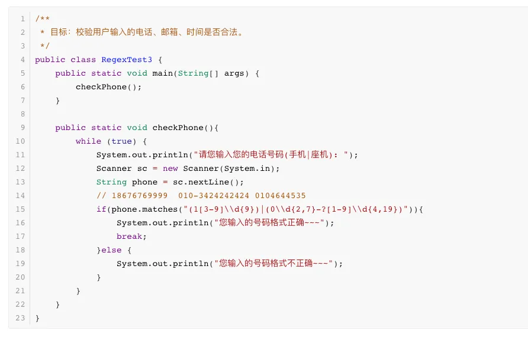

- 使用正则表达式校验邮箱是否正确

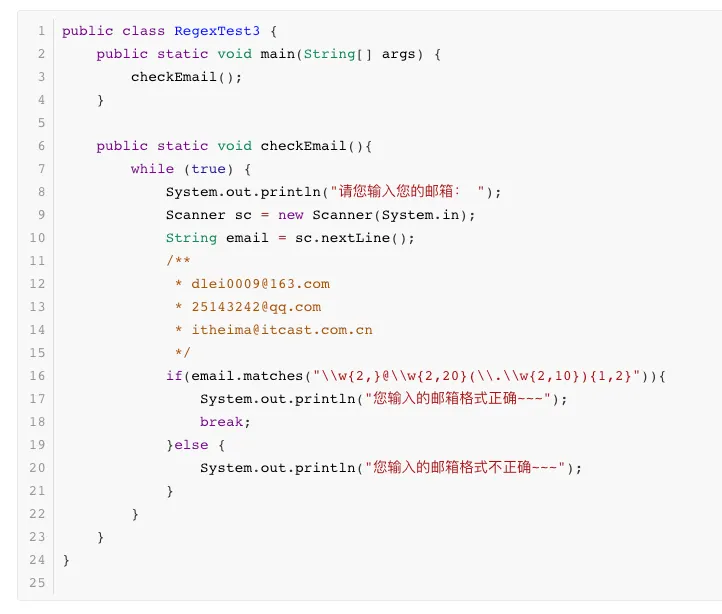

- 信息爬取


- 搜索、替换

替换、分割的功能需要用到Stirng类中的方法

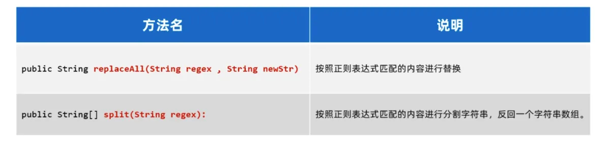

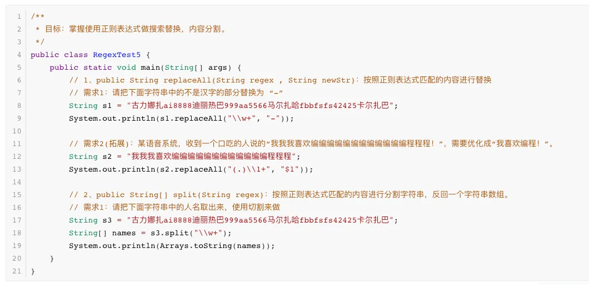

### 7. 异常

因为写代码时经常会出现问题，Java的设计者们早就为我们写好了很多个异常类，来描述不同场景下的问题。而有些类是有共性的所以就有了异常的继承体系

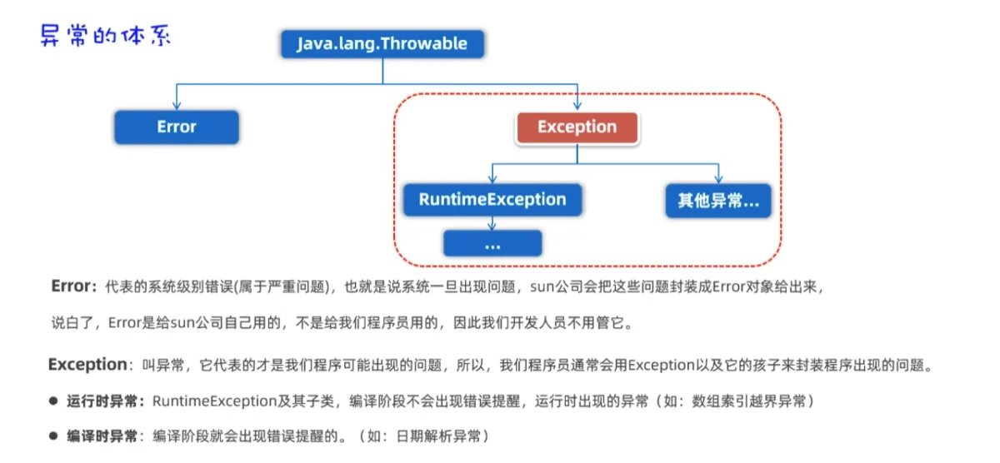

处理异常两种方法

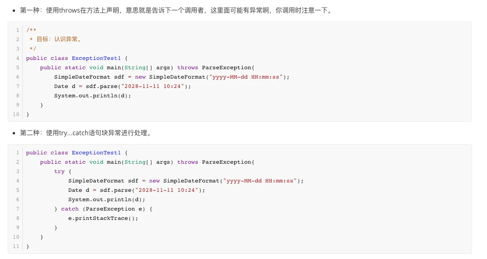


## 八、 算法


算法其实是解决某个实际问题的过程和方法。

学习算法先要搞清楚算法的流程，然后再去“推敲“如何写代码。

### 1. 冒泡排序


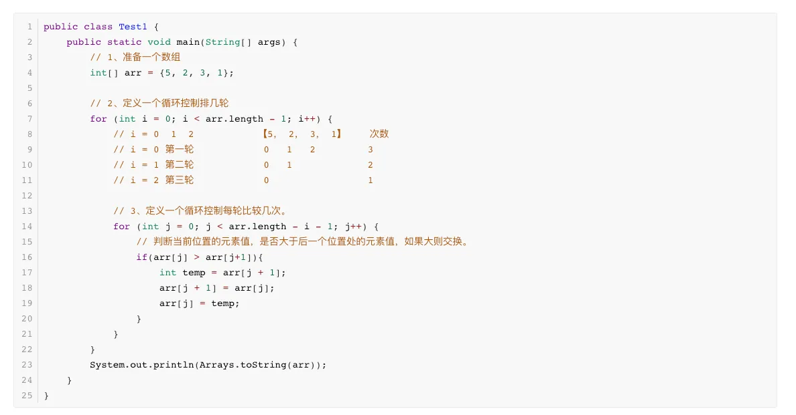

### 2. 选择排序

先分析选择排序算法的流程：选择排序的核心思路是，每一轮选定一个固定的元素，和其他的每一个元素进行比较；经过几轮比较之后，每一个元素都能比较到了。

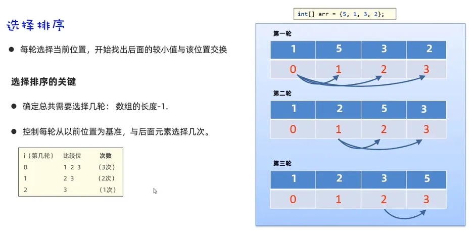

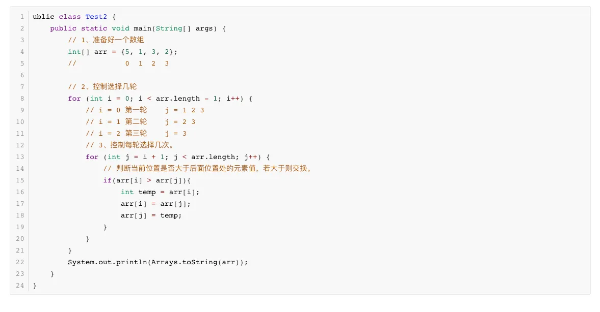

上面代码还可以做一次算法优化，上面代码里面的 for 循环要做多次数组值替换，性能是稍差的，可以稍微优化下代码，在 for 循环里面只记录最小值的index，在 里面的 for 循环完了再交换，这样只交换一次，性能更好，优化后的代码如下：

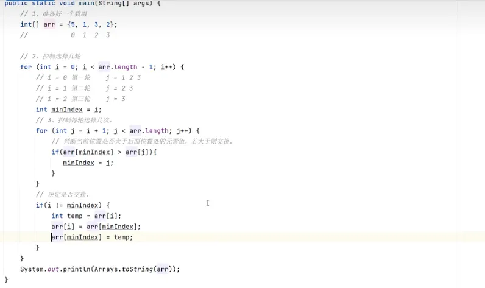

### 3.查找算法

**先聊一聊基本查找：**假设我们要查找的元素是81，如果是基本查找的话，只能从0索引开始一个一个往后找，但是如果元素比较多，你要查找的元素比较靠后的话，这样查找的此处就比较多。性能比较差。

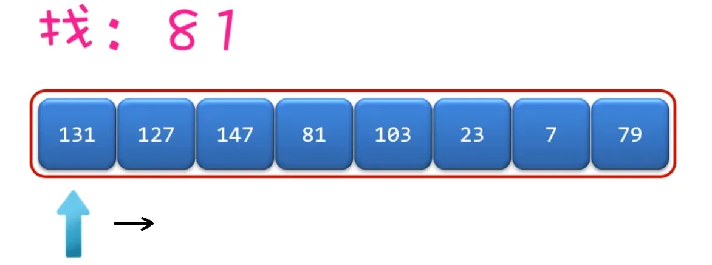

**再讲二分查找**：二分查找的主要特点是，每次查找能排除一般元素，这样效率明显提高。**但是二分查找要求比较苛刻，它要求元素必须是有序的，否则不能进行二分查找。**

二分查找的核心思路

```
第1步：先定义两个变量，分别记录开始索引(left)和结束索引(right)
第2步：计算中间位置的索引，mid = (left+right)/2;
第3步：每次查找中间mid位置的元素，和目标元素key进行比较
		如果中间位置元素比目标元素小，那就说明mid前面的元素都比目标元素小
			此时：left = mid+1
    	如果中间位置元素比目标元素大，那说明mid后面的元素都比目标元素大
    		此时：right = mid-1
		如果中间位置元素和目标元素相等，那说明mid就是我们要找的位置
			此时：把mid返回		
注意：一搬查找一次肯定是不够的，所以需要把第1步和第2步循环来做，只到left>end就结束，如果最后还没有找到目标元素，就返回-1.
```

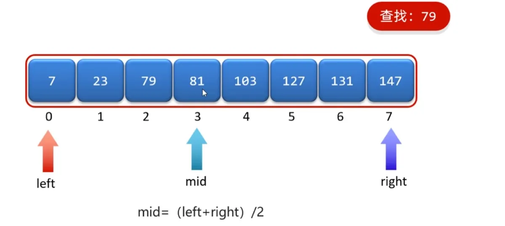

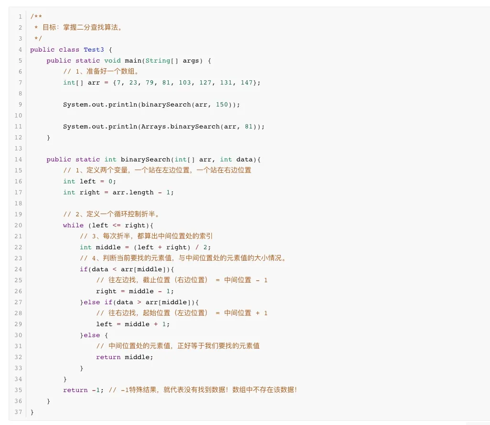

## 九、 网络编程 & 多线程技术


## 十、 JDK特性 & 基础加强


## 十一、JAVA WEB


---
## *参考*

[Java程序员学习路线图](https://yun.itheima.com/subject/javamap/index.html)

[Java入门基础视频教程(B站)](https://www.bilibili.com/video/BV1Cv411372m/?spm_id_from=333.999.0.0) 

[Java基础教程(YouTube)](https://www.youtube.com/watch?v=VqfGCmjQt10)

[JavaWeb开发教程(B站)](https://www.bilibili.com/video/BV1m84y1w7Tb/?vd_source=4d819443886ce5506c7c6b65b4a7ad93)