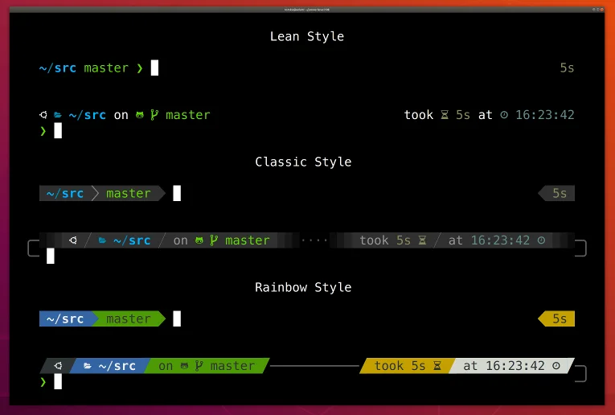
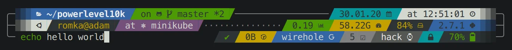

+++
title = 'Oh My Zsh 安装配置指南：打造高效终端环境'
date = '2015-06-17'
draft = false
description = 'Oh My Zsh 完整安装配置教程，涵盖 Zsh 安装、Oh My Zsh 配置、Powerlevel10k 主题美化、zsh-autosuggestions 和 zsh-syntax-highlighting 插件。适用于 macOS、Ubuntu、Linux，附常用别名配置和性能优化技巧。'
tags = ['zsh', 'oh-my-zsh', 'shell', 'linux', 'macos', '终端美化', 'powerlevel10k']
categories = ['Linux']
keywords = ['Oh My Zsh', 'Zsh 配置', 'Powerlevel10k', '终端美化', 'Shell 配置', 'zsh-autosuggestions']
+++

如果你使用 Linux 或 macOS，终端是每天都要打交道的工具。默认的 Bash 虽然够用，但 **Zsh** 配合 **Oh My Zsh** 能带来更强大的功能和更愉悦的使用体验。本文将手把手教你打造一个高效、美观的终端环境，让你的[命令行操作](/posts/linux/2020-03-19-linux-mac-commands/)效率翻倍。

<!--more-->

## 为什么选择 Zsh + Oh My Zsh？

相比系统默认的 Bash，Zsh + Oh My Zsh 的优势明显：

| 特性 | Bash | Zsh + Oh My Zsh |
|------|------|-----------------|
| 自动补全 | 基础 | 智能补全，支持命令参数 |
| 主题 | 无 | 150+ 精美主题 |
| 插件 | 需手动配置 | 300+ 开箱即用 |
| 语法高亮 | 无 | 实时高亮，错误提示 |
| 历史搜索 | 基础 | 模糊搜索，跨会话 |

> **Oh My Zsh** 是一个开源的社区驱动框架，用于管理 Zsh 配置。正如官方所说："它不会让你成为 10 倍开发者……但你可能会感觉像是。"

## 一、安装 Zsh

### macOS

macOS Catalina 及以上版本已默认使用 Zsh，无需安装。可以通过以下命令确认：

```bash
echo $SHELL
# 输出 /bin/zsh 表示已使用 Zsh
```

如果不是 Zsh，可以通过 Homebrew 安装：

```bash
brew install zsh
chsh -s $(which zsh)
```

### Ubuntu / Debian

```bash
sudo apt update
sudo apt install zsh -y

# 设置为默认 Shell
chsh -s $(which zsh)
```

### CentOS / RHEL

```bash
sudo yum install zsh -y
# 或使用 dnf
sudo dnf install zsh -y

chsh -s $(which zsh)
```

> 设置完成后，**注销并重新登录**使更改生效。

## 二、安装 Oh My Zsh

Oh My Zsh 提供一键安装脚本，非常方便：

```bash
# 使用 curl（推荐）
sh -c "$(curl -fsSL https://raw.githubusercontent.com/ohmyzsh/ohmyzsh/master/tools/install.sh)"

# 或使用 wget
sh -c "$(wget -O- https://raw.githubusercontent.com/ohmyzsh/ohmyzsh/master/tools/install.sh)"
```

如果访问 GitHub 有困难，可以使用镜像：

```bash
sh -c "$(curl -fsSL https://install.ohmyz.sh/)"
```

安装完成后，你会看到 Oh My Zsh 的欢迎界面，原有的 `.zshrc` 文件会自动备份为 `.zshrc.pre-oh-my-zsh`。

## 三、配置主题

Oh My Zsh 内置 150+ 主题，默认使用 `robbyrussell`。编辑配置文件切换主题：

```bash
vi ~/.zshrc
```

找到 `ZSH_THEME` 行，修改为你喜欢的主题：

```bash
ZSH_THEME="agnoster"  # 经典主题，需要 Powerline 字体
```

### 推荐主题：Powerlevel10k

[Powerlevel10k](https://github.com/romkatv/powerlevel10k) 是目前最受欢迎的 Zsh 主题，特点是**极速渲染**和**高度可定制**。



#### 安装 Powerlevel10k

```bash
git clone --depth=1 https://github.com/romkatv/powerlevel10k.git \
  ${ZSH_CUSTOM:-$HOME/.oh-my-zsh/custom}/themes/powerlevel10k
```

修改 `~/.zshrc`：

```bash
ZSH_THEME="powerlevel10k/powerlevel10k"
```

重新加载配置：

```bash
source ~/.zshrc
```

首次加载会自动启动配置向导，跟随提示选择你喜欢的样式：


如果需要重新配置，运行：

```bash
p10k configure
```

#### Powerlevel10k 样式预览



#### 安装推荐字体

Powerlevel10k 需要 Nerd Font 才能正确显示图标。推荐安装 **MesloLGS NF**：

- **macOS**: `brew tap homebrew/cask-fonts && brew install font-meslo-lg-nerd-font`
- **手动下载**: [MesloLGS NF 字体](https://github.com/romkatv/powerlevel10k#meslo-nerd-font-patched-for-powerlevel10k)

安装后，在终端设置中将字体改为 `MesloLGS NF`。

## 四、安装必备插件

Oh My Zsh 的强大之处在于丰富的插件生态。以下是最推荐的插件组合：

### 1. zsh-autosuggestions（命令自动建议）

根据历史命令自动提示，按 `→` 键接受建议，大幅提升输入效率。

```bash
git clone https://github.com/zsh-users/zsh-autosuggestions \
  ${ZSH_CUSTOM:-~/.oh-my-zsh/custom}/plugins/zsh-autosuggestions
```

### 2. zsh-syntax-highlighting（语法高亮）

实时高亮命令，正确命令显示绿色，错误命令显示红色，避免输错命令。

```bash
git clone https://github.com/zsh-users/zsh-syntax-highlighting \
  ${ZSH_CUSTOM:-~/.oh-my-zsh/custom}/plugins/zsh-syntax-highlighting
```

### 3. 启用插件

编辑 `~/.zshrc`，找到 `plugins` 行，添加插件：

```bash
plugins=(
  git                      # Git 别名和补全
  zsh-autosuggestions      # 命令自动建议
  zsh-syntax-highlighting  # 语法高亮
  z                        # 快速跳转目录
  extract                  # 一键解压各种格式
  sudo                     # 双击 ESC 添加 sudo
)
```

应用配置：

```bash
source ~/.zshrc
```

### 常用内置插件推荐

| 插件 | 功能 |
|------|------|
| `git` | Git 命令别名，如 `gst`=`git status` |
| `z` | 智能目录跳转，如 `z project` 跳到常用目录 |
| `extract` | 统一解压命令，支持 tar/zip/rar/7z 等 |
| `sudo` | 双击 ESC 在命令前添加 sudo |
| `docker` | Docker 命令补全 |
| `kubectl` | Kubernetes 命令补全 |
| `macos` | macOS 专用命令，如 `ofd` 打开 Finder |

## 五、自定义别名

配置常用命令的别名，可以大幅提升效率。创建本地配置文件：

```bash
vi ~/.zshrc.local
```

添加常用别名：

```bash
# Git 快捷命令
alias gs='git status'
alias ga='git add'
alias gc='git commit -m'
alias gp='git push'
alias gl='git pull'
alias gd='git diff'
alias gco='git checkout'
alias gb='git branch'

# 目录导航
alias ..='cd ..'
alias ...='cd ../..'
alias ll='ls -alh'
alias la='ls -A'

# 常用目录
alias proj='cd ~/Projects'
alias desk='cd ~/Desktop'

# 系统命令
alias cls='clear'
alias h='history'
alias grep='grep --color=auto'

# 网络工具
alias myip='curl -s ifconfig.me'
alias ports='netstat -tulanp'
```

在 `~/.zshrc` 末尾添加引用：

```bash
# 加载本地配置
[[ -f ~/.zshrc.local ]] && source ~/.zshrc.local
```

应用配置：

```bash
source ~/.zshrc
```

## 六、性能优化

如果感觉终端启动变慢，可以尝试以下优化：

### 1. 减少插件数量

只启用真正需要的插件，每个插件都会增加启动时间。

### 2. 启用 Powerlevel10k 即时提示

在 `~/.zshrc` 顶部添加（位于其他内容之前）：

```bash
# Enable Powerlevel10k instant prompt
if [[ -r "${XDG_CACHE_HOME:-$HOME/.cache}/p10k-instant-prompt-${(%):-%n}.zsh" ]]; then
  source "${XDG_CACHE_HOME:-$HOME/.cache}/p10k-instant-prompt-${(%):-%n}.zsh"
fi
```

### 3. 检测启动时间

```bash
# 测量 Zsh 启动时间
time zsh -i -c exit

# 详细分析（需要 zprof）
zmodload zsh/zprof
# 在 .zshrc 末尾添加 zprof
```

## 七、常见问题

### Q1: 主题图标显示为方块或乱码？

安装 Nerd Font 字体，并在终端设置中选择该字体。推荐 MesloLGS NF 或 Hack Nerd Font。

### Q2: 如何更新 Oh My Zsh？

```bash
omz update
# 或
upgrade_oh_my_zsh
```

### Q3: 如何卸载 Oh My Zsh？

```bash
uninstall_oh_my_zsh
```

### Q4: 配置文件改错了怎么办？

恢复备份：

```bash
cp ~/.zshrc.pre-oh-my-zsh ~/.zshrc
source ~/.zshrc
```

## 总结

通过本文的配置，你已经拥有了一个功能强大、外观精美的终端环境：

1. **Zsh** 提供强大的 Shell 基础
2. **Oh My Zsh** 简化配置管理
3. **Powerlevel10k** 带来极速美观的提示符
4. **插件组合** 提供智能补全和语法高亮
5. **自定义别名** 提升日常操作效率

终端是开发者的核心工具，花时间打造一个顺手的环境绝对值得。如果你对终端工具感兴趣，也可以看看 [2025年终端工具推荐](/posts/macos/2025-01-22-terminal-tools-guide/)，了解更多优秀的终端模拟器。

## 相关阅读

- [Linux/macOS 常用命令速查手册](/posts/linux/2020-03-19-linux-mac-commands/) - 掌握常用命令
- [Shell 脚本特殊变量详解](/posts/linux/2019-05-13-linux-shell-vars/) - Shell 脚本编程必备
- [2025年终端工具推荐：23款高效终端对比](/posts/macos/2025-01-22-terminal-tools-guide/) - 选择适合你的终端

## 参考资源

- [Oh My Zsh 官方文档](https://github.com/ohmyzsh/ohmyzsh)
- [Powerlevel10k GitHub](https://github.com/romkatv/powerlevel10k)
- [zsh-autosuggestions](https://github.com/zsh-users/zsh-autosuggestions)
- [zsh-syntax-highlighting](https://github.com/zsh-users/zsh-syntax-highlighting)
