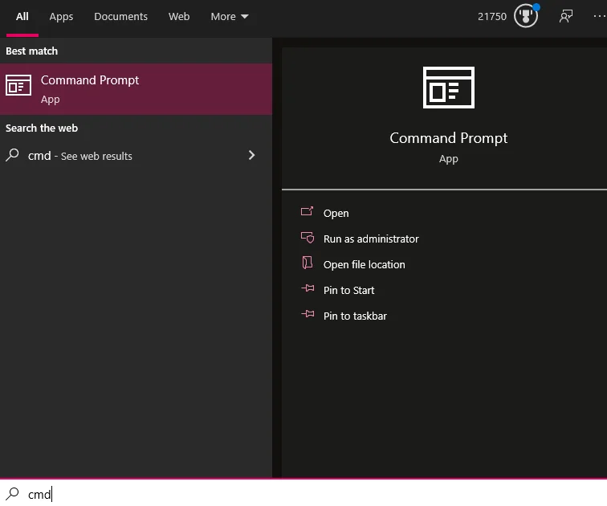
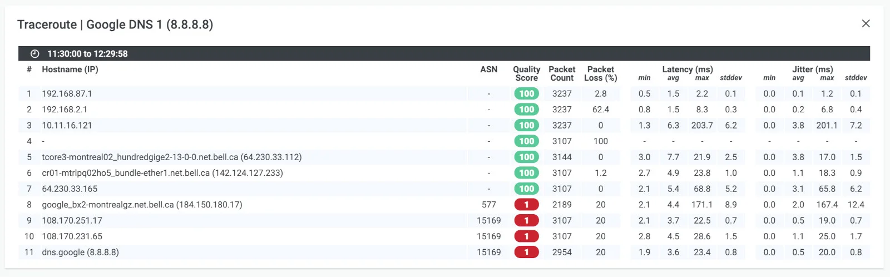

**Traceroute** 是网络诊断中最重要的工具之一，它能追踪数据包从源主机到目标主机所经过的每一个路由节点（跳数），并测量每一跳的延迟时间。无论是排查网络故障、定位延迟瓶颈，还是了解网络拓扑结构，traceroute 都是运维工程师和网络管理员的得力助手。

本文将从工作原理、命令用法、输出解读到实战案例，全面介绍 traceroute 的使用方法。

## 一、Traceroute 是什么

Traceroute（Windows 系统中叫 `tracert`）是一个网络诊断命令行工具，用于显示数据包在 IP 网络中从源到目的地的传输路径。

### 核心功能

| 功能 | 说明 |
|------|------|
| 路径追踪 | 显示数据包经过的每个路由器 |
| 延迟测量 | 测量到达每个节点的往返时间（RTT） |
| 故障定位 | 快速找出网络中断或延迟的节点 |
| 拓扑发现 | 了解网络的路由结构 |

### 平台差异

| 平台 | 命令 | 默认协议 |
|------|------|----------|
| Linux/macOS | `traceroute` | UDP |
| Windows | `tracert` | ICMP |
| Cisco IOS | `traceroute` | UDP |

## 二、工作原理：TTL 的巧妙应用

Traceroute 的核心原理是利用 IP 协议中的 **TTL（Time To Live）** 字段。

### TTL 机制

每个 IP 数据包都包含一个 TTL 值，表示数据包可以经过的最大路由器数量：

- 每经过一个路由器，TTL 值减 1
- 当 TTL 减到 0 时，路由器丢弃该数据包
- 路由器会向源地址发送 **ICMP Time Exceeded** 消息

### 探测过程

Traceroute 巧妙地利用这个机制来发现路径上的每个路由器：

```
第 1 次探测 (TTL=1):
源主机 ──[TTL=1]──> 路由器1 ──X (TTL=0，丢弃)
路由器1 ──[ICMP Time Exceeded]──> 源主机
✓ 发现第 1 跳：路由器1

第 2 次探测 (TTL=2):
源主机 ──[TTL=2]──> 路由器1 ──[TTL=1]──> 路由器2 ──X (TTL=0)
路由器2 ──[ICMP Time Exceeded]──> 源主机
✓ 发现第 2 跳：路由器2

第 N 次探测 (TTL=N):
数据包最终到达目标主机
目标主机 ──[ICMP Port Unreachable]──> 源主机
✓ 路径追踪完成
```

### 为什么每跳显示 3 个时间？

默认情况下，traceroute 对每一跳发送 **3 个探测包**，这样可以：

- 获得更准确的延迟数据
- 检测网络抖动（jitter）
- 发现负载均衡导致的多路径

## 三、Linux traceroute 命令详解

### 基本语法

```bash
traceroute [选项] 目标主机 [数据包大小]
```

### 常用参数

| 参数 | 说明 | 示例 |
|------|------|------|
| `-n` | 不解析主机名，直接显示 IP | `traceroute -n baidu.com` |
| `-m <跳数>` | 设置最大跳数（默认 30） | `traceroute -m 15 baidu.com` |
| `-q <次数>` | 每跳探测次数（默认 3） | `traceroute -q 1 baidu.com` |
| `-w <秒>` | 等待响应的超时时间 | `traceroute -w 5 baidu.com` |
| `-I` | 使用 ICMP ECHO 代替 UDP | `traceroute -I baidu.com` |
| `-T` | 使用 TCP SYN 探测 | `traceroute -T -p 80 baidu.com` |
| `-p <端口>` | 指定目标端口 | `traceroute -p 443 baidu.com` |
| `-i <接口>` | 指定网络接口 | `traceroute -i eth0 baidu.com` |
| `-s <IP>` | 指定源 IP 地址 | `traceroute -s 192.168.1.100 baidu.com` |

### 实战示例

**示例 1：基本用法**

```bash
$ traceroute www.baidu.com
traceroute to www.baidu.com (183.2.172.177), 30 hops max, 60 byte packets
 1  192.168.1.1 (192.168.1.1)  1.234 ms  1.123 ms  1.089 ms
 2  10.0.0.1 (10.0.0.1)  5.678 ms  5.432 ms  5.321 ms
 3  183.17.228.1 (183.17.228.1)  8.440 ms  7.046 ms  5.386 ms
 4  * * *
 5  113.106.35.5 (113.106.35.5)  9.818 ms  9.091 ms  7.037 ms
 6  183.2.172.177 (183.2.172.177)  10.234 ms  9.876 ms  9.654 ms
```

**示例 2：快速模式（不解析 DNS，每跳只探测 1 次）**

```bash
$ traceroute -n -q 1 www.baidu.com
```

这种方式速度更快，适合快速排查问题。

**示例 3：使用 ICMP 协议（类似 Windows tracert）**

```bash
$ sudo traceroute -I www.baidu.com
```

某些防火墙会过滤 UDP 但允许 ICMP，这时使用 `-I` 参数可能获得更好的结果。

**示例 4：使用 TCP 探测（穿透防火墙）**

```bash
$ sudo traceroute -T -p 443 www.baidu.com
```

当目标服务器或中间防火墙阻止 UDP 和 ICMP 时，可以尝试 TCP 探测。

## 四、Windows tracert 命令详解

Windows 系统使用 `tracert` 命令，默认采用 ICMP 协议。

### 基本语法

```cmd
tracert [-d] [-h maximum_hops] [-j host-list] [-w timeout] target_name
```

### 常用参数

| 参数 | 说明 |
|------|------|
| `-d` | 不解析主机名 |
| `-h <跳数>` | 最大跳数 |
| `-w <毫秒>` | 超时时间（毫秒） |
| `-j <主机列表>` | 松散源路由 |

### 实战示例



```cmd
C:\> tracert www.baidu.com

Tracing route to www.baidu.com [183.2.172.177]
over a maximum of 30 hops:

  1     1 ms     1 ms     1 ms  192.168.1.1
  2     5 ms     4 ms     5 ms  10.0.0.1
  3     8 ms     7 ms     8 ms  183.17.228.1
  4     *        *        *     Request timed out.
  5    10 ms     9 ms    10 ms  113.106.35.5
  6    11 ms    10 ms    11 ms  183.2.172.177

Trace complete.
```

## 五、输出解读技巧

理解 traceroute 的输出是诊断网络问题的关键。

### 输出结构



每行输出包含以下信息：

```
跳数  响应时间1  响应时间2  响应时间3  主机名/IP地址
 1    1.234 ms   1.123 ms   1.089 ms   192.168.1.1
```

### 常见情况解读

**1. 正常响应**

```
3  183.17.228.1 (183.17.228.1)  8.440 ms  7.046 ms  5.386 ms
```

三个时间值接近，说明该节点响应正常。

**2. 星号（*）— 超时**

```
4  * * *
```

表示该跳没有响应，可能原因：
- 路由器配置为不响应 ICMP/UDP
- 防火墙过滤
- 网络拥塞导致丢包
- 实际网络中断

**3. 部分超时**

```
5  113.106.35.5 (113.106.35.5)  9.818 ms *  7.037 ms
```

一个探测包超时，可能是轻微丢包或负载均衡。

**4. 延迟突增**

```
3  10.0.0.1 (10.0.0.1)      5 ms   5 ms   5 ms
4  202.97.80.1 (202.97.80.1)  150 ms  148 ms  152 ms  ← 延迟突增
```

从 5ms 跳到 150ms，说明第 3-4 跳之间存在延迟瓶颈，可能是：
- 跨运营商或跨国链路
- 链路拥塞
- 物理距离较远

**5. 多个 IP 地址**

```
5  113.106.35.5 (113.106.35.5)  9 ms
   113.106.35.1 (113.106.35.1)  8 ms
   202.105.106.49 (202.105.106.49)  7 ms
```

同一跳显示多个 IP，说明该位置存在负载均衡或 ECMP（等价多路径）路由。

### 可视化网络路径


现代监控工具可以将 traceroute 结果可视化为网络地图，更直观地展示数据包的传输路径。

## 六、故障排查实战

### 场景 1：确定延迟发生在哪个环节

```bash
$ traceroute -n www.example.com
 1  192.168.1.1      1 ms   1 ms   1 ms     ← 本地路由器，正常
 2  10.0.0.1         5 ms   5 ms   5 ms     ← ISP 网关，正常
 3  202.97.80.1     15 ms  14 ms  15 ms     ← 骨干网入口
 4  202.97.80.113  180 ms 175 ms 182 ms     ← 延迟突增！问题点
 5  219.148.18.117 185 ms 183 ms 186 ms
 6  * * *
```

**分析**：第 3-4 跳之间延迟从 15ms 跳到 180ms，说明该链路存在问题，需要联系 ISP 排查。

### 场景 2：判断是否是本地网络问题

```bash
$ traceroute -n www.example.com
 1  * * *                                   ← 本地路由器无响应
 2  * * *
 3  * * *
```

**分析**：第 1 跳就没有响应，说明可能是：
- 本地路由器问题
- 本地网络配置错误
- 防火墙阻止了 traceroute

### 场景 3：防火墙导致的误判

```bash
$ traceroute www.example.com
 1  192.168.1.1      1 ms   1 ms   1 ms
 2  10.0.0.1         5 ms   5 ms   5 ms
 3  * * *
 4  * * *
 5  * * *
 6  203.0.113.1     20 ms  19 ms  20 ms     ← 目标主机正常响应
```

**分析**：中间几跳显示 `* * *`，但最终到达目标，说明中间路由器配置为不响应 traceroute 探测包，这是正常的安全配置，网络本身没有问题。

## 七、进阶技巧

### 1. MTR：更强大的替代工具

MTR（My Traceroute）结合了 traceroute 和 ping 的功能，提供持续监控：

```bash
$ mtr www.baidu.com
```

MTR 会持续探测并显示丢包率、平均延迟等统计信息。

### 2. TCP 穿透防火墙

当 UDP/ICMP 被阻止时：

```bash
$ sudo traceroute -T -p 80 www.example.com   # HTTP 端口
$ sudo traceroute -T -p 443 www.example.com  # HTTPS 端口
```

### 3. 指定源 IP（多网卡场景）

```bash
$ traceroute -s 192.168.1.100 -i eth0 www.example.com
```

### 4. 增加探测包大小

某些问题只在大包时出现（MTU 问题）：

```bash
$ traceroute www.example.com 1400  # 1400 字节的数据包
```

## 八、常见问题

### Q1：为什么某些跳显示 `* * *`？

可能原因：
1. 路由器配置为不响应 ICMP Time Exceeded
2. 防火墙过滤
3. 网络拥塞导致丢包
4. 该节点真的无法到达

**解决方法**：如果最终能到达目标，通常不用担心中间的 `* * *`。

### Q2：traceroute 和 ping 有什么区别？

| 工具 | 功能 | 适用场景 |
|------|------|----------|
| ping | 测试目标是否可达，测量 RTT | 快速检查连通性 |
| traceroute | 显示完整路径，定位问题节点 | 排查延迟/中断的具体位置 |

### Q3：为什么 Linux 和 Windows 的结果不同？

Linux 默认使用 UDP，Windows 默认使用 ICMP。某些防火墙对两种协议的处理不同，可能导致结果差异。在 Linux 上使用 `-I` 参数可以获得类似 Windows 的结果。

---

## 总结

Traceroute 是网络诊断的基础工具，掌握它能帮助你：

1. **了解网络拓扑** — 看到数据包的实际传输路径
2. **定位延迟问题** — 找出网络中的瓶颈节点
3. **排查连通性故障** — 确定问题发生在哪个环节
4. **与 ISP 沟通** — 提供准确的故障信息

记住几个关键点：
- `* * *` 不一定代表问题，要看最终是否能到达目标
- 延迟突增的位置才是真正需要关注的
- 结合 ping、MTR 等工具综合判断

---

## 相关阅读

- [Linux curl 命令完全指南：HTTP 请求调试必备工具](/posts/linux/2020-06-29-curl/) - HTTP 请求调试神器
- [Linux/macOS 常用命令速查手册](/posts/linux/2020-03-19-linux-mac-commands/) - 运维开发常用命令参考

## 参考资料

- [Traceroute - Wikipedia](https://en.wikipedia.org/wiki/Traceroute)
- [How to Read a Traceroute - Catchpoint](https://www.catchpoint.com/network-admin-guide/how-to-read-a-traceroute)
- [What are Traceroutes - Obkio](https://obkio.com/blog/traceroutes-what-are-they-and-how-do-they-work/)
