+++
title = '2025年终端工具推荐：25款高效终端模拟器全面对比'
date = '2025-01-22'
draft = false
description = '全面盘点2025年最值得使用的终端工具，包括iTerm2、Warp、Ghostty、Tabby等跨平台终端模拟器，帮助开发者提升命令行工作效率。'
tags = ['终端', '开发工具', '效率工具', 'macOS', 'Windows', 'Linux']
categories = ['macOS']
keywords = ['终端工具', '终端模拟器', 'iTerm2', 'Warp', 'Ghostty', 'Tabby', 'Windows Terminal', '跨平台终端', 'SSH客户端', '命令行工具']
+++

作为开发者，终端是我们每天打交道最多的工具之一。一款好用的终端工具不仅能提升工作效率，还能让枯燥的命令行操作变得更加愉悦。本文将全面介绍 25 款主流终端工具，涵盖 Windows、macOS 和 Linux 三大平台，帮你找到最适合自己的那一款。

<!--more-->

## 为什么要选择一款好的终端工具？

在深入介绍各款终端之前，我们先来看看一款优秀的终端工具应该具备哪些特性：

- **高性能渲染**：流畅的滚动和文本渲染，即使处理大量输出也不卡顿
- **多标签/分屏**：同时处理多个任务，提高工作效率
- **主题定制**：支持自定义配色、字体等，打造个性化工作环境
- **跨平台支持**：在不同操作系统上保持一致的使用体验
- **SSH 管理**：方便地连接和管理远程服务器
- **AI 集成**：2025 年的新趋势，让 AI 辅助你的命令行操作

## macOS 平台终端推荐

### 1. iTerm2 - macOS 终端的王者

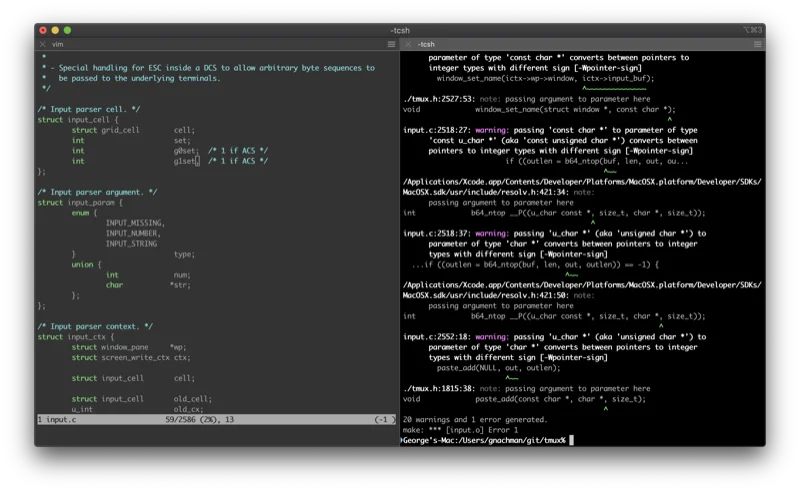

[iTerm2](https://iterm2.com/) 是 macOS 上最受欢迎的终端模拟器，拥有 **16.8k+ GitHub Stars**。

**核心特性：**
- 分屏功能：支持水平/垂直分割窗口
- Hotkey Window：一键呼出/隐藏终端
- 搜索功能：强大的历史命令和输出搜索
- 自动完成：基于历史记录的智能补全
- Shell Integration：深度整合命令行操作
- 支持 Triggers：自动响应特定输出

**适用场景：** macOS 用户的首选，功能全面，社区活跃。

### 2. Warp - AI 时代的现代终端

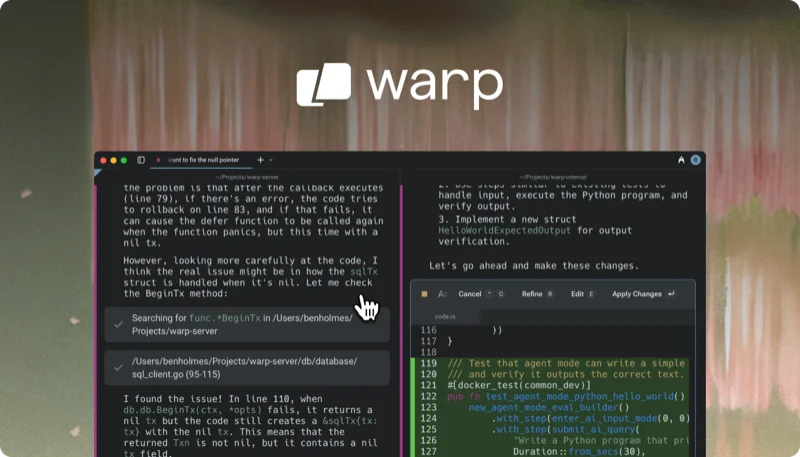

[Warp](https://www.warp.dev/) 是一款革命性的 AI 驱动终端，拥有 **25.7k+ GitHub Stars**，使用 Rust 构建，性能卓越。

**核心特性：**
- **Warp AI**：内置 AI 助手，可以用自然语言生成命令
- **Block 编辑**：将命令和输出组织成可操作的 Block
- **Warp Drive**：团队共享命令和工作流
- **现代编辑器**：支持光标移动、选择、复制粘贴等现代编辑操作
- 智能命令补全和建议

**适用场景：** 追求效率的开发者，特别是需要频繁查找命令用法的用户。

### 3. Ghostty - 2024 年的新星

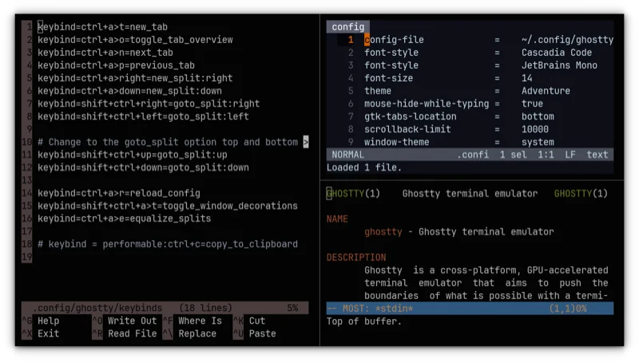

[Ghostty](https://ghostty.org/) 是由 HashiCorp 联合创始人 Mitchell Hashimoto 开发的新一代终端，拥有 **41.8k+ GitHub Stars**，于 2024 年 12 月开源。

**核心特性：**
- 使用 Zig 语言编写，极致性能
- GPU 加速渲染
- 原生 UI 集成
- 跨平台支持（macOS、Linux）
- MIT 开源协议

**适用场景：** 追求极致性能和简洁设计的用户。

### 4. Alacritty - 极简主义者的选择

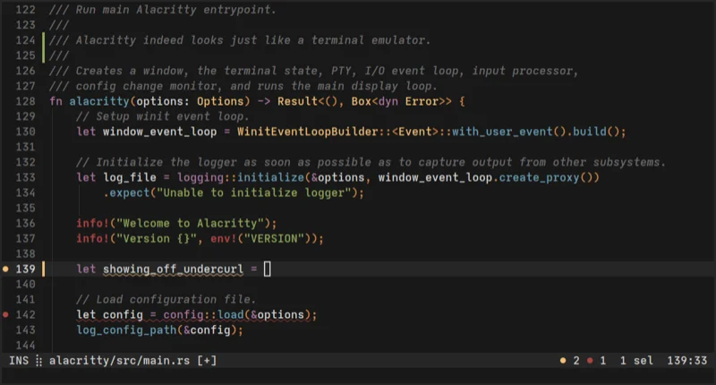

[Alacritty](https://alacritty.org/) 自称"最快的终端模拟器"，专注于性能和简洁。

**核心特性：**
- GPU 加速渲染
- 跨平台（Windows、macOS、Linux）
- 配置文件驱动
- 极低的资源占用

**适用场景：** 喜欢简洁、追求性能的用户，配合 tmux 使用效果更佳。

## Windows 平台终端推荐

### 5. Windows Terminal - 微软的诚意之作

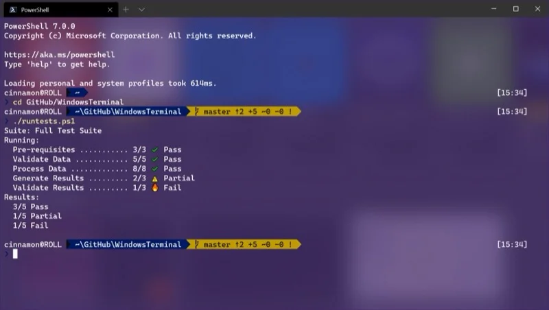

[Windows Terminal](https://github.com/microsoft/terminal) 是微软官方推出的现代终端应用。

**核心特性：**
- 多标签页支持
- 支持 PowerShell、CMD、WSL 等多种 Shell
- GPU 加速文本渲染
- 丰富的主题定制
- 支持 Unicode 和 Emoji

**适用场景：** Windows 用户的首选，特别是使用 WSL 的开发者。

### 6. PowerShell 7 - 跨平台的强大 Shell

[PowerShell](https://github.com/PowerShell/PowerShell) 已经进化为跨平台工具，不再局限于 Windows。

**核心特性：**
- 跨平台运行
- 强大的管道和对象处理
- 丰富的命令集
- .NET 集成

**适用场景：** Windows 系统管理员和 .NET 开发者。

### 7. Cmder - Windows 命令行增强器

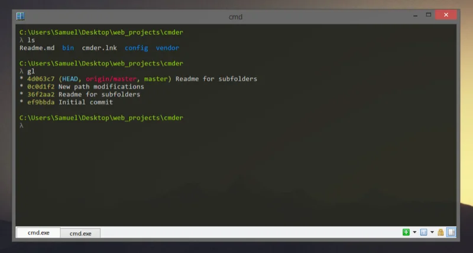

[Cmder](https://cmder.app/) 是一款便携式控制台模拟器，专为 Windows 设计。

**核心特性：**
- 无需安装，开箱即用
- 集成 Git for Windows
- 漂亮的界面和主题
- 支持多种 Shell

**适用场景：** 需要便携式终端解决方案的 Windows 用户。

### 8. MobaXterm - 远程连接神器

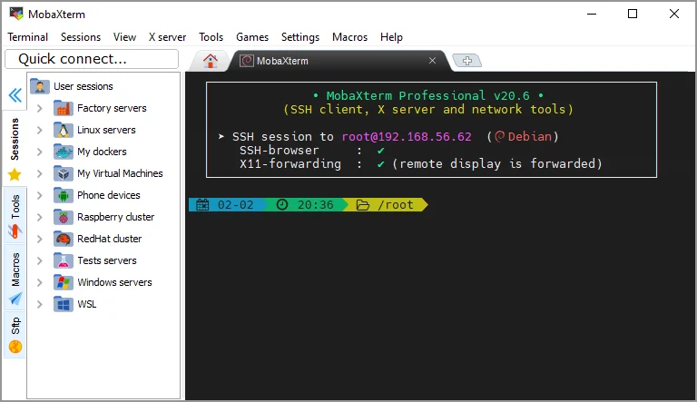

[MobaXterm](https://mobaxterm.mobatek.net/) 是 Windows 上功能最全面的终端工具之一。

**核心特性：**
- 内置 SSH、X11、RDP、VNC 等多种远程协议
- 便携版可用
- 内置 Unix 命令集
- 会话管理器
- 支持宏录制

**适用场景：** 需要频繁连接远程服务器的运维工程师。

### 9. XShell - 专业的 SSH 客户端

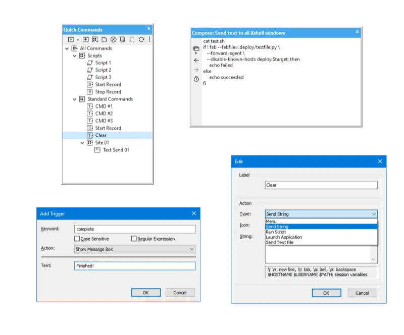

[XShell](https://www.netsarang.com/products/xsh_overview.html) 是一款功能强大的 SSH 客户端。

**核心特性：**
- 强大的会话管理
- 支持多种安全协议
- 脚本自动化
- 隧道转发

**适用场景：** 企业级运维场景。

### 10. Fluent Terminal - UWP 现代终端（强烈推荐）

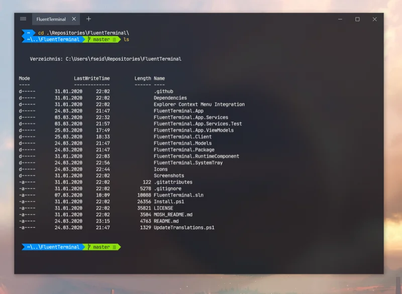

[Fluent Terminal](https://github.com/felixse/FluentTerminal) 是一款基于 UWP 的现代终端。

**核心特性：**
- Fluent Design 界面
- 多标签支持
- 支持 WSL
- 自定义主题

**适用场景：** 喜欢现代 Windows 设计风格的用户。

## 跨平台终端推荐

### 11. Tabby - 现代化的全能终端

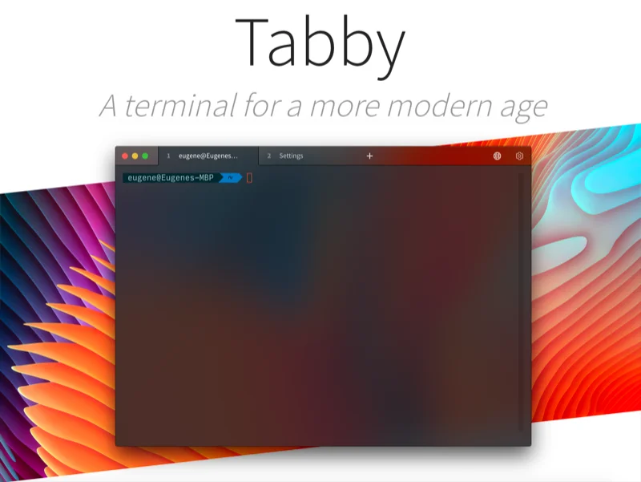

[Tabby](https://tabby.sh/)（原名 Terminus）是一款高度可定制的跨平台终端，拥有 **68.3k+ GitHub Stars**。

**核心特性：**
- 集成 SSH 客户端和连接管理器
- 支持串口连接
- 丰富的插件生态
- 跨平台（Windows、macOS、Linux）
- 支持同步配置

**适用场景：** 需要统一管理多平台终端的用户。

### 12. Hyper - 基于 Electron 的美观终端

[Hyper](https://hyper.is/) 是一款基于 Web 技术构建的终端。

**核心特性：**
- 丰富的主题和插件
- 基于 HTML/CSS/JS 定制
- 跨平台支持

**适用场景：** 前端开发者，喜欢折腾主题的用户。

### 13. Kitty - GPU 加速的强大终端

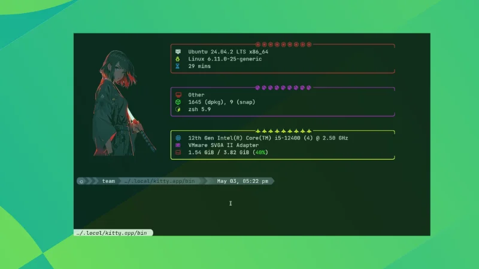

[Kitty](https://sw.kovidgoyal.net/kitty/) 是一款使用 GPU 渲染的快速终端。

**核心特性：**
- GPU 渲染，极速响应
- 支持图片显示
- 支持连字（Ligatures）
- 可脚本化扩展

**适用场景：** 追求性能的 Linux 和 macOS 用户。

### 14. WezTerm - Rust 编写的 GPU 终端

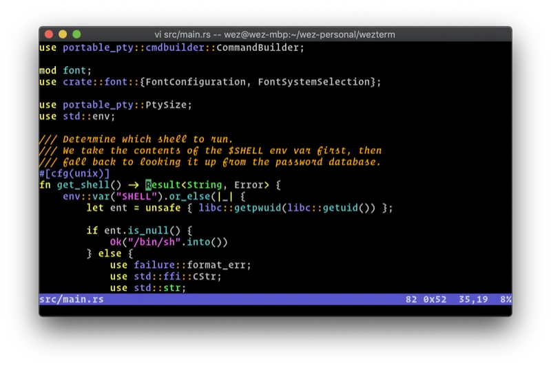

[WezTerm](https://wezfurlong.org/wezterm/) 是一款使用 Rust 编写的 GPU 加速终端。

**核心特性：**
- GPU 加速
- 内置多路复用器
- 跨平台
- Lua 配置

**适用场景：** 喜欢 Lua 配置的用户。

### 15. Wave Terminal - 开源 AI 终端

[Wave Terminal](https://www.waveterm.dev/) 是一款集成 AI 功能的现代终端。

**核心特性：**
- 内置 AI 辅助
- 现代化界面
- 跨平台支持

**适用场景：** 想要免费 AI 终端体验的用户。

## SSH 客户端专项推荐

### 16. WindTerm - 专业的跨平台 SSH 客户端

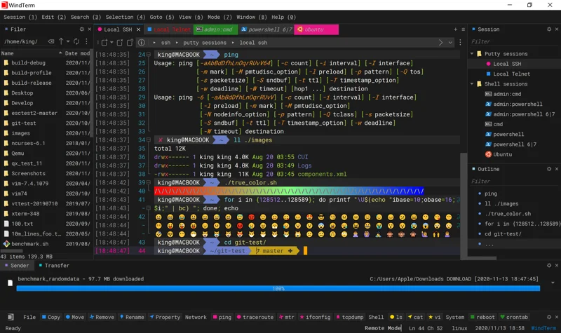

[WindTerm](https://github.com/kingToolbox/WindTerm) 是一款快速、稳定的跨平台 SSH/Telnet/Serial/Shell 终端。

**核心特性：**
- 高性能
- 会话管理
- 支持多种协议

### 17. FinalShell - 国产全能 SSH 工具

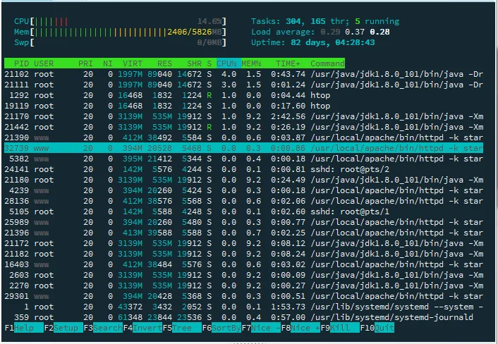

[FinalShell](http://www.hostbuf.com/t/988.html) 是一款国产 SSH 工具。

**核心特性：**
- 一键部署
- 服务器监控
- 中文界面友好

### 18. Xterminal - 简洁的 SSH 客户端

[Xterminal](https://www.xterminal.cn/) 是一款专注于简洁的 SSH 客户端。

### 19. T-Shell - 轻量级 SSH 管理

[T-Shell](https://github.com/niceit/t-shell) 是一款轻量级的 SSH 管理工具。

### 20. sshx - 基于 Web 的协作终端

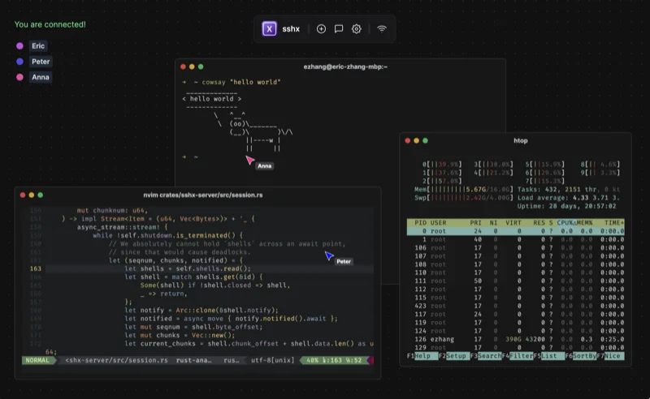

[sshx](https://sshx.io/) 是一款支持多人协作的 Web 终端。

**核心特性：**
- 多人实时协作
- 无需安装客户端
- 端到端加密

**适用场景：** 团队协作调试、远程教学。

## 其他特色终端

### 21. ConEmu - Windows 终端增强

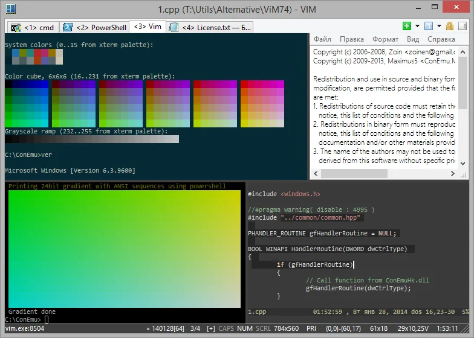

[ConEmu](https://conemu.github.io/) 是一款功能丰富的 Windows 终端模拟器。

### 22. Shell360 - 跨平台 Shell 工具

[Shell360](https://shell360.com/) 支持多种操作系统和协议。

### 23. IShell - AI 驱动的智能终端

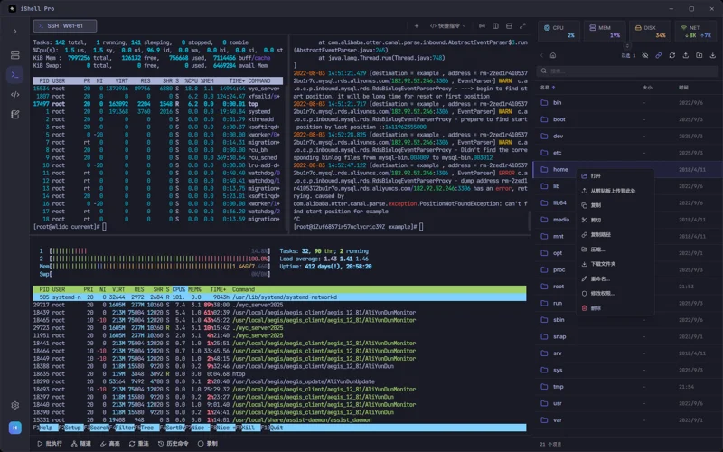

[IShell](https://ishell.cc/zh-CN) 是一款轻量又高性能的跨平台 SSH 工具，内置 AI 功能。

**核心特性：**
- **AI 赋能**：内置 70B 大模型，支持自然语言生成命令和脚本
- **SFTP 集成**：支持文件夹上传下载、断点续传、代码高亮编辑
- **云同步**：多端数据同步，支持云笔记功能
- **跨平台**：支持 Windows、macOS、Linux、Android、iOS
- **高颜值**：简洁现代的界面设计，支持自定义背景和主题

**适用场景：** 需要 AI 辅助的运维工程师，追求美观界面的用户。

### 24. Git Bash - Git 用户必备

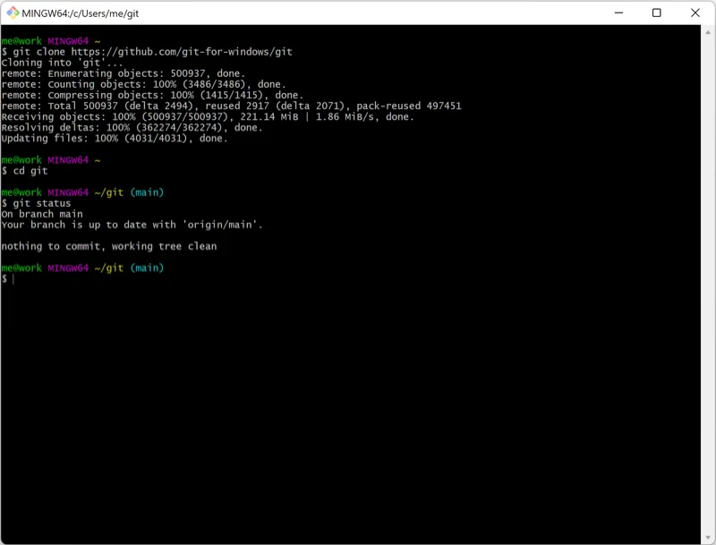

[Git Bash](https://gitforwindows.org/) 是 Git for Windows 自带的终端。

**核心特性：**
- 提供 Unix 命令行环境
- 与 Git 深度集成

**适用场景：** Windows 上使用 Git 的开发者。

### 25. Zellij - 现代终端复用器

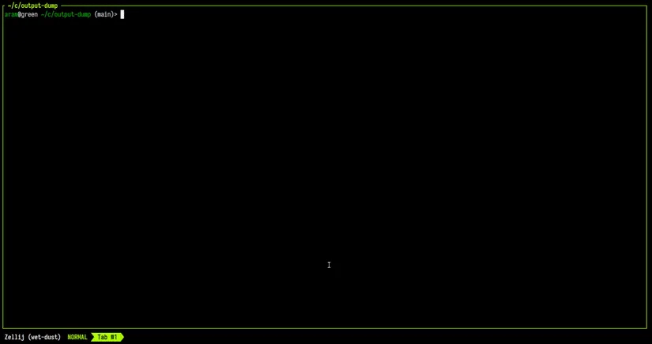

[Zellij](https://zellij.dev/) 是一款使用 Rust 编写的现代终端复用器，是 tmux 的现代替代品。

**核心特性：**
- 开箱即用的默认配置
- 插件系统
- 现代化 UI

**适用场景：** 想要 tmux 替代品的用户。

## 终端工具选择建议

根据不同使用场景，我的推荐如下：

| 使用场景 | 推荐终端 |
|---------|---------|
| macOS 日常开发 | iTerm2 / Warp |
| Windows 日常开发 | Windows Terminal |
| 追求极致性能 | Ghostty / Alacritty / Kitty |
| 跨平台统一体验 | Tabby / WezTerm |
| 远程服务器管理 | MobaXterm / WindTerm |
| 团队协作 | sshx / Warp |
| AI 辅助编程 | Warp / Wave Terminal |
| 简洁主义者 | Alacritty + tmux |

## 2025 年终端发展趋势

1. **AI 集成**：越来越多的终端开始集成 AI 功能，帮助用户生成和理解命令
2. **GPU 加速**：现代终端普遍采用 GPU 渲染，提升性能
3. **跨平台**：开发者希望在不同系统上获得一致的体验
4. **Rust 重写**：Rust 语言因其安全性和性能优势，成为终端开发的热门选择
5. **协作功能**：支持团队共享命令、实时协作的终端越来越多

## 总结

没有最好的终端，只有最适合你的终端。建议大家根据自己的操作系统、使用习惯和具体需求，选择 2-3 款终端进行试用，最终找到最顺手的那一款。

如果你是 macOS 用户，强烈推荐从 **iTerm2** 或 **Warp** 开始；Windows 用户可以先试试 **Windows Terminal**或者**Fluent Terminal**；追求性能的用户不妨体验一下 **Ghostty** 或 **Alacritty**。

你目前在使用哪款终端？欢迎在评论区分享你的使用体验！

## 参考资源

- [iTerm2 官网](https://iterm2.com/)
- [Warp 官网](https://www.warp.dev/)
- [Ghostty GitHub](https://github.com/ghostty-org/ghostty)
- [Tabby 官网](https://tabby.sh/)
- [Windows Terminal GitHub](https://github.com/microsoft/terminal)
- [Alacritty 官网](https://alacritty.org/)
