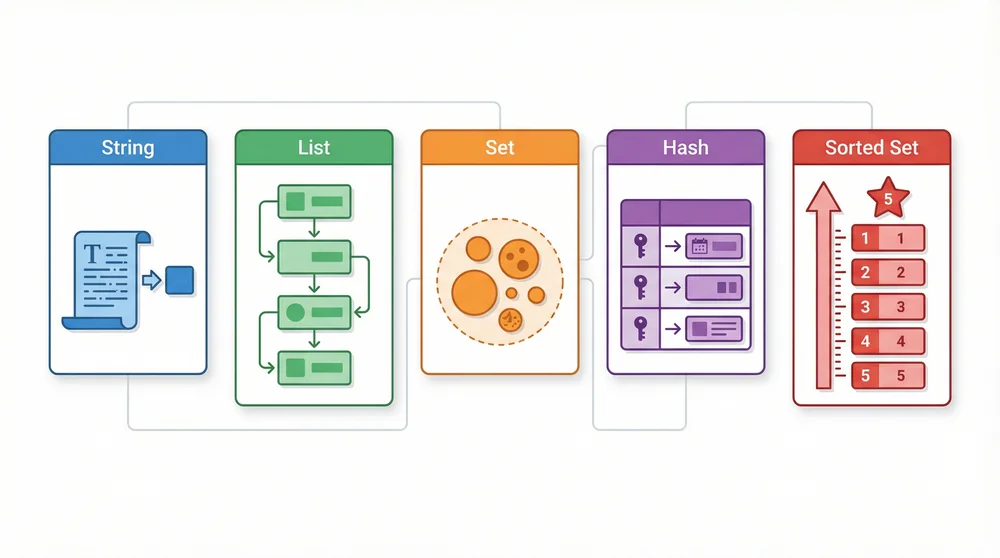
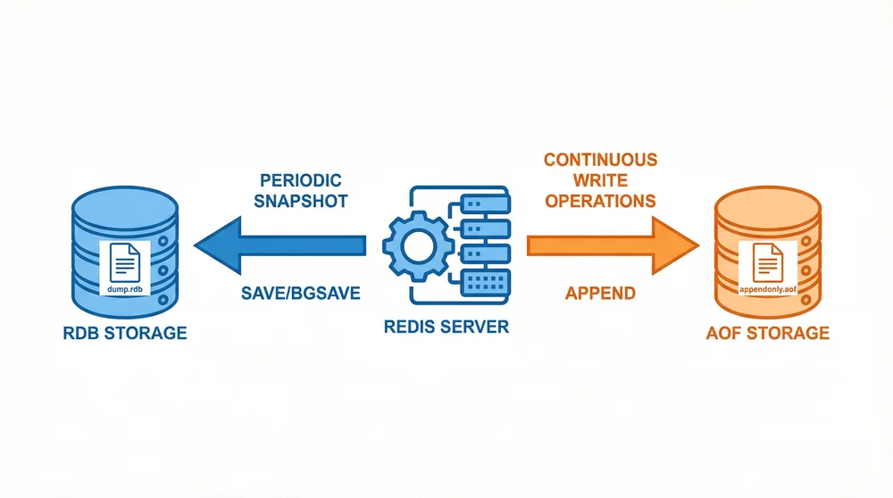
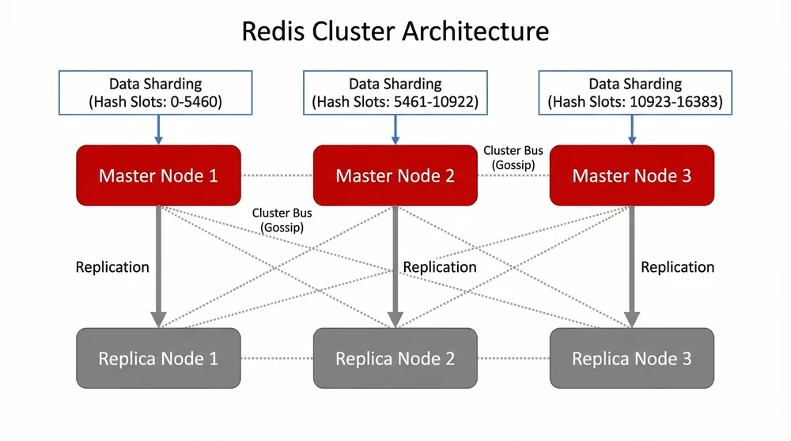

+++
title = 'Redis 从入门到精通：安装配置与实战指南'
date = '2026-01-22T17:00:00+08:00'
draft = false
author = 'weijia'
description = 'Redis 完全指南，详解 macOS 和 Windows 安装方法、五大数据类型、常用命令、持久化机制、主从复制与集群配置。从零基础到精通 Redis 的最佳学习路径。'
toc = true
tags = ['Redis', '数据库', '缓存', 'NoSQL', '中间件']
categories = ['中间件']
keywords = ['Redis安装', 'Redis教程', 'Redis数据类型', 'Redis持久化', 'Redis集群']
+++


**Redis**（Remote Dictionary Server）是一款开源的高性能键值存储数据库，以其出色的读写速度和丰富的数据结构支持，成为现代应用架构中不可或缺的组件。本文将带你从零开始，系统学习 Redis 的安装配置、核心概念、数据类型、持久化机制以及高可用集群部署。

## 一、Redis 简介

### 1. 什么是 Redis

Redis 是一个使用 ANSI C 语言编写、支持网络、可基于内存亦可持久化的键值对（Key-Value）数据库。它支持多种数据结构，包括字符串、哈希、列表、集合和有序集合，并提供多种语言的 API。

**核心特性**：

- **高性能**：纯内存操作，读写速度可达 10 万+ QPS
- **丰富的数据类型**：String、Hash、List、Set、Sorted Set 等
- **原子性操作**：所有操作都是原子的，支持事务
- **持久化**：支持 RDB 和 AOF 两种持久化方式
- **高可用**：支持主从复制、哨兵和集群模式

### 2. Redis 应用场景

| 场景 | 说明 |
|------|------|
| **缓存** | 热点数据缓存，减轻数据库压力 |
| **会话存储** | 分布式系统中的 Session 共享 |
| **排行榜** | 利用有序集合实现实时排名 |
| **消息队列** | 利用 List 实现简单的消息队列 |
| **计数器** | 利用原子操作实现访问计数、点赞数等 |
| **分布式锁** | 实现跨进程的资源互斥访问 |

## 二、Redis 安装与配置

### 1. macOS 安装

在 macOS 上推荐使用 [Homebrew](https://brew.sh/) 安装 Redis：

```bash
# 更新 Homebrew（可选但推荐）
brew update

# 安装 Redis
brew install redis
```

**启动方式**：

```bash
# 方式 A：作为后台服务自启（推荐）
brew services start redis

# 查看服务状态
brew services list

# 方式 B：前台运行（调试用）
redis-server
```

**验证安装**：

```bash
# 测试连接
redis-cli ping
# 期望返回：PONG
```

**服务管理**：

```bash
# 停止服务
brew services stop redis

# 重启服务
brew services restart redis
```

### 2. Windows 安装

Redis 官方不直接支持 Windows，但有以下几种安装方式：

#### 方式一：使用 WSL（推荐）

Windows Subsystem for Linux 可以运行原生的 Linux 版本 Redis：

```bash
# 1. 启用 WSL 并安装 Ubuntu
wsl --install

# 2. 在 WSL 中安装 Redis
sudo apt update
sudo apt install redis-server

# 3. 启动 Redis
sudo service redis-server start

# 4. 验证
redis-cli ping
```

#### 方式二：使用 Windows 移植版

从 [tporadowski/redis](https://github.com/tporadowski/redis/releases) 下载 MSI 安装包：

1. 下载 `Redis-x64-5.0.14.1.msi`
2. 双击运行安装程序
3. 安装完成后，Redis 会作为 Windows 服务自动启动

**服务管理**：

```powershell
# 查看服务状态
Get-Service redis

# 停止服务
Stop-Service redis

# 启动服务
Start-Service redis
```

#### 方式三：使用最新版本（无 MSI）

从 [redis-windows/redis-windows](https://github.com/redis-windows/redis-windows/releases) 下载：

- 支持 Redis 6.x、7.x、8.x 版本
- 解压后运行 `start.bat` 即可启动

### 3. Docker 安装

使用 Docker 是最简单、最一致的安装方式：

```bash
# 拉取最新镜像
docker pull redis:latest

# 启动容器
docker run -d \
  --name redis \
  -p 6379:6379 \
  -v redis-data:/data \
  redis:latest

# 连接测试
docker exec -it redis redis-cli ping
```

**带配置文件启动**：

```bash
docker run -d \
  --name redis \
  -p 6379:6379 \
  -v /path/to/redis.conf:/usr/local/etc/redis/redis.conf \
  -v redis-data:/data \
  redis:latest redis-server /usr/local/etc/redis/redis.conf
```

### 4. 基本配置

Redis 配置文件 `redis.conf` 的常用配置项：

```conf
# 绑定地址（生产环境建议绑定具体 IP）
bind 127.0.0.1

# 端口
port 6379

# 密码（生产环境必须设置）
requirepass your_password

# 最大内存
maxmemory 256mb

# 内存淘汰策略
maxmemory-policy allkeys-lru

# 持久化配置
save 900 1      # 900 秒内至少 1 次修改则保存
save 300 10     # 300 秒内至少 10 次修改则保存
save 60 10000   # 60 秒内至少 10000 次修改则保存

# 日志级别
loglevel notice

# 日志文件
logfile "/var/log/redis/redis-server.log"
```

## 三、Redis 数据类型详解



Redis 提供了 5 种核心数据类型，每种类型都有其特定的使用场景和操作命令。

### 1. String（字符串）

String 是 Redis 最基本的数据类型，一个 key 对应一个 value。它是二进制安全的，可以存储任何数据（文本、数字、序列化对象、图片等），最大 512MB。

**常用命令**：

```bash
# 设置值
SET name "Redis"
SET counter 100

# 获取值
GET name

# 设置过期时间（秒）
SET session "abc123" EX 3600

# 不存在时才设置（分布式锁常用）
SETNX lock "1"

# 数值操作
INCR counter      # 自增 1，返回 101
DECR counter      # 自减 1，返回 100
INCRBY counter 10 # 增加 10，返回 110

# 批量操作
MSET k1 "v1" k2 "v2" k3 "v3"
MGET k1 k2 k3

# 追加字符串
APPEND name " Database"
GET name  # 返回 "Redis Database"

# 获取长度
STRLEN name
```

**应用场景**：缓存、计数器、分布式锁、Session 存储。

### 2. Hash（哈希）

Hash 是一个键值对集合，适合存储对象。相比将对象序列化为 String 存储，Hash 可以对单个字段进行读写，更加高效。

**常用命令**：

```bash
# 设置字段
HSET user:1001 name "张三"
HSET user:1001 age 25
HSET user:1001 email "zhangsan@example.com"

# 批量设置
HMSET user:1002 name "李四" age 30 email "lisi@example.com"

# 获取字段
HGET user:1001 name

# 获取多个字段
HMGET user:1001 name age

# 获取所有字段和值
HGETALL user:1001

# 判断字段是否存在
HEXISTS user:1001 name

# 删除字段
HDEL user:1001 email

# 获取所有字段名
HKEYS user:1001

# 获取所有值
HVALS user:1001

# 获取字段数量
HLEN user:1001

# 数值增减
HINCRBY user:1001 age 1
```

**应用场景**：用户信息、商品信息、配置信息等对象存储。

### 3. List（列表）

List 是一个双向链表，可以从两端进行插入和删除操作。按照插入顺序排序，支持正向和反向遍历。

**常用命令**：

```bash
# 从左侧插入
LPUSH queue "task1"
LPUSH queue "task2" "task3"

# 从右侧插入
RPUSH queue "task4"

# 查看列表（0 到 -1 表示所有元素）
LRANGE queue 0 -1

# 从左侧弹出
LPOP queue

# 从右侧弹出
RPOP queue

# 获取指定位置的元素
LINDEX queue 0

# 获取列表长度
LLEN queue

# 阻塞式弹出（消息队列常用）
BLPOP queue 30  # 等待 30 秒

# 删除指定元素
LREM queue 1 "task1"  # 删除 1 个 "task1"

# 截取列表
LTRIM queue 0 99  # 只保留前 100 个元素
```

**应用场景**：消息队列、最新动态、历史记录。

### 4. Set（集合）

Set 是无序的字符串集合，元素唯一不重复。支持集合运算（交集、并集、差集），非常适合处理标签、好友关系等场景。

**常用命令**：

```bash
# 添加元素
SADD tags "redis" "database" "cache"

# 查看所有元素
SMEMBERS tags

# 判断元素是否存在
SISMEMBER tags "redis"

# 获取元素数量
SCARD tags

# 删除元素
SREM tags "cache"

# 随机获取元素
SRANDMEMBER tags 2

# 随机弹出元素
SPOP tags

# 集合运算
SADD set1 "a" "b" "c"
SADD set2 "b" "c" "d"

# 交集
SINTER set1 set2      # 返回 b, c

# 并集
SUNION set1 set2      # 返回 a, b, c, d

# 差集
SDIFF set1 set2       # 返回 a
```

**应用场景**：标签系统、共同好友、唯一访客统计。

### 5. Sorted Set（有序集合）

Sorted Set（ZSet）与 Set 类似，但每个元素都关联一个分数（score），元素按分数从小到大排序。元素唯一，但分数可以重复。

**常用命令**：

```bash
# 添加元素（分数 元素）
ZADD leaderboard 100 "player1"
ZADD leaderboard 200 "player2"
ZADD leaderboard 150 "player3"

# 查看排名（从小到大）
ZRANGE leaderboard 0 -1 WITHSCORES

# 查看排名（从大到小）
ZREVRANGE leaderboard 0 -1 WITHSCORES

# 获取元素分数
ZSCORE leaderboard "player1"

# 获取元素排名（从 0 开始）
ZRANK leaderboard "player1"     # 升序排名
ZREVRANK leaderboard "player1"  # 降序排名

# 增加分数
ZINCRBY leaderboard 50 "player1"

# 按分数范围查询
ZRANGEBYSCORE leaderboard 100 200

# 删除元素
ZREM leaderboard "player1"

# 获取元素数量
ZCARD leaderboard

# 统计分数范围内的元素数量
ZCOUNT leaderboard 100 200
```

**应用场景**：排行榜、延时队列、带权重的任务调度。

## 四、Redis 持久化机制



Redis 是内存数据库，为了保证数据不丢失，提供了两种持久化方式：RDB 和 AOF。

### 1. RDB（Redis Database）

RDB 是 Redis 的默认持久化方式，通过生成数据快照（snapshot）保存到磁盘。

**触发方式**：

- **自动触发**：根据配置的 save 规则
- **手动触发**：
  - `SAVE`：同步保存，会阻塞主线程
  - `BGSAVE`：异步保存，fork 子进程执行

**配置示例**：

```conf
# 触发规则
save 900 1      # 900 秒内 1 次修改
save 300 10     # 300 秒内 10 次修改
save 60 10000   # 60 秒内 10000 次修改

# 文件名
dbfilename dump.rdb

# 存储目录
dir /var/lib/redis/

# 压缩（建议关闭，节省 CPU）
rdbcompression no

# 校验（建议开启）
rdbchecksum yes
```

**优点**：
- 文件紧凑，适合备份和灾难恢复
- 恢复速度快
- 对性能影响小（子进程执行）

**缺点**：
- 可能丢失最后一次快照后的数据
- fork 子进程时，大数据量会有短暂卡顿

### 2. AOF（Append Only File）

AOF 通过记录每个写操作命令，以追加的方式保存到文件。恢复时重新执行这些命令来重建数据。

**配置示例**：

```conf
# 开启 AOF
appendonly yes

# 文件名
appendfilename "appendonly.aof"

# 同步策略
appendfsync everysec  # 每秒同步（推荐）
# appendfsync always  # 每次写操作都同步（最安全但最慢）
# appendfsync no      # 由操作系统决定（最快但可能丢数据）

# 重写配置
auto-aof-rewrite-percentage 100  # 文件增长 100% 时重写
auto-aof-rewrite-min-size 64mb   # 最小 64MB 才重写
```

**优点**：
- 数据安全性高，最多丢失 1 秒数据
- 文件可读，便于分析和修复

**缺点**：
- 文件体积通常比 RDB 大
- 恢复速度比 RDB 慢

### 3. 混合持久化（Redis 4.0+）

结合 RDB 和 AOF 的优点，重写后的 AOF 文件前半部分是 RDB 格式的全量数据，后半部分是 AOF 格式的增量数据。

```conf
# 开启混合持久化（Redis 5.0 默认开启）
aof-use-rdb-preamble yes
```

### 4. 持久化策略选择

| 场景 | 推荐策略 |
|------|----------|
| 数据可以丢失 | 关闭持久化，获得最高性能 |
| 允许丢失几分钟数据 | 仅使用 RDB |
| 数据非常重要 | RDB + AOF 混合持久化 |
| 最高数据安全 | AOF（appendfsync always） |

## 五、Redis 高可用架构

### 1. 主从复制

主从复制是 Redis 高可用的基础，实现数据的多机备份和读写分离。

**配置从节点**：

```conf
# 在从节点的 redis.conf 中配置
replicaof 192.168.1.100 6379

# 如果主节点有密码
masterauth your_master_password
```

**或使用命令**：

```bash
# 在从节点执行
REPLICAOF 192.168.1.100 6379
```

**特点**：
- 主节点负责写，从节点负责读
- 数据异步复制，可能有短暂延迟
- 一个主节点可以有多个从节点

### 2. 哨兵模式（Sentinel）

哨兵模式在主从复制的基础上，实现了自动故障转移。

**哨兵配置文件** `sentinel.conf`：

```conf
# 监控的主节点
sentinel monitor mymaster 192.168.1.100 6379 2

# 主节点密码
sentinel auth-pass mymaster your_password

# 主节点无响应时间（毫秒）
sentinel down-after-milliseconds mymaster 30000

# 故障转移超时时间
sentinel failover-timeout mymaster 180000

# 同时同步的从节点数量
sentinel parallel-syncs mymaster 1
```

**启动哨兵**：

```bash
redis-sentinel /etc/redis/sentinel.conf
```

**工作原理**：
1. 哨兵监控主从节点的运行状态
2. 当主节点故障时，哨兵选举出一个从节点升级为新主节点
3. 通知其他从节点切换到新主节点
4. 通知客户端主节点地址变更

### 3. 集群模式（Cluster）



Redis Cluster 提供了数据分片和高可用能力，适合大规模数据场景。

**集群特点**：
- 数据自动分片到多个节点
- 使用 16384 个哈希槽（Hash Slot）
- 每个主节点可以有多个从节点
- 支持自动故障转移

**创建集群**：

```bash
# 启动 6 个 Redis 实例（3 主 3 从）
# 每个实例配置：
cluster-enabled yes
cluster-config-file nodes-6379.conf
cluster-node-timeout 5000

# 创建集群
redis-cli --cluster create \
  192.168.1.101:6379 \
  192.168.1.102:6379 \
  192.168.1.103:6379 \
  192.168.1.104:6379 \
  192.168.1.105:6379 \
  192.168.1.106:6379 \
  --cluster-replicas 1
```

**连接集群**：

```bash
redis-cli -c -h 192.168.1.101 -p 6379
```

**常用集群命令**：

```bash
# 查看集群信息
CLUSTER INFO

# 查看节点
CLUSTER NODES

# 查看槽分配
CLUSTER SLOTS
```

## 六、Redis 性能优化

### 1. 内存优化

```conf
# 设置最大内存
maxmemory 4gb

# 内存淘汰策略
maxmemory-policy allkeys-lru

# 可选策略：
# volatile-lru: 在设置了过期时间的键中使用 LRU 算法
# allkeys-lru: 在所有键中使用 LRU 算法
# volatile-random: 在设置了过期时间的键中随机删除
# allkeys-random: 在所有键中随机删除
# volatile-ttl: 删除最近要过期的键
# noeviction: 不删除，写入报错
```

### 2. 连接优化

```conf
# 最大客户端连接数
maxclients 10000

# 客户端超时时间（秒，0 表示不超时）
timeout 300

# TCP keepalive
tcp-keepalive 300
```

### 3. 慢查询日志

```conf
# 慢查询阈值（微秒）
slowlog-log-slower-than 10000

# 慢查询日志最大长度
slowlog-max-len 128
```

**查看慢查询**：

```bash
# 获取最近 10 条慢查询
SLOWLOG GET 10

# 获取慢查询数量
SLOWLOG LEN

# 清空慢查询日志
SLOWLOG RESET
```

### 4. 最佳实践

| 建议 | 说明 |
|------|------|
| **合理设计 Key** | 使用业务前缀，如 `user:1001:profile` |
| **控制 Key 大小** | Key 不超过 1KB，Value 不超过 10KB |
| **设置过期时间** | 避免内存无限增长 |
| **避免大 Key** | 大 Hash/List/Set 拆分存储 |
| **使用 Pipeline** | 批量操作减少网络往返 |
| **避免阻塞命令** | `KEYS *`、`FLUSHALL` 等在生产环境慎用 |

## 七、总结

本文系统介绍了 Redis 的核心知识：

1. **安装配置**：macOS 使用 Homebrew，Windows 推荐 WSL 或 Docker
2. **五大数据类型**：String、Hash、List、Set、Sorted Set 各有特点
3. **持久化机制**：RDB 快照 + AOF 日志，推荐混合持久化
4. **高可用架构**：主从复制 → 哨兵模式 → 集群模式，按需选择

Redis 的学习是一个循序渐进的过程，建议：
- 先掌握基础命令和数据类型
- 在项目中实践缓存、会话、排行榜等场景
- 深入学习持久化和高可用配置
- 关注性能优化和最佳实践

## 参考资料

- [Redis 官方文档](https://redis.io/docs/)
- [Redis 命令参考](https://redis.io/commands/)
- [GitHub: redis/redis](https://github.com/redis/redis)
- [菜鸟教程 - Redis](https://www.runoob.com/redis/redis-tutorial.html)
- [JavaGuide - Redis](https://javaguide.cn/database/redis/redis-data-structures-01.html)
