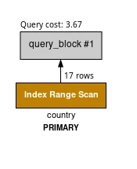

+++
title = "MySQL EXPLAIN 执行计划详解：从入门到精通的 SQL 性能分析指南"
date = 2019-09-06T20:10:21+08:00
lastmod = 2026-01-22T15:49:45+08:00
author = "bruce"
description = "深入解析 MySQL EXPLAIN 执行计划的 12 个关键字段，掌握 type 访问类型、key 索引选择、Extra 额外信息的含义，学会通过执行计划分析和优化 SQL 查询性能。"
toc = true
tags = ["MySQL", "EXPLAIN", "SQL优化", "性能调优", "索引", "数据库"]
categories = ["MySQL"]
keywords = ["MySQL EXPLAIN", "执行计划", "SQL优化", "查询性能", "索引优化", "type类型"]
+++


**EXPLAIN** 是 MySQL 中最重要的性能分析工具之一。当你的 SQL 查询变慢时，第一件事就应该用 EXPLAIN 看看执行计划。它能告诉你 MySQL 是如何执行查询的，包括使用了哪些索引、扫描了多少行、采用了什么连接方式等关键信息。

本文将详细介绍 EXPLAIN 输出的每个字段含义，帮助你快速定位 SQL 性能问题。

## 一、EXPLAIN 基本用法

使用方法很简单，在 SQL 语句前加上 `EXPLAIN` 关键字即可：

```sql
EXPLAIN SELECT * FROM users WHERE id = 1;
```

MySQL 8.0+ 还支持不同的输出格式：

```sql
-- 传统表格格式（默认）
EXPLAIN SELECT * FROM users;

-- JSON 格式，信息更详细
EXPLAIN FORMAT=JSON SELECT * FROM users;

-- 树形格式，展示执行顺序
EXPLAIN FORMAT=TREE SELECT * FROM users;

-- 实际执行并显示运行时统计（MySQL 8.0.18+）
EXPLAIN ANALYZE SELECT * FROM users;
```

> **提示**：`EXPLAIN ANALYZE` 会真正执行查询，所以对于修改数据的语句要谨慎使用。

## 二、EXPLAIN 输出字段详解

EXPLAIN 的输出包含 12 个字段，每个字段都提供了重要的执行信息：

| 字段 | 说明 |
|------|------|
| **id** | SELECT 查询的序列号 |
| **select_type** | SELECT 的类型 |
| **table** | 查询的表名 |
| **partitions** | 匹配的分区 |
| **type** | 访问类型（重要） |
| **possible_keys** | 可能使用的索引 |
| **key** | 实际使用的索引 |
| **key_len** | 使用的索引长度 |
| **ref** | 与索引比较的列 |
| **rows** | 预估扫描的行数 |
| **filtered** | 按条件过滤的行百分比 |
| **Extra** | 额外信息（重要） |

下面逐一详解每个字段。

### 2.1 id - 查询序列号

`id` 表示 SELECT 语句的执行顺序：

- **id 相同**：从上往下依次执行
- **id 不同**：id 值越大优先级越高，越先执行
- **id 为 NULL**：表示这是一个结果集，不需要用来查询

```sql
-- 示例：子查询
EXPLAIN
SELECT * FROM orders
WHERE user_id IN (SELECT id FROM users WHERE status = 1);
```

### 2.2 select_type - 查询类型

`select_type` 表示查询的类型，常见值如下：

| 类型 | 说明 |
|------|------|
| **SIMPLE** | 简单查询，不包含子查询或 UNION |
| **PRIMARY** | 最外层的 SELECT |
| **SUBQUERY** | SELECT 或 WHERE 中的子查询 |
| **DERIVED** | FROM 子句中的子查询（派生表） |
| **UNION** | UNION 中第二个及之后的 SELECT |
| **UNION RESULT** | UNION 的结果集 |
| **DEPENDENT SUBQUERY** | 依赖外部查询的子查询 |
| **DEPENDENT UNION** | 依赖外部查询的 UNION |
| **MATERIALIZED** | 物化子查询 |

```sql
-- SIMPLE 示例
EXPLAIN SELECT * FROM users WHERE id = 1;

-- SUBQUERY 示例
EXPLAIN SELECT * FROM orders
WHERE user_id = (SELECT id FROM users WHERE name = 'test');

-- DERIVED 示例
EXPLAIN SELECT * FROM (SELECT * FROM users WHERE status = 1) AS t;
```

### 2.3 table - 表名

`table` 显示这一行数据是关于哪张表的。特殊值：

- `<derived_N_>`：id 为 N 的派生表
- `<union_M_,_N_>`：id 为 M 和 N 的 UNION 结果
- `<subquery_N_>`：id 为 N 的物化子查询

### 2.4 partitions - 分区

如果表进行了分区，这里会显示查询涉及的分区。非分区表显示 NULL。

### 2.5 type - 访问类型（重要）

`type` 是 EXPLAIN 中最重要的字段之一，它表示 MySQL 如何查找表中的行。**性能从好到差排序**：

```
system > const > eq_ref > ref > fulltext > ref_or_null >
index_merge > unique_subquery > index_subquery > range > index > ALL
```

#### type 类型详解

| type | 性能 | 说明 | 触发条件 |
|------|------|------|----------|
| **system** | 最好 | 表只有一行 | const 的特例 |
| **const** | 极好 | 通过索引一次找到，最多一行 | PRIMARY KEY 或 UNIQUE 索引等值查询 |
| **eq_ref** | 很好 | 唯一索引扫描，每个索引键只有一条记录 | 多表 JOIN 时使用 PRIMARY KEY 或 UNIQUE NOT NULL 索引 |
| **ref** | 好 | 非唯一索引扫描，可能返回多行 | 使用普通索引或唯一索引的前缀 |
| **fulltext** | 一般 | 全文索引 | 使用 FULLTEXT 索引 |
| **ref_or_null** | 一般 | 类似 ref，但额外搜索 NULL 值 | WHERE col = value OR col IS NULL |
| **index_merge** | 一般 | 索引合并优化 | 同时使用多个索引 |
| **range** | 一般 | 索引范围扫描 | BETWEEN、<、>、IN 等范围条件 |
| **index** | 差 | 全索引扫描 | 遍历整个索引树 |
| **ALL** | 最差 | 全表扫描 | 没有可用索引 |

#### 实际示例

```sql
-- const：主键等值查询
EXPLAIN SELECT * FROM users WHERE id = 1;
-- type: const

-- ref：普通索引查询
EXPLAIN SELECT * FROM users WHERE email = 'test@example.com';
-- type: ref（假设 email 有普通索引）

-- range：范围查询
EXPLAIN SELECT * FROM orders WHERE created_at > '2024-01-01';
-- type: range（假设 created_at 有索引）

-- ALL：全表扫描
EXPLAIN SELECT * FROM users WHERE name LIKE '%test%';
-- type: ALL（前缀模糊查询无法使用索引）
```

> **优化目标**：让查询至少达到 `range` 级别，最好能达到 `ref` 或更好。如果出现 `ALL`，通常需要考虑添加索引。

### 2.6 possible_keys - 可能使用的索引

显示可能应用到这张表的索引。这些索引不一定会被实际使用，只是 MySQL 认为可能有用的候选。

### 2.7 key - 实际使用的索引

显示 MySQL 实际选择使用的索引。如果为 NULL，说明没有使用索引。

有时候 `key` 列显示的索引不在 `possible_keys` 中，这是因为 MySQL 发现了覆盖索引（Covering Index），可以直接从索引获取所有需要的数据。

### 2.8 key_len - 索引长度

表示使用的索引字节数。通过这个值可以判断是否充分利用了复合索引：

```sql
-- 假设有复合索引 idx_name_age (name, age)
-- name VARCHAR(50), age INT

EXPLAIN SELECT * FROM users WHERE name = 'test';
-- key_len: 152 (50*3+2，VARCHAR 使用 3 倍字符长度 + 2)

EXPLAIN SELECT * FROM users WHERE name = 'test' AND age = 25;
-- key_len: 157 (152+4+1，额外使用了 INT 的 4 字节，NULL 标志 1 字节)
```

**key_len 计算规则**：
- `CHAR(n)`：n × 字符集字节数
- `VARCHAR(n)`：n × 字符集字节数 + 2
- `INT`：4 字节
- `BIGINT`：8 字节
- `DATE`：3 字节
- `DATETIME`：8 字节
- 允许 NULL 的列额外 +1 字节

### 2.9 ref - 参考列

显示哪些列或常量被用于与 `key` 列中的索引进行比较。常见值：

- `const`：常量比较
- `字段名`：与某个字段比较
- `func`：使用了函数

### 2.10 rows - 预估行数

MySQL 估算需要检查的行数。这个数字是估计值，不是精确值。

**rows 值越小越好**。如果 rows 很大，说明查询效率可能不高。

### 2.11 filtered - 过滤比例

表示存储引擎返回的数据经过 WHERE 条件过滤后，剩余数据的百分比。

`rows × filtered%` = 最终返回的行数估计

```sql
-- 如果 rows = 1000, filtered = 10.00
-- 预计最终返回约 100 行
```

### 2.12 Extra - 额外信息（重要）

`Extra` 列包含了很多重要的执行细节：

#### 需要关注的值（可能影响性能）

| 值 | 说明 | 建议 |
|-----|------|------|
| **Using filesort** | 需要额外排序操作 | 考虑添加合适的索引来避免排序 |
| **Using temporary** | 使用了临时表 | 通常出现在 GROUP BY、DISTINCT、ORDER BY 中 |
| **Using where** | 存储引擎检索后再由 Server 层过滤 | 正常现象，但大量过滤可能需要优化 |

#### 较好的值

| 值 | 说明 |
|-----|------|
| **Using index** | 覆盖索引，无需回表 |
| **Using index condition** | 索引下推（ICP），在存储引擎层过滤 |
| **Using index for group-by** | 使用索引优化 GROUP BY |
| **Using index for skip scan** | 索引跳跃扫描（MySQL 8.0+） |

#### 其他常见值

| 值 | 说明 |
|-----|------|
| **Impossible WHERE** | WHERE 条件永远为 false |
| **Select tables optimized away** | 优化阶段已确定结果（如 MIN/MAX） |
| **No matching min/max row** | 没有满足条件的行 |
| **Distinct** | 找到第一个匹配后停止搜索 |
| **Using join buffer** | 使用连接缓冲区（Block Nested Loop 或 Hash Join） |
| **Using MRR** | 多范围读取优化 |

#### Extra 示例

```sql
-- Using index（覆盖索引）
EXPLAIN SELECT id, name FROM users WHERE name = 'test';
-- 假设有索引 idx_name(name)，且只查询 id 和 name

-- Using filesort
EXPLAIN SELECT * FROM orders ORDER BY amount;
-- 假设 amount 列没有索引

-- Using temporary; Using filesort
EXPLAIN SELECT department, COUNT(*) FROM employees
GROUP BY department ORDER BY COUNT(*) DESC;
```

## 三、Visual Explain 可视化分析

MySQL Workbench 提供了 Visual Explain 功能，可以将执行计划可视化展示。



### 颜色含义

| 颜色 | 访问类型 | 成本级别 |
|------|----------|----------|
| 蓝色 | system、const | 很低（最优） |
| 绿色 | eq_ref、ref、ref_or_null、index_merge | 低 |
| 黄色 | fulltext | 低 |
| 橙色 | unique_subquery、index_subquery、range | 中等 |
| 红色 | index、ALL | 高（需要优化） |

### 执行顺序

Visual Explain 的执行顺序是 **从下到上，从左到右**。

## 四、EXPLAIN 实战案例

### 案例 1：优化全表扫描

```sql
-- 问题 SQL
EXPLAIN SELECT * FROM orders WHERE status = 'pending';
-- type: ALL, rows: 100000

-- 添加索引后
ALTER TABLE orders ADD INDEX idx_status(status);

EXPLAIN SELECT * FROM orders WHERE status = 'pending';
-- type: ref, rows: 500
```

### 案例 2：优化 filesort

```sql
-- 问题 SQL
EXPLAIN SELECT * FROM orders WHERE user_id = 100 ORDER BY created_at;
-- Extra: Using filesort

-- 创建复合索引
ALTER TABLE orders ADD INDEX idx_user_created(user_id, created_at);

EXPLAIN SELECT * FROM orders WHERE user_id = 100 ORDER BY created_at;
-- Extra: Using index condition
```

### 案例 3：利用覆盖索引

```sql
-- 原 SQL（需要回表）
EXPLAIN SELECT id, name, email FROM users WHERE name = 'test';
-- Extra: NULL

-- 创建覆盖索引
ALTER TABLE users ADD INDEX idx_name_email(name, email);

EXPLAIN SELECT id, name, email FROM users WHERE name = 'test';
-- Extra: Using index
```

### 案例 4：多表 JOIN 优化

```sql
EXPLAIN
SELECT o.id, c.name, c.email
FROM orders o
LEFT JOIN customers c ON c.id = o.customer_id
WHERE o.created_at > '2024-01-01';
```

分析要点：
1. 检查每个表的 type，尽量达到 eq_ref 或 ref
2. 确认 JOIN 字段都有索引
3. 关注 rows 的乘积，这是预估的总扫描行数

## 五、EXPLAIN 使用技巧

### 1. 结合 SHOW WARNINGS 查看优化后的 SQL

```sql
EXPLAIN SELECT * FROM users WHERE id IN (1, 2, 3);
SHOW WARNINGS;
```

`SHOW WARNINGS` 可以显示 MySQL 优化器重写后的查询语句。

### 2. 使用 FORMAT=JSON 获取更多信息

```sql
EXPLAIN FORMAT=JSON SELECT * FROM users WHERE id = 1\G
```

JSON 格式包含更多细节，如成本估算（cost_info）、实际使用的 key_parts 等。

### 3. 使用 EXPLAIN ANALYZE 获取实际执行数据

```sql
EXPLAIN ANALYZE SELECT * FROM users WHERE status = 1;
```

`EXPLAIN ANALYZE` 会实际执行查询，显示每个步骤的真实耗时和行数。

## 六、总结

EXPLAIN 是 MySQL 性能分析的必备工具，重点关注以下几个方面：

| 关注点 | 说明 |
|--------|------|
| **type** | 至少达到 range 级别，最好是 ref 或更好 |
| **key** | 确保使用了合适的索引 |
| **rows** | 数值越小越好 |
| **Extra** | 避免 Using filesort 和 Using temporary |

优化建议：

1. **添加合适的索引**：针对 WHERE、JOIN、ORDER BY 的字段
2. **利用覆盖索引**：避免回表查询
3. **避免索引失效**：不要对索引列使用函数、不要前缀模糊查询
4. **优化 JOIN**：小表驱动大表，确保关联字段有索引

## 参考资料

- [MySQL 官方文档：EXPLAIN Output Format](https://dev.mysql.com/doc/refman/8.0/en/explain-output.html)
- [MySQL Workbench Visual Explain](https://dev.mysql.com/doc/workbench/en/wb-performance-explain.html)
- [PlanetScale：How to Read MySQL EXPLAINs](https://planetscale.com/blog/how-read-mysql-explains)
- [MySQL Visual Explain 在线工具](https://mysqlexplain.com/)
