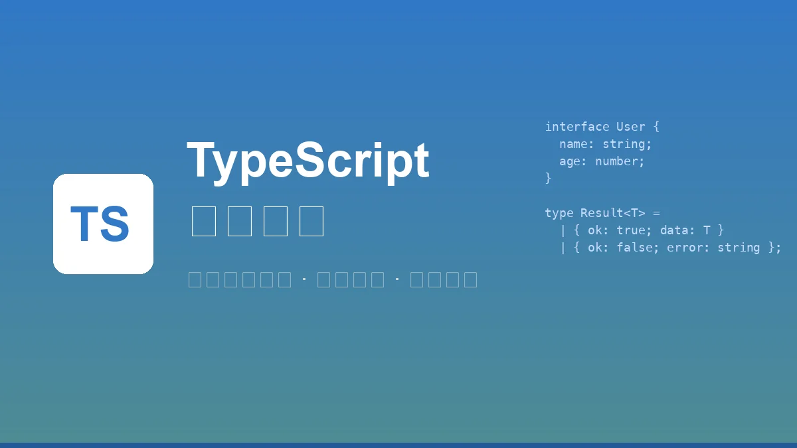

+++
date = '2026-01-23T20:07:08+08:00'
draft = false
title = 'TypeScript 完全指南：从入门到精通的进阶手册'
description = 'TypeScript 全面教程，涵盖基础语法、高级类型、泛型、类型体操、工具类型、最佳实践。适合新手入门和面试复习，附带大量实战代码示例。2025年最新版本。'
toc = true
images = ['cover.webp']
tags = ['TypeScript', 'JavaScript', '前端开发', '类型系统', '面试']
categories = ['前端']
keywords = ['TypeScript', 'TypeScript教程', 'TypeScript面试题', 'TypeScript高级类型', '类型体操', '泛型']
+++



**TypeScript** 是 JavaScript 的超集，为 JavaScript 添加了静态类型系统。它能在编译时发现错误、提供更好的 IDE 支持、使代码更易维护。本文将系统性地介绍 TypeScript 的所有核心概念，从基础语法到高级类型体操，帮助你从新手快速进阶为高手。

> 2025 年，微软宣布用 Go 重写 TypeScript 编译器，编译速度提升 10 倍，内存占用减少 50%。TypeScript 正在蚕食 JavaScript 的市场份额，已成为前端开发的必备技能。

---

## 一、TypeScript 基础

### 1. 为什么选择 TypeScript

| 特性 | JavaScript | TypeScript |
|------|------------|------------|
| 类型检查 | 运行时 | 编译时 |
| IDE 支持 | 一般 | 优秀（智能提示、重构） |
| 代码可维护性 | 较低 | 高 |
| 学习曲线 | 低 | 中等 |
| 大型项目适用性 | 一般 | 非常适合 |

### 2. 安装与配置

```bash
# 全局安装
npm install -g typescript

# 项目安装
npm install typescript --save-dev

# 初始化配置文件
npx tsc --init

# 编译单个文件
tsc hello.ts

# 监听模式
tsc --watch
```

### 3. tsconfig.json 常用配置

```json
{
  "compilerOptions": {
    // 目标 ECMAScript 版本
    "target": "ES2020",
    // 模块系统
    "module": "ESNext",
    // 严格模式（强烈建议开启）
    "strict": true,
    // 输出目录
    "outDir": "./dist",
    // 源码目录
    "rootDir": "./src",
    // 生成声明文件
    "declaration": true,
    // 允许导入 JSON
    "resolveJsonModule": true,
    // ES 模块互操作
    "esModuleInterop": true,
    // 跳过库类型检查（加速编译）
    "skipLibCheck": true,
    // 严格的空值检查
    "strictNullChecks": true,
    // 不允许隐式 any
    "noImplicitAny": true
  },
  "include": ["src/**/*"],
  "exclude": ["node_modules"]
}
```

---

## 二、基础类型

### 1. 原始类型

```typescript
// 字符串
let name: string = "TypeScript";

// 数字（整数和浮点数统一为 number）
let age: number = 25;
let price: number = 99.99;

// 布尔值
let isDone: boolean = false;

// null 和 undefined
let n: null = null;
let u: undefined = undefined;

// Symbol
let sym: symbol = Symbol("key");

// BigInt（ES2020）
let big: bigint = 100n;
```

### 2. 数组类型

```typescript
// 方式一：类型[]
let numbers: number[] = [1, 2, 3];
let strings: string[] = ["a", "b", "c"];

// 方式二：Array<类型>（泛型写法）
let nums: Array<number> = [1, 2, 3];

// 只读数组
let readonlyArr: readonly number[] = [1, 2, 3];
// readonlyArr.push(4); // 错误：只读数组不能修改
```

### 3. 元组（Tuple）

元组是固定长度和类型的数组：

```typescript
// 基本元组
let tuple: [string, number] = ["hello", 42];

// 可选元素
let optionalTuple: [string, number?] = ["hello"];

// 剩余元素
let restTuple: [string, ...number[]] = ["hello", 1, 2, 3];

// 只读元组
let readonlyTuple: readonly [string, number] = ["hello", 42];

// 命名元组（TypeScript 4.0+）
type NamedTuple = [name: string, age: number];
let person: NamedTuple = ["Alice", 30];
```

### 4. 枚举（Enum）

```typescript
// 数字枚举（默认从 0 开始）
enum Direction {
  Up,      // 0
  Down,    // 1
  Left,    // 2
  Right    // 3
}

// 指定起始值
enum Status {
  Pending = 1,
  Active,     // 2
  Inactive    // 3
}

// 字符串枚举
enum Color {
  Red = "RED",
  Green = "GREEN",
  Blue = "BLUE"
}

// const 枚举（编译时内联，性能更好）
const enum HttpStatus {
  OK = 200,
  NotFound = 404,
  ServerError = 500
}

// 使用
let dir: Direction = Direction.Up;
let status: HttpStatus = HttpStatus.OK; // 编译后直接变成 200
```

### 5. any、unknown、never、void

```typescript
// any：任意类型，跳过类型检查（尽量避免使用）
let anything: any = "hello";
anything = 42;
anything.foo(); // 不报错，但运行时可能出错

// unknown：未知类型，比 any 更安全
let unknown1: unknown = "hello";
// unknown1.foo(); // 错误：需要先检查类型
if (typeof unknown1 === "string") {
  console.log(unknown1.toUpperCase()); // OK
}

// void：无返回值
function log(msg: string): void {
  console.log(msg);
}

// never：永远不会返回（抛异常或无限循环）
function throwError(msg: string): never {
  throw new Error(msg);
}

function infiniteLoop(): never {
  while (true) {}
}
```

**面试重点：any vs unknown**

| 特性 | any | unknown |
|------|-----|---------|
| 类型安全 | 不安全 | 安全 |
| 赋值给其他类型 | 可以 | 需要类型断言或类型守卫 |
| 调用方法/属性 | 可以（不报错） | 需要先缩小类型 |
| 使用场景 | 快速迁移、第三方库 | 接收不确定类型的值 |

---

## 三、函数类型

### 1. 函数声明

```typescript
// 函数声明
function add(a: number, b: number): number {
  return a + b;
}

// 函数表达式
const multiply = function(a: number, b: number): number {
  return a * b;
};

// 箭头函数
const divide = (a: number, b: number): number => a / b;

// 完整的函数类型
const subtract: (a: number, b: number) => number = (a, b) => a - b;
```

### 2. 可选参数与默认参数

```typescript
// 可选参数（必须放在必选参数后面）
function greet(name: string, greeting?: string): string {
  return `${greeting || "Hello"}, ${name}!`;
}

// 默认参数
function greetWithDefault(name: string, greeting: string = "Hello"): string {
  return `${greeting}, ${name}!`;
}

// 剩余参数
function sum(...numbers: number[]): number {
  return numbers.reduce((a, b) => a + b, 0);
}

sum(1, 2, 3, 4, 5); // 15
```

### 3. 函数重载

当函数根据不同参数返回不同类型时，使用重载：

```typescript
// 重载签名
function format(value: string): string;
function format(value: number): string;
function format(value: Date): string;

// 实现签名
function format(value: string | number | Date): string {
  if (typeof value === "string") {
    return value.trim();
  } else if (typeof value === "number") {
    return value.toFixed(2);
  } else {
    return value.toISOString();
  }
}

format("  hello  "); // "hello"
format(3.14159);     // "3.14"
format(new Date());  // "2025-01-23T..."
```

### 4. this 类型

```typescript
interface User {
  name: string;
  greet(this: User): void;
}

const user: User = {
  name: "Alice",
  greet() {
    console.log(`Hello, ${this.name}`);
  }
};

user.greet(); // OK
// const greet = user.greet;
// greet(); // 错误：this 上下文不正确
```

---

## 四、接口与类型别名

### 1. 接口（Interface）

```typescript
// 基本接口
interface Person {
  name: string;
  age: number;
}

// 可选属性
interface Config {
  host: string;
  port?: number;  // 可选
}

// 只读属性
interface Point {
  readonly x: number;
  readonly y: number;
}

// 索引签名
interface StringArray {
  [index: number]: string;
}

interface Dictionary {
  [key: string]: any;
}

// 函数接口
interface SearchFunc {
  (source: string, keyword: string): boolean;
}

const search: SearchFunc = (source, keyword) => {
  return source.includes(keyword);
};
```

### 2. 接口继承

```typescript
interface Animal {
  name: string;
}

interface Dog extends Animal {
  breed: string;
}

// 多重继承
interface Bird extends Animal {
  fly(): void;
}

interface Parrot extends Animal, Bird {
  speak(): void;
}
```

### 3. 类型别名（Type Alias）

```typescript
// 基本类型别名
type ID = string | number;
type Name = string;

// 对象类型
type User = {
  id: ID;
  name: Name;
  email: string;
};

// 联合类型
type Status = "pending" | "active" | "inactive";

// 交叉类型
type Admin = User & {
  role: "admin";
  permissions: string[];
};

// 函数类型
type Callback = (data: string) => void;

// 泛型类型别名
type Container<T> = {
  value: T;
};
```

### 4. Interface vs Type

**面试高频题：什么时候用 interface，什么时候用 type？**

| 特性 | interface | type |
|------|-----------|------|
| 扩展方式 | extends | & (交叉类型) |
| 声明合并 | 支持 | 不支持 |
| 计算属性 | 不支持 | 支持 |
| 联合类型 | 不支持 | 支持 |
| 映射类型 | 不支持 | 支持 |

```typescript
// interface 声明合并
interface User {
  name: string;
}
interface User {
  age: number;
}
// 合并后：{ name: string; age: number }

// type 不能声明合并
type Person = { name: string };
// type Person = { age: number }; // 错误：重复定义

// type 支持联合类型
type StringOrNumber = string | number;
// interface 不能直接定义联合类型
```

**最佳实践**：
- 定义对象结构、类的契约 → 用 `interface`
- 定义联合类型、元组、映射类型 → 用 `type`
- 需要声明合并（如扩展第三方库类型） → 用 `interface`

---

## 五、类（Class）

### 1. 基本类定义

```typescript
class Person {
  // 属性声明
  name: string;
  age: number;

  // 构造函数
  constructor(name: string, age: number) {
    this.name = name;
    this.age = age;
  }

  // 方法
  greet(): string {
    return `Hello, I'm ${this.name}`;
  }
}

const person = new Person("Alice", 30);
```

### 2. 访问修饰符

```typescript
class Employee {
  public name: string;        // 公开（默认）
  protected department: string; // 受保护（子类可访问）
  private salary: number;     // 私有（仅类内部可访问）
  readonly id: number;        // 只读

  constructor(name: string, department: string, salary: number, id: number) {
    this.name = name;
    this.department = department;
    this.salary = salary;
    this.id = id;
  }
}

// 简写形式（参数属性）
class Employee2 {
  constructor(
    public name: string,
    protected department: string,
    private salary: number,
    readonly id: number
  ) {}
}
```

### 3. 存取器（Getter/Setter）

```typescript
class Circle {
  private _radius: number = 0;

  get radius(): number {
    return this._radius;
  }

  set radius(value: number) {
    if (value < 0) {
      throw new Error("Radius cannot be negative");
    }
    this._radius = value;
  }

  get area(): number {
    return Math.PI * this._radius ** 2;
  }
}

const circle = new Circle();
circle.radius = 5;
console.log(circle.area); // 78.54...
```

### 4. 静态成员

```typescript
class MathUtils {
  static PI = 3.14159;

  static square(x: number): number {
    return x * x;
  }

  static cube(x: number): number {
    return x ** 3;
  }
}

console.log(MathUtils.PI);       // 3.14159
console.log(MathUtils.square(4)); // 16
```

### 5. 抽象类

```typescript
abstract class Shape {
  abstract area(): number;      // 抽象方法（子类必须实现）
  abstract perimeter(): number;

  // 普通方法（子类可继承）
  describe(): string {
    return `Area: ${this.area()}, Perimeter: ${this.perimeter()}`;
  }
}

class Rectangle extends Shape {
  constructor(private width: number, private height: number) {
    super();
  }

  area(): number {
    return this.width * this.height;
  }

  perimeter(): number {
    return 2 * (this.width + this.height);
  }
}

// const shape = new Shape(); // 错误：不能实例化抽象类
const rect = new Rectangle(10, 5);
console.log(rect.describe()); // "Area: 50, Perimeter: 30"
```

### 6. 类实现接口

```typescript
interface Printable {
  print(): void;
}

interface Loggable {
  log(message: string): void;
}

class Document implements Printable, Loggable {
  print(): void {
    console.log("Printing document...");
  }

  log(message: string): void {
    console.log(`[LOG] ${message}`);
  }
}
```

---

## 六、泛型（Generics）

泛型是 TypeScript 最强大的特性之一，允许创建可重用的组件。

### 1. 泛型函数

```typescript
// 基本泛型函数
function identity<T>(arg: T): T {
  return arg;
}

// 使用
identity<string>("hello"); // 显式指定类型
identity(42);              // 类型推断为 number

// 多个类型参数
function pair<T, U>(first: T, second: U): [T, U] {
  return [first, second];
}

pair("hello", 42); // [string, number]
```

### 2. 泛型约束

```typescript
// 约束：T 必须有 length 属性
interface Lengthwise {
  length: number;
}

function logLength<T extends Lengthwise>(arg: T): T {
  console.log(arg.length);
  return arg;
}

logLength("hello");     // OK，字符串有 length
logLength([1, 2, 3]);   // OK，数组有 length
// logLength(123);      // 错误：number 没有 length

// keyof 约束
function getProperty<T, K extends keyof T>(obj: T, key: K): T[K] {
  return obj[key];
}

const person = { name: "Alice", age: 30 };
getProperty(person, "name"); // "Alice"
// getProperty(person, "email"); // 错误："email" 不是 person 的键
```

### 3. 泛型接口

```typescript
// 泛型接口
interface Container<T> {
  value: T;
  getValue(): T;
}

// 泛型函数接口
interface GenericFunc<T> {
  (arg: T): T;
}

// 使用
const stringContainer: Container<string> = {
  value: "hello",
  getValue() {
    return this.value;
  }
};
```

### 4. 泛型类

```typescript
class Stack<T> {
  private items: T[] = [];

  push(item: T): void {
    this.items.push(item);
  }

  pop(): T | undefined {
    return this.items.pop();
  }

  peek(): T | undefined {
    return this.items[this.items.length - 1];
  }

  isEmpty(): boolean {
    return this.items.length === 0;
  }
}

const numberStack = new Stack<number>();
numberStack.push(1);
numberStack.push(2);
numberStack.pop(); // 2
```

### 5. 泛型默认值

```typescript
// 默认类型参数
interface ApiResponse<T = any> {
  data: T;
  status: number;
  message: string;
}

// 使用默认类型
const response1: ApiResponse = { data: "anything", status: 200, message: "OK" };

// 指定类型
const response2: ApiResponse<User[]> = {
  data: [{ id: 1, name: "Alice" }],
  status: 200,
  message: "OK"
};
```

---

## 七、高级类型

### 1. 联合类型（Union Types）

```typescript
// 基本联合类型
type ID = string | number;

function printId(id: ID): void {
  if (typeof id === "string") {
    console.log(id.toUpperCase());
  } else {
    console.log(id.toFixed(2));
  }
}

// 字面量联合类型
type Status = "pending" | "success" | "error";
type HttpMethod = "GET" | "POST" | "PUT" | "DELETE";
```

### 2. 交叉类型（Intersection Types）

```typescript
interface Name {
  firstName: string;
  lastName: string;
}

interface Contact {
  email: string;
  phone: string;
}

// 交叉类型：合并多个类型
type Person = Name & Contact;

const person: Person = {
  firstName: "John",
  lastName: "Doe",
  email: "john@example.com",
  phone: "123-456-7890"
};
```

### 3. 类型守卫（Type Guards）

```typescript
// typeof 类型守卫
function padLeft(value: string, padding: string | number): string {
  if (typeof padding === "number") {
    return " ".repeat(padding) + value;
  }
  return padding + value;
}

// instanceof 类型守卫
class Cat {
  meow() { console.log("Meow!"); }
}

class Dog {
  bark() { console.log("Woof!"); }
}

function makeSound(animal: Cat | Dog): void {
  if (animal instanceof Cat) {
    animal.meow();
  } else {
    animal.bark();
  }
}

// in 类型守卫
interface Fish {
  swim(): void;
}

interface Bird {
  fly(): void;
}

function move(animal: Fish | Bird): void {
  if ("swim" in animal) {
    animal.swim();
  } else {
    animal.fly();
  }
}

// 自定义类型守卫（类型谓词）
function isFish(pet: Fish | Bird): pet is Fish {
  return (pet as Fish).swim !== undefined;
}

function doSomething(pet: Fish | Bird): void {
  if (isFish(pet)) {
    pet.swim(); // TypeScript 知道这里是 Fish
  } else {
    pet.fly();  // TypeScript 知道这里是 Bird
  }
}
```

### 4. 可辨识联合（Discriminated Unions）

这是 TypeScript 中非常实用的模式：

```typescript
// 定义可辨识联合
interface Circle {
  kind: "circle";  // 判别属性
  radius: number;
}

interface Rectangle {
  kind: "rectangle";
  width: number;
  height: number;
}

interface Triangle {
  kind: "triangle";
  base: number;
  height: number;
}

type Shape = Circle | Rectangle | Triangle;

// 根据 kind 属性自动缩小类型
function getArea(shape: Shape): number {
  switch (shape.kind) {
    case "circle":
      return Math.PI * shape.radius ** 2;
    case "rectangle":
      return shape.width * shape.height;
    case "triangle":
      return (shape.base * shape.height) / 2;
    default:
      // 穷尽性检查
      const _exhaustiveCheck: never = shape;
      return _exhaustiveCheck;
  }
}
```

### 5. keyof 和 typeof

```typescript
// keyof：获取类型的所有键
interface Person {
  name: string;
  age: number;
  email: string;
}

type PersonKeys = keyof Person; // "name" | "age" | "email"

// typeof：获取值的类型
const config = {
  host: "localhost",
  port: 3000,
  debug: true
};

type Config = typeof config;
// { host: string; port: number; debug: boolean }

// 结合使用
type ConfigKeys = keyof typeof config; // "host" | "port" | "debug"
```

### 6. 索引访问类型

```typescript
interface Person {
  name: string;
  age: number;
  address: {
    city: string;
    country: string;
  };
}

// 获取属性类型
type NameType = Person["name"];     // string
type AgeType = Person["age"];       // number
type AddressType = Person["address"]; // { city: string; country: string }

// 获取嵌套属性类型
type CityType = Person["address"]["city"]; // string

// 结合 keyof
type PersonValues = Person[keyof Person];
// string | number | { city: string; country: string }
```

---

## 八、条件类型

条件类型是 TypeScript 类型系统中最强大的特性之一。

### 1. 基本条件类型

```typescript
// 语法：T extends U ? X : Y
type IsString<T> = T extends string ? true : false;

type A = IsString<string>;  // true
type B = IsString<number>;  // false

// 实际应用
type TypeName<T> =
  T extends string ? "string" :
  T extends number ? "number" :
  T extends boolean ? "boolean" :
  T extends undefined ? "undefined" :
  T extends Function ? "function" :
  "object";

type T1 = TypeName<string>;    // "string"
type T2 = TypeName<() => void>; // "function"
```

### 2. infer 关键字

`infer` 用于在条件类型中提取类型：

```typescript
// 提取函数返回类型
type MyReturnType<T> = T extends (...args: any[]) => infer R ? R : never;

type Func = () => string;
type R1 = MyReturnType<Func>; // string

// 提取函数参数类型
type MyParameters<T> = T extends (...args: infer P) => any ? P : never;

type Func2 = (a: string, b: number) => void;
type P1 = MyParameters<Func2>; // [string, number]

// 提取数组元素类型
type ElementType<T> = T extends (infer E)[] ? E : never;

type E1 = ElementType<string[]>;  // string
type E2 = ElementType<number[]>;  // number

// 提取 Promise 的值类型
type UnwrapPromise<T> = T extends Promise<infer U> ? U : T;

type P2 = UnwrapPromise<Promise<string>>; // string
type P3 = UnwrapPromise<number>;          // number
```

### 3. 分布式条件类型

当条件类型作用于联合类型时，会自动分布：

```typescript
type ToArray<T> = T extends any ? T[] : never;

type StrArr = ToArray<string>;          // string[]
type NumOrStrArr = ToArray<string | number>; // string[] | number[]

// 如果不想分布，用 [T] 包裹
type ToArrayNonDist<T> = [T] extends [any] ? T[] : never;

type Result = ToArrayNonDist<string | number>; // (string | number)[]
```

---

## 九、映射类型

映射类型允许基于旧类型创建新类型。

### 1. 基本映射类型

```typescript
// 将所有属性变为可选
type MyPartial<T> = {
  [K in keyof T]?: T[K];
};

// 将所有属性变为只读
type MyReadonly<T> = {
  readonly [K in keyof T]: T[K];
};

// 将所有属性变为必选
type MyRequired<T> = {
  [K in keyof T]-?: T[K];
};

// 移除只读
type Mutable<T> = {
  -readonly [K in keyof T]: T[K];
};
```

### 2. 键重映射（as 子句）

TypeScript 4.1+ 支持使用 `as` 子句重映射键：

```typescript
// 将所有键转换为 getter
type Getters<T> = {
  [K in keyof T as `get${Capitalize<string & K>}`]: () => T[K];
};

interface Person {
  name: string;
  age: number;
}

type PersonGetters = Getters<Person>;
// { getName: () => string; getAge: () => number }

// 过滤掉某些键
type RemoveKind<T> = {
  [K in keyof T as K extends "kind" ? never : K]: T[K];
};

interface Shape {
  kind: string;
  radius: number;
}

type ShapeWithoutKind = RemoveKind<Shape>;
// { radius: number }
```

---

## 十、内置工具类型

TypeScript 提供了许多内置工具类型，务必熟练掌握。

### 1. 属性修饰类型

```typescript
interface User {
  id: number;
  name: string;
  email: string;
  age?: number;
}

// Partial<T>：所有属性变可选
type PartialUser = Partial<User>;
// { id?: number; name?: string; email?: string; age?: number }

// Required<T>：所有属性变必选
type RequiredUser = Required<User>;
// { id: number; name: string; email: string; age: number }

// Readonly<T>：所有属性变只读
type ReadonlyUser = Readonly<User>;
// { readonly id: number; readonly name: string; ... }
```

### 2. 属性选择类型

```typescript
interface User {
  id: number;
  name: string;
  email: string;
  password: string;
}

// Pick<T, K>：选择指定属性
type UserPreview = Pick<User, "id" | "name">;
// { id: number; name: string }

// Omit<T, K>：排除指定属性
type PublicUser = Omit<User, "password">;
// { id: number; name: string; email: string }
```

### 3. 联合类型操作

```typescript
type Status = "pending" | "active" | "inactive" | "deleted";

// Exclude<T, U>：从 T 中排除可以赋值给 U 的类型
type ActiveStatus = Exclude<Status, "deleted">;
// "pending" | "active" | "inactive"

// Extract<T, U>：从 T 中提取可以赋值给 U 的类型
type LifeStatus = Extract<Status, "active" | "inactive">;
// "active" | "inactive"

// NonNullable<T>：排除 null 和 undefined
type MaybeString = string | null | undefined;
type DefiniteString = NonNullable<MaybeString>;
// string
```

### 4. 函数相关类型

```typescript
function createUser(name: string, age: number): User {
  return { id: 1, name, age, email: "" };
}

// ReturnType<T>：获取函数返回类型
type CreateUserReturn = ReturnType<typeof createUser>;
// User

// Parameters<T>：获取函数参数类型（元组）
type CreateUserParams = Parameters<typeof createUser>;
// [string, number]

// ConstructorParameters<T>：获取构造函数参数类型
class MyClass {
  constructor(public name: string, public age: number) {}
}
type MyClassParams = ConstructorParameters<typeof MyClass>;
// [string, number]

// InstanceType<T>：获取构造函数实例类型
type MyClassInstance = InstanceType<typeof MyClass>;
// MyClass
```

### 5. 字符串操作类型

```typescript
// Uppercase<S>：转大写
type Upper = Uppercase<"hello">; // "HELLO"

// Lowercase<S>：转小写
type Lower = Lowercase<"HELLO">; // "hello"

// Capitalize<S>：首字母大写
type Cap = Capitalize<"hello">; // "Hello"

// Uncapitalize<S>：首字母小写
type Uncap = Uncapitalize<"Hello">; // "hello"
```

### 6. Record 类型

```typescript
// Record<K, V>：创建键为 K，值为 V 的对象类型
type PageInfo = {
  title: string;
  url: string;
};

type Pages = Record<"home" | "about" | "contact", PageInfo>;
// {
//   home: PageInfo;
//   about: PageInfo;
//   contact: PageInfo;
// }

// 常用于创建字典类型
type StringMap = Record<string, string>;
type NumberMap = Record<string, number>;
```

---

## 十一、模板字面量类型

### 1. 基本用法

```typescript
// 基本模板字面量
type Greeting = `Hello, ${string}`;

const g1: Greeting = "Hello, World"; // OK
// const g2: Greeting = "Hi, World"; // 错误

// 联合类型组合
type Vertical = "top" | "bottom";
type Horizontal = "left" | "right";

type Position = `${Vertical}-${Horizontal}`;
// "top-left" | "top-right" | "bottom-left" | "bottom-right"
```

### 2. 实际应用

```typescript
// 事件处理器类型
type EventName = "click" | "focus" | "blur";
type EventHandler = `on${Capitalize<EventName>}`;
// "onClick" | "onFocus" | "onBlur"

// CSS 属性
type CSSUnit = "px" | "em" | "rem" | "%";
type CSSValue = `${number}${CSSUnit}`;

const width: CSSValue = "100px"; // OK
const height: CSSValue = "50%";  // OK
// const bad: CSSValue = "100"; // 错误

// API 路径
type ApiVersion = "v1" | "v2";
type Resource = "users" | "posts" | "comments";
type ApiPath = `/api/${ApiVersion}/${Resource}`;
// "/api/v1/users" | "/api/v1/posts" | ...
```

### 3. 类型推断与模板字面量

```typescript
// 提取模板字面量中的类型
type ExtractRouteParams<T extends string> =
  T extends `${infer _Start}:${infer Param}/${infer Rest}`
    ? { [K in Param | keyof ExtractRouteParams<Rest>]: string }
    : T extends `${infer _Start}:${infer Param}`
    ? { [K in Param]: string }
    : {};

type Params = ExtractRouteParams<"/users/:userId/posts/:postId">;
// { userId: string; postId: string }
```

---

## 十二、类型体操实战

类型体操是指使用 TypeScript 类型系统进行复杂的类型运算。以下是一些常见的类型体操练习。

### 1. 实现 DeepReadonly

```typescript
// 深度只读
type DeepReadonly<T> = T extends object
  ? { readonly [K in keyof T]: DeepReadonly<T[K]> }
  : T;

interface User {
  name: string;
  address: {
    city: string;
    country: string;
  };
}

type ReadonlyUser = DeepReadonly<User>;
// {
//   readonly name: string;
//   readonly address: {
//     readonly city: string;
//     readonly country: string;
//   };
// }
```

### 2. 实现 DeepPartial

```typescript
type DeepPartial<T> = T extends object
  ? { [K in keyof T]?: DeepPartial<T[K]> }
  : T;
```

### 3. 实现 Flatten

```typescript
// 扁平化数组类型
type Flatten<T extends any[]> = T extends [infer First, ...infer Rest]
  ? First extends any[]
    ? [...Flatten<First>, ...Flatten<Rest>]
    : [First, ...Flatten<Rest>]
  : T;

type Nested = [1, [2, [3, 4]], 5];
type Flat = Flatten<Nested>; // [1, 2, 3, 4, 5]
```

### 4. 实现 TupleToUnion

```typescript
type TupleToUnion<T extends any[]> = T[number];

type Tuple = ["a", "b", "c"];
type Union = TupleToUnion<Tuple>; // "a" | "b" | "c"
```

### 5. 实现 UnionToIntersection

```typescript
type UnionToIntersection<U> =
  (U extends any ? (k: U) => void : never) extends
  (k: infer I) => void ? I : never;

type Union = { a: string } | { b: number };
type Intersection = UnionToIntersection<Union>;
// { a: string } & { b: number }
```

### 6. 实现 PickByType

```typescript
// 根据值类型选择属性
type PickByType<T, U> = {
  [K in keyof T as T[K] extends U ? K : never]: T[K];
};

interface Model {
  name: string;
  count: number;
  isReady: boolean;
  run: () => void;
}

type StringProps = PickByType<Model, string>;
// { name: string }

type FunctionProps = PickByType<Model, Function>;
// { run: () => void }
```

---

## 十三、声明文件

### 1. 声明文件基础

声明文件（`.d.ts`）用于为 JavaScript 库提供类型定义。

```typescript
// types/lodash.d.ts
declare module "lodash" {
  export function chunk<T>(array: T[], size?: number): T[][];
  export function compact<T>(array: T[]): T[];
  export function uniq<T>(array: T[]): T[];
}
```

### 2. 全局声明

```typescript
// global.d.ts
declare global {
  interface Window {
    myGlobalVar: string;
    myGlobalFunc: (arg: string) => void;
  }

  // 全局变量
  var DEBUG: boolean;

  // 全局函数
  function myGlobalFunction(): void;
}

export {}; // 确保这是一个模块
```

### 3. 模块声明

```typescript
// 为 .css 文件添加类型
declare module "*.css" {
  const content: { [className: string]: string };
  export default content;
}

// 为 .png 文件添加类型
declare module "*.png" {
  const value: string;
  export default value;
}

// 为 .json 文件添加类型
declare module "*.json" {
  const value: any;
  export default value;
}
```

### 4. 使用 @types

```bash
# 安装类型声明包
npm install --save-dev @types/node
npm install --save-dev @types/react
npm install --save-dev @types/lodash
```

---

## 十四、模块系统

### 1. ES 模块

```typescript
// math.ts - 导出
export const PI = 3.14159;

export function add(a: number, b: number): number {
  return a + b;
}

export default class Calculator {
  // ...
}

// main.ts - 导入
import Calculator, { PI, add } from "./math";
import * as math from "./math";
```

### 2. 类型导入/导出

```typescript
// types.ts
export interface User {
  id: number;
  name: string;
}

export type ID = string | number;

// main.ts - 类型导入（推荐）
import type { User, ID } from "./types";

// 或者混合导入
import { type User, someFunction } from "./module";
```

### 3. 命名空间

```typescript
// 命名空间（不推荐在新项目中使用）
namespace Validation {
  export interface StringValidator {
    isValid(s: string): boolean;
  }

  export class EmailValidator implements StringValidator {
    isValid(s: string): boolean {
      return /^[^\s@]+@[^\s@]+\.[^\s@]+$/.test(s);
    }
  }
}

// 使用
const validator = new Validation.EmailValidator();
```

---

## 十五、最佳实践

### 1. 类型推断

```typescript
// 让 TypeScript 自动推断
const name = "Alice";        // 推断为 string
const numbers = [1, 2, 3];   // 推断为 number[]
const user = { name: "Bob" }; // 推断为 { name: string }

// 使用 as const 获得更精确的类型
const status = "active" as const;     // 推断为 "active"
const tuple = [1, "hello"] as const;  // 推断为 readonly [1, "hello"]

const config = {
  host: "localhost",
  port: 3000
} as const;
// 推断为 { readonly host: "localhost"; readonly port: 3000 }
```

### 2. 类型断言

```typescript
// 基本断言
const input = document.getElementById("input") as HTMLInputElement;

// 非空断言
function getValue(map: Map<string, string>, key: string): string {
  return map.get(key)!; // 告诉 TypeScript 这里一定有值
}

// 双重断言（谨慎使用）
const value = (expr as unknown) as SomeType;
```

### 3. 类型收窄

```typescript
function process(value: string | number | null): string {
  // 使用类型守卫收窄类型
  if (value === null) {
    return "null";
  }

  if (typeof value === "string") {
    return value.toUpperCase();
  }

  // 此时 TypeScript 知道 value 是 number
  return value.toFixed(2);
}
```

### 4. 避免 any

```typescript
// 不好
function parse(json: string): any {
  return JSON.parse(json);
}

// 好 - 使用泛型
function parse<T>(json: string): T {
  return JSON.parse(json);
}

// 更好 - 添加运行时验证
function parseUser(json: string): User {
  const data = JSON.parse(json);
  if (!isUser(data)) {
    throw new Error("Invalid user data");
  }
  return data;
}

function isUser(data: unknown): data is User {
  return (
    typeof data === "object" &&
    data !== null &&
    "name" in data &&
    "age" in data
  );
}
```

### 5. 严格模式

始终在 `tsconfig.json` 中启用严格模式：

```json
{
  "compilerOptions": {
    "strict": true
  }
}
```

这相当于启用了：
- `strictNullChecks`
- `strictFunctionTypes`
- `strictBindCallApply`
- `strictPropertyInitialization`
- `noImplicitAny`
- `noImplicitThis`
- `alwaysStrict`

---

## 十六、常见面试题

### 1. type 和 interface 的区别？

**答案**：
- `interface` 支持声明合并，`type` 不支持
- `type` 可以定义联合类型、元组、原始类型别名
- `interface` 只能定义对象类型
- 扩展方式不同：`interface` 用 `extends`，`type` 用 `&`

### 2. any 和 unknown 的区别？

**答案**：
- `any` 跳过类型检查，可以调用任意方法
- `unknown` 必须先进行类型检查才能使用
- `unknown` 是类型安全的 `any`

### 3. never 和 void 的区别？

**答案**：
- `void` 表示没有返回值（函数正常结束）
- `never` 表示永远不会返回（抛异常或无限循环）
- `void` 可以被赋值为 `undefined`，`never` 不能被赋值任何值

### 4. 什么是类型守卫？

**答案**：
类型守卫是运行时检查，用于缩小类型范围：
- `typeof`：检查原始类型
- `instanceof`：检查类实例
- `in`：检查对象属性
- 自定义类型谓词：`function isFish(pet): pet is Fish`

### 5. 什么是条件类型？

**答案**：
条件类型根据条件选择类型：`T extends U ? X : Y`

常用于：
- 提取类型（`infer`）
- 过滤类型
- 创建工具类型

### 6. 什么是映射类型？

**答案**：
映射类型遍历已有类型的属性，生成新类型：

```typescript
type Readonly<T> = {
  readonly [K in keyof T]: T[K];
};
```

### 7. 如何实现一个 DeepReadonly？

**答案**：
```typescript
type DeepReadonly<T> = T extends object
  ? { readonly [K in keyof T]: DeepReadonly<T[K]> }
  : T;
```

### 8. 解释 infer 关键字的作用

**答案**：
`infer` 在条件类型中声明待推断的类型变量，用于提取复杂类型中的某部分：

```typescript
type ReturnType<T> = T extends (...args: any[]) => infer R ? R : never;
```

---

## 十七、TypeScript 5.x 新特性

### 1. 装饰器（Decorators）

TypeScript 5.0 正式支持 ECMAScript 装饰器：

```typescript
function logged(value: any, context: ClassMethodDecoratorContext) {
  const methodName = String(context.name);

  function replacementMethod(this: any, ...args: any[]) {
    console.log(`Calling ${methodName} with args:`, args);
    const result = value.call(this, ...args);
    console.log(`${methodName} returned:`, result);
    return result;
  }

  return replacementMethod;
}

class Calculator {
  @logged
  add(a: number, b: number) {
    return a + b;
  }
}
```

### 2. const 类型参数

```typescript
function createTuple<const T extends readonly unknown[]>(...args: T): T {
  return args;
}

const tuple = createTuple(1, 2, 3);
// 类型为 readonly [1, 2, 3]，而不是 number[]
```

### 3. satisfies 运算符

```typescript
type Colors = "red" | "green" | "blue";
type RGB = [red: number, green: number, blue: number];

const palette = {
  red: [255, 0, 0],
  green: "#00ff00",
  blue: [0, 0, 255]
} satisfies Record<Colors, string | RGB>;

// palette.red 的类型是 [number, number, number]，而不是 string | RGB
const redChannel = palette.red[0]; // OK
```

---

## 总结

本文涵盖了 TypeScript 的核心知识点：

1. **基础类型**：原始类型、数组、元组、枚举、any/unknown/never/void
2. **函数**：类型声明、可选参数、默认参数、重载
3. **接口与类型别名**：定义、继承、区别
4. **类**：访问修饰符、抽象类、实现接口
5. **泛型**：函数、接口、类、约束
6. **高级类型**：联合类型、交叉类型、类型守卫、可辨识联合
7. **条件类型**：基本语法、infer、分布式条件类型
8. **映射类型**：属性映射、键重映射
9. **工具类型**：Partial、Required、Pick、Omit、Record 等
10. **模板字面量类型**：字符串类型操作
11. **类型体操**：实战练习
12. **声明文件**：类型定义、模块声明
13. **最佳实践**：类型推断、断言、收窄

掌握这些知识，你就能在 TypeScript 开发中游刃有余，也能从容应对各种面试问题。

**参考资料**：

- [TypeScript 官方文档](https://www.typescriptlang.org/docs/)
- [TypeScript Handbook](https://www.typescriptlang.org/docs/handbook/intro.html)
- [TypeScript GitHub](https://github.com/microsoft/TypeScript)
- [TypeScript Deep Dive](https://basarat.gitbook.io/typescript/)
- [Type Challenges](https://github.com/type-challenges/type-challenges)
